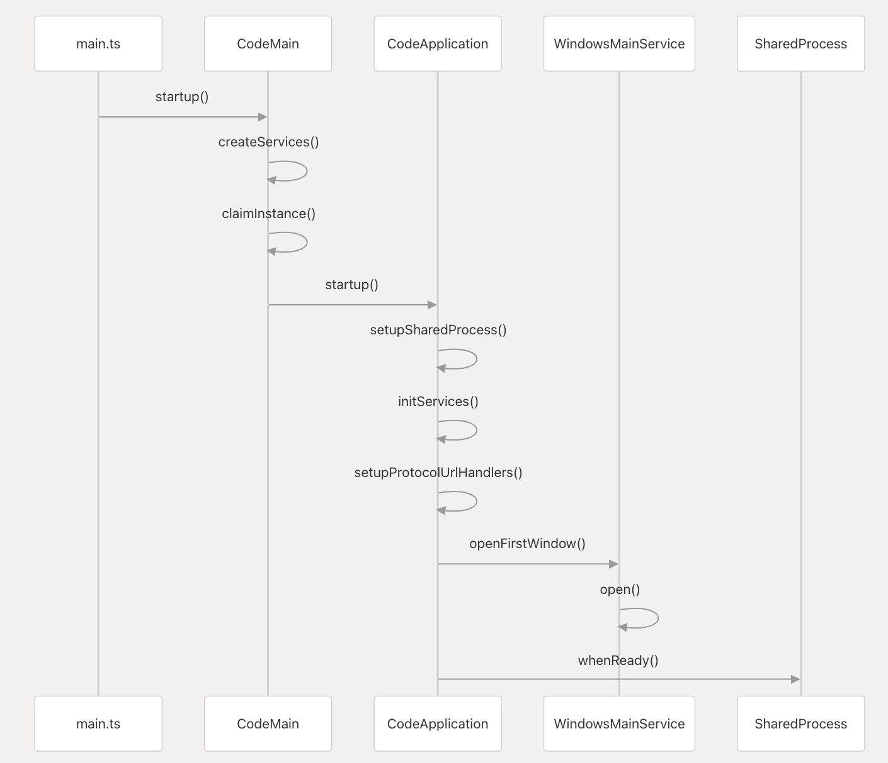

# VSCode源码分析 - 主启动流程

## 目录

* [1、启动主进程](./1-主启动流程.md)
* [2、实例化服务](./2-实例化服务.md)
* <a href="https://github.com/fzxa/VSCode-sourcecode-analysis/blob/master/chapter-1.md">1、启动主进程</a>
* <a href="https://github.com/fzxa/VSCode-sourcecode-analysis/blob/master/chapter-2.md">实例化服务</a>
* <a href="https://github.com/fzxa/VSCode-sourcecode-analysis/blob/master/chapter-3.md">事件分发</a>
* <a href="https://github.com/fzxa/VSCode-sourcecode-analysis/blob/master/chapter-4.md">进程通信</a>
* <a href="https://github.com/fzxa/VSCode-sourcecode-analysis/blob/master/chapter-5.md">主要窗口</a>
* <a href="https://github.com/fzxa/VSCode-sourcecode-analysis/blob/master/chapter-6.md">开发调试</a>

## <a name="1">简介</a>

Visual Studio Code(简称VSCode) 是开源免费的IDE编辑器，原本是微软内部使用的云编辑器(Monaco)。

git仓库地址： <https://github.com/microsoft/vscode>

通过Eletron集成了桌面应用，可以跨平台使用，开发语言主要采用微软自家的TypeScript。
整个项目结构比较清晰，方便阅读代码理解。成为了最流行跨平台的桌面IDE应用

微软希望VSCode在保持核心轻量级的基础上，增加项目支持，智能感知，编译调试。


## 编译安装

下载最新版本,目前我用的是1.37.1版本
官方的wiki中有编译安装的说明  [How to Contribute](https://github.com/microsoft/vscode/wiki/How-to-Contribute?_blank)

Linux, Window, MacOS三个系统编译时有些差别，参考官方文档，
在编译安装依赖时如果遇到connect timeout, 需要进行科学上网。

> 需要注意的一点 运行环境依赖版本 Nodejs x64 version >= 10.16.0, < 11.0.0,  python 2.7(3.0不能正常执行)

## <a name="2">技术架构</a>

### Electron

> [Electron](https://electronjs.org/?_blank) 是一个使用 JavaScript, HTML 和 CSS 等 Web 技术创建原生程序的框架，它负责比较难搞的部分，你只需把精力放在你的应用的核心上即可 (Electron = Node.js + Chromium + Native API)

### Monaco Editor
>
> [Monaco Editor](https://github.com/microsoft/monaco-editor?_blank)是微软开源项目, 为VS Code提供支持的代码编辑器，运行在浏览器环境中。编辑器提供代码提示，智能建议等功能。供开发人员远程更方便的编写代码，可独立运行。

### TypeScript
>
> TypeScript是一种由微软开发的自由和开源的编程语言。它是JavaScript的一个超集，而且本质上向这个语言添加了可选的静态类型和基于类的面向对象编程

## 目录结构

> 关键目录结构

```
├── build         # gulp编译构建脚本
├── extensions    # 内置插件
├── product.json  # App meta信息
├── resources     # 平台相关静态资源
├── scripts       # 工具脚本，开发/测试
├── src           # 源码目录
│   ├── typings     # TypeScript 类型定义文件
│   ├── vscode-dts  # 生成 VSCode API 的 .d.ts 文件
│   └── vs
│       ├── base        # 通用基础库：工具函数、UI组件、生命周期管理等
│       │   ├── browser # 浏览器环境相关的基础库 (DOM, UI)
│       │   ├── common  # 通用工具和数据结构 (事件, 集合, 字符串处理等)
│       │   ├── node    # Node.js 环境相关的基础库 (文件系统, 进程)
│       │   └── worker  # Web Worker 相关代码
│       ├── code        # VSCode 桌面应用入口和主进程逻辑
│       ├── editor      # Monaco Editor 核心代码
│       │   ├── browser # 编辑器 UI 和浏览器环境逻辑
│       │   ├── common  # 编辑器通用模型、服务和核心功能
│       │   └── contrib # 编辑器贡献点，如命令、菜单、建议等
│       ├── platform    # 平台抽象层和服务：依赖注入、配置、日志、文件访问等
│       │   ├── actions     # 命令和动作相关
│       │   ├── commands    # 命令注册与执行
│       │   ├── configuration # 配置服务
│       │   ├── dialogs     # 对话框服务
│       │   ├── files       # 文件系统服务抽象
│       │   ├── instantiation # 依赖注入核心
│       │   ├── keybinding  # 快捷键绑定
│       │   ├── lifecycle   # 应用生命周期管理
│       │   ├── log         # 日志服务
│       │   ├── storage     # 存储服务
│       │   ├── telemetry   # 遥测服务
│       │   ├── theme       # 主题服务
│       │   └── workspace   # 工作区管理
│       ├── server      # VSCode Server 相关代码 (用于 Remote 等场景)
│       └── workbench   # VSCode 工作台 UI 和核心功能实现
│           ├── api         # 扩展 API 实现
│           ├── browser     # 工作台浏览器环境 UI 组件和逻辑
│           ├── common      # 工作台通用模型和服务
│           ├── contrib     # 工作台功能贡献点 (视图、面板、命令等)
│           └── services    # 工作台特定服务
└── typings       # 函数语法补全定义 (此行原文档存在，但根据当前结构，似乎在 src 下，保留还是删除取决于是否需要兼容旧文档的结构说明)
```

### 核心层

* base: 提供通用服务和构建用户界面
* platform: 注入服务和基础服务代码
* editor: 微软Monaco编辑器，也可独立运行使用
* wrokbench: 配合Monaco并且给viewlets提供框架：如：浏览器状态栏，菜单栏利用electron实现桌面程序

### 核心环境

整个项目完全使用typescript实现，electron中运行主进程和渲染进程，使用的api有所不同，所以在core中每个目录组织也是按照使用的api来安排，
运行的环境分为几类：

* common: 只使用javascritp api的代码，能在任何环境下运行
* browser: 浏览器api, 如操作dom; 可以调用common
* node: 需要使用node的api,比如文件io操作
* electron-sandbox: 渲染进程api, 可以调用common, brower, node, 依赖[electron renderer-process API](https://github.com/electron/electron/tree/master/docs#modules-for-the-renderer-process-web-page)
* electron-main: 主进程api, 可以调用: common, node 依赖于[electron main-process AP](https://github.com/electron/electron/tree/master/docs#modules-for-the-main-process)

## <a name="3">启动主进程</a>



### Electron通过package.json中的main字段来定义应用入口

main.ts是vscode的入口。

* src/main.ts
* vs/code/electron-main/main.ts
* vs/code/electron-main/app.ts
* vs/platform/windows/electron-main/windowsMainService.ts
* vs/workbench/electron-sandbox/desktop.main.ts
* vs/workbench/browser/workbench.ts

```js
app.once('ready', function () {
	// 如果指定了 trace 参数，则开始跟踪， 性能分析
	if (args['trace']) {
		let traceOptions: Electron.TraceConfig | Electron.TraceCategoriesAndOptions;
		if (args['trace-memory-infra']) {
			const customCategories = args['trace-category-filter']?.split(',') || [];
			customCategories.push('disabled-by-default-memory-infra', 'disabled-by-default-memory-infra.v8.code_stats');
			traceOptions = {
				included_categories: customCategories,
				excluded_categories: ['*'],
				memory_dump_config: {
					allowed_dump_modes: ['light', 'detailed'],
					triggers: [
						{
							type: 'periodic_interval',
							mode: 'detailed',
							min_time_between_dumps_ms: 10000
						},
						{
							type: 'periodic_interval',
							mode: 'light',
							min_time_between_dumps_ms: 1000
						}
					]
				}
			};
		} else {
			traceOptions = {
				categoryFilter: args['trace-category-filter'] || '*',
				traceOptions: args['trace-options'] || 'record-until-full,enable-sampling'
			};
		}

		contentTracing.startRecording(traceOptions).finally(() => onReady());
	} else {
		// 初始入口
		onReady();
	}
});

async function onReady() {
	perf.mark('code/mainAppReady'); // 记录主应用准备就绪的时间点

	try {
		const [, nlsConfig] = await Promise.all([
			mkdirpIgnoreError(codeCachePath), // 创建代码缓存目录
			resolveNlsConfiguration() // 解析 NLS 配置
		]);

		await startup(codeCachePath, nlsConfig);
	} catch (error) {
		console.error(error);
	}
}

/**
 * 主启动例程
 */
async function startup(codeCachePath: string | undefined, nlsConfig: INLSConfiguration): Promise<void> {
	process.env['VSCODE_NLS_CONFIG'] = JSON.stringify(nlsConfig);
	process.env['VSCODE_CODE_CACHE_PATH'] = codeCachePath || '';

	// 引导 ESM（ECMAScript 模块）加载系统，这个函数在 bootstrap-esm.ts 文件中定义，它负责设置 NLS（原生语言支持）配置，读取语言包文件，并将相关配置存储在全局变量中，以便后续模块使用，这是应用程序启动过程中的关键步骤，确保国际化和本地化功能正常工作
	await bootstrapESM();

	// 加载 Main
	await import('./vs/code/electron-main/main.js');
	perf.mark('code/didRunMainBundle');
}
```

### vs/code/electron-main/main.ts

electron-main/main 是程序真正启动的入口,进入main process初始化流程.

#### 这里主要做了两件事情

1. 初始化Service
	* 【instantiationService】 实例化服务，负责创建和管理所有服务实例
	* 【instanceEnvironment】 实例环境，包含当前启动目录，日志目录，操作系统信息，配置文件目录，用户目录等
	* 【environmentMainService】 环境服务，负责处理命令行参数和环境变量
	* 【configurationService】 配置服务，负责管理用户配置文件
	* 【stateMainService】 状态服务，负责管理应用程序状态
	* 【bufferLogger】 缓冲日志，负责缓冲日志
	* 【productService】 产品服务，负责提供产品相关的配置信息
	* 【userDataProfilesMainService】 用户数据配置文件服务，负责管理用户数据配置文件
2. 启动主实例

直接看startup方法的实现,基础服务初始化完成后会加载 CodeApplication, mainIpcServer, instanceEnvironment，调用 startup 方法启动APP

```js
private async startup(): Promise<void> {

	// 尽早设置错误处理程序，这样我们就不会弹出
	// 默认的 electron 错误对话框
	setUnexpectedErrorHandler(err => console.error(err));

	// 创建服务
	/**
	 * 【instantiationService】 实例化服务，负责创建和管理所有服务实例
	 * 【instanceEnvironment】 实例环境，包含当前启动目录，日志目录，操作系统信息，配置文件目录，用户目录等
	 * 【environmentMainService】 环境服务，负责处理命令行参数和环境变量
	 * 【configurationService】 配置服务，负责管理用户配置文件
	 * 【stateMainService】 状态服务，负责管理应用程序状态
	 * 【bufferLogger】 缓冲日志，负责缓冲日志
	 * 【productService】 产品服务，负责提供产品相关的配置信息
	 * 【userDataProfilesMainService】 用户数据配置文件服务，负责管理用户数据配置文件
	 */
	const [instantiationService, instanceEnvironment, environmentMainService, configurationService, stateMainService, bufferLogger, productService, userDataProfilesMainService] = this.createServices();

	try {

		// 初始化服务
		try {
			await this.initServices(environmentMainService, userDataProfilesMainService, configurationService, stateMainService, productService);
		} catch (error) {

			// 对用户可以解决的错误显示一个对话框
			this.handleStartupDataDirError(environmentMainService, productService, error);

			throw error;
		}

		// 启动主实例
		await instantiationService.invokeFunction(async accessor => {
			const logService = accessor.get(ILogService); // 获取日志服务，管理日志系统的基础配置和生命周期
			const lifecycleMainService = accessor.get(ILifecycleMainService); // 获取生命周期服务
			const fileService = accessor.get(IFileService); // 获取文件服务
			const loggerService = accessor.get(ILoggerService); // 获取日志服务，管理和提供特定上下文或用途的日志记录器 (ILogger) 实例

			// 通过尝试成为服务器来创建主 IPC 服务器
			// 如果这引发错误，则意味着我们不是第一个
			// 运行的 VS Code 实例，因此我们将退出。
			const mainProcessNodeIpcServer = await this.claimInstance(logService, environmentMainService, lifecycleMainService, instantiationService, productService, true);

			// 写入一个锁文件以指示实例正在运行
			// (https://github.com/microsoft/vscode/issues/127861#issuecomment-877417451)
			FSPromises.writeFile(environmentMainService.mainLockfile, String(process.pid)).catch(err => {
				logService.warn(`app#startup(): 写入主锁文件时出错: ${err.stack}`);
			});

			// 出于性能原因延迟创建 spdlog (https://github.com/microsoft/vscode/issues/72906)
			bufferLogger.logger = loggerService.createLogger('main', { name: localize('mainLog', "Main") });

			// 生命周期
			Event.once(lifecycleMainService.onWillShutdown)(evt => {
				fileService.dispose();
				configurationService.dispose();
				evt.join('instanceLockfile', promises.unlink(environmentMainService.mainLockfile).catch(() => { /* 忽略 */ }));
			});

			// 创建主实例， 进入 vs/code/electron-main/app.ts 的 startup 方法
			return instantiationService.createInstance(CodeApplication, mainProcessNodeIpcServer, instanceEnvironment).startup();
		});
	} catch (error) {
		instantiationService.invokeFunction(this.quit, error);
	}
}
```

#### vs/code/electron-main/app.ts

**CodeApplication.startup()**
这里首先触发CodeApplication.startup()方法， 在第一个窗口打开3秒后成为共享进程，

* `startup` 方法是 VS Code 主进程 `CodeApplication` 类的核心入口点和初始化函数。
* 它的主要目的包括：
* 1. 环境设置与日志记录：记录启动信息，进行特定于操作系统的设置。
* 2. 核心服务初始化 (`initServices`)：创建和初始化主进程所需的关键服务 (窗口管理、生命周期、IPC、日志、配置、文件等)。
* 3. 进程间通信 (IPC) 设置：启动主进程 IPC 服务，设置和连接共享进程，并注册各种 IPC 通道。
* 4. 协议 URL 处理：设置处理 `vscode://` 等协议 URL 的逻辑。
* 5. 窗口管理与启动：根据启动参数或协议 URL 打开第一个 VS Code 窗口。
* 6. 生命周期管理：管理应用程序的生命周期阶段。
* 7. 启动后任务：执行窗口打开后的初始化任务（如互斥锁、Shell 环境解析、崩溃报告器设置）。
*
* 总而言之，`startup` 方法负责编排 VS Code 主进程从启动到第一个窗口可用并运行起来的整个复杂初始化流程。

```js
async startup(): Promise<void> {
 	...

 	// 1. 第一个窗口创建共享进程
	// 共享进程
	const { sharedProcessReady, sharedProcessClient } = this.setupSharedProcess(machineId, sqmId, devDeviceId);
	// 创建app实例服务
	const appInstantiationService = await this.initServices(machineId, sqmId, devDeviceId, sharedProcessReady);

	...

	// 打开窗口
	await appInstantiationService.invokeFunction(accessor => this.openFirstWindow(accessor, initialProtocolUrls));

	// 4. 窗口打开后执行生命周期和授权操作
	// 信号阶段：窗口打开后
	this.lifecycleMainService.phase = LifecycleMainPhase.AfterWindowOpen;

	// 窗口打开后的任务
	this.afterWindowOpen();

	// 在短暂延迟后且空闲时将生命周期阶段设置为 `Eventually` (最小 2.5 秒，最大 5 秒)
	const eventuallyPhaseScheduler = this._register(new RunOnceScheduler(() => {
		this._register(runWhenGlobalIdle(() => {

			// 信号阶段：最终
			this.lifecycleMainService.phase = LifecycleMainPhase.Eventually;

			// 最终的窗口打开后任务
			this.eventuallyAfterWindowOpen();
		}, 2500));
	}, 2500));
	eventuallyPhaseScheduler.schedule();
}
```

**openFirstWindow 主要实现**

* 方法负责在 VS Code 应用程序启动时决定并打开初始窗口。它的核心逻辑是根据不同的启动方式和参数来确定应该打开什么内容。
   	* 1. 获取依赖服务: 首先，它通过 accessor 获取必要的服务，主要是窗口管理服务 IWindowsMainService 和辅助窗口服务 IAuxiliaryWindowsMainService。
   	* 2. 确定启动上下文: 判断 VS Code 是从命令行 (CLI) 启动还是从桌面环境（例如点击图标） (DESKTOP) 启动。
   	* 3. 处理协议链接: 如果 initialProtocolUrls 存在，则表示有来自协议链接的窗口要打开。
   	* 4. 处理文件/文件夹参数: 如果没有文件/文件夹参数，则检查是否需要强制打开新窗口。
   	* 5. 默认: 从 cli 读取路径。

```js
private openFirstWindow(accessor: ServicesAccessor, initialProtocolUrls: IInitialProtocolUrls | undefined): Promise<ICodeWindow[]> {

  ...

  // 1.首先检查是否有来自协议链接的窗口要打开
  // 	- Openables 可以直接作为窗口打开
  // 	- 特殊处理 启动时带有 `windowId=_blank` 的协议链接
  // 2. 在没有文件/文件夹参数的情况下启动
  // 	- 强制打开新窗口
  // 	- mac: 启动时收到 open-file 事件
  // 3. 默认：从 cli 读取路径
  ...

  // 默认：从 cli 读取路径
  return windowsMainService.open({
   context,
   cli: args,
   forceNewWindow: args['new-window'] || (!hasCliArgs && args['unity-launch']),
   diffMode: args.diff,
   noRecentEntry,
   waitMarkerFileURI,
   gotoLineMode: args.goto,
   initialStartup: true
  });
 }
```

#### vs/platform/windows/electron-main/windowsMainService.ts

接下来到了electron的windows窗口，open方法在doOpen中执行窗口配置初始化，最终调用openInBrowserWindow -> 执行doOpenInBrowserWindow是其打开window,主要步骤如下：

```js
private openInBrowserWindow(options: IOpenBrowserWindowOptions): ICodeWindow {

	...
	// New window
	if (!window) {
		//1.判断是否全屏创建窗口
		...
		// 2. 创建实例窗口
		createdWindow = this.instantiationService.createInstance(CodeWindow, {
		state,
		extensionDevelopmentPath: configuration.extensionDevelopmentPath,
		isExtensionTestHost: !!configuration.extensionTestsPath
	});

	// 3.将窗口添加到我们的窗口列表中
	this.windows.set(createdWindow.id, createdWindow);

	// 4.窗口监听器
	const disposables = new DisposableStore();
	disposables.add(createdWindow.onDidSignalReady(() => this._onDidSignalReadyWindow.fire(createdWindow)));
	disposables.add(Event.once(createdWindow.onDidClose)(() => this.onWindowClosed(createdWindow, disposables)));
	disposables.add(Event.once(createdWindow.onDidDestroy)(() => this.onWindowDestroyed(createdWindow)));
	disposables.add(createdWindow.onDidMaximize(() => this._onDidMaximizeWindow.fire(createdWindow)));
	disposables.add(createdWindow.onDidUnmaximize(() => this._onDidUnmaximizeWindow.fire(createdWindow)));
	disposables.add(createdWindow.onDidEnterFullScreen(() => this._onDidChangeFullScreen.fire({ window: createdWindow, fullscreen: true })));
	disposables.add(createdWindow.onDidLeaveFullScreen(() => this._onDidChangeFullScreen.fire({ window: createdWindow, fullscreen: false })));
	disposables.add(createdWindow.onDidTriggerSystemContextMenu(({ x, y }) => this._onDidTriggerSystemContextMenu.fire({ window: createdWindow, x, y })));

	// 5.注册窗口生命周期
	this.lifecycleMainService.registerWindow(createdWindow);

	...

	// 如果窗口已经加载，确保先卸载它
	// 只有在未被否决的情况下才加载新的配置
	// 未被否决
	if (window.isReady) {
		this.lifecycleMainService.unload(window, UnloadReason.LOAD).then(async veto => {
			if (!veto) {
				await this.doOpenInBrowserWindow(window, configuration, options, defaultProfile);
			}
		});
	} else {
		await this.doOpenInBrowserWindow(window, configuration, options, defaultProfile);
	}

	return window;
 }

 ...

 return window;
}
```

`doOpenInBrowserWindow` 会调用`(window as ICodeWindow).load`方法 在`windowImpl.ts`中实现

```js
// windowsMainService.ts
private async doOpenInBrowserWindow(window: ICodeWindow, configuration: INativeWindowConfiguration, options: IOpenBrowserWindowOptions, defaultProfile: IUserDataProfile): Promise<void> {
		// 注册窗口备份，除非窗口
		// 用于扩展开发，我们不保留任何备份。
		if (!configuration.extensionDevelopmentPath) {
			...
		}
		// Load it
		window.load(configuration);
}

// windowImpl.ts
// 加载窗口配置
load(config: IWindowConfiguration, isReload?: boolean, disableExtensions?: boolean): void {

 ...

	// Load URL
	perf.mark('main:loadWindow');
	/**
	 * 加载URL, 是整个 VSCode 编辑器的基础框架页面，它包含了：
	 * 	编辑器布局
	 * 	菜单
	 * 	侧边栏
	 * 	面板
	 * 	状态栏
	 */
	this._win.loadURL(FileAccess.asBrowserUri(`vs/code/electron-sandbox/workbench/workbench${this.environmentMainService.isBuilt ? '' : '-dev'}.html`).toString(true));

 ...
}
```

main process的使命完成, 主界面进行构建布局。

在workbench.html中加载了workbench.js，
这里调用return require('src/vs/workbench/electron-sandbox/desktop.main').main(configuration);实现对主界面的展示

#### src/vs/workbench/electron-sandbox/desktop.main.ts

创建工作区，调用workbench.startup()方法，构建主界面展示布局

```js
...
async open(): Promise<void> {

	// 并行初始化服务并等待DOM准备就绪
	const [services] = await Promise.all([this.initServices(), domContentLoaded(mainWindow)]);

	// 在创建工作台之前尽早应用缩放级别以防闪烁。
	// 我们还需要考虑缩放级别可以根据工作区进行配置，
	// 因此需要已解析的配置服务。
	// 最后，窗口可能有一个不是从设置派生的自定义缩放级别。
	// (修复 https://github.com/microsoft/vscode/issues/187982)
	this.applyWindowZoomLevel(services.configurationService);

	// 创建工作台
	const workbench = new Workbench(mainWindow.document.body, { extraClasses: this.getExtraClasses() }, services.serviceCollection, services.logService);

	// 注册监听器
	this.registerListeners(workbench, services.storageService);

	// 启动
	const instantiationService = workbench.startup();

	// 窗口
	this._register(instantiationService.createInstance(NativeWindow));
}
...
```

#### vs/workbench/browser/workbench.ts

工作区继承自layout类，主要作用是构建工作区，初始化和加载工作台界面

```js
export class Workbench extends Layout {
 	...
	startup(): IInstantiationService {
		try {
			...
			// Services
			const instantiationService = this.initServices(this.serviceCollection);

			instantiationService.invokeFunction(accessor => {
				const lifecycleService = accessor.get(ILifecycleService);
				const storageService = accessor.get(IStorageService);
				const configurationService = accessor.get(IConfigurationService);
				const hostService = accessor.get(IHostService);
				const hoverService = accessor.get(IHoverService);
				const dialogService = accessor.get(IDialogService);
				const notificationService = accessor.get(INotificationService) as NotificationService;

				// 默认悬停委托必须在创建任何工作台/布局组件之前注册
				// 因为这些可能会使用默认悬停委托
				setHoverDelegateFactory((placement, enableInstantHover) => instantiationService.createInstance(WorkbenchHoverDelegate, placement, { instantHover: enableInstantHover }, {}));
				setBaseLayerHoverDelegate(hoverService);

				// 布局
				this.initLayout(accessor);

				// 注册表
				Registry.as<IWorkbenchContributionsRegistry>(WorkbenchExtensions.Workbench).start(accessor);
				Registry.as<IEditorFactoryRegistry>(EditorExtensions.EditorFactory).start(accessor);

				// 上下文键
				this._register(instantiationService.createInstance(WorkbenchContextKeysHandler));

				// 注册监听器
				this.registerListeners(lifecycleService, storageService, configurationService, hostService, dialogService);

				// 渲染工作台
				this.renderWorkbench(instantiationService, notificationService, storageService, configurationService);

				// 工作台布局
				this.createWorkbenchLayout();

				// 布局
				this.layout();

				// 恢复
				this.restore(lifecycleService);
			});
			return instantiationService;
		} catch (error) {
			onUnexpectedError(error);

			throw error; // 重新抛出，因为这是一个我们无法在此处正确处理的关键问题
		}
	}
	...
}
```
