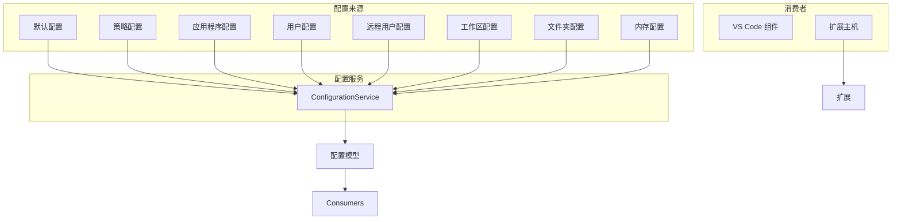
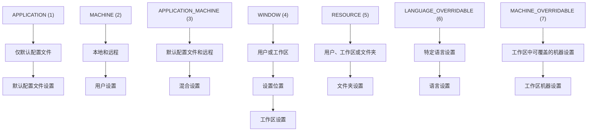
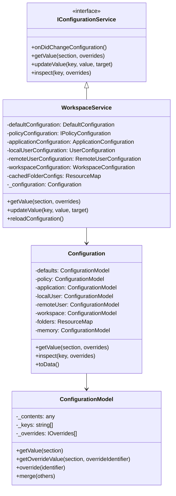
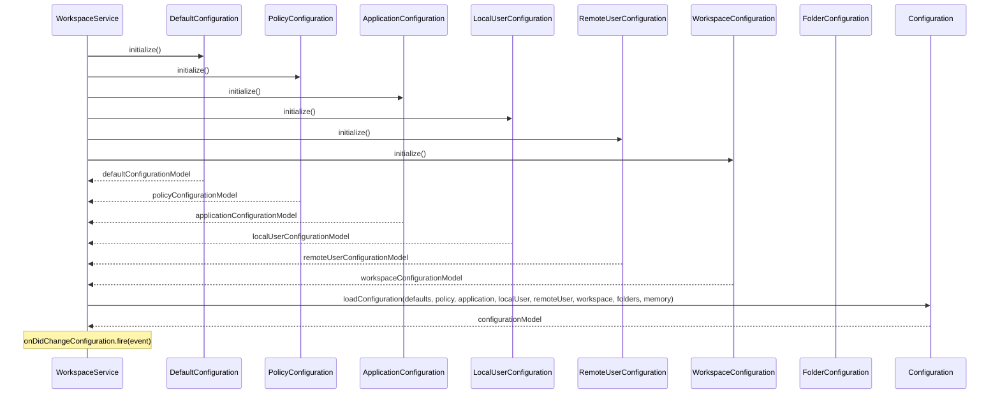
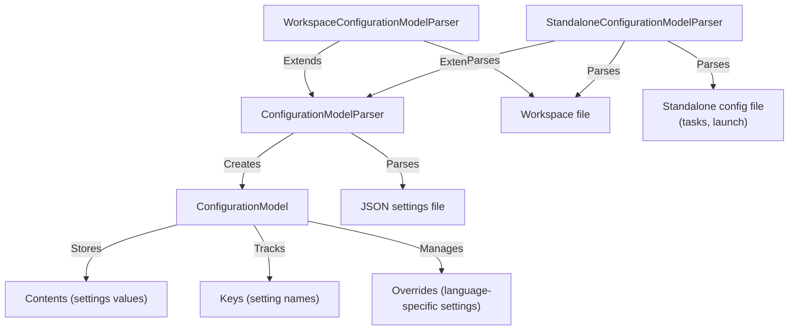
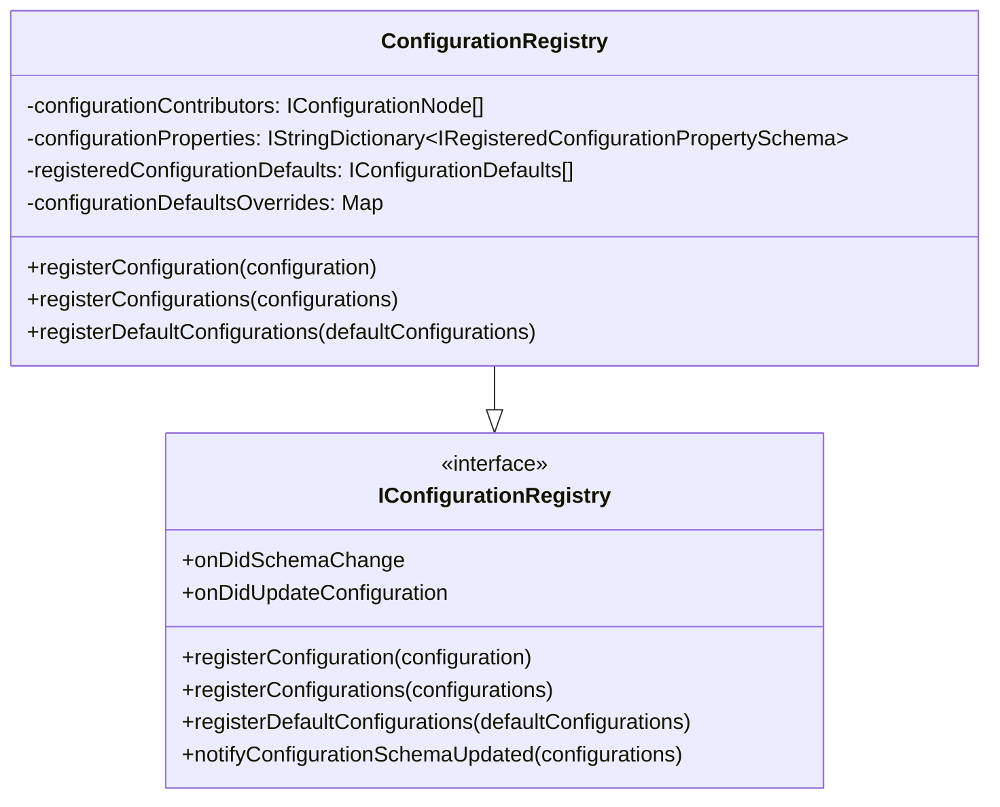
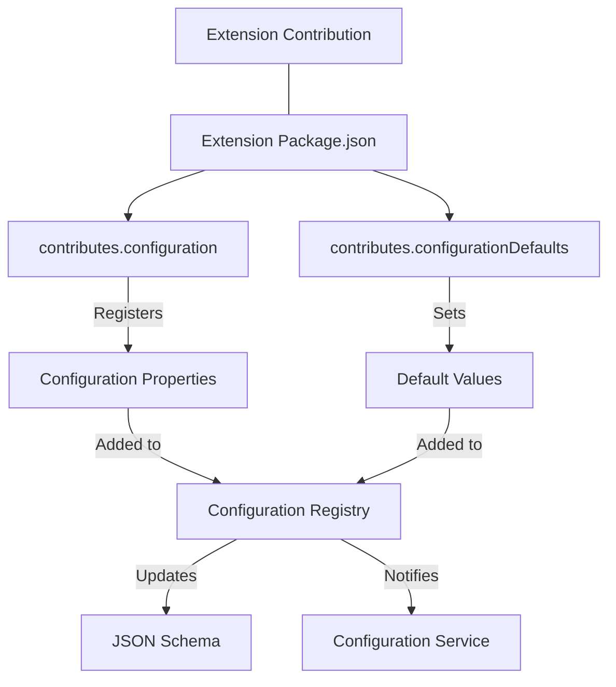
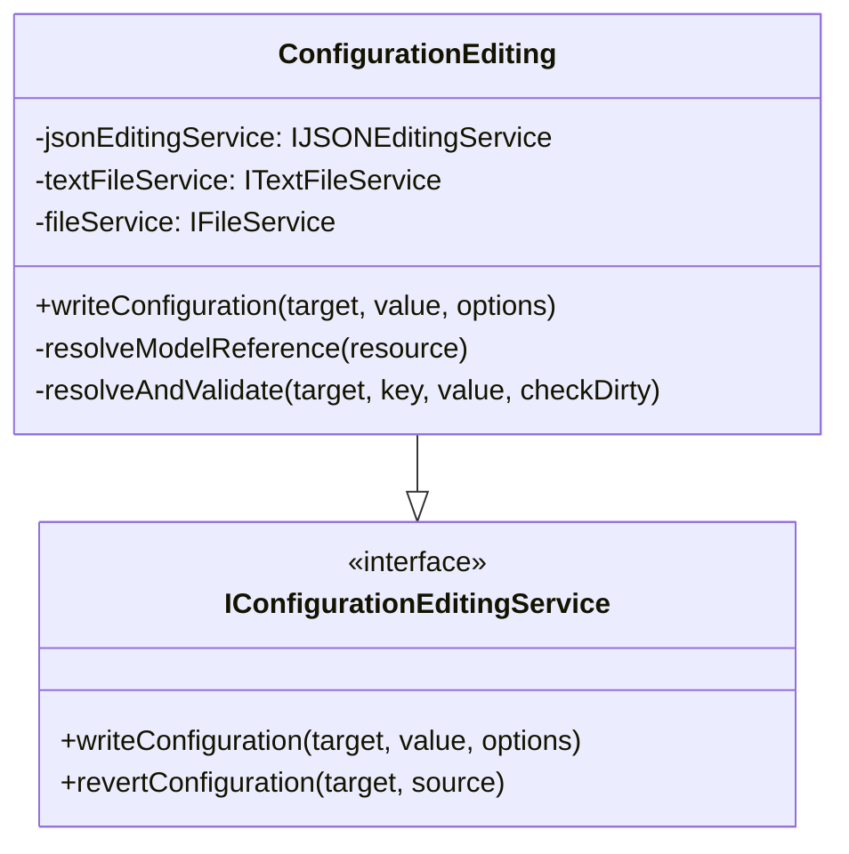
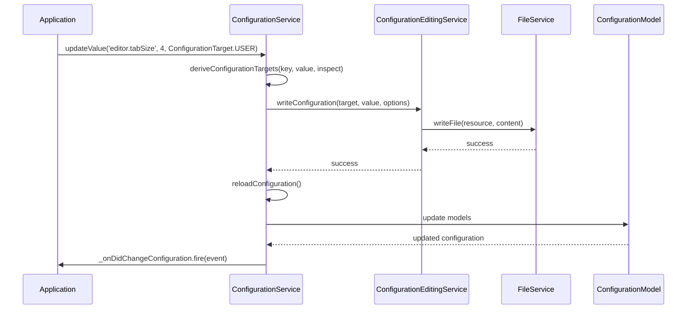
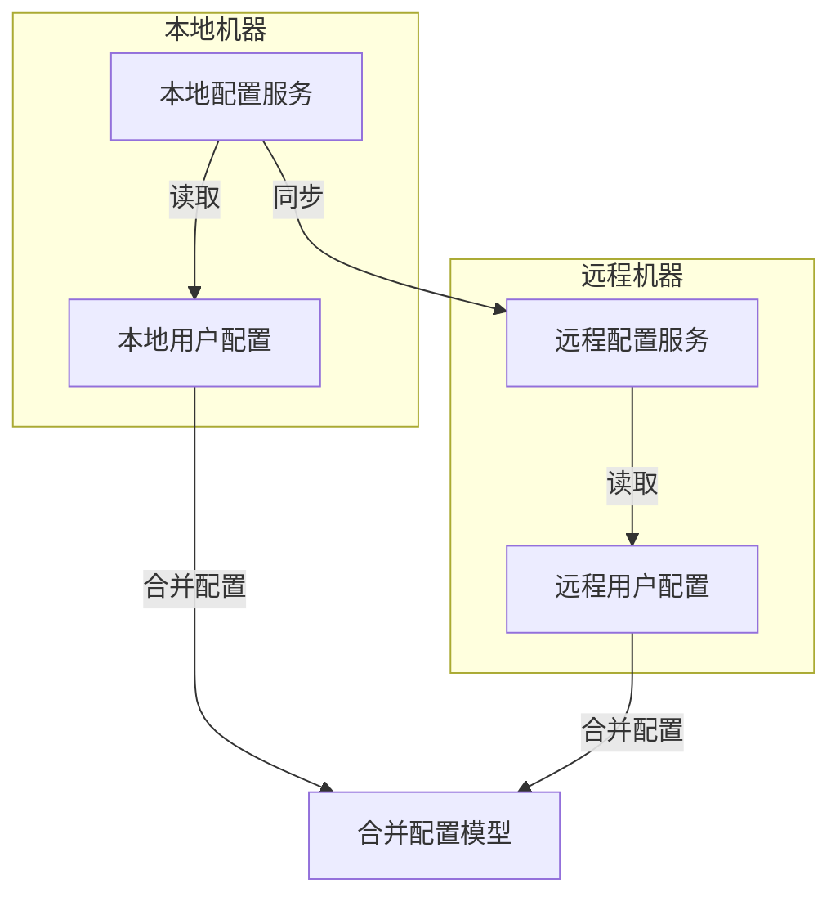

# 配置系统

VS Code 配置系统管理着不同范围和来源的设置，提供了一种统一的方式来访问和修改整个应用程序中的配置值。该系统负责加载、合并并提供对来自各种来源（如用户设置、工作区设置和默认设置）的配置的访问。

本页重点介绍核心配置架构以及内部如何管理设置。有关扩展配置贡献的信息，请参阅扩展系统。

## 总览

VS Code 的配置系统旨在处理来自多个来源且具有不同优先级的设置。它提供了一个统一的 API，用于访问和修改配置值，同时尊重适当的作用域和覆盖规则。



Sources:

- [src/vs/workbench/services/configuration/browser/configurationService.ts](../../src/vs/workbench/services/configuration/browser/configurationService.ts) 130-131
- [src/vs/workbench/services/configuration/browser/configuration.ts](../../src/vs/workbench/services/configuration/browser/configuration.ts) 32-121

## 配置范围



Sources:

- [src/vs/platform/configuration/common/configurationRegistry.ts](../../src/vs/platform/configuration/common/configurationRegistry.ts) 128-157
- [src/vs/workbench/services/configuration/common/configuration.ts](../../src/vs/workbench/services/configuration/common/configuration.ts) 28-33

## 配置目标

| 目标 | 描述 | 文件位置 |
|------|------|----------|
| APPLICATION | 应用程序范围的设置 | 默认配置文件 settings.json |
| USER | 用户设置（自动确定本地或远程） | User settings.json |
| USER_LOCAL | 本地用户设置 | Local user settings.json |
| USER_REMOTE | 远程用户设置 | Remote user settings.json |
| WORKSPACE | 工作区设置 | workspace.json 或 .code-workspace 文件 |
| WORKSPACE_FOLDER | 文件夹特定设置 | .vscode/settings.json 在文件夹中 |
| DEFAULT | 默认设置（只读） | 内置默认值 |
| MEMORY | 内存中的设置（临时） | 不持久化到磁盘 |
Sources:

- [src/vs/platform/configuration/common/configuration.ts](../../src/vs/platform/configuration/common/configuration.ts) 38-47
- [src/vs/workbench/services/configuration/browser/configurationService.ts](../../src/vs/workbench/services/configuration/browser/configurationService.ts) 362-363

## 配置架构

配置系统围绕几个关键组件构建，这些组件协同工作，提供统一的配置体验。



Sources:

- [src/vs/workbench/services/configuration/browser/configurationService.ts](../../src/vs/workbench/services/configuration/browser/configurationService.ts) 63-109
- [src/vs/platform/configuration/common/configurationModels.ts](../../src/vs/platform/configuration/common/configurationModels.ts) 29-296

## 配置加载过程

配置加载过程包括从不同来源收集和合并设置的多个步骤。



Sources:

- [src/vs/workbench/services/configuration/browser/configurationService.ts](../../src/vs/workbench/services/configuration/browser/configurationService.ts) 371-386
- [src/vs/workbench/services/configuration/browser/configurationService.ts](../../src/vs/workbench/services/configuration/browser/configurationService.ts) 1000-1050

## 配置模型

配置模型代表不同层级的设置数据，负责存储和检索配置值。



Sources:

- [src/vs/platform/configuration/common/configurationModels.ts](../../src/vs/platform/configuration/common/configurationModels.ts) 29-296
- [src/vs/platform/configuration/common/configurationModels.ts](../../src/vs/platform/configuration/common/configurationModels.ts) 306-650

## 配置注册表

配置注册表负责注册配置属性及其模式。它被扩展和核心组件用来定义可用设置。



Sources:

- [src/vs/platform/configuration/common/configurationRegistry.ts](../../src/vs/platform/configuration/common/configurationRegistry.ts) 34-126
- [src/vs/platform/configuration/common/configurationRegistry.ts](../../src/vs/platform/configuration/common/configurationRegistry.ts) 276-1000

## 配置扩展点

VS Code 允许扩展通过 configuration 和 configurationDefaults 扩展点贡献配置属性。



Sources:

- [src/vs/workbench/api/common/configurationExtensionPoint.ts{}](../../src/vs/workbench/api/common/configurationExtensionPoint.ts) 26-132
- [src/vs/workbench/api/common/configurationExtensionPoint.ts](../../src/vs/workbench/api/common/configurationExtensionPoint.ts) 138-180

## 配置编辑

配置编辑服务提供用于编程编辑配置文件的 API。



Sources:

- [src/vs/workbench/services/configuration/common/configurationEditing.ts](../../src/vs/workbench/services/configuration/common/configurationEditing.ts) 1-1000
- [src/vs/workbench/services/configuration/browser/configurationService.ts](../../src/vs/workbench/services/configuration/browser/configurationService.ts) 362-363

## 配置访问

配置服务提供从应用程序任何位置访问配置值的方法。

### 获取配置值

```ts
// Get a specific configuration value
const tabSize = configurationService.getValue<number>('editor.tabSize');

// Get a configuration value with overrides
const pythonTabSize = configurationService.getValue<number>('editor.tabSize', {
    overrideIdentifier: 'python'
});

// Get a configuration value for a specific resource
const fileTabSize = configurationService.getValue<number>('editor.tabSize', {
    resource: fileUri
});
```

### 检查配置值

```ts
// Inspect a configuration value to see where it's defined
const inspectResult = configurationService.inspect('editor.tabSize');
console.log(inspectResult.defaultValue); // Default value
console.log(inspectResult.userValue);    // User value
console.log(inspectResult.workspaceValue); // Workspace value
console.log(inspectResult.value);        // Effective value
```

Sources:

- [src/vs/workbench/services/configuration/browser/configurationService.ts](../../src/vs/workbench/services/configuration/browser/configurationService.ts) 324-332
- [src/vs/platform/configuration/common/configuration.ts](../../src/vs/platform/configuration/common/configuration.ts) 75-105

## 配置更新

配置服务允许动态更新配置值。



Sources:

- [src/vs/workbench/services/configuration/browser/configurationService.ts](../../src/vs/workbench/services/configuration/browser/configurationService.ts) 334-363
- [src/vs/workbench/services/configuration/common/configurationEditing.ts](../../src/vs/workbench/services/configuration/common/configurationEditing.ts) 1-1000

## 配置文件更改事件

配置服务在配置值发生变化时会发出事件，使组件能够对这些变化做出反应。

```js
// Listen for configuration changes
const disposable = configurationService.onDidChangeConfiguration(event => {
    // Check if a specific configuration has changed
    if (event.affectsConfiguration('editor.tabSize')) {
        // Handle the change
    }

    // Check if a specific configuration with overrides has changed
    if (event.affectsConfiguration('editor.tabSize', { overrideIdentifier: 'python' })) {
        // Handle the change
    }
});
```

Sources:

- [src/vs/workbench/services/configuration/browser/configurationService.ts](../../src/vs/workbench/services/configuration/browser/configurationService.ts) 83-96
- [src/vs/platform/configuration/common/configurationModels.ts](../../src/vs/platform/configuration/common/configurationModels.ts) 1000-1100

## 配置文件

VS Code 使用几种 JSON 文件来存储不同级别的配置。

| File | Location | Purpose |
|------|----------|---------|
| settings.json | User settings directory | User-specific settings |
| settings.json | .vscode folder in workspace | Workspace folder-specific settings |
| *.code-workspace | Workspace root | Multi-root workspace settings |
| launch.json | .vscode folder | Debugging configurations |
| tasks.json | .vscode folder | Task configurations |

Sources:

- [src/vs/workbench/services/configuration/common/configuration.ts](../../src/vs/workbench/services/configuration/common/configuration.ts) 14-26
- [src/vs/workbench/services/configuration/browser/configuration.ts](../../src/vs/workbench/services/configuration/browser/configuration.ts) 123-221

## 远程配置

VS Code 支持远程开发，需要处理来自本地和远程环境的配置。



## 总结

VS Code 配置系统提供了一种灵活且强大的方式来管理不同范围和环境的设置。它处理了从多个来源合并设置的复杂性，同时提供了一个简单的 API 来访问和修改配置值。

该系统设计为可扩展的，允许扩展贡献自己的配置属性和默认值。它还支持高级功能，如特定语言的设置和远程配置。

理解配置系统对于开发扩展和贡献 VS Code 代码库至关重要，因为它是应用程序架构的基本组成部分。
