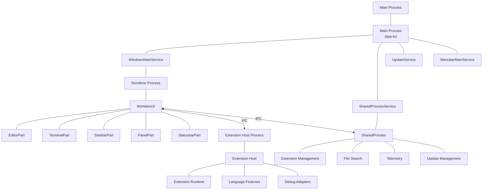
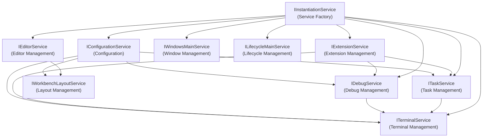
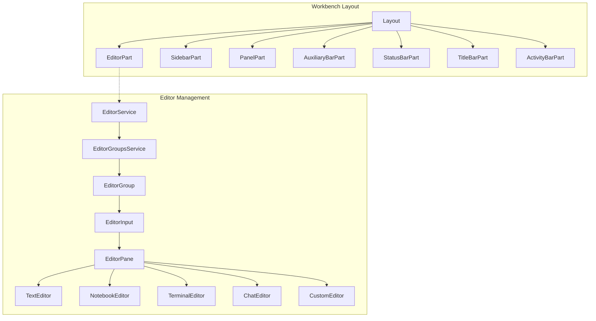
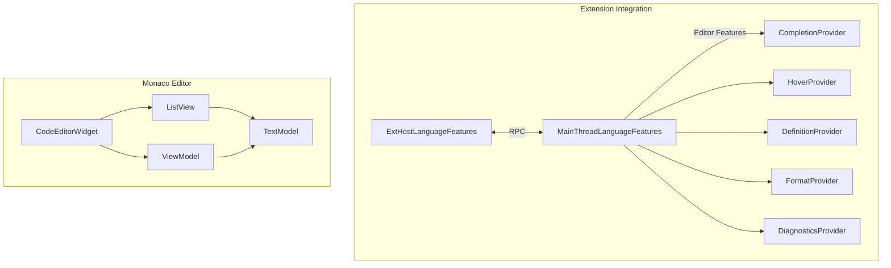
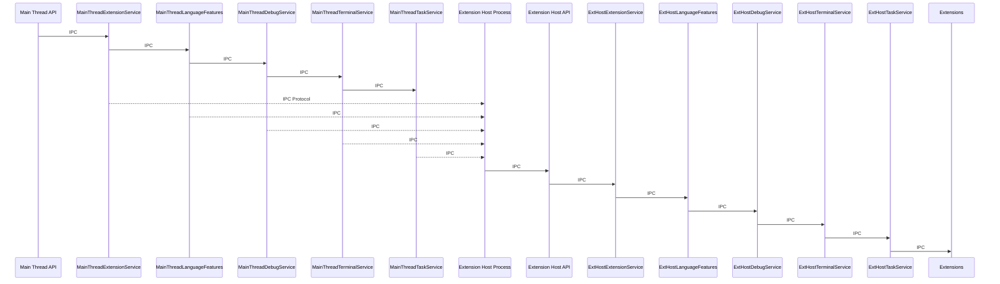
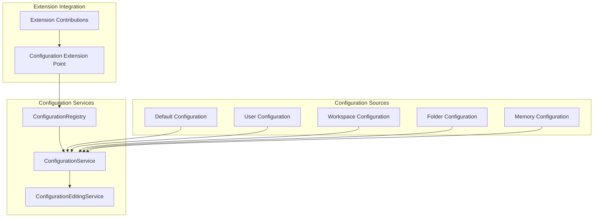
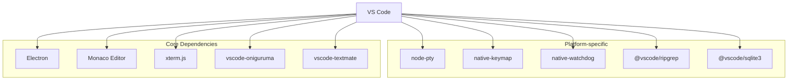
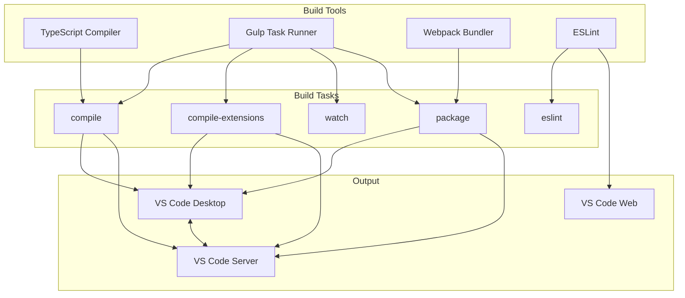

# VS Code 结构总览
本文档提供了Visual Studio Code架构的高层次概述，解释了核心组件及其相互之间的交互方式。内容涵盖进程架构、核心服务以及构成VS Code的主要构建模块。

如需了解特定子系统的详细信息，请参阅各组件对应的专门页面，例如Monaco编辑器、扩展系统或集成终端。

## 过程架构
VS Code 采用多进程架构，以确保稳定性、性能和安全性。应用程序被拆分为多个进程，每个进程都有特定的职责：
1. 主进程(Main Process)管理窗口、共享进程和更新
2. 渲染进程(Renderer Process)包含工作台(Workbench)和各种UI部分
3. 扩展主机进程(Extension Host Process)运行扩展
4. 共享进程(SharedProcess)处理扩展管理、文件搜索等
5. 各进程间通过IPC(进程间通信)连接，形成一个分布式但协同工作的系统。

### 主进程
主进程(Main Process)是VS Code的核心，负责管理应用程序的生命周期、窗口管理、更新、状态栏、菜单等。
- 管理应用程序生命周期
- 创建和管理窗口
- 处理原生操作系统集成
- 协调其他进程

主要流程在`CodeApplication`类中实现，该类初始化了所有核心服务并设置了必要的事件监听器。

Sources:

- [src/vs/code/electron-main/app.ts](../../src/vs/code/electron-main/app.ts) 130-1000
- [src/vs/code/electron-main/main.ts](../../src/vs/code/electron-main/main.ts) 84-200

### 渲染进程
渲染进程(Renderer Process)包含工作台(Workbench)和各种UI部分，如编辑器、终端、侧边栏等。
- 渲染用户界面
- 处理用户交互
- 管理编辑器和视图
- 与其他进程通信

VS Code 中的每个窗口都有其独立的渲染进程，这有助于将各个窗口彼此隔离。

Sources:

- [src/vs/platform/windows/electron-main/windowImpl.ts](../../src/vs/platform/windows/electron-main/windowImpl.ts) 1-100
- [src/vs/platform/windows/electron-main/windowsMainService.ts](../../src/vs/platform/windows/electron-main/windowsMainService.ts) 183-300

### 扩展主机进程
扩展主机进程(Extension Host Process)运行扩展，处理扩展管理、文件搜索等。
扩展宿主进程在独立进程中运行扩展，以确保稳定性：

- 将扩展代码与主应用程序隔离
- 提供扩展API接口
- 通过IPC与渲染进程通信
- 托管语言服务、调试器及其他扩展功能

Sources:

- [src/vs/workbench/api/node/extHost.api.impl.ts](../../src/vs/workbench/api/node/extHost.api.impl.ts)

### 共享进程
共享进程(Shared Process)处理扩展管理、文件搜索等，是扩展主机进程的辅助进程。

- 扩展管理（安装、更新）
- 文件搜索与索引
- 遥测
- 更新管理

Sources:

- [src/vs/platform/sharedProcess/electron-main/sharedProcess.ts](../../src/vs/platform/sharedProcess/electron-main/sharedProcess.ts) 1-100

## 核心服务架构
VS Code 基于面向服务的架构构建，并采用依赖注入机制。其核心服务以分层方式组织：

服务架构使用接口来定义服务契约，使用实现来提供实际功能。这种方式允许：

- 组件之间的松散耦合
- 通过服务模拟实现更简单的测试
- 通过服务替换实现扩展性

Sources:

- [src/vs/platform/instantiation/common/instantiation.js](../../src/vs/platform/instantiation/common/instantiation.js)
- [src/vs/code/electron-main/app.ts](../../src/vs/code/electron-main/app.ts) 142-154

## Workbench and Layout 工作台和布局
工作区是 VS Code 的主要用户界面组件，它提供了整体布局并承载了各个部分：

工作台布局高度可定制，允许用户根据自己的偏好调整大小、移动和隐藏不同部分。

Sources:

- [src/vs/workbench/browser/layout.ts](../../src/vs/workbench/browser/layout.ts)
- [src/vs/workbench/browser/parts/editor/editorPart.ts](../../src/vs/workbench/browser/parts/editor/editorPart.ts)

## Monaco Editor
VS Code 编辑能力的核心是 Monaco 编辑器，这是一个复杂的文本编辑器组件：

Monaco Editor 由几个关键组件组成：

TextModel: 管理文本内容并提供文本操作API
ViewModel: 处理文本模型的可视化表示，包括行包装和装饰
CodeEditorWidget: 集成模型、视图和用户交互的主编辑器组件
Sources:

- [src/vs/editor/common/model/textModel.ts](../../src/vs/editor/common/model/textModel.ts) 178-410
- [src/vs/editor/common/viewModel/viewModelImpl.ts](../../src/vs/editor/common/viewModel/viewModelImpl.ts) 47-100
- [src/vs/monaco.d.ts](../../src/vs/monaco.d.ts) 1-100

## 扩展系统
扩展系统是 VS Code 的另一个核心组件，它允许用户通过安装和使用扩展来定制和增强 IDE 的功能。

扩展系统采用基于代理的架构，在主线程和扩展宿主进程之间进行通信。这确保了扩展无法直接影响主应用程序的稳定性。

Sources:

- [src/vs/workbench/api/browser/mainThreadExtensionService.ts](../../src/vs/workbench/api/browser/mainThreadExtensionService.ts)
- [src/vs/workbench/api/common/extHost.protocol.ts](../../src/vs/workbench/api/common/extHost.protocol.ts)

## 配置系统
VS Code的配置系统管理来自不同来源的设置：

配置系统合并来自多个来源的设置，并按特定优先级顺序排列：

1. 默认设置
2. 用户设置
3. 工作区设置
4. 文件夹特定设置
5. 内存设置（程序设置）

Sources:

- [src/vs/platform/configuration/common/configuration.js](../../src/vs/platform/configuration/common/configuration.js)
- [src/vs/platform/configuration/common/configurationRegistry.js](../../src/vs/platform/configuration/common/configurationRegistry.js)
- [src/vs/editor/common/config/editorOptions.ts](../../src/vs/editor/common/config/editorOptions.ts) 52-786

## 依赖管理
VS Code 使用 npm 进行依赖管理，依赖项经过精心挑选：

主依赖在 package.json 中定义，包括：

- Electron: 构建跨平台桌面应用程序的框架
- Monaco Editor: 核心文本编辑器组件
- xterm.js: 终端仿真库
- vscode-oniguruma 和 vscode-textmate: 用于语法高亮
- 各种用于平台特定功能的原生模块

Sources:

- [package.json](../../package.json) 71-116
- [remote/package.json](../../remote/package.json) 5-42
- [remote/web/package.json](../../remote/web/package.json) 4-24

## 构建系统
VS Code 采用了一个基于 TypeScript、Gulp 和 Webpack 的复杂构建系统。

构建系统支持多个目标：

- 桌面应用程序（基于 Electron）
- Web 版本（基于浏览器）
- 远程服务器（用于远程开发）

Sources:

- [package.json](../../package.json) 12-69
- [build/package.json](../../build/package.json) 4-69
- [.npmrc](../../.npmrc) 1-2

## 总结
VS Code的架构设计旨在实现可扩展性、性能和稳定性。多进程架构隔离不同组件，面向服务的架构实现松耦合，扩展系统允许强大的定制化。

本概述为理解VS Code代码库提供了基础。有关特定组件的更多详细信息，请参阅各子系统的专用页面。
