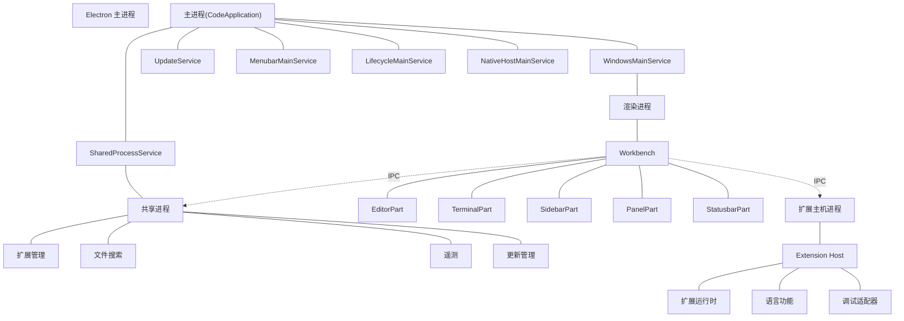
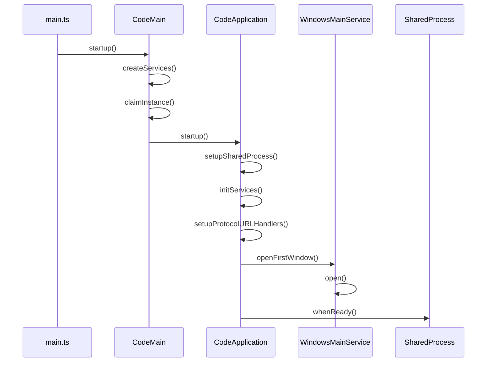
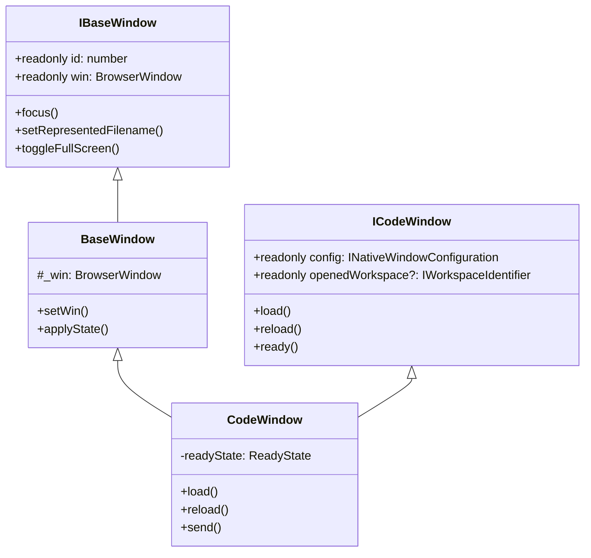
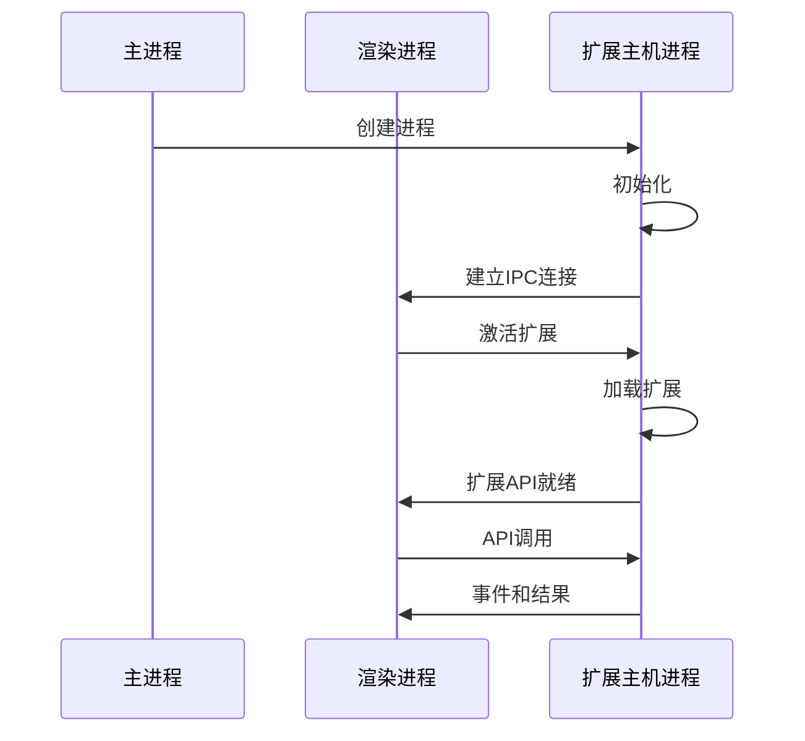
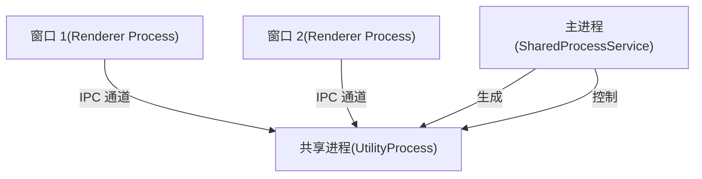
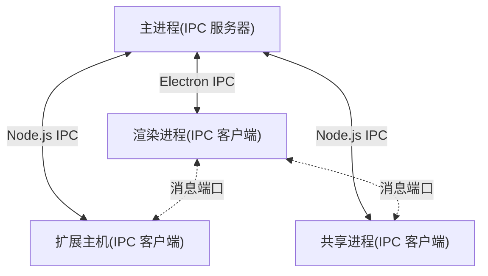
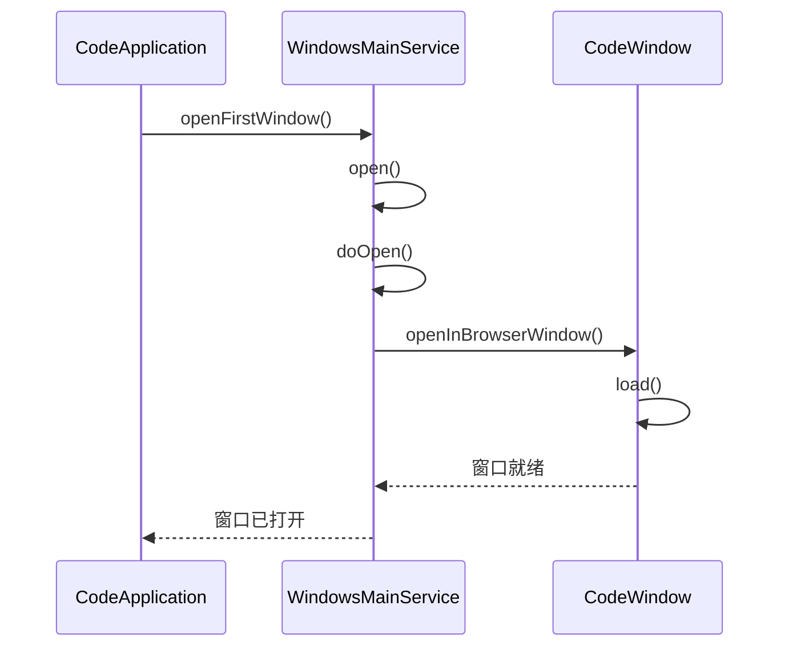
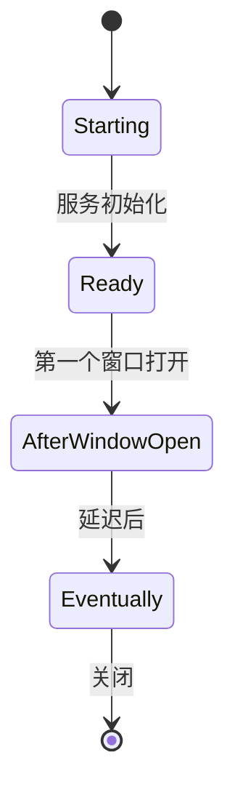
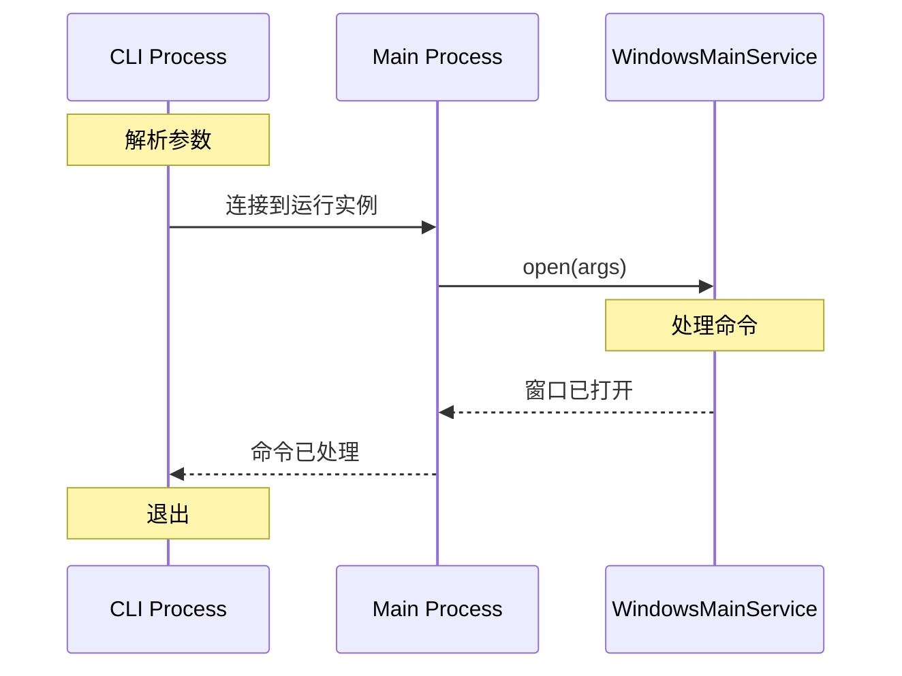
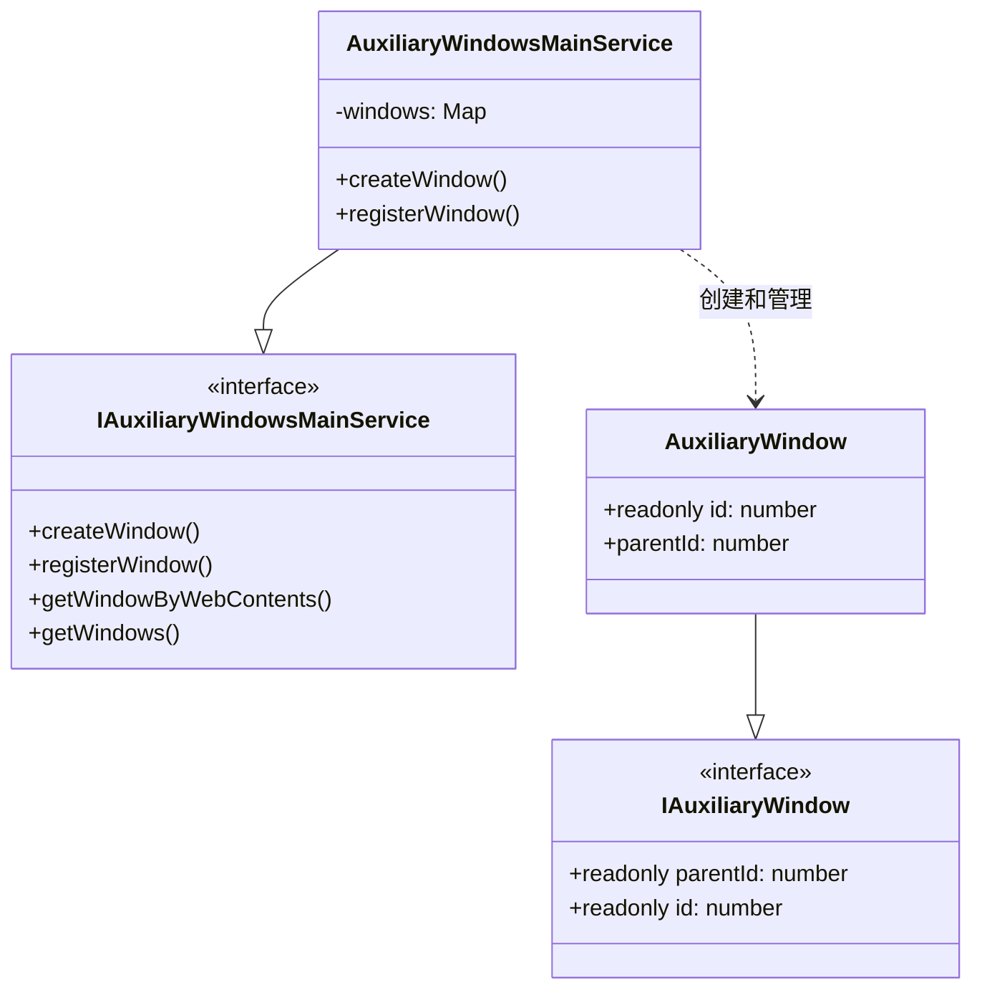

# 进程架构

本文档详细阐述了 VS Code 的多进程架构，包括主进程、渲染进程、扩展主机进程和共享进程。它介绍了这些进程之间如何进行通信以及它们在应用程序中的具体职责。

有关依赖管理和构建系统的信息，请参阅依赖管理与构建系统。

## 总览

VS Code 采用多进程架构，以确保稳定性、安全性和性能。该架构基于 Electron，结合了 Chromium（用于渲染）和 Node.js（用于文件系统访问及其他原生功能）。

应用程序被划分为多个进程，每个进程都有特定的职责：

- 主进程：协调应用程序生命周期并管理窗口
- 渲染进程：处理 UI 和工作台组件
- 扩展主机进程：在隔离环境中运行扩展
- 共享进程：处理跨窗口的资源密集型操作
- 语言服务进程：运行语言服务器协议（LSP）实现，如 TypeScript/JavaScript、Python、C++ 等的智能补全、诊断等。

这种分离带来了多项优势：

- 将扩展与主界面隔离，防止崩溃
- 通过进程边界提升安全性
- 通过跨进程分配工作，实现更佳性能

Sources:

- [src/vs/code/electron-main/app.ts](../../src/vs/code/electron-main/app.ts) 126-129
- [src/vs/code/electron-main/main.ts](../../src/vs/code/electron-main/main.ts) 76-83

## 流程架构图

Sources:

- [src/vs/code/electron-main/app.ts](../../src/vs/code/electron-main/app.ts) 130-607
- [src/vs/platform/windows/electron-main/windowsMainService.ts](../../src/vs/platform/windows/electron-main/windowsMainService.ts) 183-657
- [src/vs/platform/sharedProcess/electron-main/sharedProcess.ts](../../src/vs/platform/sharedProcess/electron-main/sharedProcess.ts) 24-193

## 主进程

主进程是应用程序的入口点，负责协调 VS Code 的整体生命周期。它通过 `CodeApplication` 类实现。

### 职责
- 应用程序生命周期管理
- 窗口管理
- 菜单管理
- 协议处理
- 安全策略执行
- 进程间通信（IPC）协调

### 关键组件

1. CodeApplication：核心类，负责初始化和管理应用程序
2. WindowsMainService：管理窗口的创建、焦点和生命周期
3. LifecycleMainService：处理应用程序的启动和关闭
4. MenubarMainService：管理应用程序菜单
5. NativeHostMainService：提供原生操作系统功能
6. SharedProcessService：管理共享进程

### 启动顺序

1. 应用程序从 `main.ts` 开始，该文件创建了一个 `CodeMain` 实例
2. `CodeMain` 初始化核心服务并获取实例锁
3. `CodeApplication` 被创建并启动应用程序
4. 根据命令行参数或上一次会话状态打开窗口

Sources:

- [src/vs/code/electron-main/main.ts](../../src/vs/code/electron-main/main.ts) 84-84
- [src/vs/code/electron-main/app.ts](../../src/vs/code/electron-main/app.ts) 522-620
- [src/vs/platform/windows/electron-main/windowsMainService.ts](../../src/vs/platform/windows/electron-main/windowsMainService.ts) 272-450

## 渲染进程

渲染器进程托管了 VS Code 的工作台用户界面，并负责渲染用户界面。VS Code 中的每个窗口都有其独立的渲染器进程。

### 职责

- 渲染用户界面（工作台）
- 处理用户交互
- 管理编辑器和视图
- 与扩展主机和共享进程通信

### 关键组件

- **Workbench**: 主 UI 组件，托管所有其他 UI 部分
- **EditorPart**: 管理编辑器组和编辑器
- **SidebarPart**: 托管如 Explorer、Search 等视图
- **PanelPart**: 托管如 Terminal、Output 等面板
- **StatusbarPart**: 显示状态信息

### 窗口实现
`CodeWindow` 类（继承自 `BaseWindow`）代表 VS Code 中的一个窗口，并管理与其关联的渲染器进程的生命周期。

Sources:

- [src/vs/platform/window/electron-main/window.ts](../../src/vs/platform/window/electron-main/window.ts) 16-83
- [src/vs/platform/windows/electron-main/windowImpl.ts](../../src/vs/platform/windows/electron-main/windowImpl.ts) 86-200
- [src/vs/platform/windows/electron-main/windowImpl.ts](../../src/vs/platform/windows/electron-main/windowImpl.ts) 1000-1100

## 扩展主机进程

扩展宿主进程在独立于主界面的环境中运行扩展，以防止扩展影响编辑器的稳定性。

### 职责
- 在隔离环境中运行扩展代码
- 提供扩展API
- 与渲染进程通信
- 管理扩展生命周期

### 进程创建
扩展运行在一个由主进程生成的独立Node.js进程中。该进程通过RPC协议与渲染进程进行通信。

### Extension 扩展隔离

扩展宿主进程提供了一个受控的环境，供扩展运行，并访问由 VS Code 定义的一组特定 API。这种隔离确保了：

- 扩展不能崩溃主编辑器
- 扩展对 UI 的访问有限
- 扩展在一致的环境中运行

Sources:

- [src/vs/code/electron-main/app.ts](../../src/vs/code/electron-main/app.ts) 42-44
- [src/vs/platform/windows/electron-main/windowImpl.ts](../../src/vs/platform/windows/electron-main/windowImpl.ts) 252-269

## 共享进程
共享进程负责处理跨多个窗口共享的资源密集型操作，例如扩展管理和文件搜索。

### 职责
- 扩展管理（安装、更新）
- 文件搜索与索引
- 遥测
- 更新管理

### 实现
共享进程被实现为一个由主进程生成的实用进程。它通过IPC与渲染器进程进行通信。

### Initialization
共享进程在应用程序启动时初始化：

- 主进程创建一个 `SharedProcess` 实例
- 共享进程作为实用进程生成
- 共享进程初始化其服务
- 窗口通过 IPC 连接到共享进程

Sources:

- [src/vs/platform/sharedProcess/electron-main/sharedProcess.ts](../../src/vs/platform/sharedProcess/electron-main/sharedProcess.ts) 24-193
- [src/vs/code/electron-main/app.ts](../../src/vs/code/electron-main/app.ts) 573-574
- [src/vs/platform/sharedProcess/node/sharedProcess.ts](../../src/vs/platform/sharedProcess/node/sharedProcess.ts) 13-34

## 语言服务进程

语言服务进程负责处理语言服务，例如智能补全、诊断等。

### 职责
- 智能补全
- 诊断
- 代码导航

### 实现
语言服务进程被实现为一个由主进程生成的实用进程。它通过IPC与渲染器进程进行通信。

## 进程间通信

VS Code 使用多种 IPC 机制来实现其不同进程间的通信。

### IPC Channels

- IPC Channels: 用于主进程和渲染进程之间的通信
- Node.js IPC: 用于扩展主机进程和共享进程之间的通信
- Message Ports: 用于高性能的进程间通信

Sources:

- [src/vs/code/electron-main/app.ts](../../src/vs/code/electron-main/app.ts) 42-44
- [src/vs/platform/windows/electron-main/windowImpl.ts](../../src/vs/platform/windows/electron-main/windowImpl.ts) 252-269

### Main Process as Coordinator 主要流程作为协调者
主进程充当进程间通信的协调者，负责建立通道并在进程之间路由消息。

### Service Architecture
VS Code 使用服务导向架构，服务通过 IPC 通道暴露。这允许服务在进程边界之间被消费。

Sources:

- [src/vs/code/electron-main/app.ts](../../src/vs/code/electron-main/app.ts) 551-561
- [src/vs/code/electron-main/app.ts](../../src/vs/code/electron-main/app.ts) 588-594

## Window Management
窗口管理是主进程的核心职责，主要由 `WindowsMainService` 处理。

### Window Creation
窗口通过 `WindowsMainService` 创建，管理应用程序中所有窗口的生命周期。

### Window States
窗口在其生命周期中经历几个状态：

- 创建：窗口已创建但尚未加载
- 加载：窗口正在加载工作台
- 就绪：窗口已完全加载并准备好用户交互
- 关闭：窗口正在关闭

### Multi-Window Support
VS Code 支持多个窗口，每个窗口都有其自己的渲染进程。`WindowsMainService` 跟踪所有打开的窗口并管理焦点、z-order 和窗口状态。

Sources:

- [src/vs/platform/windows/electron-main/windowsMainService.ts](../../src/vs/platform/windows/electron-main/windowsMainService.ts) 183-657
- [src/vs/platform/windows/electron-main/windows.ts](../../src/vs/platform/windows/electron-main/windows.ts) 58-237
- [src/vs/platform/window/electron-main/window.ts](../../src/vs/platform/window/electron-main/window.ts) 45-83

## Process Lifecycle Management 进程生命周期管理

VS Code 精心管理所有进程的生命周期，以确保适当的启动、关闭和资源管理。

### Application Lifecycle 应用程序生命周期
`LifecycleMainService` 管理整个应用程序的生命周期，包括：

- 启动：初始化服务并打开窗口
- 运行：管理正在运行的应用程序
- 关闭：优雅地关闭所有进程

### Lifecycle Phases 生命周期阶段
应用程序在其生命周期中经历几个阶段：

1. **Starting**: 应用程序正在初始化
2. **Ready**: 核心服务已初始化
3. **AfterWindowOpen**: 第一个窗口已打开
4. **Eventually**: 应用程序已完全初始化
5. **Shutdown**: 应用程序正在关闭

### Process Coordination
在关闭时，进程以协调的方式终止：

- 渲染进程首先关闭
- 扩展主机进程终止
- 共享进程终止
- 主进程退出

Sources:

- [src/vs/code/electron-main/app.ts](../../src/vs/code/electron-main/app.ts) 596-620
- [src/vs/code/electron-main/app.ts](../../src/vs/code/electron-main/app.ts) 374-386
- [src/vs/platform/windows/electron-main/windowImpl.ts](../../src/vs/platform/windows/electron-main/windowImpl.ts) 1000-1100

## 安全考虑
VS Code 的多进程架构通过隔离不同组件提供了安全优势。

### 进程隔离
通过在单独的进程中运行扩展，VS Code 防止扩展直接访问 UI 或应用程序的其他敏感部分。

### 内容安全
主进程实现了几项安全措施：

- 权限处理：控制授予网页内容的权限
- 内容过滤：阻止潜在危险的内容
- 协议处理：安全地处理自定义协议

### 沙箱
VS Code 使用 Electron 的沙箱功能来限制渲染进程的行为，提供额外的安全层。

Sources:

- [src/vs/code/electron-main/app.ts](../../src/vs/code/electron-main/app.ts) 161-205
- [src/vs/code/electron-main/app.ts](../../src/vs/code/electron-main/app.ts) 267-320
- [src/vs/code/electron-main/app.ts](../../src/vs/code/electron-main/app.ts) 397-442

## Command Line Integration
VS Code 支持通过各种命令行参数启动。这通过一个特殊的 CLI 进程来处理。

### CLI Process
当 VS Code 从命令行启动时，会创建一个 CLI 进程，与主进程进行通信以处理命令。

### Single Instance
VS Code 确保应用程序只有一个实例在运行。当一个新的实例被启动时，它与现有的实例进行通信并退出。

Sources:

- [src/vs/code/node/cliProcessMain.ts](../../src/vs/code/node/cliProcessMain.ts) 72-342
- [src/vs/code/electron-main/main.ts](../../src/vs/code/electron-main/main.ts) 291-419
- [src/vs/platform/launch/electron-main/launchMainService.ts](../../src/vs/platform/launch/electron-main/launchMainService.ts) 39-93

## Auxiliary Windows
VS Code 支持辅助窗口，例如用于调试的调试控制台。这些窗口通过主进程管理。

### Auxiliary Window Management
Auxiliary windows are managed by the AuxiliaryWindowsMainService, which handles their creation, focus, and lifecycle.

Sources:

- [src/vs/platform/auxiliaryWindow/electron-main/auxiliaryWindow.ts](../../src/vs/platform/auxiliaryWindow/electron-main/auxiliaryWindow.ts) 17-67
- [src/vs/platform/auxiliaryWindow/electron-main/auxiliaryWindowsMainService.ts](../../src/vs/platform/auxiliaryWindow/electron-main/auxiliaryWindowsMainService.ts) 18-36
- [src/vs/platform/auxiliaryWindow/electron-main/auxiliaryWindows.ts](../../src/vs/platform/auxiliaryWindow/electron-main/auxiliaryWindows.ts) 13-32

## Summary
VS Code的多进程架构为应用程序提供了强大的基础，在进程之间有明确的关注点分离：

1. **主进程**: 协调应用程序和窗口管理
2. **渲染进程**: 处理UI和用户交互
3. **扩展宿主进程**: 运行扩展隔离
4. **共享进程**: 处理跨窗口共享操作

这种架构使VS Code能够保持稳定、安全和高性能，同时为扩展提供丰富的平台。

| 进程 | 主要职责 | 关键组件 |
| --- | --- | --- |
| 主进程 | 应用程序生命周期，窗口管理 | CodeApplication, WindowsMainService, LifecycleMainService |
| 渲染进程 | UI渲染，用户交互 | Workbench, EditorPart, SidebarPart |
| 扩展宿主 | 运行扩展，提供API | Extension Host, Extension Runtime |
| 共享进程 | 共享操作，资源管理 | Extension Management, File Search |

Sources:

- [src/vs/code/electron-main/app.ts](../../src/vs/code/electron-main/app.ts) 126-130
- [src/vs/platform/windows/electron-main/windowsMainService.ts](../../src/vs/platform/windows/electron-main/windowsMainService.ts) 183-237
- [src/vs/platform/sharedProcess/electron-main/sharedProcess.ts](../../src/vs/platform/sharedProcess/electron-main/sharedProcess.ts) 24-34
