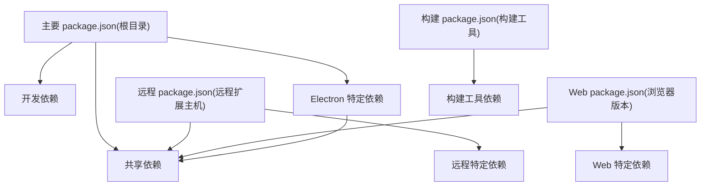
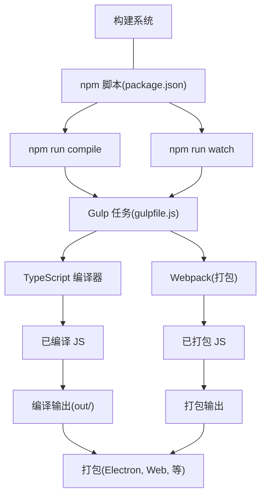
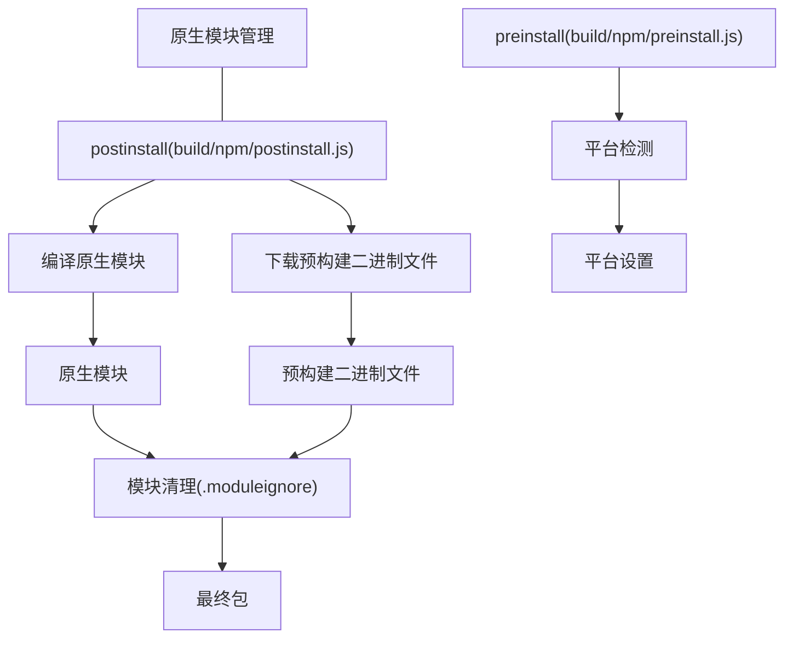
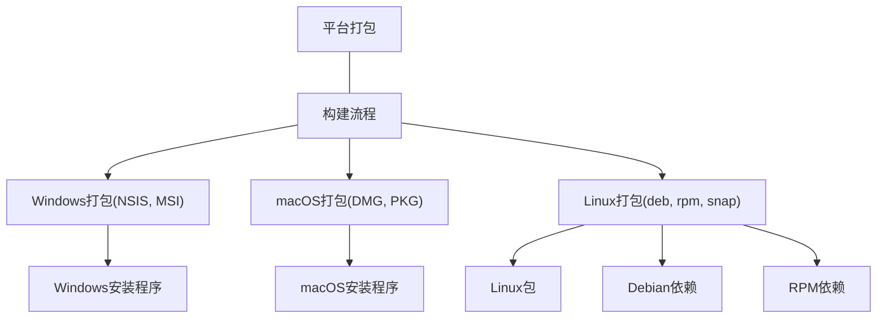
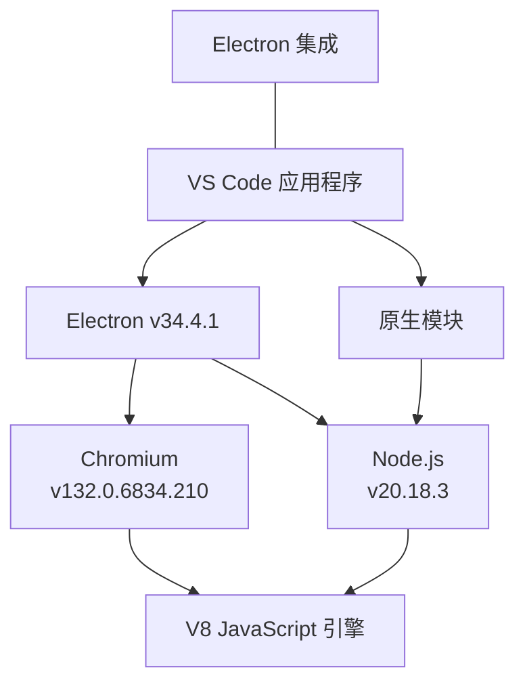

# 依赖管理与构建系统

本文档详细介绍了VS Code如何管理其依赖项、构建应用程序，以及为不同平台打包的过程。内容包括包管理方法、构建工具，以及为Windows、macOS和Linux创建可分发包的流程。

## 总览

VS Code使用npm作为其主要包管理工具，并采用基于Gulp的多阶段构建系统来编译、打包和封装应用程序。该构建系统能够处理不同的目标平台（桌面端、网页端、远程端）和架构（x64、arm64等）。

Sources:

- [package.json](../../package.json) 1-241
- [.npmrc](../../.npmrc) 1-8
- [remote/.npmrc](../../remote/.npmrc) 1-8

## 包管理

VS Code 在不同的 package.json 文件中管理着三组独立的依赖项：



### Main Dependencies

根目录的 `package.json` 定义了基于 Electron 的桌面应用程序的依赖项。它包括：

- 运行时依赖：VS Code 功能所需的库
- 原生模块：特定平台的二进制模块
- 开发依赖：用于构建、测试和打包的工具

主要的原生模块包括：

- @vscode/spdlog：日志记录
- @vscode/ripgrep：快速搜索
- node-pty：终端支持
- @vscode/sqlite3：数据库存储
- native-keymap：键盘处理
- @parcel/watcher：文件系统监视

Sources:

- [package.json](../../package.json) 71-116
- [package.json](../../package.json) 117-224
- [package.json](../../package.json) 238-240

### Remote and Web Dependencies

分别存在用于远程扩展主机和Web版本的 `package.json` 文件：

- 远程扩展主机：VS Code 远程功能所需的依赖项子集
- Web 版本：浏览器版本的 VS Code 依赖项
这些 `package.json` 文件仅包含其特定环境的依赖项，避免不必要的包。

Sources:

- [remote/package.json](../../remote/package.json) 1-49
- [remote/web/package.json](../../remote/web/package.json) 1-25

### Dependency Overrides
VS Code 使用 package.json 中的 overrides 字段来强制指定传递依赖的特定版本，以确保兼容性和安全性：

```json
"overrides": {
  "node-gyp-build": "4.8.1",
  "kerberos@2.1.1": {
    "node-addon-api": "7.1.0"
  }
}
```
Sources:

- [package.json](../../package.json) 225-230
- [remote/package.json](../../remote/package.json) 43-48

## 构建系统

VS Code 使用基于 Gulp 的构建系统来处理编译、打包和发布过程。



### 构建脚本

主要的构建命令在 `package.json` 中定义为 `npm` 脚本：

- `compile`: 编译整个代码库
- `watch`: 监视文件变化并重新编译
- `compile-web`: 为Web目标编译
- `compile-cli`: 为CLI目标编译
- `minify-vscode`: 压缩VS Code代码
- `download-builtin-extensions`: 下载内置扩展

Sources:

- [package.json](../../package.json) 12-69
- [build/package.json](../../build/package.json) 61-65

### Build Tools
构建过程依赖于以下工具：

- `TypeScript`: 将TypeScript编译为JavaScript
- `Gulp`: 协调构建过程
- `Webpack`: 为生产环境打包模块
- `Electron`: 打包桌面应用程序
这些构建工具本身在 `build/package.json` 文件中定义为依赖项。

Sources:

- [build/package.json](../../build/package.json) 5-69
- [package.json](../../package.json) 117-224


### Build Variants
VS Code 支持多种构建变体：

- Desktop (Electron): 标准桌面应用程序
- Web: 基于浏览器的版本
- Remote Extension Host: 用于远程开发场景
每个变体都有特定的编译和打包步骤。

Sources:

- [package.json](../../package.json) 50-62

## Native Module Management
VS Code 依赖于需要为每个平台和架构编译的几个原生模块。

### Native Module Compilation

原生模块在安装后阶段（postinstall）使用以下工具进行编译：

- `node-gyp`：用于编译 C/C++ 模块
- `Electron 的头文件`：确保与 Electron 的 Node.js 版本兼容

.npmrc 文件配置了原生模块的构建环境：

```
disturl="https://electronjs.org/headers"
target="34.4.1"
ms_build_id="11317338"
runtime="electron"
build_from_source="true"
```
Sources:

- [.npmrc](../../.npmrc) 1-8
- [package.json](../../package.json) 18-19
- [build/.moduleignore](../../build/.moduleignore) 1-189

### Native Module Cleanup
安装后，使用 `.moduleignore` 文件删除原生模块中的不必要文件，指定要排除的文件模式：

Sources:

- [build/.moduleignore](../../build/.moduleignore) 1-189
- [build/.webignore](../../build/.webignore) 1-60


## 多种平台打包
VS Code 为多种平台打包，每个平台都有其特定的要求和依赖。



### Linux 打包
对于 Linux，VS Code 生成包含适当依赖的 Debian (.deb) 和 RPM (.rpm) 包。

### Debian 依赖
Debian 包需要一个列表，列出 VS Code 运行所需的依赖项。这些依赖项基于：

- 生成的依赖：通过分析二进制文件确定
- 额外的依赖：手动指定的依赖

Sources:

- [build/linux/debian/dep-lists.ts](../../build/linux/debian/dep-lists.ts) 1-141
- [build/linux/debian/calculate-deps.ts](../../build/linux/debian/calculate-deps.ts) 1-20
- [build/linux/dependencies-generator.ts](../../build/linux/dependencies-generator.ts) 1-20

### RPM 依赖
RPM 包需要一个列表，列出 VS Code 运行所需的依赖项。这些依赖项基于：

- 生成的依赖：通过分析二进制文件确定
- 额外的依赖：手动指定的依赖

Sources:

- [build/linux/rpm/dep-lists.ts](../../build/linux/rpm/dep-lists.ts) 1-140
- [build/linux/rpm/dep-lists.js](../../build/linux/rpm/dep-lists.js) 1-140

### Windows 和 macOS 打包
对于 Windows，VS Code 使用：

- Inno Setup 创建安装程序
- Electron 的打包能力

对于 macOS：

- DMG 创建工具
- 代码签名用于公证

Sources:

- [cgmanifest.json](../../cgmanifest.json) 538-562

## Electron 与 Node.js 集成

VS Code 基于 Electron 构建，它结合了 Chromium 和 Node.js。



### Electron 版本管理
VS Code 跟踪特定的 Electron 版本以确保稳定性和兼容性：

- Electron 版本在 .npmrc 和 package.json 中指定
- Electron 二进制文件的校验和存储在 build/checksums/electron.txt

Sources:

- [.npmrc](../../.npmrc) 1-3
- [package.json](../../package.json) 158
- [build/checksums/electron.txt](../../build/checksums/electron.txt) 1-75

### Node.js 版本管理
对于远程扩展主机，VS Code 使用特定的 Node.js 版本：

- Node.js 版本在 remote/.npmrc 中指定
- Node.js 二进制文件的校验和存储在 build/checksums/nodejs.txt

Sources:

- [remote/.npmrc](../../remote/.npmrc) 1-3
- [build/checksums/nodejs.txt](../../build/checksums/nodejs.txt) 1-8
- [cgmanifest.json](../../cgmanifest.json) 517-524

## 测试基础设施
VS Code 包含几个依赖于构建系统的测试套件：

- 单元测试：用于测试单个组件
- 集成测试：用于测试组件交互
- 冒烟测试：用于测试完整应用程序
- 浏览器测试：用于测试 Web 版本
每个测试套件都有其自己的依赖和构建要求。

Sources:

- [package.json](../../package.json) 13-17
- [test/smoke/package.json](../../test/smoke/package.json) 1-26
- [test/automation/package.json](../../test/automation/package.json) 1-34
- [test/integration/browser/package.json](../../test/integration/browser/package.json) 1-18

## 第三方依赖
VS Code tracks third-party dependencies in cgmanifest.json, which includes:

- Chromium: 浏览器引擎
- Node.js: JavaScript 运行时
- Electron: 应用程序框架
- FFmpeg: 媒体支持
- Inno Setup: 用于 Windows 安装程序

Sources:

- [cgmanifest.json](../../cgmanifest.json) 1-562

## 结论
VS Code 的依赖管理与构建系统旨在处理多种平台、架构和部署场景。它使用 npm、Gulp 和平台特定的工具来为每个目标环境创建优化的包。

该系统高度可配置且可扩展，允许在不同构建变体和打包选项之间保持一致的开发体验。


