# 核心服务与组件
本文档概述了构成VS Code架构基础的核心服务和组件，重点介绍了配置系统、服务基础设施以及其他实现VS Code功能的关键组件。

有关Monaco编辑器的信息，请参阅Monaco编辑器。关于扩展系统的详细信息，请参阅扩展系统。

## 配置系统架构
VS Code的配置系统是一个复杂框架，用于管理跨多个范围和来源的设置。它提供了一种统一的方式来访问和修改配置值，同时尊重不同配置源之间的优先级。

### 配置源和层次结构
配置系统将设置从多个来源按特定顺序组合在一起：

```mermaid
flowchart TD
    subgraph "配置源优先级"
        DC["默认配置(DefaultConfiguration)"]
        PC["策略配置(PolicyConfiguration)"]
        AC["应用程序配置(ApplicationConfiguration)"]
        ULC["用户本地配置(UserConfiguration)"]
        RUC["远程用户配置(RemoteUserConfiguration)"]
        WC["工作区配置(WorkspaceConfiguration)"]
        FC["文件夹配置(FolderConfiguration)"]
        MC["内存配置(Memory Configuration)"]

        DC --> PC
        PC --> AC
        AC --> ULC
        ULC --> RUC
        RUC --> WC
        WC --> FC
        FC --> MC

        MC -.-> LSO

        subgraph "覆盖"
            LSO["语言特定覆盖([language])"]
        end
    end
```

来源（按优先级从低到高）：

默认配置：所有设置的内置默认值
策略配置：系统策略强制执行的设置
应用程序配置：所有配置文件应用的设置
用户配置：用户设置（本地和远程）
工作区配置：特定于工作区的设置
文件夹配置：特定于工作区文件夹的设置
内存配置：临时内存中的设置

Sources:

- [src/vs/workbench/services/configuration/browser/configurationService.ts](../../src/vs/workbench/services/configuration/browser/configurationService.ts) 62-170
- [src/vs/platform/configuration/common/configurationModels.ts](../../src/vs/platform/configuration/common/configurationModels.ts) 29-296

### 配置范围
每个配置属性都有一个作用域，用于确定其可设置的位置：
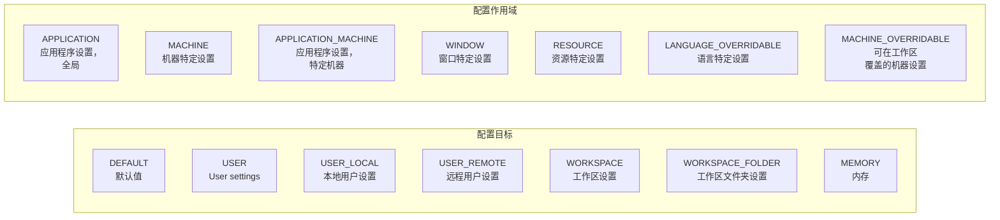

Sources:

- [src/vs/platform/configuration/common/configurationRegistry.ts](../../src/vs/platform/configuration/common/configurationRegistry.ts) 128-157
- [src/vs/workbench/services/configuration/common/configuration.ts](../../src/vs/workbench/services/configuration/common/configuration.ts) 28-35

### 配置模型
配置系统使用一系列模型类来表示和管理配置数据：

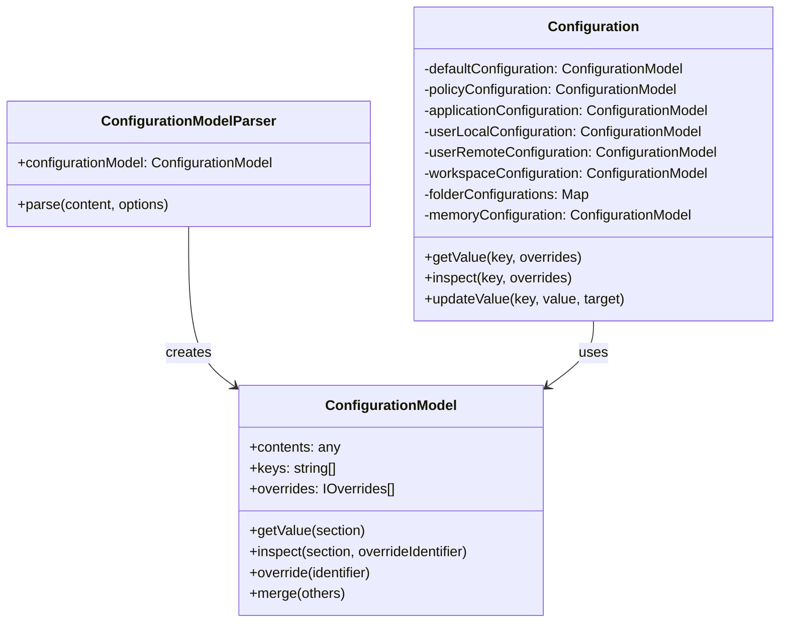

Sources:

- [src/vs/platform/configuration/common/configurationModels.ts](../../src/vs/platform/configuration/common/configurationModels.ts) 29-296
- [src/vs/workbench/services/configuration/common/configurationModels.ts](../../src/vs/workbench/services/configuration/common/configurationModels.ts) 97-172

### WorkspaceService
WorkspaceService 是 VS Code 中配置系统的核心实现。它同时实现了 IWorkspaceContextService 和 IWorkbenchConfigurationService 接口，提供工作区信息和配置管理功能。

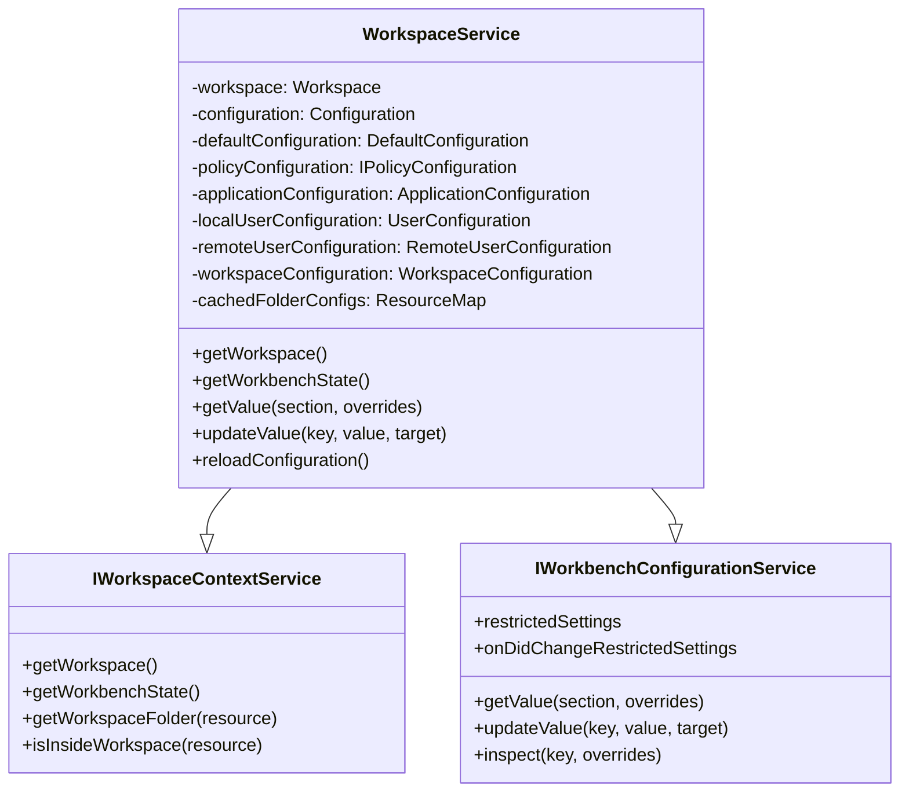

Sources:

- [src/vs/workbench/services/configuration/browser/configurationService.ts](../../src/vs/workbench/services/configuration/browser/configurationService.ts) 62-170
- [src/vs/workbench/services/configuration/common/configuration.ts](../../src/vs/workbench/services/configuration/common/configuration.ts) 68-97

## 配置注册与扩展点
VS Code 使用注册表模式来管理配置属性及其元数据。

### 配置注册表
ConfigRegistry维护了所有配置属性、其模式及默认值的注册表：

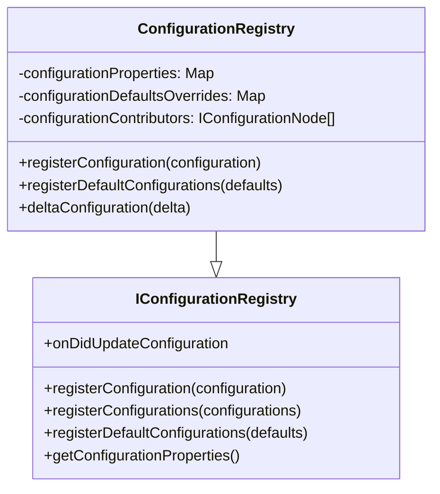

Sources:

- [src/vs/platform/configuration/common/configurationRegistry.ts](../../src/vs/platform/configuration/common/configurationRegistry.ts) 34-116
- [src/vs/platform/configuration/common/configurationRegistry.ts](../../src/vs/platform/configuration/common/configurationRegistry.ts) 276-307

### 配置的扩展点

VS Code 提供了扩展点，允许扩展贡献配置属性及其默认值：

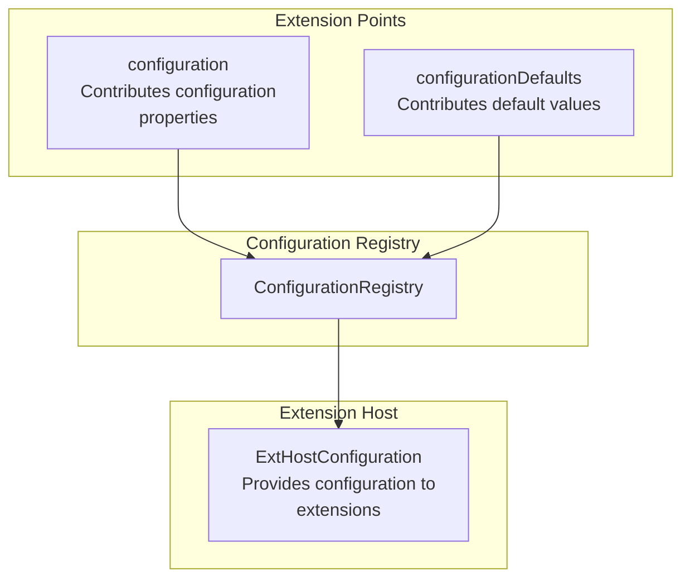
Sources:

- [src/vs/workbench/api/common/configurationExtensionPoint.ts](../../src/vs/workbench/api/common/configurationExtensionPoint.ts) 138-306
- [src/vs/workbench/api/common/extHostConfiguration.ts](../../src/vs/workbench/api/common/extHostConfiguration.ts) 97-132

## 服务基础设施

VS Code 采用基于服务的架构，通过依赖注入来管理组件及其依赖关系。

### 服务实例化

实例化服务负责创建和管理服务实例：

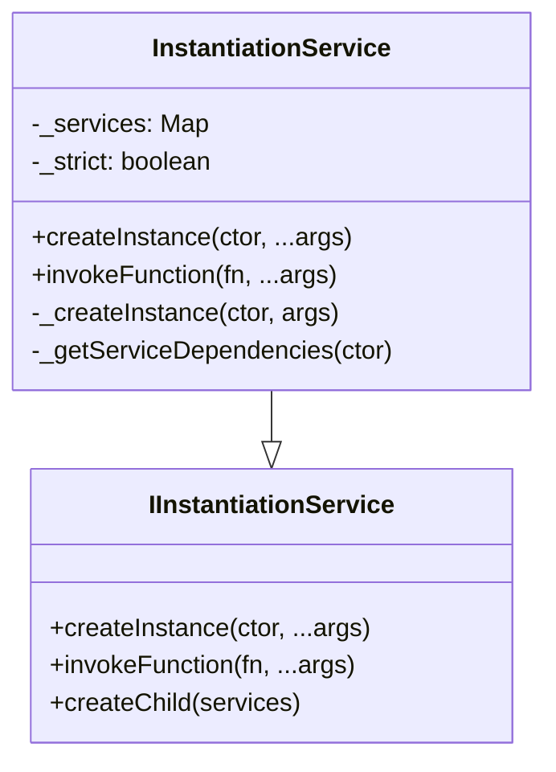

Sources:

- [src/vs/workbench/services/configuration/browser/configurationService.ts](../../src/vs/workbench/services/configuration/browser/configurationService.ts) 492-495

### 服务装饰器
VS Code 使用 TypeScript 装饰器来定义服务依赖：

```ts
// Service interface declaration with decorator
export const IConfigurationService = createDecorator<IConfigurationService>('configurationService');

// Service implementation with dependencies
class ConfigurationService implements IConfigurationService {
    constructor(
        @IFileService private readonly fileService: IFileService,
        @ILogService private readonly logService: ILogService
    ) { /* ... */ }
}
```
Sources:

- [src/vs/platform/configuration/common/configuration.ts](../../src/vs/platform/configuration/common/configuration.ts) 14-15
- [src/vs/platform/configuration/common/configurationService.ts](../../src/vs/platform/configuration/common/configurationService.ts) 42-48

## 配置访问模式

### 访问配置值

VS Code 提供了多种访问配置值的方式：

1. Direct access through IConfigurationService:

```ts
const value = configurationService.getValue('editor.fontSize');
```

2. Scoped access with overrides:

```ts
const value = configurationService.getValue('editor.fontSize', { resource: uri });
```

3. Inspecting configuration:

```ts
const inspect = configurationService.inspect('editor.fontSize');
// Access specific layers: inspect.defaultValue, inspect.userValue, etc.
```

Sources:

- [src/vs/platform/configuration/common/configuration.ts](../../src/vs/platform/configuration/common/configuration.ts) 165-168
- [src/vs/workbench/services/configuration/browser/configurationService.ts](../../src/vs/workbench/services/configuration/browser/configurationService.ts) 323-332


### 更新配置值
配置值可以在不同的目标位置进行更新：
```ts
// Update user settings
configurationService.updateValue('editor.fontSize', 14, ConfigurationTarget.USER);

// Update workspace settings
configurationService.updateValue('editor.fontSize', 14, ConfigurationTarget.WORKSPACE);

// Update folder settings
configurationService.updateValue('editor.fontSize', 14,
    { resource: folderUri }, ConfigurationTarget.WORKSPACE_FOLDER);
```
Sources:

- [src/vs/platform/configuration/common/configuration.ts](../../src/vs/platform/configuration/common/configuration.ts) 188-192

- [src/vs/workbench/services/configuration/browser/configurationService.ts](../../src/vs/workbench/services/configuration/browser/configurationService.ts) 334-363

## 配置变更事件
配置系统提供了事件，以便在配置更改时通知组件：

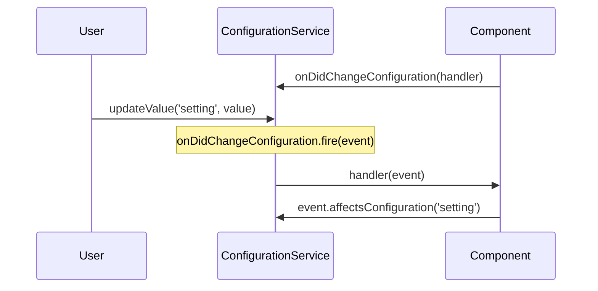
Sources:

- [src/vs/platform/configuration/common/configuration.ts](../../src/vs/platform/configuration/common/configuration.ts) 66-73
- [src/vs/workbench/services/configuration/browser/configurationService.ts](../../src/vs/workbench/services/configuration/browser/configurationService.ts) 83-86

## 配置存储
VS Code 根据配置的类型存储在不同的位置：

| 配置类型 | 存储位置 | 格式 |
| --- | --- | --- |
| 默认配置 | 内存中 | JSON |
| 用户配置 | 用户数据目录中的 settings.json | JSON |
| 工作区配置 | 工作区中的 .vscode/settings.json | JSON |
| 文件夹配置 | 文件夹中的 .vscode/settings.json | JSON |

Sources:

- [src/vs/workbench/services/configuration/browser/configuration.ts](../../src/vs/workbench/services/configuration/browser/configuration.ts) 123-172
- [src/vs/workbench/services/configuration/common/configuration.ts](../../src/vs/workbench/services/configuration/common/configuration.ts) 14-18

## 限制设置
VS Code 支持限制设置的概念，这些设置仅在受信任的工作区中应用：

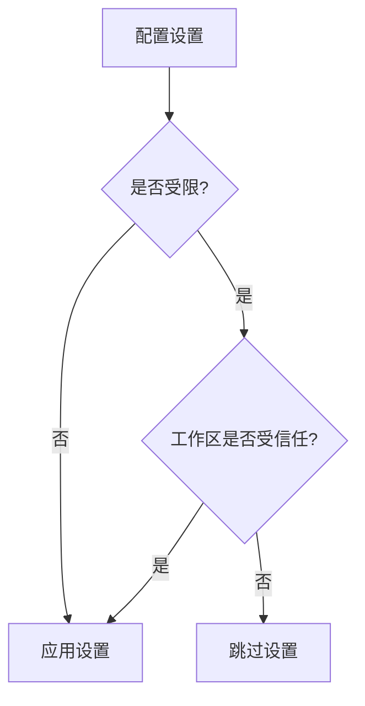

Sources:
- [src/vs/workbench/services/configuration/browser/configurationService.ts](../../src/vs/workbench/services/configuration/browser/configurationService.ts) 451-490
- [src/vs/platform/configuration/common/configurationRegistry.ts](../../src/vs/platform/configuration/common/configurationRegistry.ts) 167-169

## 配置缓存
VS Code 缓存配置以提高性能，特别是针对远程工作区：

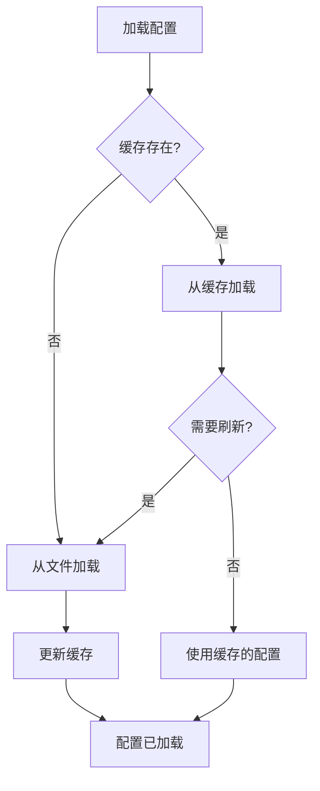

Sources:

- [src/vs/workbench/services/configuration/browser/configurationService.ts](../../src/vs/workbench/services/configuration/browser/configurationService.ts) 606-631
- [src/vs/workbench/services/configuration/common/configuration.ts](../../src/vs/workbench/services/configuration/common/configuration.ts) 50-56

## 与扩展主机的集成
VS Code 的配置系统与扩展主机集成，为扩展提供配置：

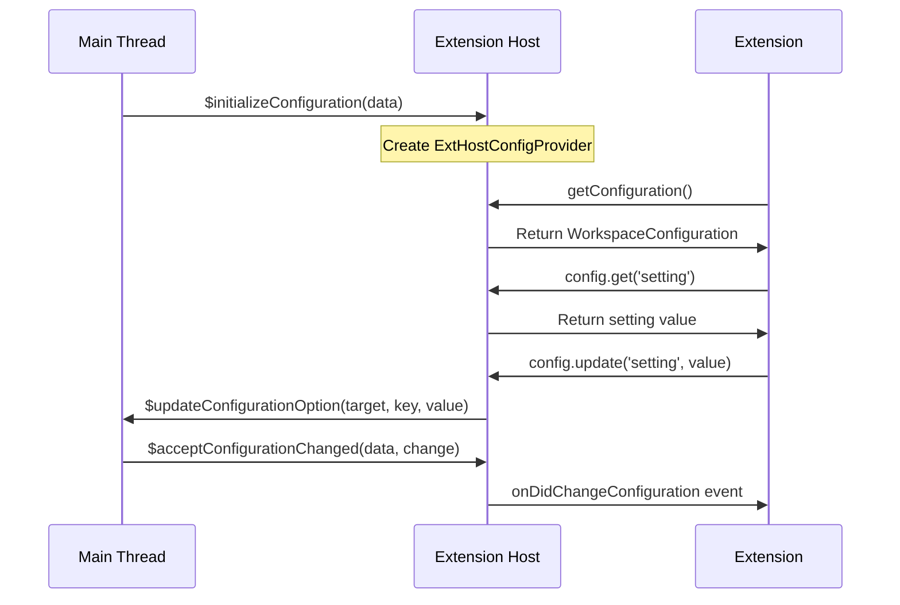
Sources:

- [src/vs/workbench/api/common/extHostConfiguration.ts](../../src/vs/workbench/api/common/extHostConfiguration.ts) 97-132
- [src/vs/workbench/api/browser/mainThreadConfiguration.ts](../../src/vs/workbench/api/browser/mainThreadConfiguration.ts) 16-48

## 关键组件与服务

### WorkspaceService
WorkspaceService 是工作区上下文和配置服务的核心实现。它负责管理：

1. 工作区信息（文件夹、状态）
2. 从多个来源获取配置
3. 配置变更事件
4. 工作区信任状态

Sources:

- [src/vs/workbench/services/configuration/browser/configurationService.ts](../../src/vs/workbench/services/configuration/browser/configurationService.ts) 62-170

### ConfigurationRegistry
ConfigurationRegistry 维护了所有配置属性的注册表，包括它们的模式和默认值。它负责：

1. 注册配置属性
2. 注册默认值
3. 模式验证
4. 配置属性覆盖

Sources:

- [src/vs/platform/configuration/common/configurationRegistry.ts](../../src/vs/platform/configuration/common/configurationRegistry.ts) 276-307

### Configuration Models
多个模型类表示配置数据：

1. ConfigurationModel：表示单一层级的配置
2. Configuration：以适当的优先级组合多个配置模型
3. ConfigurationModelParser：从JSON解析配置

来源：

- [src/vs/platform/configuration/common/configurationModels.ts](../../src/vs/platform/configuration/common/configurationModels.ts) 29-296
- [src/vs/workbench/services/configuration/common/configurationModels.ts](../../src/vs/workbench/services/configuration/common/configurationModels.ts) 97-172

### 配置编辑
ConfigurationEditing服务提供编辑配置文件的功能：

1. 在适当的文件中更新配置值
2. 处理文件格式和JSON结构
3. 根据模式验证更改

来源：

- [src/vs/workbench/services/keybinding/test/browser/keybindingEditing.test.ts](../../src/vs/workbench/services/keybinding/test/browser/keybindingEditing.test.ts) 80-81

## 总结
VS Code 的配置系统是一个复杂的管理框架，它能够跨多个范围和来源处理设置。该系统提供了一种统一的方式来访问和修改配置值，同时尊重不同配置源之间的优先级。该设计具有可扩展性，允许扩展贡献自己的配置属性和默认值。

本文档中描述的核心服务和组件构成了 VS Code 架构的基础，使其拥有丰富的功能和可扩展性。
