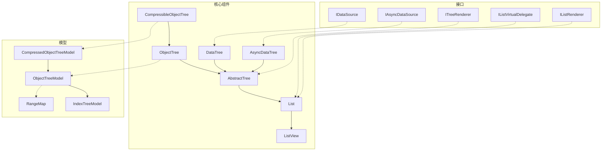
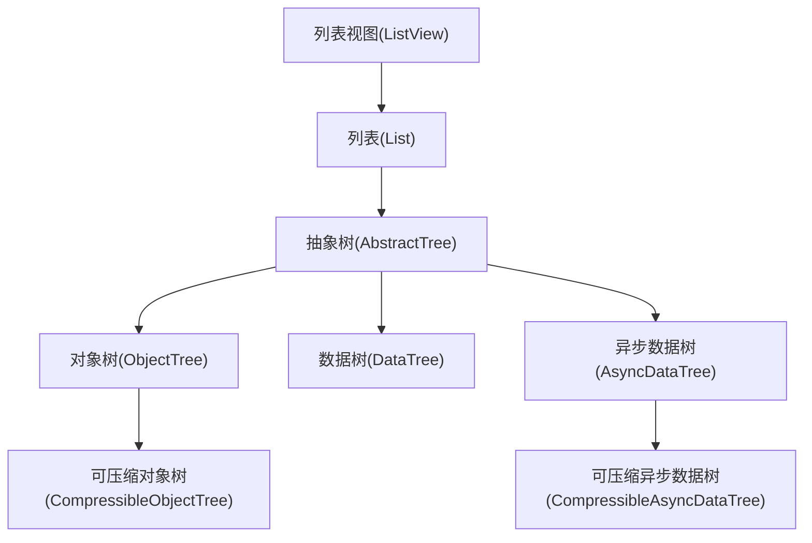
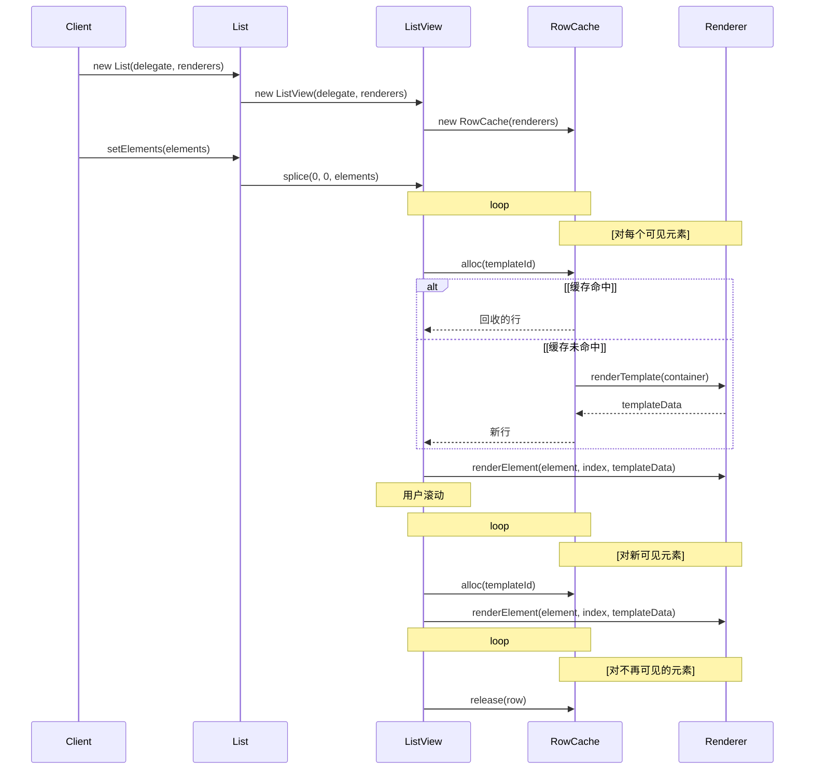
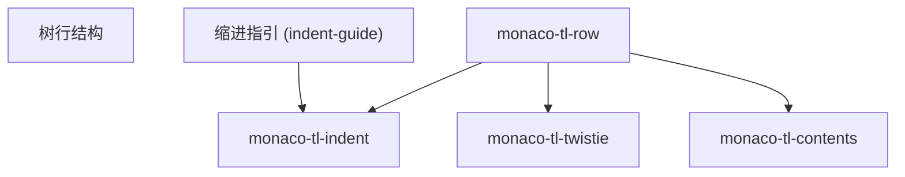

# List and Tree Components 列表和树组件

本文档描述了VS Code中使用的虚拟化列表和树UI组件。这些组件提供了大型项目集合的高效渲染，支持选择、键盘导航、拖放和其他交互功能。

有关Monaco编辑器的信息，请参阅Monaco编辑器文档。

## 概述

VS Code 的列表和树组件是应用程序中许多部分的基础 UI 元素，包括资源管理器、搜索结果、扩展视图等。这些组件旨在高效渲染可能非常大的数据集，同时保持流畅的性能。

这些组件建立在虚拟化架构之上，仅渲染当前在视口中可见的项目，即使在非常大的数据集上也能实现高效的内存使用和性能。



Sources:

- [src/vs/base/browser/ui/list/listView.ts](../../src/vs/base/browser/ui/list/listView.ts)
- [src/vs/base/browser/ui/list/listWidget.ts](../../src/vs/base/browser/ui/list/listWidget.ts)
- [src/vs/base/browser/ui/tree/abstractTree.ts](../../src/vs/base/browser/ui/tree/abstractTree.ts)
- [src/vs/base/browser/ui/tree/objectTree.ts](../../src/vs/base/browser/ui/tree/objectTree.ts)
- [src/vs/base/browser/ui/tree/dataTree.ts](../../src/vs/base/browser/ui/tree/dataTree.ts)
- [src/vs/base/browser/ui/tree/asyncDataTree.ts](../../src/vs/base/browser/ui/tree/asyncDataTree.ts)

## 组件层次结构

列表和树组件遵循层次结构，每一级都基于前一级，以添加更专业的功能。



Sources:

- [src/vs/base/browser/ui/list/listView.ts](../../src/vs/base/browser/ui/list/listView.ts)
- [src/vs/base/browser/ui/list/listWidget.ts](../../src/vs/base/browser/ui/list/listWidget.ts)
- [src/vs/base/browser/ui/tree/abstractTree.ts](../../src/vs/base/browser/ui/tree/abstractTree.ts)
- [src/vs/base/browser/ui/tree/objectTree.ts](../../src/vs/base/browser/ui/tree/objectTree.ts)
- [src/vs/base/browser/ui/tree/dataTree.ts](../../src/vs/base/browser/ui/tree/dataTree.ts)
- [src/vs/base/browser/ui/tree/asyncDataTree.ts](../../src/vs/base/browser/ui/tree/asyncDataTree.ts)

## 核心组件

### ListView

`ListView<T>` 是处理虚拟化的基础组件。它仅渲染当前视口中可见的元素，并在用户滚动时回收 DOM 节点。

主要职责：

- 虚拟滚动
- DOM 回收
- 项目渲染
- 滚动事件处理
- 拖放支持

```ts
export class ListView<T> implements IListView<T> {
    constructor(
        container: HTMLElement,
        virtualDelegate: IListVirtualDelegate<T>,
        renderers: IListRenderer<any, any>[],
        options: IListViewOptions<T> = DefaultOptions
    )
}
```

Sources:

- [src/vs/base/browser/ui/list/listView.ts](../../src/vs/base/browser/ui/list/listView.ts)

### List

List<T> 在 ListView<T> 的基础上增加了：

- 选择管理
- 键盘导航
- 焦点管理
- 无障碍支持

```ts
export class List<T> implements IDisposable {
    constructor(
        user: string,
        container: HTMLElement,
        virtualDelegate: IListVirtualDelegate<T>,
        renderers: IListRenderer<T, any>[],
        options?: IListOptions<T>
    )
}
```
Sources:

- [src/vs/base/browser/ui/list/listWidget.ts](../../src/vs/base/browser/ui/list/listWidget.ts)

### AbstractTree

AbstractTree<T, TFilterData, TRef> 扩展了 List<T> 以添加层次结构数据支持：

- 树节点管理
- 展开/折叠功能
- 树特有的键盘导航
- 过滤能力

```ts
export abstract class AbstractTree<T, TFilterData, TRef> extends Disposable {
    constructor(
        user: string,
        container: HTMLElement,
        delegate: IListVirtualDelegate<T>,
        renderers: ITreeRenderer<T, TFilterData, any>[],
        options: IAbstractTreeOptions<T, TFilterData> = {}
    )
}
```

Sources:

- [src/vs/base/browser/ui/tree/abstractTree.ts](../../src/vs/base/browser/ui/tree/abstractTree.ts)

### ObjectTree
ObjectTree<T, TFilterData> 是 AbstractTree 的一个具体实现，用于处理基于对象的数据结构：

- 管理对象之间的父子关系
- 处理可折叠状态
- 支持排序

```ts
export class ObjectTree<T extends NonNullable<any>, TFilterData = void> extends AbstractTree<T | null, TFilterData, T | null> {
    constructor(
        protected readonly user: string,
        container: HTMLElement,
        delegate: IListVirtualDelegate<T>,
        renderers: ITreeRenderer<T, TFilterData, any>[],
        options: IObjectTreeOptions<T, TFilterData> = {}
    )
}
```

Sources:

- [src/vs/base/browser/ui/tree/objectTree.ts](../../src/vs/base/browser/ui/tree/objectTree.ts)

### DataTree

DataTree<TInput, T, TFilterData> 扩展了 AbstractTree 以处理需要按需提供子元素的数据源：

- 使用数据源获取子元素
- 管理父-子关系
- 支持刷新数据

```ts
export class DataTree<TInput, T, TFilterData = void> extends AbstractTree<T | null, TFilterData, T | null> {
    constructor(
        private user: string,
        container: HTMLElement,
        delegate: IListVirtualDelegate<T>,
        renderers: ITreeRenderer<T, TFilterData, any>[],
        private dataSource: IDataSource<TInput, T>,
        options: IDataTreeOptions<T, TFilterData> = {}
    )
}
```

Sources:

- [src/vs/base/browser/ui/tree/dataTree.ts](../../src/vs/base/browser/ui/tree/dataTree.ts)

### AsyncDataTree
AsyncDataTree<TInput, T, TFilterData> 扩展了 AbstractTree 以处理异步数据源：

- 处理异步数据加载
- 显示加载状态
- 管理刷新操作
- 支持取消

```ts
export class AsyncDataTree<TInput, T, TFilterData = void> implements IDisposable {
    constructor(
        private user: string,
        container: HTMLElement,
        delegate: IListVirtualDelegate<T>,
        renderers: ITreeRenderer<T, TFilterData, any>[],
        dataSource: IAsyncDataSource<TInput, T>,
        options: IAsyncDataTreeOptions<T, TFilterData> = {}
    )
}
```

Sources:

- [src/vs/base/browser/ui/tree/asyncDataTree.ts](../../src/vs/base/browser/ui/tree/asyncDataTree.ts)

### CompressibleObjectTree and CompressibleAsyncDataTree
这些变体为各自的基类添加了路径压缩功能：

- 将单个子节点压缩为单个视觉节点
- 支持基于路径的导航
- 在简化视觉表示的同时保持逻辑树结构

Sources:

- [src/vs/base/browser/ui/tree/objectTree.ts](../../src/vs/base/browser/ui/tree/objectTree.ts)
- [src/vs/base/browser/ui/tree/compressedObjectTreeModel.ts](../../src/vs/base/browser/ui/tree/compressedObjectTreeModel.ts)
- [src/vs/base/browser/ui/tree/asyncDataTree.ts](../../src/vs/base/browser/ui/tree/asyncDataTree.ts)

## 模型
树组件使用模型类来管理它们的数据结构和状态：

### RangeMap
RangeMap 是一个数据结构，用于将索引映射到虚拟空间中的位置，用于 ListView 的虚拟化。
```ts
export class RangeMap implements IRangeMap {
    constructor(paddingTop: number = 0) {
        this.paddingTop = paddingTop;
    }
}
```
Sources:

- [src/vs/base/browser/ui/list/rangeMap.ts](../../src/vs/base/browser/ui/list/rangeMap.ts)

### IndexTreeModel
IndexTreeModel<T, TFilterData> 是管理树结构的基础树模型，使用数字索引表示节点位置。
```ts
export class IndexTreeModel<T extends Exclude<any, undefined>, TFilterData = void> implements ITreeModel<T, TFilterData, number[]> {
    constructor(
        private user: string,
        rootElement: T,
        options: IIndexTreeModelOptions<T, TFilterData> = {}
    )
}
```
Sources:

- [src/vs/base/browser/ui/tree/indexTreeModel.ts](../../src/vs/base/browser/ui/tree/indexTreeModel.ts)

### ObjectTreeModel
ObjectTreeModel<T, TFilterData> 扩展了树模型概念，使用对象作为元素。
```ts
export class ObjectTreeModel<T extends NonNullable<any>, TFilterData extends NonNullable<any> = void> implements IObjectTreeModel<T, TFilterData> {
    constructor(
        private user: string,
        options: IObjectTreeModelOptions<T, TFilterData> = {}
    )
}
```

Sources:

- [src/vs/base/browser/ui/tree/objectTreeModel.ts](../../src/vs/base/browser/ui/tree/objectTreeModel.ts)

### CompressedObjectTreeModel
CompressedObjectTreeModel<T, TFilterData> 为对象树模型添加了路径压缩功能。
```ts
export class CompressedObjectTreeModel<T extends NonNullable<any>, TFilterData extends NonNullable<any> = void> implements ITreeModel<ICompressedTreeNode<T> | null, TFilterData, T | null> {
    constructor(
        private user: string,
        options: ICompressedObjectTreeModelOptions<T, TFilterData> = {}
    )
}
```

Sources:

- [src/vs/base/browser/ui/tree/compressedObjectTreeModel.ts](../../src/vs/base/browser/ui/tree/compressedObjectTreeModel.ts)

## Key Interfaces

### IListVirtualDelegate
这个接口提供了列表项的大小信息：
```ts
export interface IListVirtualDelegate<T> {
    getHeight(element: T): number;
    getTemplateId(element: T): string;
    hasDynamicHeight?(element: T): boolean;
    getDynamicHeight?(element: T): number | null;
    setDynamicHeight?(element: T, height: number): void;
}
```

Sources:

- [src/vs/base/browser/ui/list/list.ts](../../src/vs/base/browser/ui/list/list.ts)

### IListRenderer
这个接口定义了如何渲染列表项：
```ts
export interface IListRenderer<T, TTemplateData> {
    readonly templateId: string;
    renderTemplate(container: HTMLElement): TTemplateData;
    renderElement(element: T, index: number, templateData: TTemplateData, height: number | undefined): void;
    disposeElement?(element: T, index: number, templateData: TTemplateData, height: number | undefined): void;
    disposeTemplate(templateData: TTemplateData): void;
}
```

Sources:

- [src/vs/base/browser/ui/list/list.ts](../../src/vs/base/browser/ui/list/list.ts)

### ITreeRenderer
这个接口扩展了 IListRenderer 以添加树特有的渲染功能：
```ts
export interface ITreeRenderer<T, TFilterData = void, TTemplateData = void> extends IListRenderer<ITreeNode<T, TFilterData>, TTemplateData> {
    renderTwistie?(element: T, twistieElement: HTMLElement): boolean;
    onDidChangeTwistieState?: Event<T>;
}
```

Sources:

- [src/vs/base/browser/ui/tree/tree.ts:162-165](../../src/vs/base/browser/ui/tree/tree.ts)

### IDataSource and IAsyncDataSource
这些接口定义了如何为树节点获取子元素：
```ts
export interface IDataSource<TInput, T> {
    hasChildren?(element: TInput | T): boolean;
    getChildren(element: TInput | T): Iterable<T>;
}

export interface IAsyncDataSource<TInput, T> {
    hasChildren(element: TInput | T): boolean;
    getChildren(element: TInput | T): Iterable<T> | Promise<Iterable<T>>;
    getParent?(element: T): TInput | T;
}
```

Sources:

- [src/vs/base/browser/ui/tree/tree.ts:200-208](../../src/vs/base/browser/ui/tree/tree.ts)

## Rendering Architecture
列表和树组件使用基于模板的渲染系统高效地创建和回收 DOM 元素。


Sources:

- [src/vs/base/browser/ui/list/listView.ts:373-456](../../src/vs/base/browser/ui/list/listView.ts)
- [src/vs/base/browser/ui/list/rowCache.ts](../../src/vs/base/browser/ui/list/rowCache.ts)

### Template-based Rendering

1. 每个渲染器都有一个唯一的 templateId
2. 当需要渲染一个元素时：
    - 委托通过 getTemplateId 确定使用哪个模板
    - 渲染器创建或重用一个模板
    - 渲染器用元素数据填充模板
3. 当一个元素滚动出视图时，它的 DOM 节点被缓存以便重用
4. 当一个元素滚动进入视图时，如果可用，则重用缓存的 DOM 节点
Sources:

- [src/vs/base/browser/ui/list/listView.ts](../../src/vs/base/browser/ui/list/listView.ts)
- [src/vs/base/browser/ui/list/rowCache.ts](../../src/vs/base/browser/ui/list/rowCache.ts)

## Tree Node Structure
树组件使用一个节点结构来表示层次结构数据：
```ts
export interface ITreeNode<T, TFilterData = void> {
    readonly element: T;
    readonly children: ITreeNode<T, TFilterData>[];
    readonly depth: number;
    readonly visibleChildrenCount: number;
    readonly visibleChildIndex: number;
    readonly collapsible: boolean;
    readonly collapsed: boolean;
    readonly visible: boolean;
    readonly filterData: TFilterData | undefined;
}
```

Sources:

- [src/vs/base/browser/ui/tree/tree.ts:105-115](../../src/vs/base/browser/ui/tree/tree.ts)

对于压缩的树，节点可以表示路径中的多个元素：
```ts
export interface ICompressedTreeNode<T> {
    readonly elements: T[];
    readonly incompressible: boolean;
}
```
Sources:

- [src/vs/base/browser/ui/tree/compressedObjectTreeModel.ts:20-24](../../src/vs/base/browser/ui/tree/compressedObjectTreeModel.ts)

## Tree Rendering
树组件具有额外的渲染复杂性，以处理缩进、扭动（展开/折叠图标）和层次结构：


TreeRenderer 类处理树特有的渲染方面：
```ts
export class TreeRenderer<T, TFilterData, TRef, TTemplateData> implements IListRenderer<ITreeNode<T, TFilterData>, ITreeListTemplateData<TTemplateData>> {
    constructor(
        private readonly renderer: ITreeRenderer<T, TFilterData, TTemplateData>,
        private readonly model: ITreeModel<T, TFilterData, TRef>,
        onDidChangeCollapseState: Event<ICollapseStateChangeEvent<T, TFilterData>>,
        private readonly activeNodes: Collection<ITreeNode<T, TFilterData>>,
        private readonly renderedIndentGuides: SetMap<ITreeNode<T, TFilterData>, HTMLDivElement>,
        options: ITreeRendererOptions = {}
    )
}
```
Sources:

- [src/vs/base/browser/ui/tree/abstractTree.ts:334-574](../../src/vs/base/browser/ui/tree/abstractTree.ts)
- [src/vs/base/browser/ui/tree/media/tree.css](../../src/vs/base/browser/ui/tree/media/tree.css)

## Filtering and Type Navigation
树组件支持过滤和基于键盘的导航：

### Tree Filtering
```ts
export interface ITreeFilter<T, TFilterData = void> {
    filter(element: T, parentVisibility: TreeVisibility): TreeFilterResult<TFilterData>;
}

export type TreeFilterResult<TFilterData> = boolean | TreeVisibility | ITreeFilterDataResult<TFilterData>;

export enum TreeVisibility {
    Hidden,
    Visible,
    Recurse
}
```
Sources:

- [src/vs/base/browser/ui/tree/tree.ts:12-70](../../src/vs/base/browser/ui/tree/tree.ts)

### Find Feature
树组件包含一个内置的查找功能，用于在树中搜索：
```ts
export class FindController<T, TFilterData> extends AbstractFindController<T, TFilterData> {
    constructor(
        tree: ObjectTree<IAsyncDataTreeNode<TInput, T>, TFilterData>,
        filter: IFindFilter<T>,
        contextViewProvider: IContextViewProvider,
        options: IFindControllerOptions = {}
    )
}
```
Sources:

- [src/vs/base/browser/ui/tree/abstractTree.ts:1087-1146](../../src/vs/base/browser/ui/tree/abstractTree.ts)

## Drag and Drop
列表和树组件支持丰富的拖放交互：
```ts
export interface IListDragAndDrop<T> extends IDisposable {
    getDragURI(element: T): string | null;
    getDragLabel?(elements: T[], originalEvent: DragEvent): string | undefined;
    onDragStart?(data: IDragAndDropData, originalEvent: DragEvent): void;
    onDragOver(data: IDragAndDropData, targetElement: T | undefined, targetIndex: number | undefined, originalEvent: DragEvent): boolean | IListDragOverReaction;
    drop(data: IDragAndDropData, targetElement: T | undefined, targetIndex: number | undefined, originalEvent: DragEvent): void;
}
```
Sources:

- [src/vs/base/browser/ui/list/list.ts:120-125](../../src/vs/base/browser/ui/list/list.ts)

树组件扩展了此功能，以处理树特有的拖放行为：
```ts
export interface ITreeDragAndDrop<T> extends IListDragAndDrop<T> {
    onDragOver(data: IDragAndDropData, targetElement: T | undefined, targetIndex: number | undefined, targetSector: ListViewTargetSector | undefined, originalEvent: DragEvent): boolean | ITreeDragOverReaction;
}
```
Sources:

- [src/vs/base/browser/ui/tree/tree.ts:228-230](../../src/vs/base/browser/ui/tree/tree.ts)

## Workbench Integration
VS Code 的 workbench 提供了包装类，将列表和树组件与 workbench 的服务和上下文键集成在一起：
```ts
export class WorkbenchList<T> extends List<T> {
    constructor(
        user: string,
        container: HTMLElement,
        delegate: IListVirtualDelegate<T>,
        renderers: IListRenderer<T, any>[],
        options: IWorkbenchListOptions<T>,
        @IContextKeyService contextKeyService: IContextKeyService,
        @IListService listService: IListService,
        @IConfigurationService configurationService: IConfigurationService,
        @IInstantiationService instantiationService: IInstantiationService
    )
}
```
类似的包装类存在于所有列表和树变体中。

Sources:

- [src/vs/platform/list/browser/listService.ts:254-383](../../src/vs/platform/list/browser/listService.ts)

## Usage Examples

### Basic List
```ts
// Create a list
const list = new List('myList', container, {
    getHeight: () => 22,
    getTemplateId: () => 'template'
}, [
    {
        templateId: 'template',
        renderTemplate: (container) => ({ element: container }),
        renderElement: (element, index, templateData) => {
            templateData.element.textContent = element.toString();
        },
        disposeTemplate: () => {}
    }
]);

// Set elements
list.splice(0, 0, ['Item 1', 'Item 2', 'Item 3']);

// Listen for selection changes
list.onDidChangeSelection(e => {
    console.log('Selection changed:', e.elements);
});
```

### Basic Tree
```ts
// Create a tree
const tree = new ObjectTree('myTree', container, {
    getHeight: () => 22,
    getTemplateId: () => 'template'
}, [
    {
        templateId: 'template',
        renderTemplate: (container) => ({ element: container }),
        renderElement: (node, index, templateData) => {
            templateData.element.textContent = node.element.label;
        },
        disposeTemplate: () => {}
    }
]);

// Set tree elements
tree.setChildren(null, [
    {
        element: { id: '1', label: 'Parent 1' },
        children: [
            { element: { id: '1.1', label: 'Child 1.1' } },
            { element: { id: '1.2', label: 'Child 1.2' } }
        ]
    },
    {
        element: { id: '2', label: 'Parent 2' },
        children: [
            { element: { id: '2.1', label: 'Child 2.1' } }
        ]
    }
]);
```

### Async Data Tree
```ts
// Create an async data tree
const tree = new AsyncDataTree('myTree', container, {
    getHeight: () => 22,
    getTemplateId: () => 'template'
}, [
    {
        templateId: 'template',
        renderTemplate: (container) => ({ element: container }),
        renderElement: (node, index, templateData) => {
            templateData.element.textContent = node.element.label;
        },
        disposeTemplate: () => {}
    }
], {
    hasChildren: element => !!element.hasChildren,
    getChildren: element => {
        return fetchChildrenFromServer(element.id)
            .then(children => children.map(c => ({ id: c.id, label: c.name, hasChildren: c.hasChildren })));
    }
});

// Set the root element
tree.setInput({ id: 'root', label: 'Root', hasChildren: true });
```

## Conclusion
VS Code 的列表和树组件提供了一个强大且灵活的基础，用于构建高效、交互式的 UI，可以处理大型数据集。虚拟化架构确保了良好的性能，而丰富的功能如选择、键盘导航、过滤和拖放支持使这些组件适用于应用程序中的广泛用例。

组件类的层次设计允许代码重用，同时为不同的场景提供专门的功能，从简单的平面列表到复杂的路径压缩的异步加载树。

Sources:

- [src/vs/base/browser/ui/list/listWidget.ts](../../src/vs/base/browser/ui/list/listWidget.ts)
- [src/vs/base/browser/ui/tree/abstractTree.ts](../../src/vs/base/browser/ui/tree/abstractTree.ts)
- [src/vs/base/browser/ui/tree/objectTree.ts](../../src/vs/base/browser/ui/tree/objectTree.ts)
- [src/vs/base/browser/ui/tree/dataTree.ts](../../src/vs/base/browser/ui/tree/dataTree.ts)
- [src/vs/base/browser/ui/tree/asyncDataTree.ts](../../src/vs/base/browser/ui/tree/asyncDataTree.ts)
