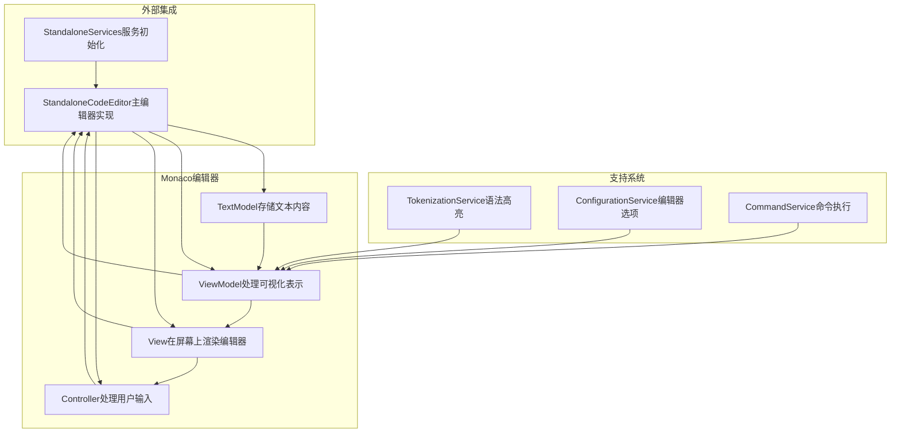
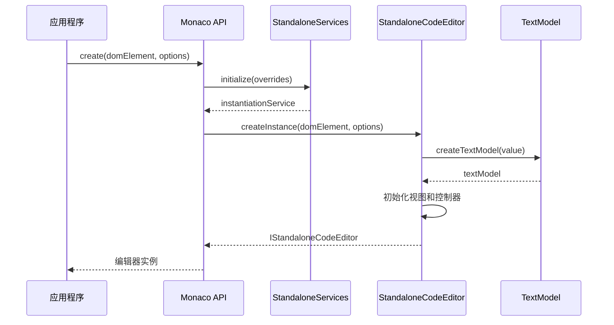
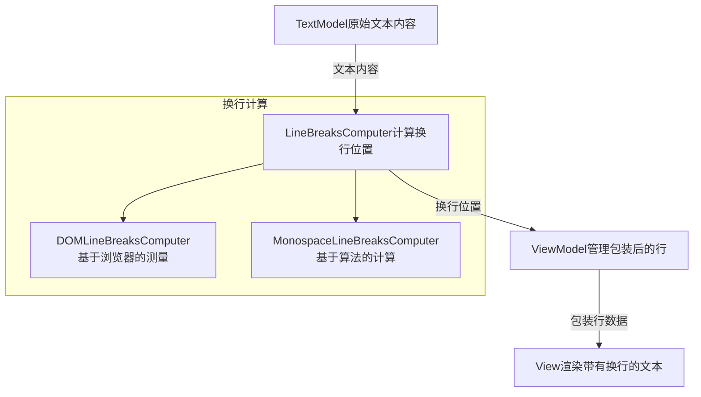
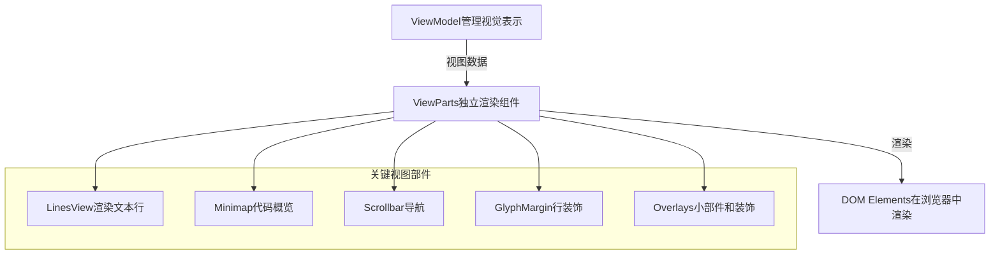
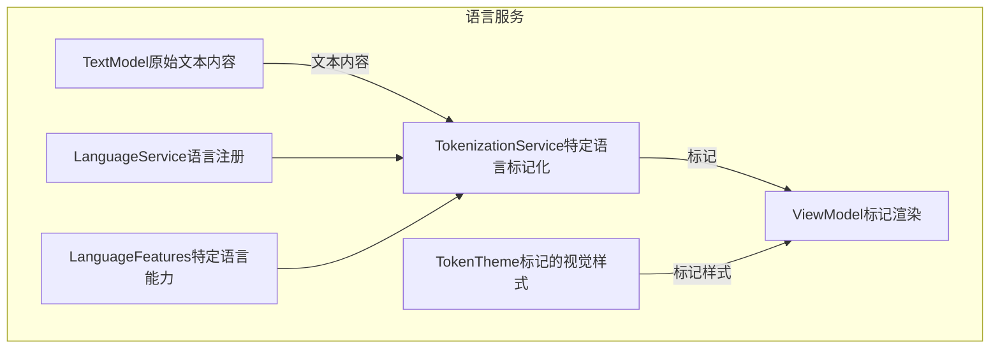
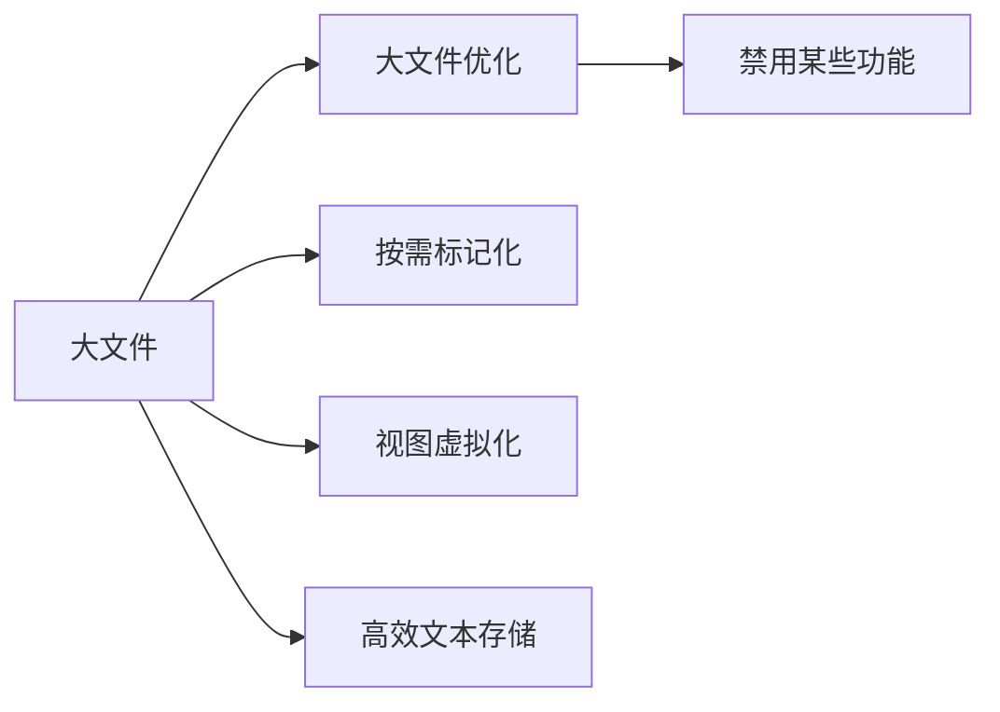

# Monaco编辑器


<details>
<summary>相关源文件</summary>

* [build/monaco/monaco.d.ts.recipe](../../build/monaco/monaco.d.ts.recipe)
* [extensions/vscode-colorize-perf-tests/test/colorize-fixtures/test-treeView.ts](../../extensions/vscode-colorize-perf-tests/test/colorize-fixtures/test-treeView.ts)
* [src/vs/editor/browser/editorBrowser.ts](../../src/vs/editor/browser/editorBrowser.ts)
* [src/vs/editor/browser/view/domLineBreaksComputer.ts](../../src/vs/editor/browser/view/domLineBreaksComputer.ts)
* [src/vs/editor/browser/viewParts/minimap/minimap.ts](../../src/vs/editor/browser/viewParts/minimap/minimap.ts)
* [src/vs/editor/browser/viewParts/minimap/minimapCharRenderer.ts](../../src/vs/editor/browser/viewParts/minimap/minimapCharRenderer.ts)
* [src/vs/editor/browser/viewParts/minimap/minimapCharRendererFactory.ts](../../src/vs/editor/browser/viewParts/minimap/minimapCharRendererFactory.ts)
* [src/vs/editor/browser/viewParts/minimap/minimapCharSheet.ts](../../src/vs/editor/browser/viewParts/minimap/minimapCharSheet.ts)
* [src/vs/editor/browser/viewParts/minimap/minimapPreBaked.ts](../../src/vs/editor/browser/viewParts/minimap/minimapPreBaked.ts)
* [src/vs/editor/browser/widget/codeEditor/codeEditorWidget.ts](../../src/vs/editor/browser/widget/codeEditor/codeEditorWidget.ts)
* [src/vs/editor/common/config/editorOptions.ts](../../src/vs/editor/common/config/editorOptions.ts)
* [src/vs/editor/common/core/rgba.ts](../../src/vs/editor/common/core/rgba.ts)
* [src/vs/editor/common/editorCommon.ts](../../src/vs/editor/common/editorCommon.ts)
* [src/vs/editor/common/model.ts](../../src/vs/editor/common/model.ts)
* [src/vs/editor/common/model/guidesTextModelPart.ts](../../src/vs/editor/common/model/guidesTextModelPart.ts)
* [src/vs/editor/common/model/textModel.ts](../../src/vs/editor/common/model/textModel.ts)
* [src/vs/editor/common/standalone/standaloneEnums.ts](../../src/vs/editor/common/standalone/standaloneEnums.ts)
* [src/vs/editor/common/textModelGuides.ts](../../src/vs/editor/common/textModelGuides.ts)
* [src/vs/editor/common/viewModel/minimapTokensColorTracker.ts](../../src/vs/editor/common/viewModel/minimapTokensColorTracker.ts)
* [src/vs/editor/common/viewModel/modelLineProjection.ts](../../src/vs/editor/common/viewModel/modelLineProjection.ts)
* [src/vs/editor/common/viewModel/monospaceLineBreaksComputer.ts](../../src/vs/editor/common/viewModel/monospaceLineBreaksComputer.ts)
* [src/vs/editor/common/viewModel/viewModelImpl.ts](../../src/vs/editor/common/viewModel/viewModelImpl.ts)
* [src/vs/editor/common/viewModel/viewModelLines.ts](../../src/vs/editor/common/viewModel/viewModelLines.ts)
* [src/vs/editor/standalone/browser/standaloneCodeEditor.ts](../../src/vs/editor/standalone/browser/standaloneCodeEditor.ts)
* [src/vs/editor/standalone/browser/standaloneEditor.ts](../../src/vs/editor/standalone/browser/standaloneEditor.ts)
* [src/vs/editor/test/browser/view/minimapCharRenderer.test.ts](../../src/vs/editor/test/browser/view/minimapCharRenderer.test.ts)
* [src/vs/editor/test/browser/viewModel/modelLineProjection.test.ts](../../src/vs/editor/test/browser/viewModel/modelLineProjection.test.ts)
* src/vs/editor/test/common/model/modelInjectedText.test.ts
* [src/vs/editor/test/common/viewModel/lineBreakData.test.ts](../../src/vs/editor/test/common/viewModel/lineBreakData.test.ts)
* [src/vs/editor/test/common/viewModel/monospaceLineBreaksComputer.test.ts](../../src/vs/editor/test/common/viewModel/monospaceLineBreaksComputer.test.ts)
* [src/vs/monaco.d.ts](../../src/vs/monaco.d.ts)
</details>
Monaco编辑器是一个强大的独立代码编辑器，为VS Code提供支持。它提供了丰富的文本编辑体验，包括语法高亮、代码补全等功能。本文档解释了Monaco编辑器的架构、核心组件和关键概念。

关于管理VS Code中编辑器实例的编辑器服务的信息，请参阅编辑器服务。

## 概述

Monaco编辑器是一个独立组件，可用于网络应用程序中，提供全功能代码编辑体验。它是用TypeScript构建的，设计为高度可定制且性能出色。

编辑器由几个关键组件组成：

* 文本模型（Text model）- 存储和管理文本内容
* 视图模型（View model）- 处理文本的视觉表示
* 视图（View）- 在屏幕上渲染编辑器
* 控制器（Controller）- 处理用户输入和命令

来源：

* src/vs/monaco.d.ts1-942
* src/vs/editor/standalone/browser/standaloneEditor.ts43-105

## 架构

### 核心组件

Monaco编辑器架构遵循模型-视图-控制器模式，具有明确的关注点分离。文本模型存储内容，视图模型处理视觉表示，视图渲染编辑器，控制器处理用户输入。



来源：

* src/vs/editor/common/model/textModel.ts178-410
* src/vs/editor/common/viewModel/viewModelImpl.ts47-163
* src/vs/editor/browser/widget/codeEditor/codeEditorWidget.ts1-100
* src/vs/editor/standalone/browser/standaloneCodeEditor.ts1-100

### 初始化流程


创建Monaco编辑器实例时，应用程序调用带有DOM元素和选项的`create`函数。这会初始化独立服务，创建文本模型，并设置编辑器组件。

来源：

* src/vs/editor/standalone/browser/standaloneEditor.ts43-51
* src/vs/editor/standalone/browser/standaloneCodeEditor.ts100-200

## 核心组件

### 文本模型（TextModel）

文本模型是保存编辑器文本内容的核心数据结构。它管理：

* 文本内容存储和操作
* 行和列跟踪
* 文本变更事件
* 装饰（如语法高亮）

```ts
// Creating a text model
const model = monaco.editor.createModel(
    'console.log("Hello world");', // text content
    'javascript',                  // language
    monaco.Uri.parse('file:///main.js') // optional URI
);

// Using the model with an editor
const editor = monaco.editor.create(domElement, {
    model: model
});
```

文本模型在内部使用piece tree数据结构进行高效的文本操作，允许快速插入、删除和查找。

来源：

* src/vs/editor/common/model/textModel.ts178-410
* src/vs/editor/common/model.ts1-100
* src/vs/editor/standalone/browser/standaloneEditor.ts1029-1070

### 视图模型（ViewModel）

视图模型是原始文本模型和屏幕显示之间的桥梁。它处理：

* 行包装
* 空白渲染
* 装饰渲染
* 光标定位

视图模型在模型坐标（实际文本中的行/列）和视图坐标（考虑行包装后屏幕上显示的行/列）之间进行转换。

来源：

* src/vs/editor/common/viewModel/viewModelImpl.ts47-163
* src/vs/editor/common/viewModel/viewModelLines.ts22-58

### 换行与自动换行

Monaco 编辑器支持采用不同策略的自动换行：

* 简单换行：在指定列处断行
* 高级换行：考虑缩进和单词边界

两种行断行计算器可用：

1. **DOMLineBreaksComputer**：使用浏览器的文本测量功能以实现精确换行
2. **MonospaceLineBreaksComputer**：对等宽字体使用更快的算法



来源：

* src/vs/editor/browser/view/domLineBreaksComputer.ts20-42
* src/vs/editor/common/viewModel/monospaceLineBreaksComputer.ts15-40
* src/vs/editor/common/viewModel/viewModelLines.ts60-100

### 编辑器配置

Monaco编辑器高度可配置，有众多选项用于自定义外观和行为。主要配置类别包括：

| 类别       | 描述              | 示例                                  |
| ---------- | ----------------- | ------------------------------------- |
| 外观       | 视觉样式          | fontSize, lineHeight, fontFamily      |
| 行为       | 编辑器功能        | tabSize, insertSpaces, wordWrap       |
| 特性       | 编辑器能力        | minimap, scrollBeyondLastLine, folding|
| 性能       | 优化设置          | largeFileOptimizations                |

配置选项在`editorOptions.ts`中定义，可以在创建编辑器时设置或稍后更新。

```ts
// Setting options at creation time
const editor = monaco.editor.create(domElement, {
    fontSize: 14,
    wordWrap: 'on',
    minimap: { enabled: false }
});

// Updating options later
editor.updateOptions({
    fontSize: 16,
    lineNumbers: 'off'
});
```
来源：

* src/vs/editor/common/config/editorOptions.ts52-786
* src/vs/editor/standalone/browser/standaloneCodeEditor.ts94-130

## 渲染系统

### 视图架构


视图系统负责将编辑器内容渲染到DOM。它由多个ViewParts组成，每个处理编辑器视觉表示的特定方面。

来源：

* src/vs/editor/browser/view/viewPart.ts
* src/vs/editor/browser/viewParts/minimap/minimap.ts48-110

### 小地图（Minimap）

小地图提供编辑器内容的浓缩概览，允许在大文件中快速导航。它渲染代码的缩小版本，带有语法高亮。

小地图主要功能：

* 可配置的大小和位置
* 语法高亮
* 可用鼠标交互滚动
* 可显示装饰，如错误和搜索结果

来源：

* src/vs/editor/browser/viewParts/minimap/minimap.ts48-110
* src/vs/editor/browser/viewParts/minimap/minimapCharRenderer.ts10-17

### 装饰（Decorations）

装饰允许在不修改文本的情况下向编辑器内容添加视觉元素。它们用于：

* 语法高亮
* 错误和警告指示器
* 搜索结果高亮
* 行号
* 自定义注释

```ts
// Adding decorations
const decorations = editor.deltaDecorations([], [
    {
        range: new monaco.Range(1, 1, 1, 10),
        options: {
            inlineClassName: 'myDecoration',
            hoverMessage: { value: 'Decoration hover message' }
        }
    }
]);
```
来源：

* src/vs/editor/common/model.ts88-284
* src/vs/editor/common/model/textModel.ts284-287

## 集成和扩展

### 独立使用

Monaco编辑器可作为独立组件在Web应用程序中使用：
```ts
<!DOCTYPE html>
<html>
<head>
    <meta charset="UTF-8">
    <title>Monaco Editor Example</title>
    <script src="monaco-editor/min/vs/loader.js"></script>
</head>
<body>
    <div id="container" style="height:600px;"></div>
    <script>
        require.config({ paths: { 'vs': 'monaco-editor/min/vs' }});
        require(['vs/editor/editor.main'], function() {
            var editor = monaco.editor.create(document.getElementById('container'), {
                value: 'function hello() {\tconsole.log("Hello world!");}',
                language: 'javascript'
            });
        });
    </script>
</body>
</html>
```

来源：

* src/vs/editor/standalone/browser/standaloneEditor.ts43-105
* src/vs/editor/standalone/browser/standaloneCodeEditor.ts94-130

### 编辑器贡献

Monaco编辑器可以通过添加新功能的贡献进行扩展：
```ts
// Adding a custom action
monaco.editor.addEditorAction({
    id: 'my-unique-id',
    label: 'My Label',
    keybindings: [
        monaco.KeyMod.CtrlCmd | monaco.KeyCode.KeyF
    ],
    run: function(editor) {
        console.log('Custom action executed!');
    }
});
```

来源：

* src/vs/editor/standalone/browser/standaloneEditor.ts134-162
* src/vs/editor/standalone/browser/standaloneCodeEditor.ts49-89

### 差异编辑器

Monaco还提供差异编辑器，用于并排比较两个文本模型：
```ts
// Creating a diff editor
const diffEditor = monaco.editor.createDiffEditor(document.getElementById('container'));

// Setting models
diffEditor.setModel({
    original: monaco.editor.createModel('Original content', 'javascript'),
    modified: monaco.editor.createModel('Modified content', 'javascript')
});

```

来源：

* src/vs/editor/standalone/browser/standaloneEditor.ts97-100

## 高级功能

### 文本模型投影

Monaco 编辑器采用了一套复杂的投影系统来处理诸如换行和插入文本等功能。该系统在以下方面进行映射：

* 模型坐标：文档中原始文本的位置
* 视图坐标：考虑换行和插入文本后的视觉位置

此投影由`ModelLineProjection`类和相关组件处理。

来源：

* src/vs/editor/common/viewModel/modelLineProjection.ts14-28
* src/vs/editor/test/common/viewModel/lineBreakData.test.ts16-21

### 分词与语法高亮

Monaco编辑器通过标记化系统提供语法高亮：


标记化系统根据特定语言的规则分析文本内容并分配标记类型，然后根据当前主题进行样式设置。

来源：

* src/vs/editor/common/model/textModel.ts290-296
* src/vs/editor/standalone/browser/standaloneThemeService.ts

## 性能考虑

Monaco编辑器包含几个用于处理大文件的优化：

1. **大文件优化**：为大文件禁用某些内存密集型功能
2. **行标记化**：按需标记化行，而不是一次全部标记化
3. **视图虚拟化**：只渲染可见行
4. **高效文本存储**：使用piece tree数据结构进行高效文本操作

```ts
// Configuring large file optimizations
const editor = monaco.editor.create(domElement, {
    largeFileOptimizations: true
});
```



来源：

* src/vs/editor/common/model/textModel.ts330-343
* src/vs/editor/common/viewModel/viewModelImpl.ts90-114

## 结论

Monaco编辑器是一个强大、灵活的代码编辑器组件，在独立包中提供VS Code的编辑功能。其架构将文本存储、视觉表示和用户交互的关注点分离，使其既高性能又可扩展。

编辑器可以轻松集成到Web应用程序中，并通过其全面的配置选项和扩展点进行定制，以满足特定需求。
