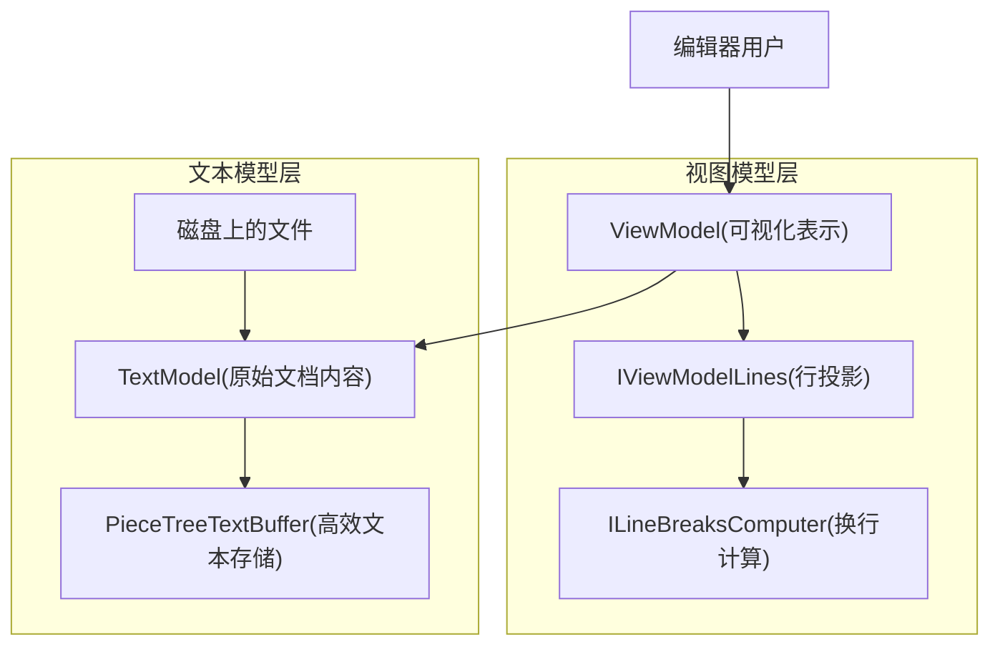
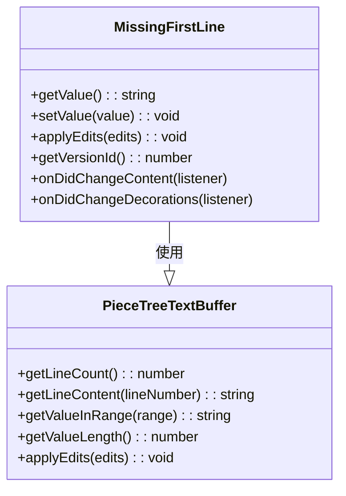
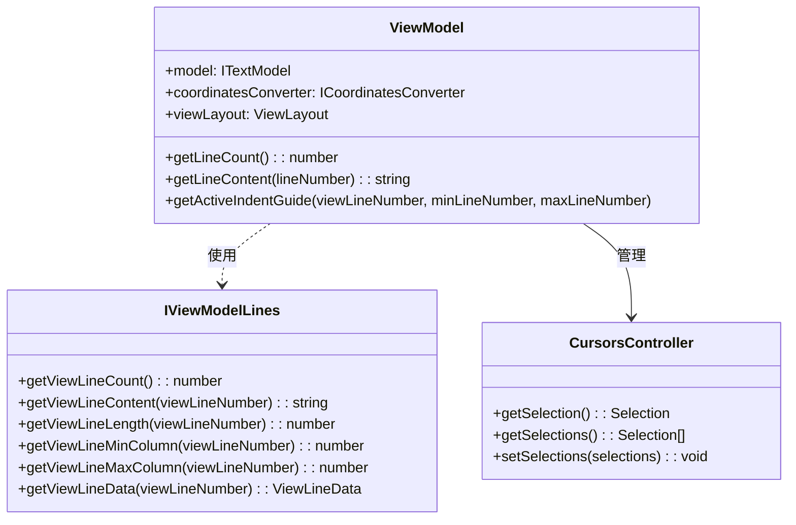
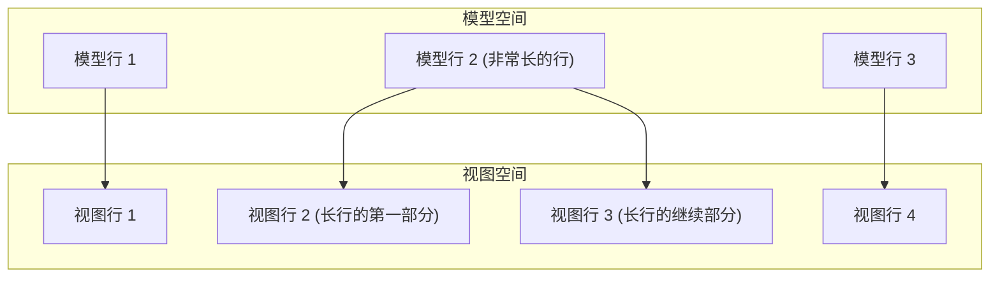
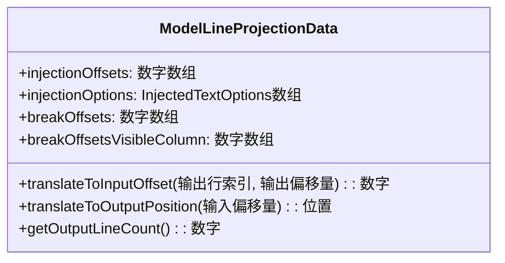
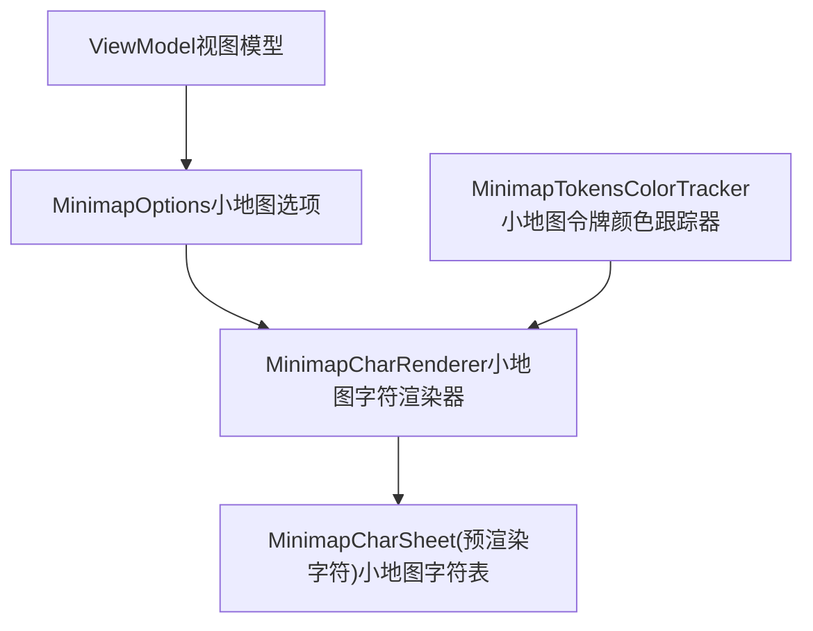
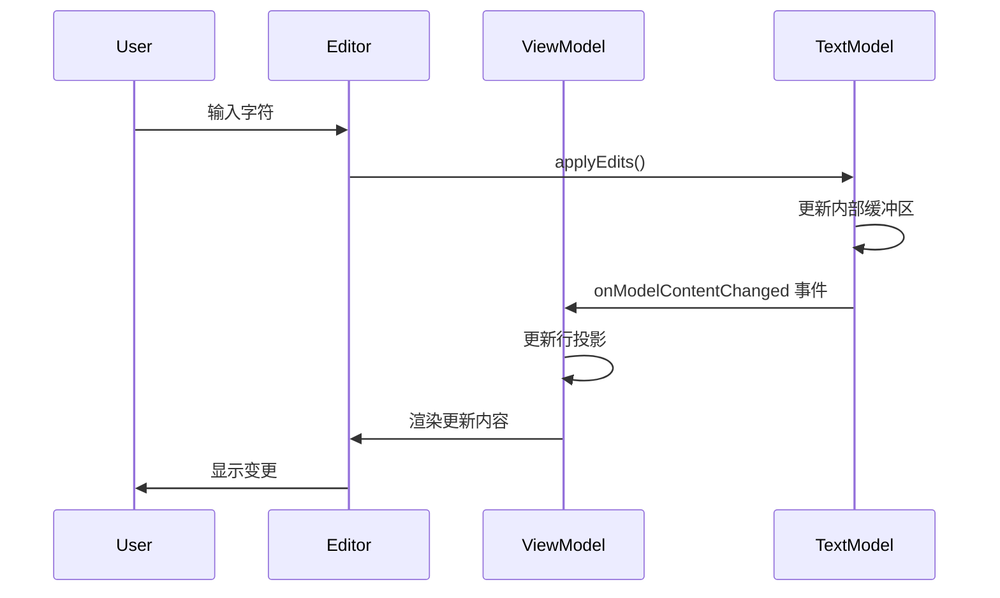
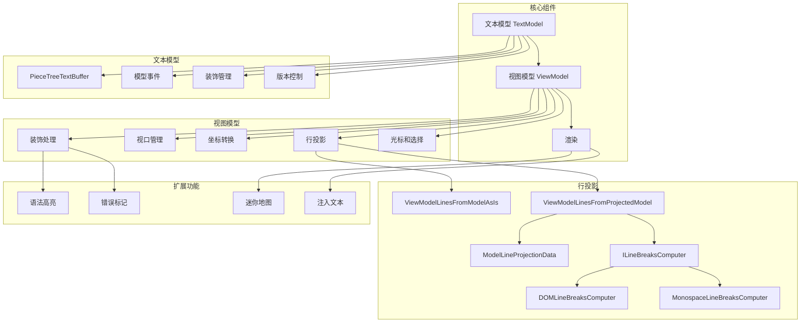

# 文本模型和视图模型

<details>
<summary>相关源文件</summary>

* [build/monaco/monaco.d.ts.recipe](../../build/monaco/monaco.d.ts.recipe)
* [extensions/vscode-colorize-perf-tests/test/colorize-fixtures/test-treeView.ts](../../extensions/vscode-colorize-perf-tests/test/colorize-fixtures/test-treeView.ts)
* [src/vs/editor/browser/editorBrowser.ts](../../src/vs/editor/browser/editorBrowser.ts)
* [src/vs/editor/browser/view/domLineBreaksComputer.ts](../../src/vs/editor/browser/view/domLineBreaksComputer.ts)
* [src/vs/editor/browser/viewParts/minimap/minimap.ts](../../src/vs/editor/browser/viewParts/minimap/minimap.ts)
* [src/vs/editor/browser/viewParts/minimap/minimapCharRenderer.ts](../../src/vs/editor/browser/viewParts/minimap/minimapCharRenderer.ts)
* [src/vs/editor/browser/viewParts/minimap/minimapCharRendererFactory.ts](../../src/vs/editor/browser/viewParts/minimap/minimapCharRendererFactory.ts)
* [src/vs/editor/browser/viewParts/minimap/minimapCharSheet.ts](../../src/vs/editor/browser/viewParts/minimap/minimapCharSheet.ts)
* [src/vs/editor/browser/viewParts/minimap/minimapPreBaked.ts](../../src/vs/editor/browser/viewParts/minimap/minimapPreBaked.ts)
* [src/vs/editor/browser/widget/codeEditor/codeEditorWidget.ts](../../src/vs/editor/browser/widget/codeEditor/codeEditorWidget.ts)
* [src/vs/editor/common/config/editorOptions.ts](../../src/vs/editor/common/config/editorOptions.ts)
* [src/vs/editor/common/core/rgba.ts](../../src/vs/editor/common/core/rgba.ts)
* [src/vs/editor/common/editorCommon.ts](../../src/vs/editor/common/editorCommon.ts)
* [src/vs/editor/common/model.ts](../../src/vs/editor/common/model.ts)
* [src/vs/editor/common/model/guidesTextModelPart.ts](../../src/vs/editor/common/model/guidesTextModelPart.ts)
* [src/vs/editor/common/model/textModel.ts](../../src/vs/editor/common/model/textModel.ts)
* [src/vs/editor/common/standalone/standaloneEnums.ts](../../src/vs/editor/common/standalone/standaloneEnums.ts)
* [src/vs/editor/common/textModelGuides.ts](../../src/vs/editor/common/textModelGuides.ts)
* [src/vs/editor/common/viewModel/minimapTokensColorTracker.ts](../../src/vs/editor/common/viewModel/minimapTokensColorTracker.ts)
* [src/vs/editor/common/viewModel/modelLineProjection.ts](../../src/vs/editor/common/viewModel/modelLineProjection.ts)
* [src/vs/editor/common/viewModel/monospaceLineBreaksComputer.ts](../../src/vs/editor/common/viewModel/monospaceLineBreaksComputer.ts)
* [src/vs/editor/common/viewModel/viewModelImpl.ts](../../src/vs/editor/common/viewModel/viewModelImpl.ts)
* [src/vs/editor/common/viewModel/viewModelLines.ts](../../src/vs/editor/common/viewModel/viewModelLines.ts)
* [src/vs/editor/standalone/browser/standaloneCodeEditor.ts](../../src/vs/editor/standalone/browser/standaloneCodeEditor.ts)
* [src/vs/editor/standalone/browser/standaloneEditor.ts](../../src/vs/editor/standalone/browser/standaloneEditor.ts)
* [src/vs/editor/test/browser/view/minimapCharRenderer.test.ts](../../src/vs/editor/test/browser/view/minimapCharRenderer.test.ts)
* [src/vs/editor/test/browser/viewModel/modelLineProjection.test.ts](../../src/vs/editor/test/browser/viewModel/modelLineProjection.test.ts)
* [src/vs/editor/test/common/model/modelInjectedText.test.ts](../../src/vs/editor/test/common/model/modelInjectedText.test.ts)
* [src/vs/editor/test/common/viewModel/lineBreakData.test.ts](../../src/vs/editor/test/common/viewModel/lineBreakData.test.ts)
* [src/vs/editor/test/common/viewModel/monospaceLineBreaksComputer.test.ts](../../src/vs/editor/test/common/viewModel/monospaceLineBreaksComputer.test.ts)
* [src/vs/monaco.d.ts](../../src/vs/monaco.d.ts)

</details>
本页解释了VS Code编辑器中的核心文本表示系统：文本模型和视图模型。这些组件构成了编辑器中文本内容如何存储、操作和渲染的基础。

有关基于这些模型构建的编辑器功能的信息，请参阅编辑器功能和贡献。

## 目的和概述

VS Code编辑器使用两层架构来表示文本：

1. **文本模型**：带有换行符的原始文本内容，表示实际的文件内容。
2. **视图模型**：文本模型的投影，处理视觉方面如行包装、装饰和隐藏区域。

这种分离使VS Code能够在实际文档内容和如何呈现给用户之间保持清晰的区分。


来源：

* src/vs/editor/common/model/textModel.ts178-410
* src/vs/editor/common/viewModel/viewModelImpl.ts47-163

## 文本模型

文本模型表示文档的原始内容。它由`TextModel`类实现，为编辑器中的所有文本操作提供基础。

### 核心概念

* **文本存储**：使用片段树数据结构（`PieceTreeTextBuffer`）进行高效的文本操作
* **行管理**：跟踪换行符并提供基于行的内容访问
* **版本控制**：维护版本ID以跟踪撤销/重做操作的变更
* **装饰**：支持向文本范围添加元数据而不修改内容
* **事件**：当内容或装饰变化时发出事件



来源：

* src/vs/editor/common/model/textModel.ts178-410
* src/vs/editor/common/model.ts1033-1200

### 文本缓冲区

文本模型使用片段树数据结构（`PieceTreeTextBuffer`）高效地存储和操作文本。这种方法允许：

* 高效的插入和删除操作
* 大文件的内存高效表示
* 快速访问基于行的内容

当文本被修改时，缓冲区更新其内部结构，而不一定复制整个内容，使得输入和粘贴等操作非常高效。
```ts
// Creating a text buffer
const textBufferFactory = createTextBufferFactory(text);
const { textBuffer, disposable } = textBufferFactory.create(defaultEOL);
```

来源：

* src/vs/editor/common/model/textModel.ts52-114
* src/vs/editor/common/model/textModel.ts323-330

### 模型事件

文本模型发出各种事件来通知监听器发生的变化：

* **内容变化**：当文本被插入、删除或修改时
* **装饰变化**：当装饰被添加、移除或修改时
* **选项变化**：当模型选项如制表符大小或缩进变化时
* **语言变化**：当与模型关联的语言变化时

这些事件允许其他组件对模型中的变化做出反应。
```ts
// Example of listening to content changes
model.onDidChangeContent((e) => {
    console.log('Content changed:', e);
});
```

来源：

* src/vs/editor/common/model/textModel.ts213-244
* src/vs/editor/common/textModelEvents.ts

## 视图模型

视图模型（`ViewModel`类）创建文本模型的视觉表示，处理行包装、装饰和隐藏区域等方面。它将原始文本投影为适合显示的形式。

### 核心概念

* **行投影**：将模型行映射到视图行（例如，当启用换行时）
* **装饰**：管理视觉元素如语法高亮、错误标记等
* **视口**：跟踪当前可见的文档部分
* **光标管理**：处理光标位置和选择
* **事件**：当视觉表示变化时发出事件



来源：

* src/vs/editor/common/viewModel/viewModelImpl.ts47-163
* src/vs/editor/common/viewModel.ts

### 行投影

视图模型的关键职责之一是行投影 - 在模型行（实际文本内容）和视图行（屏幕上显示的内容）之间进行映射。这对以下功能特别重要：

* **行折行**：当长行折成多行显示时
* **代码折叠**：当代码的某些部分被折叠时
* **隐藏文本**：当某些范围的文本被隐藏时

视图模型使用`IViewModelLines`实现来处理这种投影，有两个主要变体：

1. `ViewModelLinesFromModelAsIs`：当不需要换行时使用的简单1:1映射
2. `ViewModelLinesFromProjectedModel`：处理换行和其他视觉转换的复杂映射



来源：

* src/vs/editor/common/viewModel/viewModelImpl.ts87-114
* src/vs/editor/common/viewModel/viewModelLines.ts22-58

### 换行计算

为确定行应该在哪里换行，视图模型使用换行计算器：

1. **基于DOM的换行计算器**：使用浏览器的文本布局引擎进行准确换行
2. **等宽字体换行计算器**：一种用于等宽字体的更快算法

这些计算器分析文本并根据以下因素确定最佳断点：

* 字体特性
* 可用宽度
* 换行设置（列、缩进）
* 单词断行规则
```ts
// Creating a line breaks computer
const lineBreaksComputer = this._lines.createLineBreaksComputer();

// Adding requests for line break calculations
lineBreaksComputer.addRequest(lineText, injectedText, previousLineBreakData);

// Getting the results
const lineBreaks = lineBreaksComputer.finalize();
```

来源：

* src/vs/editor/browser/view/domLineBreaksComputer.ts20-42
* src/vs/editor/common/viewModel/monospaceLineBreaksComputer.ts15-40

### 坐标转换

视图模型的一个关键功能是在不同坐标系统之间进行转换：

* **模型坐标**：原始文本中的位置（行/列）
* **视图坐标**：换行/视觉表示中的位置（行/列）
* **DOM坐标**：渲染的DOM中的位置（像素）

`ICoordinatesConverter`接口提供了这些转换的方法。
```ts
// Converting from model to view coordinates
const viewPosition = coordinatesConverter.convertModelPositionToViewPosition(modelPosition);

// Converting from view to model coordinates
const modelPosition = coordinatesConverter.convertViewPositionToModelPosition(viewPosition);
```

来源：

* src/vs/editor/common/viewModel/viewModelImpl.ts116
* src/vs/editor/common/viewModel.ts

## 模型行投影数据

`ModelLineProjectionData`类是一个关键组件，它存储关于模型行如何投影到视图行的信息。它包含：

* **断点偏移量**：换行符出现的位置
* **断点偏移量视觉列**：对应于断点位置的视觉列
* **注入文本**：关于注入到视图中的文本信息（不是模型的一部分）

这些数据使得模型和视图位置之间的高效映射成为可能。


来源：

* src/vs/editor/common/modelLineProjectionData.ts
* src/vs/editor/test/common/viewModel/lineBreakData.test.ts16-21

## 注入文本

文本模型和视图模型都支持注入文本 - 在编辑器中出现但不是实际文档一部分的内容。这用于以下功能：

* 内联建议
* 代码镜头
* 内联装饰
* 幽灵文本

注入文本由`InjectedText`接口表示，可以包括样式选项和光标行为设置。
```ts
// Example of injected text options
interface InjectedTextOptions {
    content: string;          // The text to inject
    inlineClassName?: string; // CSS class for styling
    cursorStops?: InjectedTextCursorStops; // How cursor interacts with the text
}
```
来源：

* src/vs/editor/common/model.ts289-321
* src/vs/editor/test/common/model/modelInjectedText.test.ts

## 装饰

装饰是附加到文本范围的元数据，影响文本的显示方式而不改变内容。文本模型和视图模型以不同方式处理装饰：

* **文本模型**：存储装饰数据并在装饰变化时发出事件
* **视图模型**：将模型装饰转换为视图装饰并处理它们的视觉表示

装饰可以包括：

* 语法高亮
* 错误/警告标记
* 选择高亮
* 查找匹配
* 自定义样式
```ts
// Example of decoration options
interface IModelDecorationOptions {
    className?: string;           // CSS class for styling
    inlineClassName?: string;     // CSS class for inline styling
    stickiness?: TrackedRangeStickiness; // How decoration behaves during edits
    hoverMessage?: IMarkdownString; // Message shown on hover
    // ... many other options
}
```

来源：

* src/vs/editor/common/model.ts145-284
* src/vs/editor/common/model/textModel.ts271-287

## 迷你地图

迷你地图是文档的一个特殊视图，显示整个内容的缩小版本。它作为视图模型层的一部分实现，并使用专门的渲染技术以提高性能：

* **字符渲染**：使用预渲染的字符位图提高效率
* **采样**：可能对行进行采样而不是渲染每一行
* **颜色跟踪**：跟踪迷你地图中语法高亮的标记颜色


来源：

* src/vs/editor/browser/viewParts/minimap/minimap.ts48-178
* src/vs/editor/browser/viewParts/minimap/minimapCharRenderer.ts10-16

## 模型之间的交互

文本模型和视图模型一起工作，提供完整的编辑体验：

1. **内容变化**：
   * 用户编辑应用于文本模型
   * 文本模型发出变化事件
   * 视图模型根据这些变化更新其投影
2. **视口管理**：
   * 视图模型跟踪文档的哪一部分可见
   * 只有可见部分才会被完全处理以进行渲染
   * 这使得高效处理大文件成为可能
3. **光标和选择**：
   * 光标位置在模型坐标中维护
   * 视图模型将这些转换为视图坐标以进行显示
   * 选择范围跨越模型位置但可能覆盖多个视图行



来源：

* src/vs/editor/common/viewModel/viewModelImpl.ts300-435
* src/vs/editor/common/model/textModel.ts441-477

## 总结

文本模型和视图模型构成了VS Code编辑器的基础：

* **文本模型**：表示原始文档内容，提供高效的文本存储和操作
* **视图模型**：将文本模型投影为视觉表示，处理换行、装饰和视口管理

这种关注点分离使VS Code能够在内容和表示之间保持清晰的区分，即使在处理大文件时也能启用强大的编辑功能并保持性能。

| 组件 | 主要职责 | 关键类 |
| --- | --- | --- |
| 文本模型 | 原始文档内容 | TextModel, PieceTreeTextBuffer |
| 视图模型 | 视觉表示 | ViewModel, ViewModelLinesFromProjectedModel |
| 行投影 | 模型之间的映射 | ModelLineProjectionData, ILineBreaksComputer |
| 坐标转换 | 位置转换 | ICoordinatesConverter |
| 装饰 | 视觉元数据 | IModelDecoration, ViewModelDecorations |

来源：

* src/vs/editor/common/model/textModel.ts
* src/vs/editor/common/viewModel/viewModelImpl.ts

## VS Code文本和视图模型架构图


