# 编辑器特性和贡献


<details>
<summary>相关源文件：</summary>

* [build/monaco/monaco.d.ts.recipe](../../build/monaco/monaco.d.ts.recipe)
* [extensions/vscode-api-tests/package.json](../../extensions/vscode-api-tests/package.json)
* [extensions/vscode-colorize-perf-tests/test/colorize-fixtures/test-treeView.ts](../../extensions/vscode-colorize-perf-tests/test/colorize-fixtures/test-treeView.ts)
* [src/vs/editor/browser/editorBrowser.ts](../../src/vs/editor/browser/editorBrowser.ts)
* [src/vs/editor/browser/view/domLineBreaksComputer.ts](../../src/vs/editor/browser/view/domLineBreaksComputer.ts)
* [src/vs/editor/browser/viewParts/minimap/minimap.ts](../../src/vs/editor/browser/viewParts/minimap/minimap.ts)
* [src/vs/editor/browser/viewParts/minimap/minimapCharRenderer.ts](../../src/vs/editor/browser/viewParts/minimap/minimapCharRenderer.ts)
* [src/vs/editor/browser/viewParts/minimap/minimapCharRendererFactory.ts](../../src/vs/editor/browser/viewParts/minimap/minimapCharRendererFactory.ts)
* [src/vs/editor/browser/viewParts/minimap/minimapCharSheet.ts](../../src/vs/editor/browser/viewParts/minimap/minimapCharSheet.ts)
* [src/vs/editor/browser/viewParts/minimap/minimapPreBaked.ts](../../src/vs/editor/browser/viewParts/minimap/minimapPreBaked.ts)
* [src/vs/editor/browser/widget/codeEditor/codeEditorWidget.ts](../../src/vs/editor/browser/widget/codeEditor/codeEditorWidget.ts)
* [src/vs/editor/common/config/editorOptions.ts](../../src/vs/editor/common/config/editorOptions.ts)
* [src/vs/editor/common/core/rgba.ts](../../src/vs/editor/common/core/rgba.ts)
* [src/vs/editor/common/editorCommon.ts](../../src/vs/editor/common/editorCommon.ts)
* [src/vs/editor/common/languages.ts](../../src/vs/editor/common/languages.ts)
* [src/vs/editor/common/model.ts](../../src/vs/editor/common/model.ts)
* [src/vs/editor/common/model/guidesTextModelPart.ts](../../src/vs/editor/common/model/guidesTextModelPart.ts)
* [src/vs/editor/common/model/textModel.ts](../../src/vs/editor/common/model/textModel.ts)
* [src/vs/editor/common/standalone/standaloneEnums.ts](../../src/vs/editor/common/standalone/standaloneEnums.ts)
* [src/vs/editor/common/textModelGuides.ts](../../src/vs/editor/common/textModelGuides.ts)
* [src/vs/editor/common/viewModel/minimapTokensColorTracker.ts](../../src/vs/editor/common/viewModel/minimapTokensColorTracker.ts)
* [src/vs/editor/common/viewModel/modelLineProjection.ts](../../src/vs/editor/common/viewModel/modelLineProjection.ts)
* [src/vs/editor/common/viewModel/monospaceLineBreaksComputer.ts](../../src/vs/editor/common/viewModel/monospaceLineBreaksComputer.ts)
* [src/vs/editor/common/viewModel/viewModelImpl.ts](../../src/vs/editor/common/viewModel/viewModelImpl.ts)
* [src/vs/editor/common/viewModel/viewModelLines.ts](../../src/vs/editor/common/viewModel/viewModelLines.ts)
* [src/vs/editor/standalone/browser/standaloneCodeEditor.ts](../../src/vs/editor/standalone/browser/standaloneCodeEditor.ts)
* [src/vs/editor/standalone/browser/standaloneEditor.ts](../../src/vs/editor/standalone/browser/standaloneEditor.ts)
* [src/vs/editor/test/browser/view/minimapCharRenderer.test.ts](../../src/vs/editor/test/browser/view/minimapCharRenderer.test.ts)
* [src/vs/editor/test/browser/viewModel/modelLineProjection.test.ts](../../src/vs/editor/test/browser/viewModel/modelLineProjection.test.ts)
* [src/vs/editor/test/common/model/modelInjectedText.test.ts](../../src/vs/editor/test/common/model/modelInjectedText.test.ts)
* [src/vs/editor/test/common/viewModel/lineBreakData.test.ts](../../src/vs/editor/test/common/viewModel/lineBreakData.test.ts)
* [src/vs/editor/test/common/viewModel/monospaceLineBreaksComputer.test.ts](../../src/vs/editor/test/common/viewModel/monospaceLineBreaksComputer.test.ts)
* [src/vs/monaco.d.ts](../../src/vs/monaco.d.ts)
* [src/vs/platform/extensions/common/extensionsApiProposals.ts](../../src/vs/platform/extensions/common/extensionsApiProposals.ts)
* [src/vs/workbench/api/browser/mainThreadLanguageFeatures.ts](../../src/vs/workbench/api/browser/mainThreadLanguageFeatures.ts)
* [src/vs/workbench/api/common/extHost.api.impl.ts](../../src/vs/workbench/api/common/extHost.api.impl.ts)
* [src/vs/workbench/api/common/extHost.protocol.ts](../../src/vs/workbench/api/common/extHost.protocol.ts)
* [src/vs/workbench/api/common/extHostLanguageFeatures.ts](../../src/vs/workbench/api/common/extHostLanguageFeatures.ts)
* [src/vs/workbench/api/common/extHostTypeConverters.ts](../../src/vs/workbench/api/common/extHostTypeConverters.ts)
* [src/vs/workbench/api/common/extHostTypes.ts](../../src/vs/workbench/api/common/extHostTypes.ts)
* [src/vscode-dts/vscode.d.ts](../../src/vscode-dts/vscode.d.ts)
</details>

本页解释了VS Code中编辑器特性和贡献的工作原理。它涵盖了语言特性（如语法高亮、代码补全、悬停信息）和其他使VS Code成为强大代码编辑器的编辑器增强功能的架构。

有关核心编辑器模型和文本缓冲区实现的信息，请参阅文本模型和视图模型。有关提供许多这些特性的扩展系统的信息，请参阅扩展系统。

## 编辑器特性概述

VS Code的编辑器提供了一套丰富的特性，增强了编码体验。这些特性包括：

* 语法高亮
* 代码补全（IntelliSense）
* 悬停信息
* 代码操作和快速修复
* 代码导航（转到定义、查找引用）
* 代码折叠
* 格式化
* 诊断（错误和警告）
* 语义高亮

这些特性通过内置功能和扩展的组合实现。架构遵循客户端-服务器模型，其中扩展主机提供语言智能，主线程渲染UI。


### 编辑器特性架构
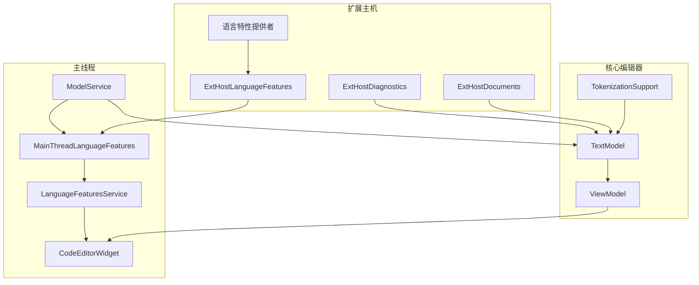

来源：

* src/vs/workbench/api/common/extHostLanguageFeatures.ts
* src/vs/workbench/api/browser/mainThreadLanguageFeatures.ts
* src/vs/editor/common/model/textModel.ts
* src/vs/editor/common/viewModel/viewModelImpl.ts

## 语言特性提供者

语言特性通过提供者接口实现。扩展可以为特定语言特性注册提供者。扩展主机管理这些提供者并与主线程通信以渲染结果。

### 提供者注册流程

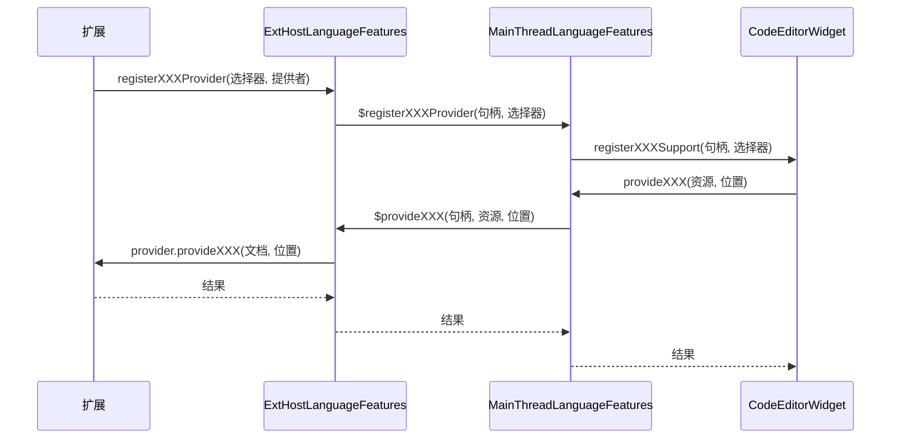

来源：

* src/vs/workbench/api/common/extHostLanguageFeatures.ts
* src/vs/workbench/api/browser/mainThreadLanguageFeatures.ts
* src/vs/workbench/api/common/extHost.protocol.ts

## 主要语言特性提供者

VS Code支持广泛的语言特性提供者。以下是主要的提供者：

| 提供者 | 接口 | 目的 |
| ------ | ---- | ---- |
| 补全 | CompletionItemProvider | 提供代码补全项 |
| 悬停 | HoverProvider | 提供悬停信息 |
| 定义 | DefinitionProvider | 提供转到定义功能 |
| 引用 | ReferenceProvider | 提供查找所有引用功能 |
| 文档符号 | DocumentSymbolProvider | 提供文档大纲 |
| 代码操作 | CodeActionProvider | 提供快速修复和重构 |
| 格式化 | DocumentFormattingEditProvider | 提供文档格式化 |
| 重命名 | RenameProvider | 提供重命名功能 |
| 签名帮助 | SignatureHelpProvider | 提供函数签名帮助 |
| 诊断 | DiagnosticCollection | 提供错误和警告 |
| 语义标记 | DocumentSemanticTokensProvider | 提供语义高亮 |

来源：

* src/vs/editor/common/languages.ts
* src/vs/workbench/api/common/extHostTypes.ts
* src/vs/workbench/api/common/extHostLanguageFeatures.ts

## 语言特性的适配器模式

VS Code使用适配器模式来桥接扩展API和内部编辑器实现。每个语言特性在扩展主机中都有相应的适配器类。

### 适配器类

```mermaid
classDiagram
    class DocumentSymbolAdapter {
        +provideDocumentSymbols(resource, token)
    }

    class CodeLensAdapter {
        +provideCodeLenses(resource, token)
        +resolveCodeLens(model, token)
        +releaseCodeLens(cache)
    }

    class DefinitionAdapter {
        +provideDefinition(resource, position, token)
    }

    class HoverAdapter {
        +provideHover(resource, position, token)
    }

    class CompletionAdapter {
        +provideCompletionItems(resource, position, context, token)
        +resolveCompletionItem(item, token)
    }

    class InlineCompletionAdapter {
        +provideInlineCompletions(resource, position, context, token)
    }

    class SignatureHelpAdapter {
        +provideSignatureHelp(resource, position, context, token)
    }

    class DocumentFormattingAdapter {
        +provideDocumentFormattingEdits(resource, options, token)
    }
```

来源：

* src/vs/workbench/api/common/extHostLanguageFeatures.ts43-1000

## 类型转换器

为了桥接扩展API类型和内部编辑器类型，VS Code使用类型转换器。这些转换器处理像位置、范围和选择等对象的转换。

```typescript
// Example of type converters
export namespace Position {
    export function to(position: IPosition): types.Position {
        return new types.Position(position.lineNumber - 1, position.column - 1);
    }
    export function from(position: types.Position): IPosition {
        return { lineNumber: position.line + 1, column: position.character + 1 };
    }
}

export namespace Range {
    export function from(range: RangeLike): editorRange.IRange {
        const { start, end } = range;
        return {
            startLineNumber: start.line + 1,
            startColumn: start.character + 1,
            endLineNumber: end.line + 1,
            endColumn: end.character + 1
        };
    }

    export function to(range: editorRange.IRange): types.Range {
        return new types.Range(
            range.startLineNumber - 1,
            range.startColumn - 1,
            range.endLineNumber - 1,
            range.endColumn - 1
        );
    }
}
```

来源：

* src/vs/workbench/api/common/extHostTypeConverters.ts89-136

## 编辑器贡献

编辑器贡献是添加编辑器功能的组件。它们可以由扩展注册或内置于VS Code中。

### 编辑器贡献架构

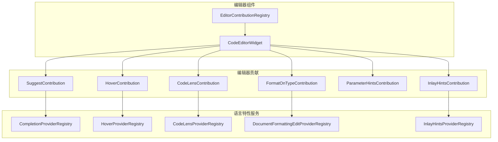

来源：

* src/vs/editor/browser/widget/codeEditor/codeEditorWidget.ts
* src/vs/editor/common/languages.ts
* src/vs/editor/browser/editorBrowser.ts

## 标记化和语法高亮

语法高亮通过标记化实现。编辑器使用标记化系统来解析和着色代码。

### 标记化架构

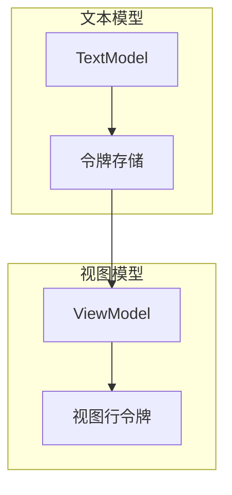

来源：

* src/vs/editor/common/model/textModel.ts
* src/vs/editor/common/languages.ts61-162
* src/vs/editor/common/viewModel/viewModelImpl.ts

## 代码补全（IntelliSense）

代码补全是最重要的编辑器特性之一。它在您键入时提供建议。

### 补全架构

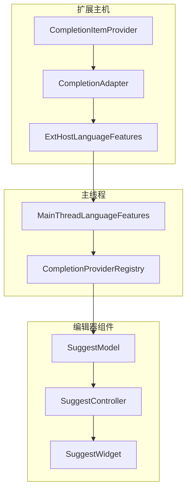

来源：

* src/vs/workbench/api/common/extHostLanguageFeatures.ts
* src/vs/workbench/api/browser/mainThreadLanguageFeatures.ts
* src/vs/editor/common/languages.ts

## 悬停信息

悬停信息在悬停代码元素时提供上下文详情。

### 悬停架构

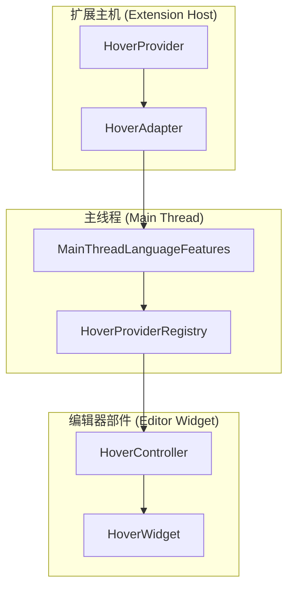

来源：

* src/vs/workbench/api/common/extHostLanguageFeatures.ts
* src/vs/workbench/api/browser/mainThreadLanguageFeatures.ts
* src/vs/editor/common/languages.ts

## 代码操作和快速修复

代码操作为代码问题提供快速修复和重构。

### 代码操作架构

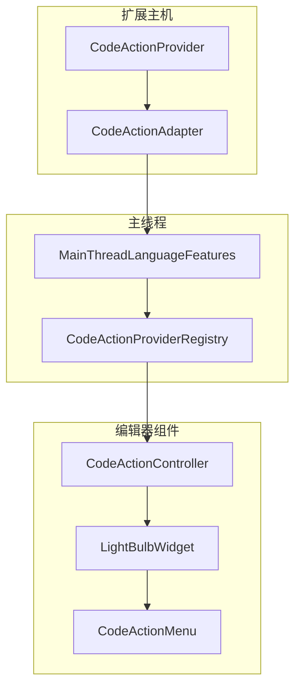

来源：

* src/vs/workbench/api/common/extHostLanguageFeatures.ts
* src/vs/workbench/api/browser/mainThreadLanguageFeatures.ts
* src/vs/editor/common/languages.ts

## 文档格式化

文档格式化提供代码格式化功能。

### 格式化架构

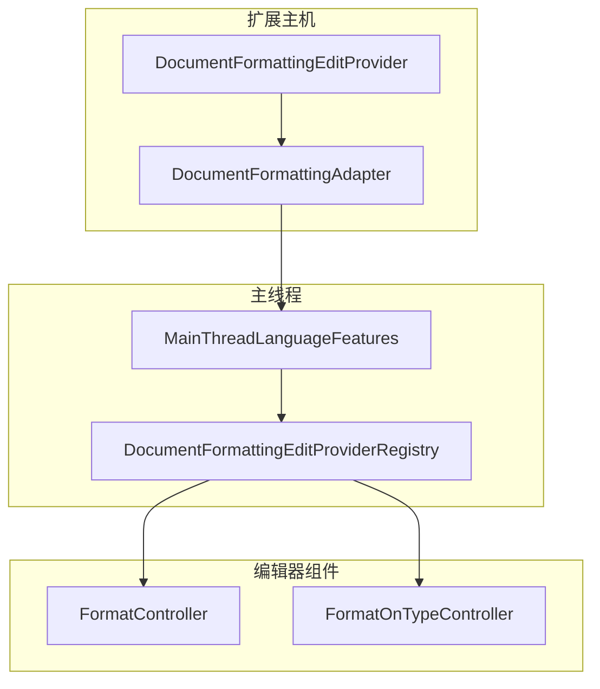

来源：

* src/vs/workbench/api/common/extHostLanguageFeatures.ts
* src/vs/workbench/api/browser/mainThreadLanguageFeatures.ts
* src/vs/editor/common/languages.ts

## 换行和自动换行

VS Code提供复杂的换行和自动换行功能来处理长代码行。

### 换行架构

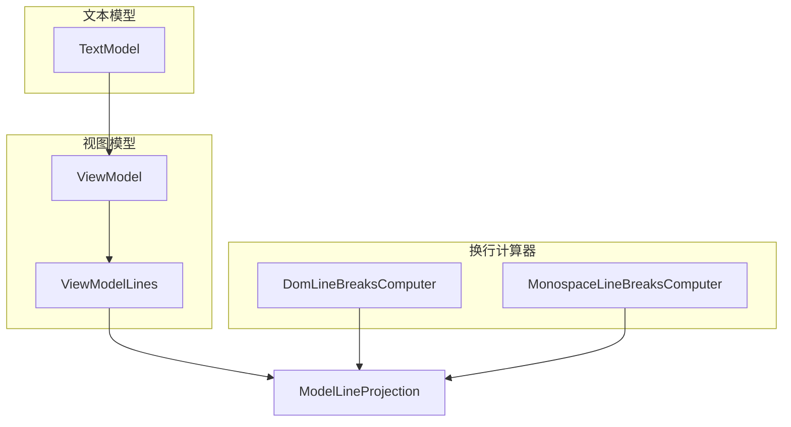

来源：

* src/vs/editor/common/viewModel/viewModelLines.ts
* src/vs/editor/browser/view/domLineBreaksComputer.ts
* src/vs/editor/common/viewModel/monospaceLineBreaksComputer.ts
* src/vs/editor/common/viewModel/modelLineProjection.ts

## 小地图（Minimap）

小地图提供整个文档的缩略视图。

### 小地图架构

来源：

* src/vs/editor/browser/viewParts/minimap/minimap.ts
* src/vs/editor/browser/viewParts/minimap/minimapCharRenderer.ts
* src/vs/editor/common/viewModel/minimapTokensColorTracker.ts

## 编辑器选项和配置

VS Code提供丰富的编辑器选项来自定义编辑体验。

### 编辑器选项

```typescript
// Key editor options
export interface IEditorOptions {
    // Appearance
    lineNumbers?: LineNumbersType;
    renderLineHighlight?: 'none' | 'gutter' | 'line' | 'all';
    renderWhitespace?: 'none' | 'boundary' | 'selection' | 'trailing' | 'all';

    // Behavior
    wordWrap?: 'off' | 'on' | 'wordWrapColumn' | 'bounded';
    autoIndent?: 'none' | 'keep' | 'brackets' | 'advanced' | 'full';
    cursorBlinking?: 'blink' | 'smooth' | 'phase' | 'expand' | 'solid';

    // Features
    quickSuggestions?: boolean | IQuickSuggestionsOptions;
    suggestOnTriggerCharacters?: boolean;
    acceptSuggestionOnEnter?: 'on' | 'smart' | 'off';

    // Code lens
    codeLens?: boolean;

    // Folding
    folding?: boolean;
    foldingStrategy?: 'auto' | 'indentation';
}
```

来源：

* src/vs/editor/common/config/editorOptions.ts52-706

## 编辑器特性的扩展API

VS Code为扩展提供丰富的API来贡献编辑器特性。

### 语言特性的扩展API

```typescript
// Example of registering a completion provider
vscode.languages.registerCompletionItemProvider('javascript', {
    provideCompletionItems(document, position, token, context) {
        // Provide completion items
        return [
            new vscode.CompletionItem('example', vscode.CompletionItemKind.Keyword)
        ];
    }
});

// Example of registering a hover provider
vscode.languages.registerHoverProvider('javascript', {
    provideHover(document, position, token) {
        // Provide hover information
        return new vscode.Hover('Hover information');
    }
});
```

来源：

* src/vscode-dts/vscode.d.ts
* src/vs/workbench/api/common/extHost.api.impl.ts

## 独立编辑器

VS Code的编辑器可以作为独立组件在Web应用程序中使用。

### 独立编辑器架构

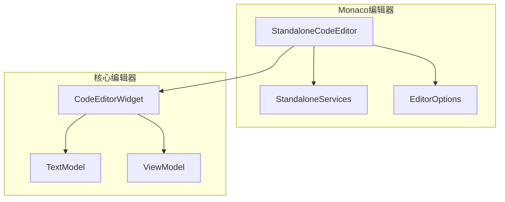

来源：

* src/vs/editor/standalone/browser/standaloneEditor.ts
* src/vs/editor/standalone/browser/standaloneCodeEditor.ts
* src/vs/monaco.d.ts

## 编辑器特性的API提案

VS Code使用API提案系统来引入新的编辑器特性。

### API提案

```typescript
// Example of API proposals related to editor features
const _allApiProposals = {
    // Editor-related proposals
    inlineCompletionsAdditions: {
        proposal: '...',
    },
    documentPaste: {
        proposal: '...',
    },
    tokenInformation: {
        proposal: '...',
    },
    // Other proposals
    // ...
};
```
来源：

* src/vs/platform/extensions/common/extensionsApiProposals.ts
* extensions/vscode-api-tests/package.json

## 结论

VS Code的编辑器特性和贡献系统为代码编辑提供了强大且可扩展的基础。该架构允许扩展实现各种语言特性，同时保持高性能和一致的用户体验。

该系统建立在扩展主机和主线程之间明确分离的基础上，并有定义良好的通信协议。这种架构使VS Code能够通过其扩展生态系统支持广泛的编程语言和工具。
