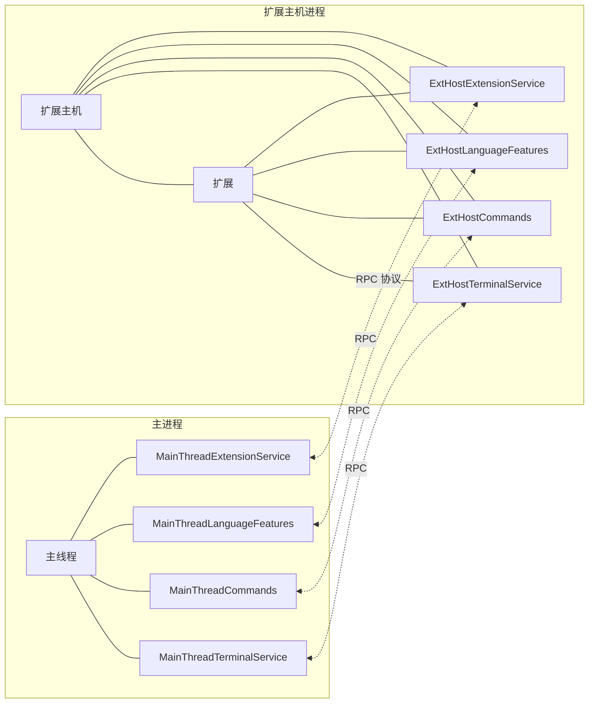
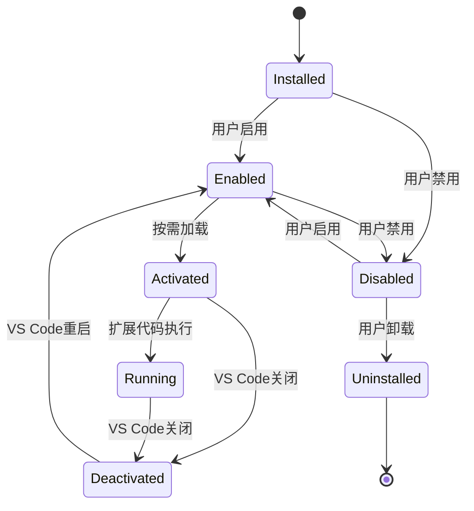
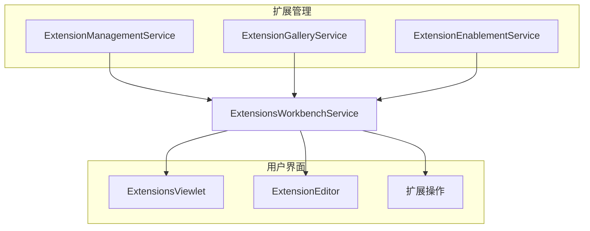
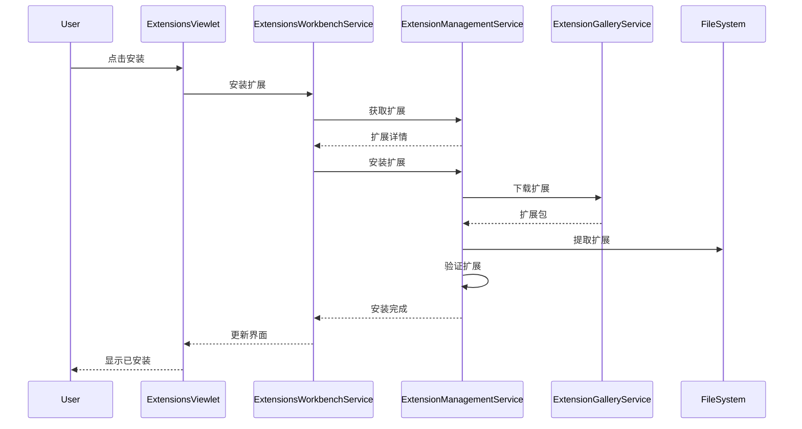
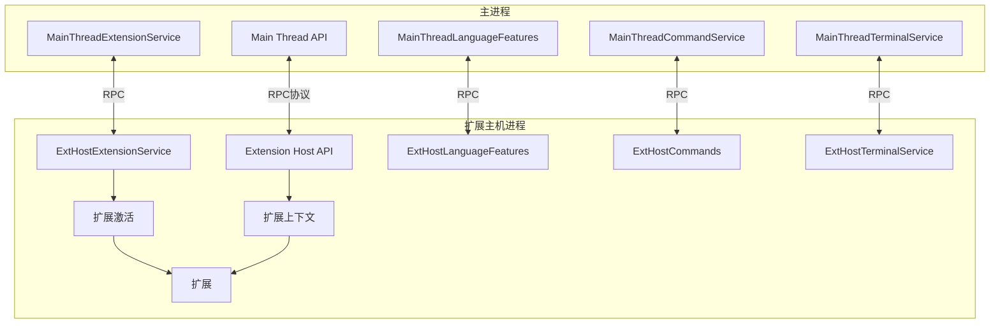
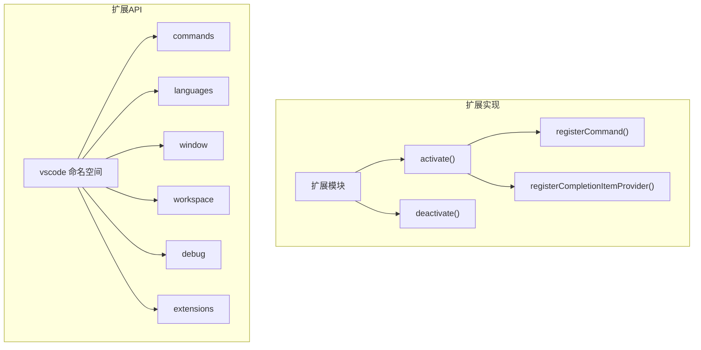
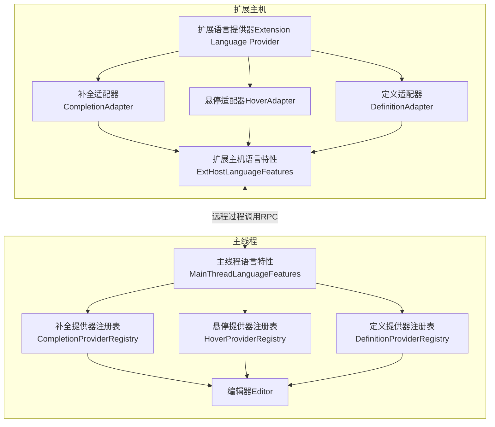
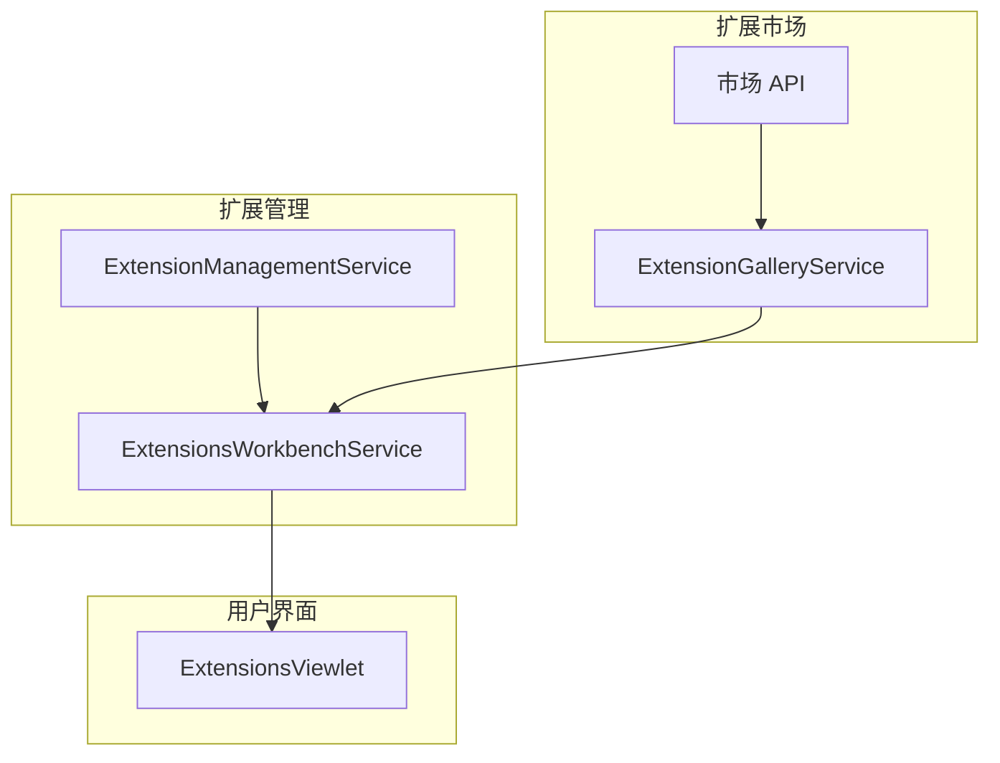
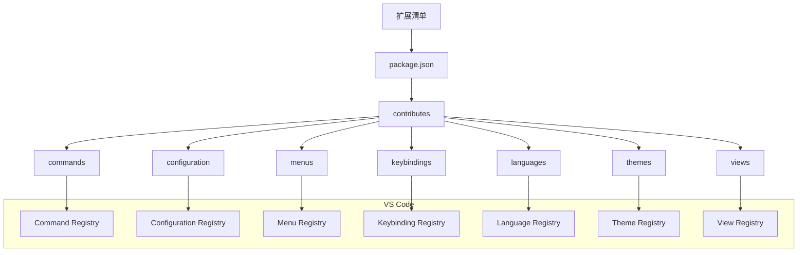

# 扩展系统

<details>
<summary>相关源文件：</summary>

* [extensions/vscode-api-tests/package.json](../../extensions/vscode-api-tests/package.json)
* [src/vs/editor/common/languages.ts](../../src/vs/editor/common/languages.ts)
* [src/vs/platform/extensionManagement/common/abstractExtensionManagementService.ts](../../src/vs/platform/extensionManagement/common/abstractExtensionManagementService.ts)
* [src/vs/platform/extensionManagement/common/extensionGalleryService.ts](../../src/vs/platform/extensionManagement/common/extensionGalleryService.ts)
* [src/vs/platform/extensionManagement/common/extensionManagement.ts](../../src/vs/platform/extensionManagement/common/extensionManagement.ts)
* [src/vs/platform/extensionManagement/common/extensionManagementIpc.ts](../../src/vs/platform/extensionManagement/common/extensionManagementIpc.ts)
* [src/vs/platform/extensionManagement/common/extensionManagementUtil.ts](../../src/vs/platform/extensionManagement/common/extensionManagementUtil.ts)
* [src/vs/platform/extensionManagement/node/extensionManagementService.ts](../../src/vs/platform/extensionManagement/node/extensionManagementService.ts)
* [src/vs/platform/extensions/common/extensionsApiProposals.ts](../../src/vs/platform/extensions/common/extensionsApiProposals.ts)
* [src/vs/workbench/api/browser/mainThreadLanguageFeatures.ts](../../src/vs/workbench/api/browser/mainThreadLanguageFeatures.ts)
* [src/vs/workbench/api/common/extHost.api.impl.ts](../../src/vs/workbench/api/common/extHost.api.impl.ts)
* [src/vs/workbench/api/common/extHost.protocol.ts](../../src/vs/workbench/api/common/extHost.protocol.ts)
* [src/vs/workbench/api/common/extHostLanguageFeatures.ts](../../src/vs/workbench/api/common/extHostLanguageFeatures.ts)
* [src/vs/workbench/api/common/extHostTypeConverters.ts](../../src/vs/workbench/api/common/extHostTypeConverters.ts)
* [src/vs/workbench/api/common/extHostTypes.ts](../../src/vs/workbench/api/common/extHostTypes.ts)
* [src/vs/workbench/contrib/extensions/browser/extensionEditor.ts](../../src/vs/workbench/contrib/extensions/browser/extensionEditor.ts)
* [src/vs/workbench/contrib/extensions/browser/extensions.contribution.ts](../../src/vs/workbench/contrib/extensions/browser/extensions.contribution.ts)
* [src/vs/workbench/contrib/extensions/browser/extensionsActions.ts](../../src/vs/workbench/contrib/extensions/browser/extensionsActions.ts)
* [src/vs/workbench/contrib/extensions/browser/extensionsIcons.ts](../../src/vs/workbench/contrib/extensions/browser/extensionsIcons.ts)
* [src/vs/workbench/contrib/extensions/browser/extensionsList.ts](../../src/vs/workbench/contrib/extensions/browser/extensionsList.ts)
* [src/vs/workbench/contrib/extensions/browser/extensionsViewer.ts](../../src/vs/workbench/contrib/extensions/browser/extensionsViewer.ts)
* [src/vs/workbench/contrib/extensions/browser/extensionsViewlet.ts](../../src/vs/workbench/contrib/extensions/browser/extensionsViewlet.ts)
* [src/vs/workbench/contrib/extensions/browser/extensionsViews.ts](../../src/vs/workbench/contrib/extensions/browser/extensionsViews.ts)
* [src/vs/workbench/contrib/extensions/browser/extensionsWidgets.ts](../../src/vs/workbench/contrib/extensions/browser/extensionsWidgets.ts)
* [src/vs/workbench/contrib/extensions/browser/extensionsWorkbenchService.ts](../../src/vs/workbench/contrib/extensions/browser/extensionsWorkbenchService.ts)
* [src/vs/workbench/contrib/extensions/browser/media/extension.css](../../src/vs/workbench/contrib/extensions/browser/media/extension.css)
* [src/vs/workbench/contrib/extensions/browser/media/extensionActions.css](../../src/vs/workbench/contrib/extensions/browser/media/extensionActions.css)
* [src/vs/workbench/contrib/extensions/browser/media/extensionEditor.css](../../src/vs/workbench/contrib/extensions/browser/media/extensionEditor.css)
* [src/vs/workbench/contrib/extensions/browser/media/extensionsViewlet.css](../../src/vs/workbench/contrib/extensions/browser/media/extensionsViewlet.css)
* [src/vs/workbench/contrib/extensions/browser/media/extensionsWidgets.css](../../src/vs/workbench/contrib/extensions/browser/media/extensionsWidgets.css)
* [src/vs/workbench/contrib/extensions/common/extensions.ts](../../src/vs/workbench/contrib/extensions/common/extensions.ts)
* [src/vs/workbench/services/extensionManagement/browser/extensionEnablementService.ts](../../src/vs/workbench/services/extensionManagement/browser/extensionEnablementService.ts)
* [src/vs/workbench/services/extensionManagement/common/extensionManagement.ts](../../src/vs/workbench/services/extensionManagement/common/extensionManagement.ts)
* [src/vs/workbench/services/extensionManagement/common/extensionManagementChannelClient.ts](../../src/vs/workbench/services/extensionManagement/common/extensionManagementChannelClient.ts)
* [src/vs/workbench/services/extensionManagement/common/extensionManagementServerService.ts](../../src/vs/workbench/services/extensionManagement/common/extensionManagementServerService.ts)
* [src/vs/workbench/services/extensionManagement/common/extensionManagementService.ts](../../src/vs/workbench/services/extensionManagement/common/extensionManagementService.ts)
* [src/vs/workbench/services/extensionManagement/common/webExtensionManagementService.ts](../../src/vs/workbench/services/extensionManagement/common/webExtensionManagementService.ts)
* [src/vs/workbench/services/extensionManagement/electron-sandbox/extensionManagementServerService.ts](../../src/vs/workbench/services/extensionManagement/electron-sandbox/extensionManagementServerService.ts)
* [src/vs/workbench/services/extensionManagement/electron-sandbox/extensionManagementService.ts](../../src/vs/workbench/services/extensionManagement/electron-sandbox/extensionManagementService.ts)
* [src/vs/workbench/services/extensionManagement/electron-sandbox/extensionTipsService.ts](../../src/vs/workbench/services/extensionManagement/electron-sandbox/extensionTipsService.ts)
* [src/vs/workbench/services/extensionManagement/electron-sandbox/nativeExtensionManagementService.ts](../../src/vs/workbench/services/extensionManagement/electron-sandbox/nativeExtensionManagementService.ts)
* [src/vs/workbench/services/extensionManagement/electron-sandbox/remoteExtensionManagementService.ts](../../src/vs/workbench/services/extensionManagement/electron-sandbox/remoteExtensionManagementService.ts)
* [src/vs/workbench/services/extensionManagement/test/browser/extensionEnablementService.test.ts](../../src/vs/workbench/services/extensionManagement/test/browser/extensionEnablementService.test.ts)
* [src/vscode-dts/vscode.d.ts](../../src/vscode-dts/vscode.d.ts)

</details>
VS Code 扩展系统使开发者能够通过扩展来扩展和定制编辑器的功能。本文档提供了扩展系统架构的概述，包括扩展如何被加载、管理，以及它们如何与 VS Code 核心交互。

关于开发者用于创建扩展的扩展 API 的信息，请参见扩展 API。

## 概述

VS Code 的扩展系统旨在提供一种强大且安全的方式来扩展编辑器的功能，同时保持性能和稳定性。扩展在一个称为扩展主机（Extension Host）的独立进程中运行，该进程通过一个定义良好的协议与主 VS Code 进程通信。




来源：

* src/vs/workbench/api/common/extHost.protocol.ts1-5000 此文件定义了主线程和扩展主机之间的协议。
* src/vs/workbench/api/common/extHost.api.impl.ts1-500 此文件实现了扩展主机 API。
* src/vs/workbench/api/browser/mainThreadLanguageFeatures.ts1-200 此文件实现了主线程语言特性。

## 扩展生命周期

扩展在其生命周期中经历几个阶段：

1. **发现**：VS Code 在扩展目录中发现扩展
2. **安装**：从市场或本地 VSIX 文件安装扩展
3. **激活**：根据需要激活扩展（按需）
4. **执行**：扩展在扩展主机进程中运行
5. **停用**：当 VS Code 关闭时，扩展被停用



来源：

* src/vs/workbench/contrib/extensions/browser/extensionsWorkbenchService.ts1-500 此文件管理扩展生命周期。
* src/vs/workbench/api/common/extHostExtensionService.ts 此文件处理扩展激活。

## 扩展管理

扩展管理系统处理安装、更新和卸载扩展。它由几个关键组件组成：



来源：

* src/vs/platform/extensionManagement/node/extensionManagementService.ts1-200 此文件实现了扩展管理服务。
* src/vs/platform/extensionManagement/common/extensionGalleryService.ts1-200 此文件处理与扩展市场的通信。
* src/vs/workbench/services/extensionManagement/browser/extensionEnablementService.ts1-200 此文件管理扩展启用状态。
* src/vs/workbench/contrib/extensions/browser/extensionsWorkbenchService.ts1-200 此文件提供工作台级别的扩展管理。

### 扩展安装

当用户安装扩展时，会发生以下过程：

1. 从市场下载扩展或从本地 VSIX 文件加载扩展
2. 将扩展解压到扩展目录
3. 验证扩展的清单
4. 向 VS Code 注册扩展
5. 如果启用，根据需要激活扩展



来源：

* src/vs/platform/extensionManagement/node/extensionManagementService.ts100-500 此文件处理扩展安装过程。
* src/vs/workbench/contrib/extensions/browser/extensionsActions.ts1-300 此文件实现了扩展安装操作。

### 扩展启用

扩展可以处于不同的启用状态：

| 状态             | 描述                           |
| ---------------- | ------------------------------ |
| EnabledGlobally  | 为所有工作区启用               |
| EnabledWorkspace | 仅为当前工作区启用             |
| DisabledGlobally | 为所有工作区禁用               |
| DisabledWorkspace| 仅为当前工作区禁用             |

`ExtensionEnablementService` 管理这些状态并确定是否应该激活扩展。

来源：

* src/vs/workbench/services/extensionManagement/browser/extensionEnablementService.ts1-300 此文件管理扩展启用状态。

## 扩展主机架构

扩展主机是运行扩展代码的独立进程。这种隔离提供了几个好处：



1. **稳定性**：扩展中的崩溃不会影响主 VS Code 进程
2. **安全性**：扩展对 VS Code 内部的访问受限
3. **性能**：扩展不能直接阻塞 UI 线程

来源：

* src/vs/workbench/api/common/extHost.protocol.ts1-1000 此文件定义了主线程和扩展主机之间的协议。
* src/vs/workbench/api/common/extHost.api.impl.ts1-500 此文件实现了扩展主机 API。

### 扩展主机协议

扩展主机协议是一种远程过程调用（RPC）机制，允许主 VS Code 进程和扩展主机进程进行通信。它定义了一组可以跨进程边界调用的接口和方法。

该协议在 `extHost.protocol.ts` 中定义，包括：

1. **代理标识符**：每个服务的唯一标识符
2. **形状接口**：定义可以调用的方法的接口
3. **数据传输对象（DTOs）**：可以在进程之间序列化和传输的对象

来源：

* src/vs/workbench/api/common/extHost.protocol.ts1-1000 此文件定义了扩展主机协议。

### 扩展激活

扩展是按需激活的，通常在以下情况下：

1. 执行扩展提供的命令
2. 需要扩展提供的语言特性
3. 扩展明确声明的激活事件发生

激活过程：

1. VS Code 确定需要激活扩展
2. `ExtHostExtensionService` 加载扩展的主模块
3. 调用扩展的 `activate` 函数，并传入扩展上下文
4. 扩展向 VS Code 注册其功能
5. 扩展返回一个 VS Code 可以使用的 API 对象

来源：

* src/vs/workbench/api/common/extHostExtensionService.ts 此文件处理扩展激活。

## 扩展 API

扩展 API 是扩展用来与 VS Code 交互的接口。它定义在 `vscode` 命名空间中，包括：

1. **命令**：注册和执行命令
2. **语言**：注册语言特性，如代码补全、悬停提示等
3. **窗口**：与 VS Code 窗口交互，显示消息等
4. **工作区**：访问工作区文件、配置等
5. **调试**：与调试系统交互
6. **扩展**：访问已安装扩展的信息



来源：

* src/vscode-dts/vscode.d.ts1-1000 此文件定义了 VS Code API 类型。
* src/vs/workbench/api/common/extHostTypeConverters.ts1-500 此文件处理 VS Code 和扩展类型之间的类型转换。

### 扩展上下文

当扩展被激活时，它会收到一个 `ExtensionContext` 对象，提供：

1. **订阅**：当扩展被停用时自动处理的一组可释放资源
2. **扩展路径**：扩展的文件系统路径
3. **存储路径**：扩展可以存储数据的路径
4. **全局状态**：用于全局扩展状态的键值存储
5. **工作区状态**：用于工作区特定扩展状态的键值存储

来源：

* src/vs/workbench/api/common/extHostTypes.ts1-500 此文件定义了扩展上下文和其他类型。

## 语言特性

扩展系统最强大的方面之一是能够添加语言特性，如代码补全、悬停信息和代码操作。这些特性通过语言服务器协议（LSP）或直接使用 VS Code API 实现。


来源：

* src/vs/workbench/api/common/extHostLanguageFeatures.ts1-1000 此文件实现了扩展主机语言特性。
* src/vs/workbench/api/browser/mainThreadLanguageFeatures.ts1-500 此文件实现了主线程语言特性。
* src/vs/editor/common/languages.ts1-500 此文件定义了语言特性接口。

### 语言特性注册

扩展通过提供特定接口的实现来注册语言特性：

```typescript
// Example of registering a completion provider
vscode.languages.registerCompletionItemProvider('javascript', {
    provideCompletionItems(document, position, token, context) {
        // Provide completion items
        return [
            new vscode.CompletionItem('example', vscode.CompletionItemKind.Keyword)
        ];
    }
});
```

当注册一个语言特性时：

1. 扩展提供该特性接口的实现
2. `ExtHostLanguageFeatures` 为该特性创建一个适配器
3. 通过 RPC 将适配器注册到 `MainThreadLanguageFeatures`
4. `MainThreadLanguageFeatures` 将该特性注册到相应的注册表
5. 当需要该特性时，请求通过相同的路径流回扩展

来源：

* src/vs/workbench/api/common/extHostLanguageFeatures.ts100-1000 此文件实现了语言特性适配器。

## 命令

命令是扩展系统的基本部分。它们允许扩展暴露可由用户或其他扩展触发的功能。

来源：

* src/vs/workbench/api/common/extHostCommands.ts 此文件实现了扩展主机命令。
* src/vs/workbench/api/browser/mainThreadCommands.ts 此文件实现了主线程命令。

### 命令注册

扩展使用 `commands.registerCommand` API 注册命令：

```ts
// Example of registering a command
vscode.commands.registerCommand('extension.helloWorld', () => {
    vscode.window.showInformationMessage('Hello World!');
});
```

当注册一个命令时：

1. 扩展提供一个命令处理函数
2. `ExtHostCommands` 注册命令处理程序
3. 通过 RPC 将命令注册到 `MainThreadCommands`
4. `MainThreadCommands` 将命令注册到 `CommandService`
5. 当执行命令时，请求通过相同的路径流回扩展

来源：

* src/vs/workbench/api/common/extHostCommands.ts 此文件实现了命令注册。

## 扩展市场

扩展市场允许用户发现、安装和管理扩展。它通过扩展视图与 VS Code UI 集成。



来源：

* src/vs/platform/extensionManagement/common/extensionGalleryService.ts1-500 此文件实现了扩展库服务。
* src/vs/workbench/contrib/extensions/browser/extensionsViewlet.ts1-500 此文件实现了扩展视图小部件。
* src/vs/workbench/contrib/extensions/browser/extensionEditor.ts1-500 此文件实现了扩展编辑器。

### 扩展市场集成

扩展市场集成涉及：

1. **发现**：查询市场中的扩展
2. **安装**：从市场安装扩展
3. **更新**：检查并安装更新
4. **推荐**：基于工作区内容和用户活动推荐扩展

来源：

* src/vs/platform/extensionManagement/common/extensionGalleryService.ts1-500 此文件处理与扩展市场的通信。
* src/vs/workbench/contrib/extensions/browser/extensionsViews.ts1-500 此文件实现了扩展视图。

## 扩展贡献点

扩展可以通过在其 `package.json` 文件中定义的贡献点为 VS Code 的各个部分做出贡献。常见的贡献点包括：

1. **命令**：向 VS Code 添加命令
2. **配置**：向 VS Code 添加设置
3. **菜单**：向 VS Code 添加菜单项
4. **键绑定**：添加键盘快捷键
5. **语言**：添加语言支持
6. **主题**：添加颜色主题或图标主题
7. **视图**：向侧边栏或面板添加自定义视图



来源：

* src/vs/workbench/services/extensions/common/extensions.ts 此文件定义了扩展贡献点。
* src/vs/platform/extensions/common/extensions.ts 此文件定义了扩展清单类型。

## 扩展安全性

VS Code 的扩展系统设计时考虑了安全性：

1. **进程隔离**：扩展在单独的进程中运行
2. **有限 API**：扩展只能通过定义的 API 访问 VS Code
3. **工作区信任**：扩展可以基于工作区信任受到限制
4. **扩展验证**：可以验证来自市场的扩展

来源：

* src/vs/workbench/services/extensions/common/extensions.ts 此文件定义了扩展安全模型。
* src/vs/platform/extensionManagement/node/extensionManagementService.ts500-1000 此文件实现了扩展验证。

## 结论

VS Code 扩展系统提供了一种强大且灵活的方式来扩展编辑器的功能。通过在单独的进程中运行扩展并提供定义良好的 API，VS Code 确保了稳定性、安全性和性能，同时允许丰富的定制。

扩展系统的关键组件包括：

1. **扩展主机**：运行扩展代码的独立进程
2. **扩展管理**：用于安装、更新和管理扩展的服务
3. **扩展 API**：扩展用来与 VS Code 交互的接口
4. **语言特性**：添加语言智能特性的能力
5. **命令**：向 VS Code 添加新命令的能力
6. **贡献点**：扩展为 VS Code 各部分做出贡献的方式

这种架构允许 VS Code 保持小巧、快速的核心，同时支持丰富的扩展生态系统，可以为不同的语言、工作流和领域转变编辑器。

## VS Code 扩展系统架构图

```mermaid
graph TD
    subgraph "VS Code 主进程"
        A[VS Code 核心] --> B[主线程服务]
        B --> C[主线程命令]
        B --> D[主线程语言特性]
        B --> E[扩展管理服务]
        E --> F[扩展启用服务]
        E --> G[扩展库服务]
    end

    subgraph "扩展主机进程"
        H[扩展主机] --> I[扩展主机API]
        I --> J[扩展主机命令]
        I --> K[扩展主机语言特性]
        I --> L[扩展主机类型转换器]
        H --> M[扩展主机扩展服务]
    end

    N[扩展A] --> M
    O[扩展B] --> M
    P[扩展C] --> M

    H <-->|"扩展主机协议(RPC)"| B

    G <-->|"HTTPS"| Q[扩展市场]
</rewritten_file>
