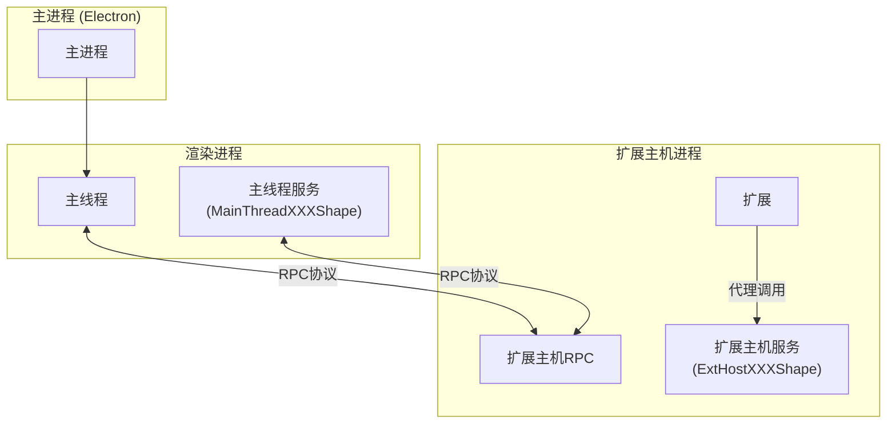
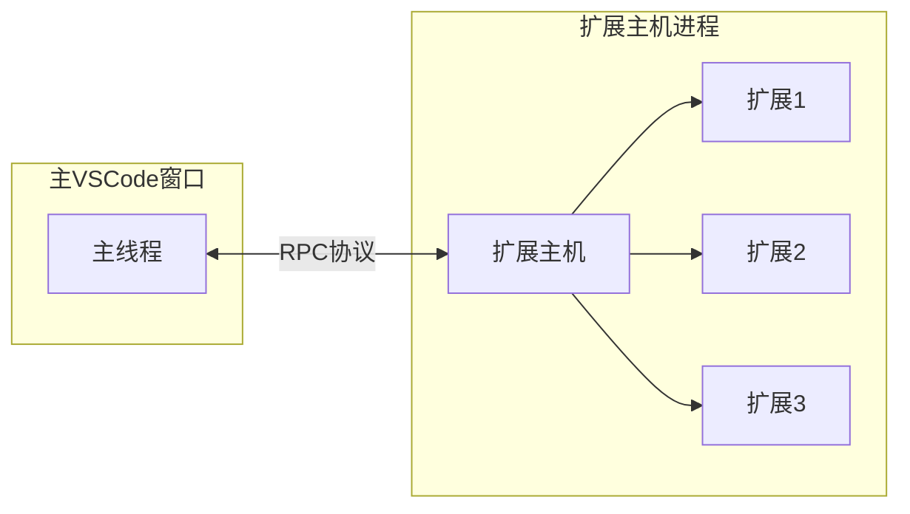
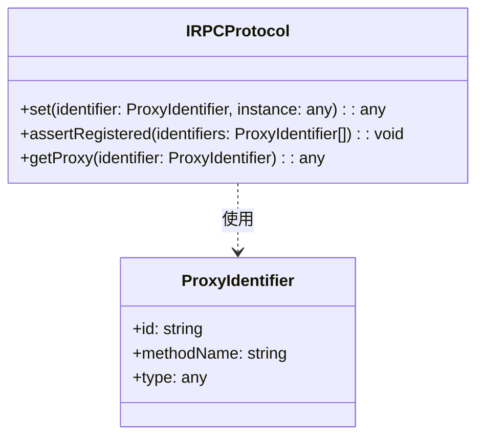
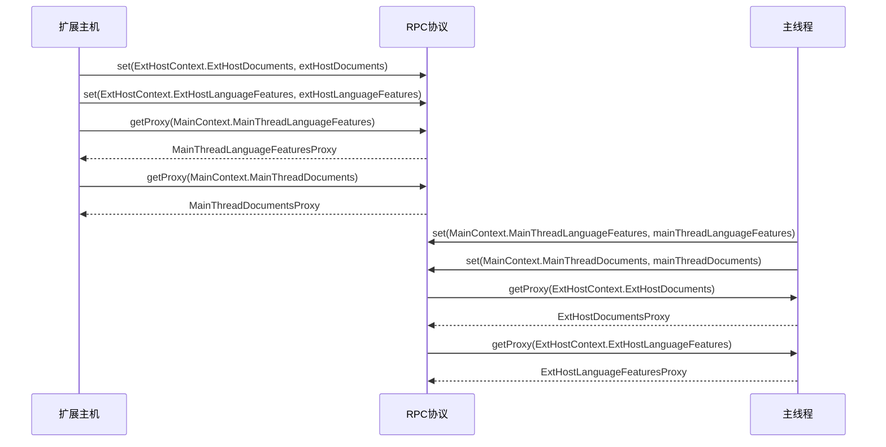
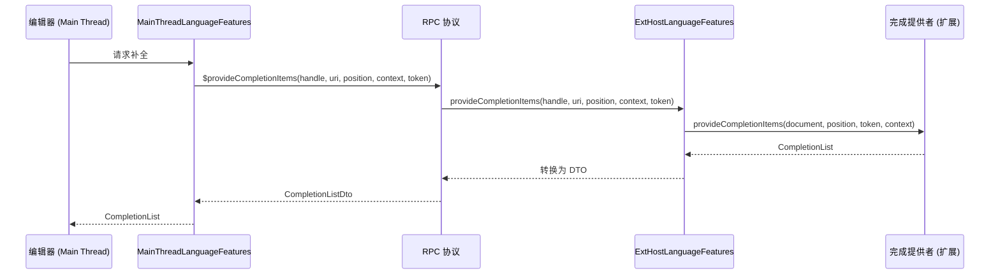
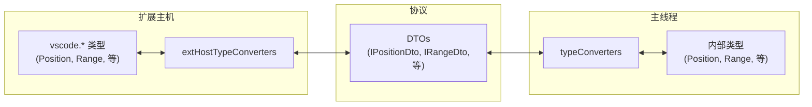
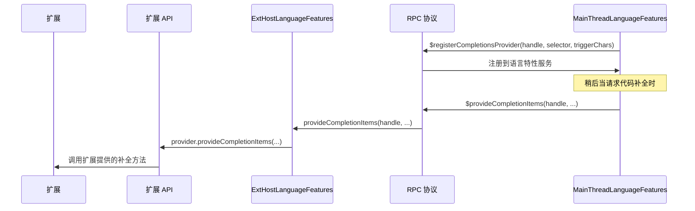
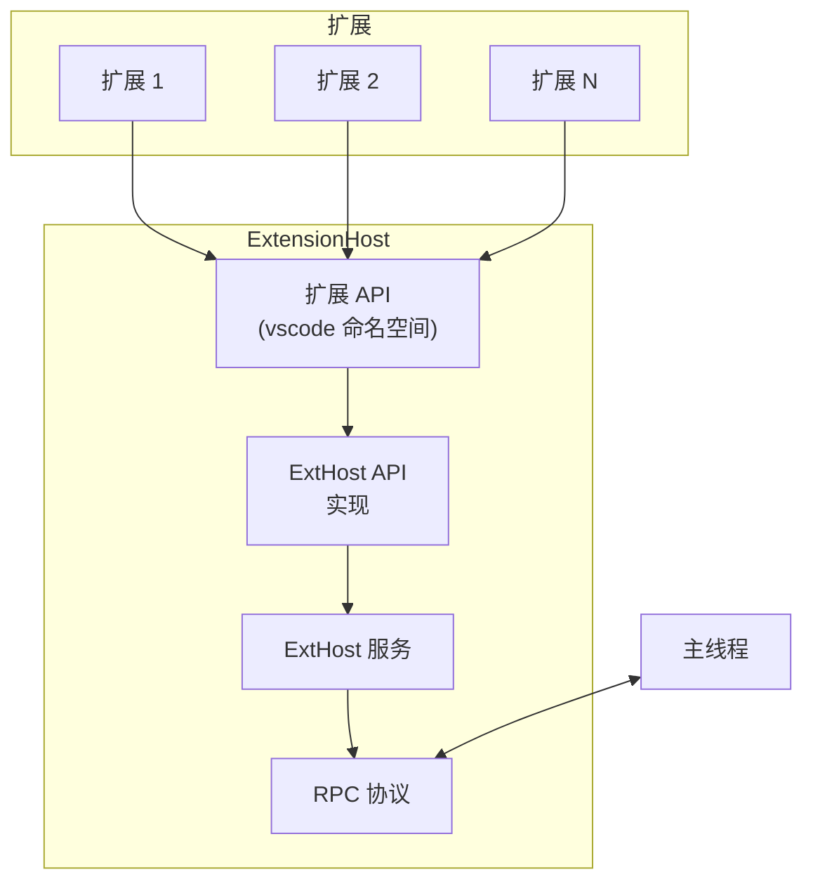

# 扩展主机协议

相关源文件

* [extensions/vscode-api-tests/package.json](../../extensions/vscode-api-tests/package.json)
* [src/vs/editor/common/languages.ts](../../src/vs/editor/common/languages.ts)
* [src/vs/platform/extensions/common/extensionsApiProposals.ts](../../src/vs/platform/extensions/common/extensionsApiProposals.ts)
* [src/vs/workbench/api/browser/mainThreadLanguageFeatures.ts](../../src/vs/workbench/api/browser/mainThreadLanguageFeatures.ts)
* [src/vs/workbench/api/common/extHost.api.impl.ts](../../src/vs/workbench/api/common/extHost.api.impl.ts)
* [src/vs/workbench/api/common/extHost.protocol.ts](../../src/vs/workbench/api/common/extHost.protocol.ts)
* [src/vs/workbench/api/common/extHostLanguageFeatures.ts](../../src/vs/workbench/api/common/extHostLanguageFeatures.ts)
* [src/vs/workbench/api/common/extHostTypeConverters.ts](../../src/vs/workbench/api/common/extHostTypeConverters.ts)
* [src/vs/workbench/api/common/extHostTypes.ts](../../src/vs/workbench/api/common/extHostTypes.ts)
* [src/vscode-dts/vscode.d.ts](../../src/vscode-dts/vscode.d.ts)

扩展主机协议定义了主线程（运行在VS Code窗口中）和扩展主机进程（扩展执行的地方）之间的通信机制。这个协议使扩展能够与VS Code的UI交互，访问文档，并提供语言特性，同时为了稳定性和安全性维持进程隔离。

关于扩展API实现的信息，请参见扩展系统。

## 目的与范围

本文档涵盖：

* RPC（远程过程调用）协议架构
* 主线程和扩展主机之间的通信通道
* 协议消息类型和结构
* 服务注册和代理机制

来源：src/vs/workbench/api/common/extHost.protocol.ts1-92 src/vs/workbench/api/common/extHost.api.impl.ts1-30

## 架构概述

扩展主机协议基于双向RPC系统构建，允许主线程和扩展主机相互调用方法。该协议为可以远程访问的各种服务定义了接口。

**扩展主机协议通信流程**

来源：
src/vs/workbench/api/common/extHost.protocol.ts93-110
src/vs/workbench/api/common/extHost.api.impl.ts126-167

## 协议核心组件

### IRPCProtocol

扩展主机协议的核心是`IRPCProtocol`接口，它提供了用于注册服务和创建代理的方法：

**IRPCProtocol和ProxyIdentifier**

协议使用`ProxyIdentifier`对象来唯一标识可以远程调用的服务。每个服务都使用唯一标识符注册，并创建代理来进行远程调用。

来源：src/vs/workbench/api/common/extHost.protocol.ts80-82 src/vs/workbench/services/extensions/common/proxyIdentifier.js1-50

### 上下文标识符

协议定义了两个主要上下文：

1. `MainContext` - 标识主线程中实现的服务
2. `ExtHostContext` - 标识扩展主机中实现的服务

这些上下文包含枚举值，映射到特定的服务接口。

来源：src/vs/workbench/api/common/extHost.protocol.ts30-80 src/vs/workbench/api/common/extHost.api.impl.ts152-167

## 服务注册

当扩展主机启动时，它向RPC协议注册其服务并获取主线程服务的代理：

**服务注册和代理创建**

来源：src/vs/workbench/api/common/extHost.api.impl.ts152-224

## 主线程形状

协议为可以从扩展主机调用的主线程服务定义了接口。这些接口遵循`MainThreadXXXShape`命名模式并扩展了`IDisposable`。

主要的主线程形状包括：

| 形状                           | 用途                       |
| ------------------------------- | ----------------------------- |
| MainThreadCommandsShape         | 注册和执行命令 |
| MainThreadDocumentsShape        | 管理文本文档         |
| MainThreadEditorsShape          | 控制文本编辑器          |
| MainThreadLanguageFeaturesShape | 注册语言提供者   |
| MainThreadTerminalServiceShape  | 管理终端实例     |
| MainThreadWebviewsShape         | 处理webview内容        |
| MainThreadDialogsShape          | 显示文件对话框             |
| MainThreadStatusBarShape        | 管理状态栏项目       |

来源：src/vs/workbench/api/common/extHost.protocol.ts106-738 src/vs/workbench/api/browser/mainThreadLanguageFeatures.ts36-50

## 扩展主机形状

协议还定义了可以从主线程调用的扩展主机服务的接口。这些接口遵循`ExtHostXXXShape`命名模式。

主要的扩展主机形状包括：

| 形状                        | 用途                                   |
| ---------------------------- | ----------------------------------------- |
| ExtHostDocumentsShape        | 提供文档内容和事件       |
| ExtHostEditorsShape          | 处理编辑器操作                  |
| ExtHostLanguageFeaturesShape | 提供代码补全等语言特性 |
| ExtHostTerminalServiceShape  | 处理终端操作                |
| ExtHostWebviewsShape         | 管理webview内容                  |
| ExtHostTreeViewsShape        | 提供树视图数据                    |
| ExtHostOutputServiceShape    | 管理输出通道                   |

来源：src/vs/workbench/api/common/extHost.protocol.ts4000-5000 src/vs/workbench/api/common/extHostLanguageFeatures.ts40-60

## 协议消息流

协议对大多数操作使用请求-响应模式。以下是语言特性（如代码补全）如何处理的示例：

**语言特性协议流程**

来源：src/vs/workbench/api/common/extHost.protocol.ts448-480 src/vs/workbench/api/common/extHostLanguageFeatures.ts1000-1100 src/vs/workbench/api/browser/mainThreadLanguageFeatures.ts400-500

## 数据传输对象（DTOs）

协议使用数据传输对象（DTOs）来序列化复杂对象以便在进程间传输。这些DTOs在协议中定义，并在每一侧转换为/从实际对象。

DTOs的例子包括：

* `ICodeLensListDto` - 用于代码镜头结果
* `IDocumentFilterDto` - 用于文档选择器
* `ILocationDto` - 用于文件中的位置
* `IWorkspaceEditDto` - 用于工作区编辑
* `ISignatureHelpProviderMetadataDto` - 用于签名帮助元数据

来源：src/vs/workbench/api/common/extHost.protocol.ts400-500 src/vs/workbench/api/common/extHostTypeConverters.ts1-100

## 类型转换器

协议包含类型转换器，将VS Code API类型转换为内部类型，反之亦然。这些转换器处理复杂对象的序列化和反序列化。

**类型转换流程**

来源：src/vs/workbench/api/common/extHostTypeConverters.ts100-200 src/vs/workbench/api/common/extHost.protocol.ts300-400

## 注册机制

扩展通过扩展API注册提供者，然后通过协议在主线程上注册它们。每个提供者都被分配一个唯一的句柄用于标识。

**提供者注册流程**

来源：src/vs/workbench/api/common/extHostLanguageFeatures.ts500-600 src/vs/workbench/api/browser/mainThreadLanguageFeatures.ts100-200

## 取消和错误处理

协议支持通过RPC边界传递的取消令牌，以允许取消长时间运行的操作。错误处理也内置在协议中，以便在进程边界之间传播异常。

来源：src/vs/workbench/api/common/extHost.protocol.ts7-10 src/vs/workbench/api/common/extHostLanguageFeatures.ts8-10

## 扩展主机API实现

扩展主机API实现（`extHost.api.impl.ts`）使用协议向扩展公开VS Code API。它创建主线程服务的代理并向协议注册扩展主机服务。

**扩展主机API实现**

来源：src/vs/workbench/api/common/extHost.api.impl.ts126-240

## 结论

扩展主机协议是VS Code可扩展性模型的关键组件。它提供了主线程和扩展主机之间安全且强大的通信通道，使扩展能够与VS Code交互，同时保持进程隔离。协议的设计允许高效序列化复杂对象，并支持取消和错误处理等功能。

了解此协议对于开发与VS Code核心功能交互的扩展以及理解VS Code的可扩展性模型的工作原理至关重要。
