# 扩展管理

相关源文件

* [src/vs/platform/extensionManagement/common/abstractExtensionManagementService.ts](../../src/vs/platform/extensionManagement/common/abstractExtensionManagementService.ts)
* [src/vs/platform/extensionManagement/common/extensionGalleryService.ts](../../src/vs/platform/extensionManagement/common/extensionGalleryService.ts)
* [src/vs/platform/extensionManagement/common/extensionManagement.ts](../../src/vs/platform/extensionManagement/common/extensionManagement.ts)
* [src/vs/platform/extensionManagement/common/extensionManagementIpc.ts](../../src/vs/platform/extensionManagement/common/extensionManagementIpc.ts)
* [src/vs/platform/extensionManagement/common/extensionManagementUtil.ts](../../src/vs/platform/extensionManagement/common/extensionManagementUtil.ts)
* [src/vs/platform/extensionManagement/node/extensionManagementService.ts](../../src/vs/platform/extensionManagement/node/extensionManagementService.ts)
* [src/vs/workbench/contrib/extensions/browser/extensionEditor.ts](../../src/vs/workbench/contrib/extensions/browser/extensionEditor.ts)
* [src/vs/workbench/contrib/extensions/browser/extensions.contribution.ts](../../src/vs/workbench/contrib/extensions/browser/extensions.contribution.ts)
* [src/vs/workbench/contrib/extensions/browser/extensionsActions.ts](../../src/vs/workbench/contrib/extensions/browser/extensionsActions.ts)
* [src/vs/workbench/contrib/extensions/browser/extensionsIcons.ts](../../src/vs/workbench/contrib/extensions/browser/extensionsIcons.ts)
* [src/vs/workbench/contrib/extensions/browser/extensionsList.ts](../../src/vs/workbench/contrib/extensions/browser/extensionsList.ts)
* [src/vs/workbench/contrib/extensions/browser/extensionsViewer.ts](../../src/vs/workbench/contrib/extensions/browser/extensionsViewer.ts)
* [src/vs/workbench/contrib/extensions/browser/extensionsViewlet.ts](../../src/vs/workbench/contrib/extensions/browser/extensionsViewlet.ts)
* [src/vs/workbench/contrib/extensions/browser/extensionsViews.ts](../../src/vs/workbench/contrib/extensions/browser/extensionsViews.ts)
* [src/vs/workbench/contrib/extensions/browser/extensionsWidgets.ts](../../src/vs/workbench/contrib/extensions/browser/extensionsWidgets.ts)
* [src/vs/workbench/contrib/extensions/browser/extensionsWorkbenchService.ts](../../src/vs/workbench/contrib/extensions/browser/extensionsWorkbenchService.ts)
* [src/vs/workbench/contrib/extensions/browser/media/extension.css](../../src/vs/workbench/contrib/extensions/browser/media/extension.css)
* [src/vs/workbench/contrib/extensions/browser/media/extensionActions.css](../../src/vs/workbench/contrib/extensions/browser/media/extensionActions.css)
* [src/vs/workbench/contrib/extensions/browser/media/extensionEditor.css](../../src/vs/workbench/contrib/extensions/browser/media/extensionEditor.css)
* [src/vs/workbench/contrib/extensions/browser/media/extensionsViewlet.css](../../src/vs/workbench/contrib/extensions/browser/media/extensionsViewlet.css)
* [src/vs/workbench/contrib/extensions/browser/media/extensionsWidgets.css](../../src/vs/workbench/contrib/extensions/browser/media/extensionsWidgets.css)
* [src/vs/workbench/contrib/extensions/common/extensions.ts](../../src/vs/workbench/contrib/extensions/common/extensions.ts)
* [src/vs/workbench/services/extensionManagement/browser/extensionEnablementService.ts](../../src/vs/workbench/services/extensionManagement/browser/extensionEnablementService.ts)
* [src/vs/workbench/services/extensionManagement/common/extensionManagement.ts](../../src/vs/workbench/services/extensionManagement/common/extensionManagement.ts)
* [src/vs/workbench/services/extensionManagement/common/extensionManagementChannelClient.ts](../../src/vs/workbench/services/extensionManagement/common/extensionManagementChannelClient.ts)
* [src/vs/workbench/services/extensionManagement/common/extensionManagementServerService.ts](../../src/vs/workbench/services/extensionManagement/common/extensionManagementServerService.ts)
* [src/vs/workbench/services/extensionManagement/common/extensionManagementService.ts](../../src/vs/workbench/services/extensionManagement/common/extensionManagementService.ts)
* [src/vs/workbench/services/extensionManagement/common/webExtensionManagementService.ts](../../src/vs/workbench/services/extensionManagement/common/webExtensionManagementService.ts)
* [src/vs/workbench/services/extensionManagement/electron-sandbox/extensionManagementServerService.ts](../../src/vs/workbench/services/extensionManagement/electron-sandbox/extensionManagementServerService.ts)
* [src/vs/workbench/services/extensionManagement/electron-sandbox/extensionManagementService.ts](../../src/vs/workbench/services/extensionManagement/electron-sandbox/extensionManagementService.ts)
* [src/vs/workbench/services/extensionManagement/electron-sandbox/extensionTipsService.ts](../../src/vs/workbench/services/extensionManagement/electron-sandbox/extensionTipsService.ts)
* [src/vs/workbench/services/extensionManagement/electron-sandbox/nativeExtensionManagementService.ts](../../src/vs/workbench/services/extensionManagement/electron-sandbox/nativeExtensionManagementService.ts)
* [src/vs/workbench/services/extensionManagement/electron-sandbox/remoteExtensionManagementService.ts](../../src/vs/workbench/services/extensionManagement/electron-sandbox/remoteExtensionManagementService.ts)
* [src/vs/workbench/services/extensionManagement/test/browser/extensionEnablementService.test.ts](../../src/vs/workbench/services/extensionManagement/test/browser/extensionEnablementService.test.ts)

本文档涵盖了VS Code中的扩展管理系统，该系统负责扩展的安装、卸载、启用、禁用和更新。文档解释了如何在不同环境（本地、远程、Web）和配置文件中管理扩展。

有关扩展主机协议以及主进程与扩展主机之间通信的信息，请参阅扩展主机协议。有关暴露给扩展的API详细信息，请参阅扩展API。

## 概述

VS Code中的扩展管理系统提供了一套全面的服务和组件，用于管理扩展的整个生命周期。这包括从应用商店发现扩展、安装扩展、启用或禁用扩展，以及在不再需要时卸载扩展。

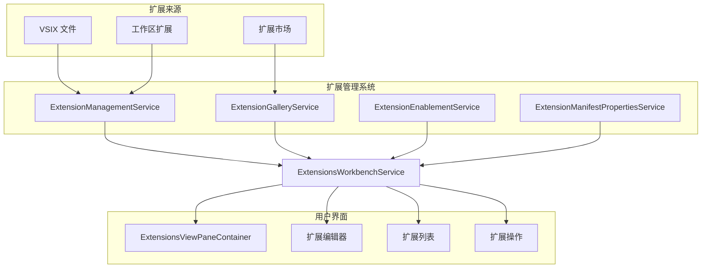

来源：

* src/vs/workbench/contrib/extensions/browser/extensionsWorkbenchService.ts1-100
* src/vs/platform/extensionManagement/common/extensionManagement.ts1-100
* src/vs/workbench/services/extensionManagement/common/extensionManagement.ts1-50

## 核心服务

扩展管理系统围绕几个关键服务构建，这些服务协同工作，提供完整的扩展管理体验。

### 扩展管理服务

`IExtensionManagementService`是负责安装、卸载和管理扩展的核心服务。它提供以下方法：

* 从应用商店或本地VSIX文件安装扩展
* 卸载扩展
* 获取已安装的扩展
* 更新扩展元数据
* 管理扩展启用状态

在VS Code中，针对不同环境有不同的服务实现：

* 桌面环境的`ExtensionManagementService`
* Web环境的`WebExtensionManagementService`
* 远程环境的`RemoteExtensionManagementService`

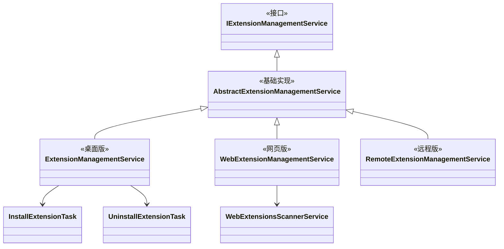

来源：

* src/vs/platform/extensionManagement/common/abstractExtensionManagementService.ts1-120
* src/vs/platform/extensionManagement/common/extensionManagement.ts396-419
* src/vs/platform/extensionManagement/node/extensionManagementService.ts60-120
* src/vs/workbench/services/extensionManagement/common/webExtensionManagementService.ts1-50

### 扩展工作台服务

`IExtensionsWorkbenchService`为UI组件提供了与扩展交互的高级API。它封装了低级别的`IExtensionManagementService`，并添加了额外功能，如：

* 从应用商店查询扩展
* 管理本地和应用商店扩展
* 处理扩展状态和启用情况
* 提供扩展元数据和详细信息

该服务是扩展UI组件使用的主要接口。

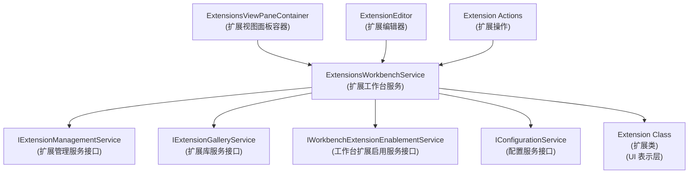

来源：

* src/vs/workbench/contrib/extensions/browser/extensionsWorkbenchService.ts1-100
* src/vs/workbench/contrib/extensions/common/extensions.ts1-100

### 扩展库服务

`IExtensionGalleryService`负责与VS Code应用商店通信，用于：

* 基于各种条件查询扩展
* 获取扩展详情、清单和资源
* 下载扩展
* 报告扩展统计数据

该服务处理与应用商店API的所有通信，并为系统的其余部分提供与应用商店交互的清晰接口。

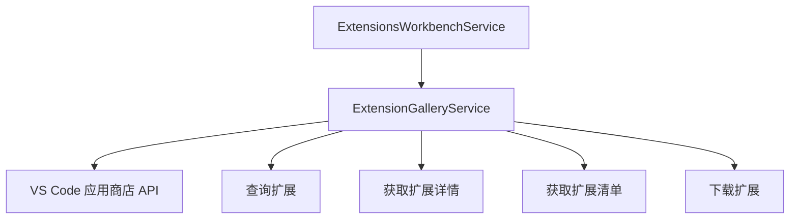

来源：

* src/vs/platform/extensionManagement/common/extensionGalleryService.ts1-100
* src/vs/platform/extensionManagement/common/extensionManagement.ts396-419

### 扩展启用服务

`IWorkbenchExtensionEnablementService`管理扩展的启用状态。它处理：

* 启用和禁用扩展
* 确定扩展是否可以启用
* 管理扩展之间的依赖关系
* 处理工作区信任要求

该服务确保根据用户偏好和系统约束正确启用或禁用扩展。

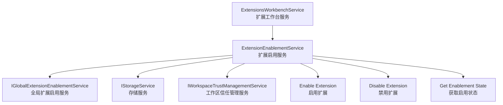

来源：

* src/vs/workbench/services/extensionManagement/browser/extensionEnablementService.ts1-100
* src/vs/workbench/services/extensionManagement/test/browser/extensionEnablementService.test.ts1-50

## 扩展管理工作流

扩展管理系统遵循明确定义的工作流程来安装、更新和卸载扩展。

### 安装过程

当用户安装扩展时，会发生以下过程：

1. UI组件（例如`InstallAction`）调用`IExtensionsWorkbenchService.install()`
2. 工作台服务委托给适当的`IExtensionManagementService`实现
3. 管理服务下载扩展（如果来自应用商店）或提取它（如果来自VSIX）
4. 扩展被安装到适当的位置
5. 触发事件通知系统安装已完成
6. 更新UI以反映新状态

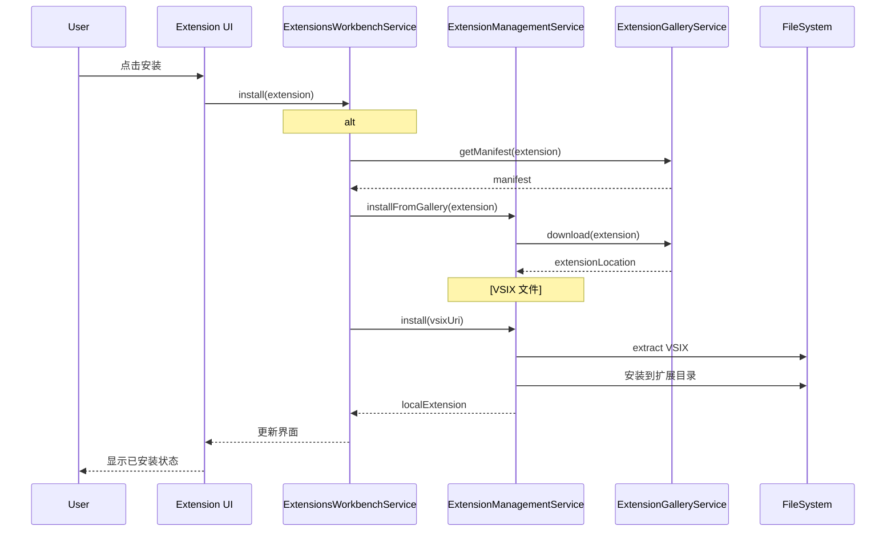

来源：

* src/vs/workbench/contrib/extensions/browser/extensionsActions.ts427-646
* src/vs/platform/extensionManagement/node/extensionManagementService.ts145-173
* src/vs/workbench/contrib/extensions/browser/extensionsWorkbenchService.ts1-100

### 卸载过程

卸载过程遵循类似的模式：

1. UI组件调用`IExtensionsWorkbenchService.uninstall()`
2. 工作台服务委托给适当的`IExtensionManagementService`
3. 管理服务删除扩展文件
4. 触发事件通知系统卸载已完成
5. 更新UI以反映新状态

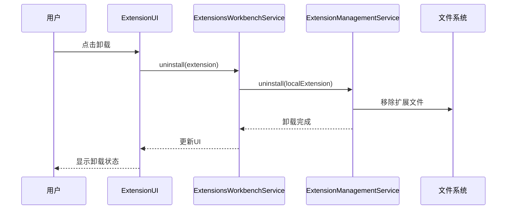

来源：

* src/vs/workbench/contrib/extensions/browser/extensionsActions.ts1-100
* src/vs/platform/extensionManagement/node/extensionManagementService.ts220-234
* src/vs/workbench/contrib/extensions/browser/extensionsWorkbenchService.ts1-100

### 更新过程

更新过程类似于安装，但包括额外的检查：

1. 系统检查过期的扩展
2. UI显示过期扩展的更新按钮
3. 当用户启动更新时，卸载旧版本
4. 安装新版本
5. 触发事件通知系统更新已完成
6. 更新UI以反映新状态

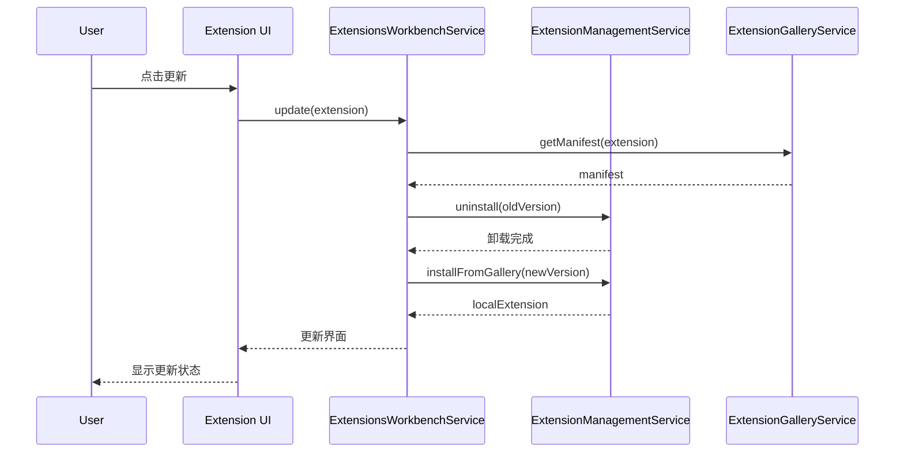

来源：

* src/vs/workbench/contrib/extensions/browser/extensionsActions.ts1-100
* src/vs/workbench/contrib/extensions/browser/extensionsWorkbenchService.ts1-100

## 扩展状态和生命周期

VS Code中的扩展可以存在于不同的状态，并在其生命周期中在这些状态之间转换。

### 扩展状态

`ExtensionState`枚举定义了扩展的可能状态：

* `Installing`：扩展正在安装中
* `Installed`：扩展已安装并可用
* `Uninstalling`：扩展正在卸载中
* `Uninstalled`：扩展未安装

此外，扩展还有一个`EnablementState`，用于确定它们是启用还是禁用：

* `EnabledGlobally`：对所有工作区启用
* `EnabledWorkspace`：仅对当前工作区启用
* `DisabledGlobally`：对所有工作区禁用
* `DisabledWorkspace`：仅对当前工作区禁用
* `DisabledByExtensionKind`：因与当前环境不兼容而禁用
* `DisabledByTrustRequirement`：因工作区不受信任而禁用
* `DisabledByVirtualWorkspace`：因不支持虚拟工作区而禁用
* `DisabledByMalicious`：因被标记为恶意而禁用

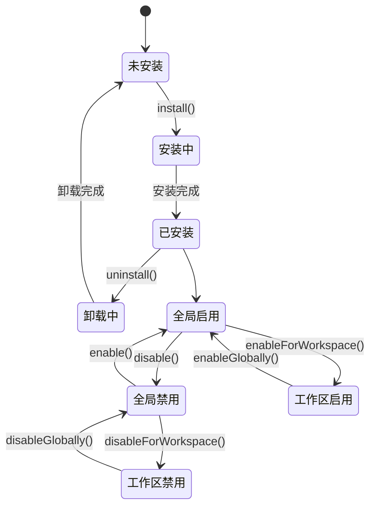

来源：

* src/vs/workbench/contrib/extensions/common/extensions.ts39-44
* src/vs/workbench/services/extensionManagement/common/extensionManagement.ts1-50
* src/vs/workbench/services/extensionManagement/browser/extensionEnablementService.ts1-100

### 扩展启用

扩展启用系统根据各种因素确定扩展是否可以启用：

* 用户偏好（全局或每个工作区）
* 扩展依赖关系
* 工作区信任要求
* 虚拟工作区支持
* 扩展类型兼容性

`ExtensionEnablementService`管理这些规则，并提供API来启用或禁用扩展。

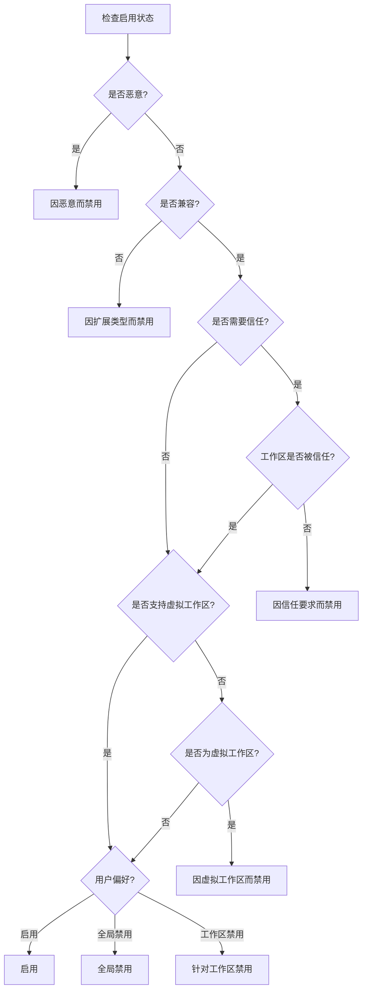

来源：

* src/vs/workbench/services/extensionManagement/browser/extensionEnablementService.ts1-100
* src/vs/workbench/services/extensionManagement/test/browser/extensionEnablementService.test.ts1-50

## 扩展管理UI

扩展管理UI提供了一个用户友好的界面，用于发现、安装和管理扩展。

### 扩展视图

`ExtensionsViewPaneContainer`是浏览和管理扩展的主要UI组件。它包括：

* 用于查找扩展的搜索栏
* 不同类别扩展的各种视图（已安装、推荐等）
* 用于安装、更新和管理扩展的操作

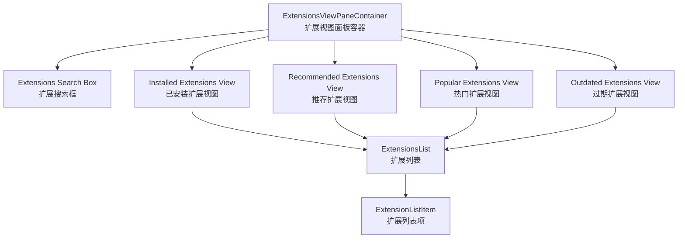

来源：

* src/vs/workbench/contrib/extensions/browser/extensionsViewlet.ts1-100
* src/vs/workbench/contrib/extensions/browser/extensionsViews.ts1-100
* src/vs/workbench/contrib/extensions/browser/media/extensionsViewlet.css1-50

### 扩展编辑器

`ExtensionEditor`提供了扩展的详细视图，包括：

* 扩展元数据（名称、发布者、版本等）
* 描述和文档
* 安装、启用或卸载的操作
* 不同部分的标签页（自述文件、更新日志等）

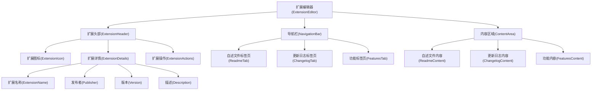

来源：

* src/vs/workbench/contrib/extensions/browser/extensionEditor.ts1-100
* src/vs/workbench/contrib/extensions/browser/media/extensionEditor.css1-50

### 扩展操作

扩展管理系统提供了各种用于管理扩展的操作：

* `InstallAction`：安装扩展
* `UninstallAction`：卸载扩展
* `UpdateAction`：更新扩展
* `EnableAction`/`DisableAction`：启用或禁用扩展
* `SetColorThemeAction`/`SetFileIconThemeAction`：从扩展设置主题
* 以及更多专门的操作

这些操作在UI中显示为按钮或菜单项，并触发扩展管理服务中的相应操作。

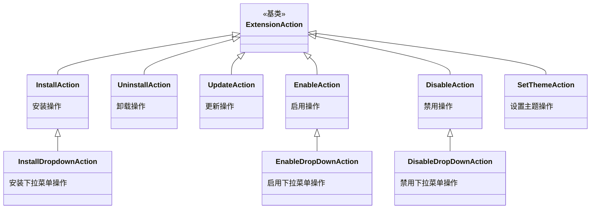

来源：

* src/vs/workbench/contrib/extensions/browser/extensionsActions.ts1-100
* src/vs/workbench/contrib/extensions/browser/media/extensionActions.css1-50

## 多环境扩展管理

VS Code支持在不同环境（桌面、Web、远程）中运行，扩展管理系统设计用于处理这些环境中的扩展。

### 扩展管理服务器

`IExtensionManagementServerService`提供对不同扩展管理服务器的访问：

* `localExtensionManagementServer`：管理本地机器上的扩展
* `remoteExtensionManagementServer`：管理远程机器上的扩展
* `webExtensionManagementServer`：管理Web环境中的扩展

每个服务器都有自己的`IExtensionManagementService`实现，针对其环境进行了定制。

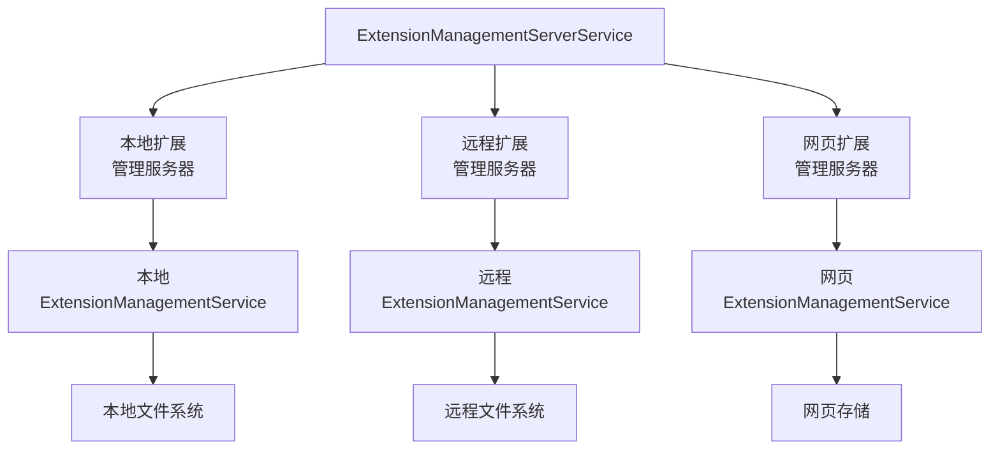

来源：

* src/vs/workbench/services/extensionManagement/common/extensionManagement.ts1-50
* src/vs/workbench/services/extensionManagement/common/extensionManagementServerService.ts1-50
* src/vs/workbench/services/extensionManagement/electron-sandbox/extensionManagementServerService.ts1-50

### 扩展安装位置

扩展可以安装在不同的位置，具体取决于环境和扩展类型：

* 本地：安装在本地机器上的扩展
* 远程：安装在远程机器上的扩展
* Web：安装在Web环境中的扩展

系统根据扩展的清单和当前环境确定适当的位置。

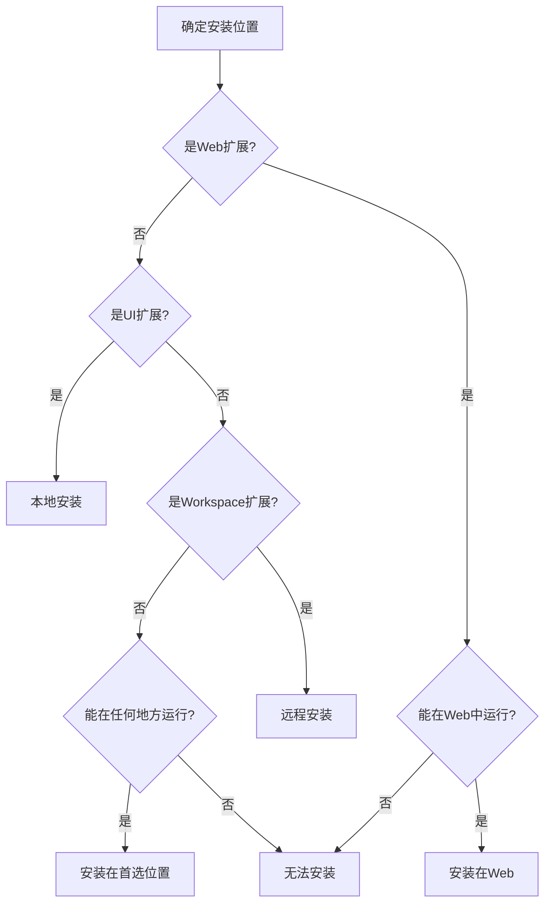

来源：

* src/vs/workbench/services/extensionManagement/common/extensionManagement.ts30-34
* src/vs/workbench/contrib/extensions/browser/extensionsActions.ts727-815
* src/vs/workbench/services/extensionManagement/common/extensionManagementService.ts1-100

## 扩展配置文件

VS Code支持扩展配置文件，允许用户为不同的工作区或项目拥有不同的扩展集。

### 配置文件感知扩展管理

`IProfileAwareExtensionManagementService`扩展了基本的`IExtensionManagementService`，增加了配置文件特定的功能：

* 将扩展安装到特定配置文件
* 在配置文件之间复制扩展
* 配置文件特定的扩展变更事件

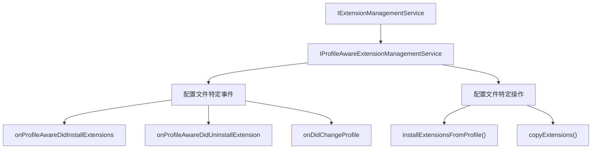

来源：

* src/vs/workbench/services/extensionManagement/common/extensionManagement.ts16-22
* src/vs/workbench/services/extensionManagement/common/extensionManagementService.ts1-100

### 扩展元数据

扩展存储包含配置文件特定信息的元数据：

* 安装来源（应用商店、VSIX等）
* 扩展是机器范围还是配置文件范围
* 预发布状态
* 安装时间戳
* 等等

切换配置文件或工作区时，使用此元数据正确恢复扩展。

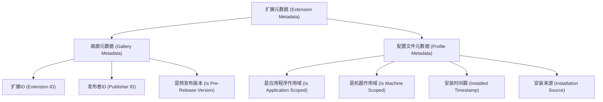

来源：

* src/vs/platform/extensionManagement/common/extensionManagement.ts260-272
* src/vs/platform/extensionManagement/node/extensionManagementService.ts198-218

## 结论

VS Code中的扩展管理系统是一套全面的服务和组件，它们协同工作，提供了无缝的扩展发现、安装和管理体验。它处理不同环境、配置文件和扩展类型的复杂性，同时提供用户友好的界面与扩展交互。

该系统设计为可扩展和适应不同环境，使得VS Code能够在各种上下文中运行，同时保持一致的扩展管理体验。
