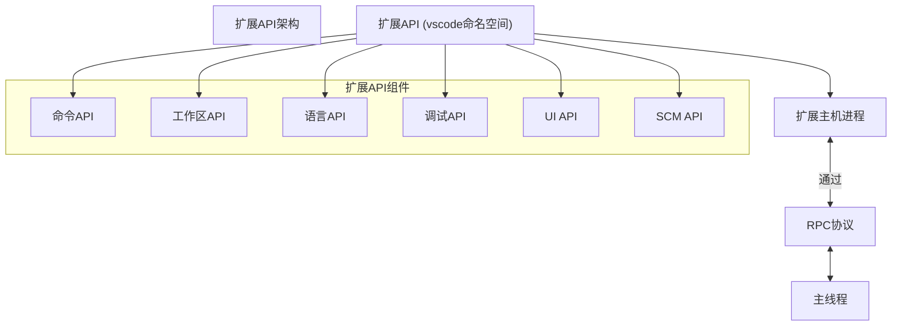
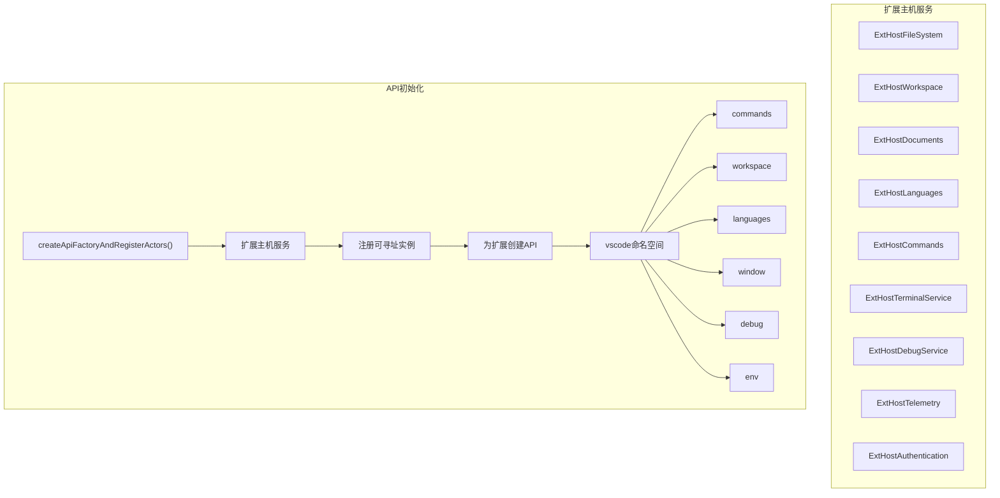
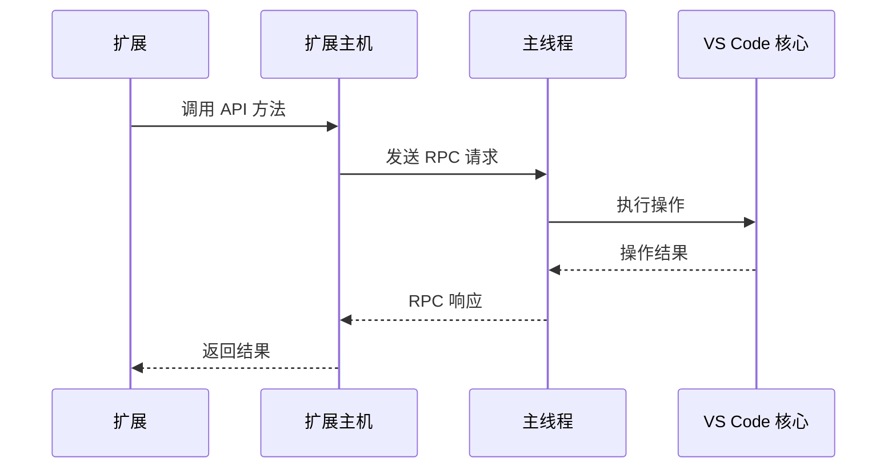
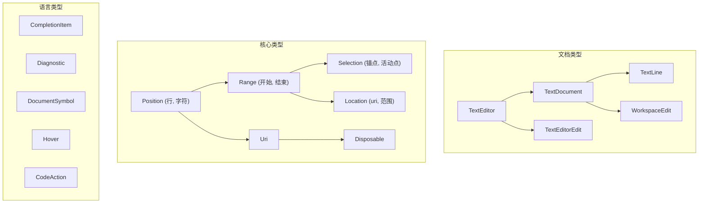
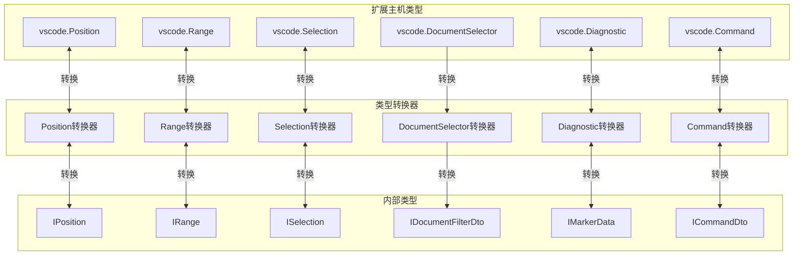
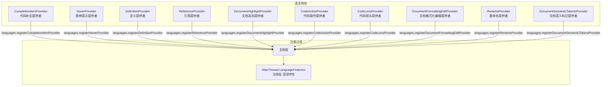
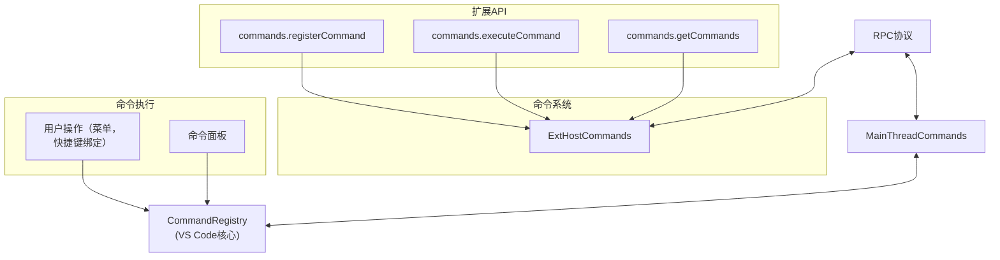
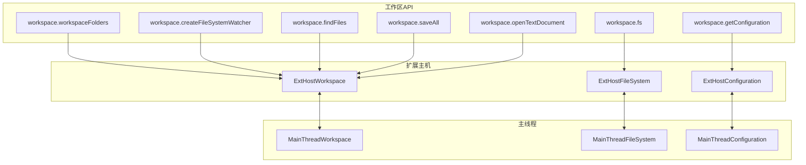
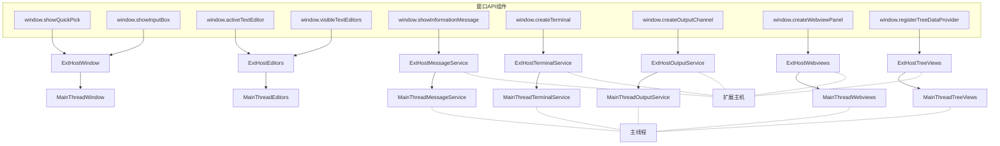
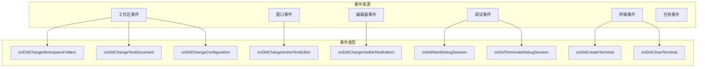

# 扩展API

<details>
<summary>相关源文件</summary>

* [extensions/git/package.json](../../extensions/git/package.json)
* [extensions/git/package.nls.json](../../extensions/git/package.nls.json)
* [extensions/git/src/actionButton.ts](../../extensions/git/src/actionButton.ts)
* [extensions/git/src/api/api1.ts](../../extensions/git/src/api/api1.ts)
* [extensions/git/src/api/extension.ts](../../extensions/git/src/api/extension.ts)
* [extensions/git/src/api/git.d.ts](../../extensions/git/src/api/git.d.ts)
* [extensions/git/src/askpass-empty.sh](../../extensions/git/src/askpass-empty.sh)
* [extensions/git/src/askpass-main.ts](../../extensions/git/src/askpass-main.ts)
* [extensions/git/src/askpass.sh](../../extensions/git/src/askpass.sh)
* [extensions/git/src/askpass.ts](../../extensions/git/src/askpass.ts)
* [extensions/git/src/autofetch.ts](../../extensions/git/src/autofetch.ts)
* [extensions/git/src/commands.ts](../../extensions/git/src/commands.ts)
* [extensions/git/src/git.ts](../../extensions/git/src/git.ts)
* [extensions/git/src/gitEditor.ts](../../extensions/git/src/gitEditor.ts)
* [extensions/git/src/ipc/ipcClient.ts](../../extensions/git/src/ipc/ipcClient.ts)
* [extensions/git/src/ipc/ipcServer.ts](../../extensions/git/src/ipc/ipcServer.ts)
* [extensions/git/src/main.ts](../../extensions/git/src/main.ts)
* [extensions/git/src/model.ts](../../extensions/git/src/model.ts)
* [extensions/git/src/postCommitCommands.ts](../../extensions/git/src/postCommitCommands.ts)
* [extensions/git/src/repository.ts](../../extensions/git/src/repository.ts)
* [extensions/git/src/ssh-askpass-empty.sh](../../extensions/git/src/ssh-askpass-empty.sh)
* [extensions/git/src/ssh-askpass.sh](../../extensions/git/src/ssh-askpass.sh)
* [extensions/git/src/statusbar.ts](../../extensions/git/src/statusbar.ts)
* [extensions/git/src/terminal.ts](../../extensions/git/src/terminal.ts)
* [extensions/git/src/test/git.test.ts](../../extensions/git/src/test/git.test.ts)
* [extensions/git/src/util.ts](../../extensions/git/src/util.ts)
* [extensions/git/tsconfig.json](../../extensions/git/tsconfig.json)
* [extensions/vscode-api-tests/package.json](../../extensions/vscode-api-tests/package.json)
* [src/vs/editor/common/languages.ts](../../src/vs/editor/common/languages.ts)
* [src/vs/platform/extensions/common/extensionsApiProposals.ts](../../src/vs/platform/extensions/common/extensionsApiProposals.ts)
* [src/vs/workbench/api/browser/mainThreadLanguageFeatures.ts](../../src/vs/workbench/api/browser/mainThreadLanguageFeatures.ts)
* [src/vs/workbench/api/common/extHost.api.impl.ts](../../src/vs/workbench/api/common/extHost.api.impl.ts)
* [src/vs/workbench/api/common/extHost.protocol.ts](../../src/vs/workbench/api/common/extHost.protocol.ts)
* [src/vs/workbench/api/common/extHostLanguageFeatures.ts](../../src/vs/workbench/api/common/extHostLanguageFeatures.ts)
* [src/vs/workbench/api/common/extHostTypeConverters.ts](../../src/vs/workbench/api/common/extHostTypeConverters.ts)
* [src/vs/workbench/api/common/extHostTypes.ts](../../src/vs/workbench/api/common/extHostTypes.ts)
* [src/vscode-dts/vscode.d.ts](../../src/vscode-dts/vscode.d.ts)

</details>

本页记录了VS Code中的扩展API系统，该系统使扩展能够与编辑器交互并扩展其功能。扩展API提供了一套全面的接口和服务，扩展可以使用这些接口和服务与VS Code的功能集成。

有关使扩展主机和主线程之间进行通信的扩展主机协议的信息，请参阅[扩展主机协议](4.1-扩展主机协议.md)。

有关扩展管理的信息，请参阅[扩展管理](4.2-扩展管理.md)。

## 概述

VS Code扩展API是扩展与编辑器交互的主要方式。它提供了丰富的功能，允许扩展：

1. 访问和修改编辑器内容
2. 贡献UI元素
3. 响应编辑器事件
4. 向VS Code添加新功能

API通过`vscode`命名空间公开，当扩展加载时，该命名空间会自动可用。



来源：

* src/vs/workbench/api/common/extHost.api.impl.ts126-240
* src/vs/workbench/api/common/extHost.protocol.ts93-167

## API工厂和初始化

当扩展被激活时，VS Code会为该扩展创建一个API实例。这是通过`createApiFactoryAndRegisterActors`函数完成的，该函数设置了扩展与VS Code交互所需的所有必要服务和组件。



来源：

* src/vs/workbench/api/common/extHost.api.impl.ts126-240
* src/vs/workbench/api/common/extHost.api.impl.ts240-524

## 核心API命名空间

VS Code API组织成几个关键命名空间，每个命名空间提供对编辑器不同方面的访问：

### 命令API

命令API允许扩展注册和执行命令。

```ts
// Register a command
commands.registerCommand('extension.myCommand', () => {
    console.log('My command executed!');
});

// Execute a command
commands.executeCommand('workbench.action.openSettings');
```

来源：

* src/vs/workbench/api/common/extHost.api.impl.ts317-361

### 工作区API

工作区API提供对工作区相关功能的访问，如文件系统操作、配置和工作区文件夹。

```ts
// Access workspace folders
const folders = workspace.workspaceFolders;

// Read configuration
const config = workspace.getConfiguration('myExtension');

// Watch for file changes
const watcher = workspace.createFileSystemWatcher('**/*.json');
```

来源：

* src/vs/workbench/api/common/extHostWorkspace.ts

### 语言API

语言API允许扩展贡献代码完成、诊断和格式化等语言特性。

```ts
// Register a completion provider
languages.registerCompletionItemProvider('javascript', {
    provideCompletionItems(document, position) {
        // Provide completion items
    }
});

// Create diagnostics
const diagnostics = languages.createDiagnosticCollection('myExtension');
```

来源：

* src/vs/workbench/api/common/extHost.api.impl.ts526-589
* src/vs/workbench/api/common/extHostLanguageFeatures.ts

### 窗口API

窗口API提供对编辑器UI的访问，包括文本编辑器、终端和UI组件。
```ts
// Show information message
window.showInformationMessage('Hello World!');

// Get active text editor
const editor = window.activeTextEditor;
```

### 调试API

调试API允许扩展与调试系统交互。
```ts
// Register a debug adapter provider
debug.registerDebugAdapterDescriptorFactory('myDebugType', {
    createDebugAdapterDescriptor(session) {
        // Create debug adapter
    }
});
```
### 环境API

环境API提供有关VS Code环境的信息。

```ts
// Get VS Code version
const version = env.appVersion;

// Access clipboard
const text = await env.clipboard.readText();
```

来源：

* src/vs/workbench/api/common/extHost.api.impl.ts364-449

## 通信架构

扩展API使用远程过程调用(RPC)协议在扩展主机进程和主VS Code进程之间进行通信。



来源：

* src/vs/workbench/api/common/extHost.protocol.ts93-167
* src/vs/workbench/api/common/extHost.api.impl.ts152-225

## 扩展上下文和生命周期

当扩展被激活时，它会收到一个`ExtensionContext`对象，该对象提供对各种服务和实用程序的访问：

```ts
export function activate(context: vscode.ExtensionContext) {
    // Register commands, providers, etc.
    const disposable = vscode.commands.registerCommand('extension.helloWorld', () => {
        vscode.window.showInformationMessage('Hello World!');
    });

    // Add to disposables to ensure cleanup on deactivation
    context.subscriptions.push(disposable);
}

export function deactivate() {
    // Cleanup resources
}
```


`ExtensionContext`提供：

* 可释放资源的订阅管理
* 用于持久化数据的存储API
* 扩展路径信息
* 秘密存储

来源：

* src/vscode-dts/vscode.d.ts

## 类型系统

VS Code的扩展API包含一个丰富的类型系统，提供了用于处理编辑器概念的类和接口：



来源：

* src/vs/workbench/api/common/extHostTypes.ts99-281
* src/vs/workbench/api/common/extHostTypes.ts283-431
* src/vs/workbench/api/common/extHostTypes.ts433-502

### 位置和范围

`Position`和`Range`类是在VS Code中处理文本的基础：

```ts
// Create a position at line 5, character 10
const position = new vscode.Position(5, 10);

// Create a range from line 5, character 10 to line 6, character 20
const range = new vscode.Range(5, 10, 6, 20);
// Or using positions
const range2 = new vscode.Range(position, new vscode.Position(6, 20));
```

来源：

* src/vs/workbench/api/common/extHostTypes.ts99-281
* src/vs/workbench/api/common/extHostTypes.ts283-431

### 选择

`Selection`类扩展了`Range`类，表示具有锚点和活动位置的文本选择：

```ts
// Create a selection from line 5, character 10 to line 6, character 20
const selection = new vscode.Selection(5, 10, 6, 20);
```

来源：

* src/vs/workbench/api/common/extHostTypes.ts433-502

### URI

`Uri`类表示通用资源标识符：

```ts
// Create a URI for a file
const uri = vscode.Uri.file('/path/to/file.txt');

// Create a URI from a string
const uri2 = vscode.Uri.parse('file:///path/to/file.txt');
```

## 类型转换器

VS Code使用类型转换器来转换扩展使用的API类型和编辑器内部使用的类型。这些转换器确保数据在跨越扩展主机和主线程之间的边界时被正确转换。


来源：

* src/vs/workbench/api/common/extHostTypeConverters.ts89-170
* src/vs/workbench/api/common/extHostTypeConverters.ts172-256
* src/vs/workbench/api/common/extHostTypeConverters.ts210-266

## 语言特性API

语言特性API允许扩展向编辑器贡献特定语言的功能，如代码完成、诊断和格式化。



来源：

* src/vs/workbench/api/common/extHostLanguageFeatures.ts
* src/vs/workbench/api/browser/mainThreadLanguageFeatures.ts
* src/vs/editor/common/languages.ts

### 注册语言提供者

扩展可以注册各种语言提供者，以增强特定语言的编辑体验：

```ts
// Register a completion provider for JavaScript
const provider = vscode.languages.registerCompletionItemProvider('javascript', {
    provideCompletionItems(document, position, token, context) {
        // Return completion items
        return [
            new vscode.CompletionItem('function', vscode.CompletionItemKind.Keyword),
            new vscode.CompletionItem('class', vscode.CompletionItemKind.Keyword)
        ];
    }
});

// Register a hover provider for TypeScript
const hoverProvider = vscode.languages.registerHoverProvider('typescript', {
    provideHover(document, position, token) {
        // Return hover information
        return new vscode.Hover('Hover information');
    }
});
```

来源：

* src/vs/workbench/api/common/extHost.api.impl.ts526-589
* src/vs/workbench/api/common/extHostLanguageFeatures.ts

## 命令API

命令API允许扩展注册和执行命令。命令是扩展向用户公开功能并与VS Code其他部分交互的主要方式。



来源：

* src/vs/workbench/api/common/extHost.api.impl.ts317-361
* src/vs/workbench/api/common/extHostCommands.ts

### 注册命令

扩展可以注册可由用户或其他扩展执行的命令：

```ts
// Register a simple command
const disposable = vscode.commands.registerCommand('extension.helloWorld', () => {
    vscode.window.showInformationMessage('Hello World!');
});

// Register a command that takes parameters
const paramCommand = vscode.commands.registerCommand('extension.greet', (name) => {
    vscode.window.showInformationMessage(`Hello, ${name}!`);
});

// Register a text editor command
const editorCommand = vscode.commands.registerTextEditorCommand('extension.insertText', (editor, edit) => {
    edit.insert(editor.selection.start, 'Inserted text');
});
```
来源：

* src/vs/workbench/api/common/extHost.api.impl.ts317-361

### 执行命令

扩展可以执行命令，包括内置的VS Code命令和其他扩展注册的命令：

```ts
// Execute a command without parameters
vscode.commands.executeCommand('workbench.action.openSettings');

// Execute a command with parameters
vscode.commands.executeCommand('extension.greet', 'John');

// Execute a command and get the result
const result = await vscode.commands.executeCommand('vscode.executeDefinitionProvider',
    document.uri, new vscode.Position(10, 20));
```
来源：

* src/vs/workbench/api/common/extHost.api.impl.ts317-361

## 工作区API

工作区API提供对工作区相关功能的访问，如文件系统操作、配置和工作区文件夹。



来源：

* src/vs/workbench/api/common/extHostWorkspace.ts
* src/vs/workbench/api/common/extHostFileSystem.ts
* src/vs/workbench/api/common/extHostConfiguration.ts

### 工作区文件夹

扩展可以访问在工作区中打开的文件夹：
```ts
// Get all workspace folders
const folders = vscode.workspace.workspaceFolders;

// Check if workspace has folders
if (folders && folders.length > 0) {
    const firstFolder = folders[0];
    console.log(`First folder: ${firstFolder.name} at ${firstFolder.uri.fsPath}`);
}
```

### 文件系统操作

工作区API通过`workspace.fs`命名空间提供文件系统操作：

```ts
// Read a file
const fileContent = await vscode.workspace.fs.readFile(vscode.Uri.file('/path/to/file.txt'));

// Write a file
await vscode.workspace.fs.writeFile(
    vscode.Uri.file('/path/to/file.txt'),
    new Uint8Array(Buffer.from('Hello, World!'))
);

// Create a directory
await vscode.workspace.fs.createDirectory(vscode.Uri.file('/path/to/directory'));

// Delete a file
await vscode.workspace.fs.delete(vscode.Uri.file('/path/to/file.txt'));
```

### 配置

扩展可以通过配置API访问和修改VS Code设置：

```ts
// Get configuration for the extension
const config = vscode.workspace.getConfiguration('myExtension');

// Read a setting
const value = config.get('setting', 'default');

// Update a setting
await config.update('setting', 'new value', vscode.ConfigurationTarget.Global);
```

来源：

* src/vs/workbench/api/common/extHostConfiguration.ts

### 文件系统观察者

扩展可以监视文件系统的变化：

```ts
// Watch for changes to JSON files
const watcher = vscode.workspace.createFileSystemWatcher('**/*.json');

// Listen for file creation
watcher.onDidCreate(uri => {
    console.log(`File created: ${uri.fsPath}`);
});

// Listen for file changes
watcher.onDidChange(uri => {
    console.log(`File changed: ${uri.fsPath}`);
});

// Listen for file deletion
watcher.onDidDelete(uri => {
    console.log(`File deleted: ${uri.fsPath}`);
});
```

## 窗口API

窗口API提供对编辑器UI的访问，包括文本编辑器、终端和UI组件。


来源：

* src/vs/workbench/api/common/extHostEditors.ts
* src/vs/workbench/api/common/extHostMessageService.ts
* src/vs/workbench/api/common/extHostTerminalService.ts

### 文本编辑器

扩展可以访问和操作文本编辑器：
```ts
// Get the active text editor
const editor = vscode.window.activeTextEditor;
if (editor) {
    // Get the document
    const document = editor.document;

    // Get the selection
    const selection = editor.selection;

    // Get the text in the selection
    const text = document.getText(selection);

    // Edit the document
    editor.edit(editBuilder => {
        editBuilder.replace(selection, text.toUpperCase());
    });
}
```

### 消息和UI

扩展可以显示消息和UI元素：
```ts
// Show an information message
vscode.window.showInformationMessage('Hello, World!');

// Show a warning message
vscode.window.showWarningMessage('Warning!');

// Show an error message
vscode.window.showErrorMessage('Error!');

// Show a message with buttons
vscode.window.showInformationMessage('Do you want to continue?', 'Yes', 'No')
    .then(selection => {
        if (selection === 'Yes') {
            // User clicked Yes
        }
    });

// Show a quick pick
vscode.window.showQuickPick(['Option 1', 'Option 2', 'Option 3'])
    .then(selection => {
        if (selection) {
            console.log(`Selected: ${selection}`);
        }
    });

// Show an input box
vscode.window.showInputBox({ prompt: 'Enter your name' })
    .then(value => {
        if (value) {
            console.log(`Name: ${value}`);
        }
    });
```


### 终端

扩展可以创建和与集成终端交互：

```ts
// Create a terminal
const terminal = vscode.window.createTerminal('My Terminal');

// Send text to the terminal
terminal.sendText('echo Hello, World!');

// Show the terminal
terminal.show();

// Hide the terminal
terminal.hide();

// Dispose the terminal
terminal.dispose();
```

## 事件和事件处理

VS Code的扩展API为其许多功能使用基于事件的架构。扩展可以订阅事件，以便在特定操作发生时收到通知。



来源：

* src/vs/workbench/api/common/extHost.api.impl.ts245-257

### 订阅事件

扩展可以使用各种API对象提供的`on*`方法订阅事件：

```ts
// Listen for changes to workspace folders
vscode.workspace.onDidChangeWorkspaceFolders(event => {
    console.log(`Added folders: ${event.added.length}`);
    console.log(`Removed folders: ${event.removed.length}`);
});

// Listen for changes to text documents
vscode.workspace.onDidChangeTextDocument(event => {
    console.log(`Document changed: ${event.document.uri.fsPath}`);
    console.log(`Changes: ${event.contentChanges.length}`);
});

// Listen for changes to the active text editor
vscode.window.onDidChangeActiveTextEditor(editor => {
    if (editor) {
        console.log(`New active editor: ${editor.document.uri.fsPath}`);
    } else {
        console.log('No active editor');
    }
});

// Listen for changes to configuration
vscode.workspace.onDidChangeConfiguration(event => {
    if (event.affectsConfiguration('myExtension')) {
        console.log('My extension configuration changed');
    }
});
```

### 事件处理最佳实践

在扩展中处理事件时，遵循以下最佳实践很重要：

1. **处理事件监听器**：当不再需要事件监听器时，始终处理它们，以防止内存泄漏。
```ts
// Store the disposable returned by the event subscription
const disposable = vscode.workspace.onDidChangeTextDocument(event => {
    // Handle event
});

// Add to extension context subscriptions for automatic disposal
context.subscriptions.push(disposable);
```
2. **错误处理**：在try-catch块中包装事件处理程序，以防止错误使扩展主机崩溃。
```ts
vscode.workspace.onDidChangeTextDocument(event => {
    try {
        // Handle event
    } catch (error) {
        console.error('Error handling text document change:', error);
    }
});
```
3. **去抖动**：对于频繁事件，考虑去抖动以提高性能。
```ts
let timeout: NodeJS.Timeout | undefined;
vscode.workspace.onDidChangeTextDocument(event => {
    if (timeout) {
        clearTimeout(timeout);
    }
    timeout = setTimeout(() => {
        // Handle event
        timeout = undefined;
    }, 500);
});
```

## 扩展激活

VS Code中的扩展是惰性激活的，这意味着它们只在需要时才加载。激活由扩展的`package.json`文件中指定的`activationEvents`控制。
