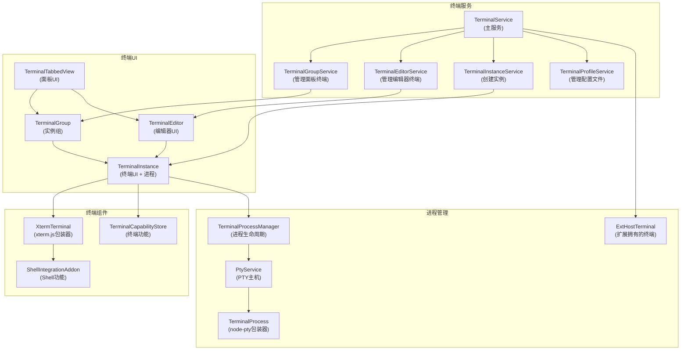
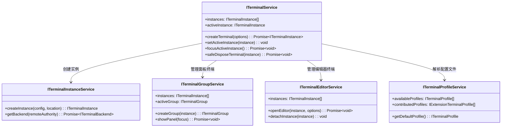
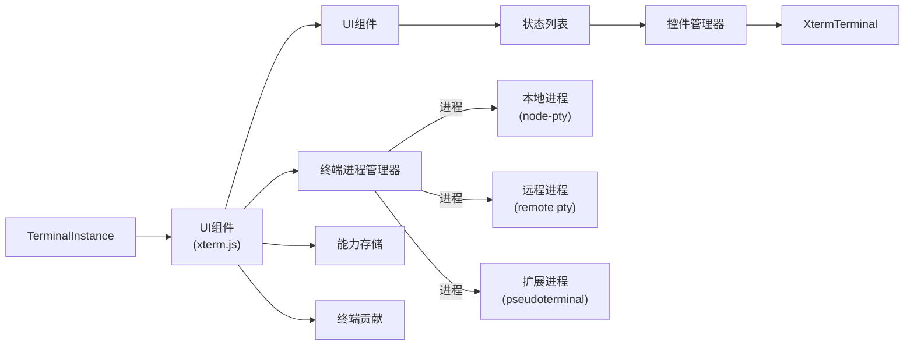
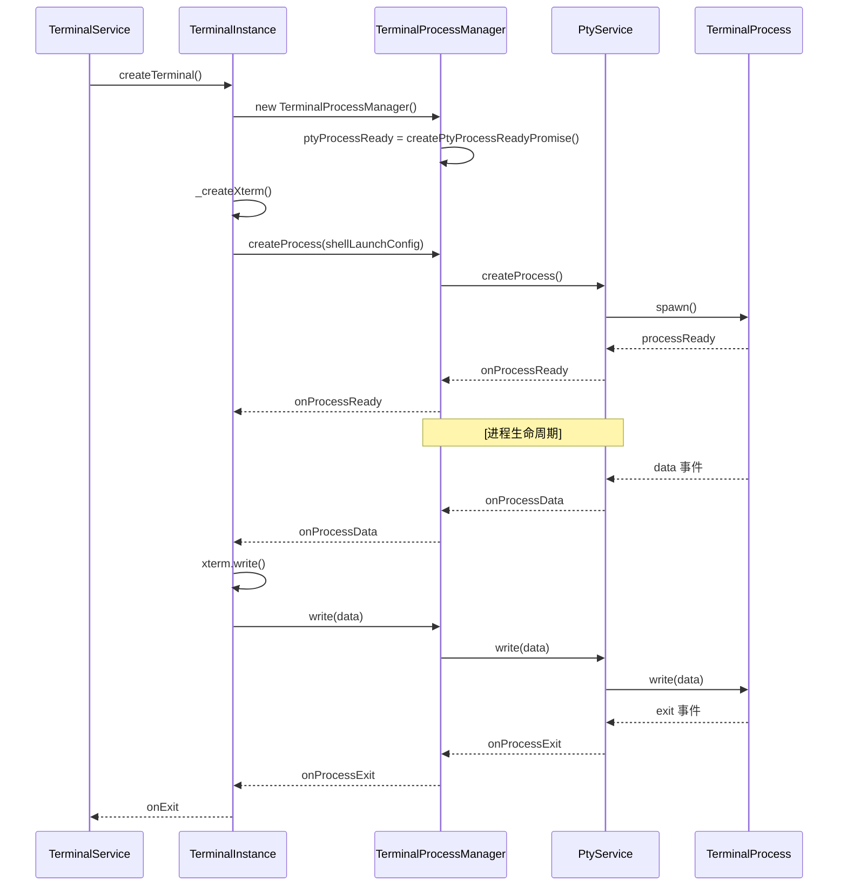
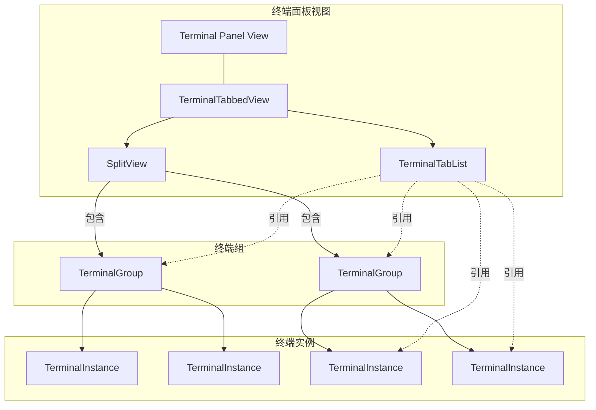
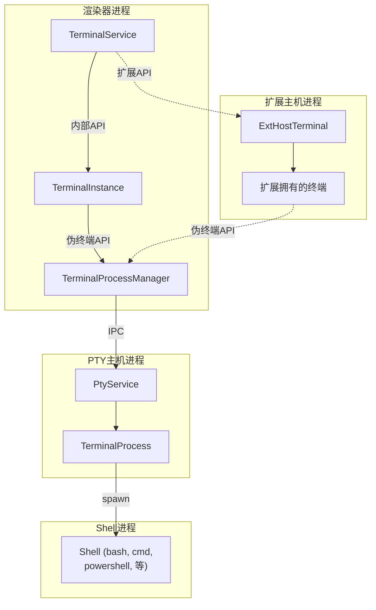
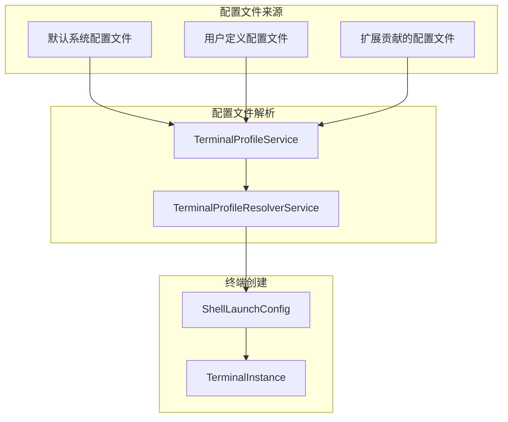
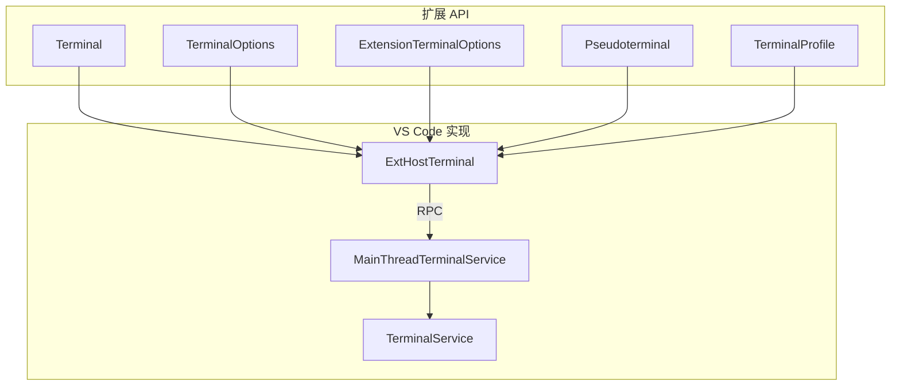

# 集成终端

相关源文件

* [src/vs/platform/terminal/common/terminal.ts](../../src/vs/platform/terminal/common/terminal.ts)
* [src/vs/platform/terminal/common/terminalPlatformConfiguration.ts](../../src/vs/platform/terminal/common/terminalPlatformConfiguration.ts)
* [src/vs/platform/terminal/node/ptyHostService.ts](../../src/vs/platform/terminal/node/ptyHostService.ts)
* [src/vs/platform/terminal/node/ptyService.ts](../../src/vs/platform/terminal/node/ptyService.ts)
* [src/vs/platform/terminal/node/terminalProcess.ts](../../src/vs/platform/terminal/node/terminalProcess.ts)
* [src/vs/platform/terminal/node/terminalProfiles.ts](../../src/vs/platform/terminal/node/terminalProfiles.ts)
* [src/vs/workbench/api/browser/mainThreadTerminalService.ts](../../src/vs/workbench/api/browser/mainThreadTerminalService.ts)
* [src/vs/workbench/api/common/extHostTerminalService.ts](../../src/vs/workbench/api/common/extHostTerminalService.ts)
* [src/vs/workbench/api/node/extHostTerminalService.ts](../../src/vs/workbench/api/node/extHostTerminalService.ts)
* [src/vs/workbench/browser/parts/media/compositepart.css](../../src/vs/workbench/browser/parts/media/compositepart.css)
* [src/vs/workbench/contrib/terminal/browser/media/terminal.css](../../src/vs/workbench/contrib/terminal/browser/media/terminal.css)
* [src/vs/workbench/contrib/terminal/browser/media/xterm.css](../../src/vs/workbench/contrib/terminal/browser/media/xterm.css)
* [src/vs/workbench/contrib/terminal/browser/remotePty.ts](../../src/vs/workbench/contrib/terminal/browser/remotePty.ts)
* [src/vs/workbench/contrib/terminal/browser/terminal.contribution.ts](../../src/vs/workbench/contrib/terminal/browser/terminal.contribution.ts)
* [src/vs/workbench/contrib/terminal/browser/terminal.ts](../../src/vs/workbench/contrib/terminal/browser/terminal.ts)
* [src/vs/workbench/contrib/terminal/browser/terminalActions.ts](../../src/vs/workbench/contrib/terminal/browser/terminalActions.ts)
* [src/vs/workbench/contrib/terminal/browser/terminalEditor.ts](../../src/vs/workbench/contrib/terminal/browser/terminalEditor.ts)
* [src/vs/workbench/contrib/terminal/browser/terminalEditorInput.ts](../../src/vs/workbench/contrib/terminal/browser/terminalEditorInput.ts)
* [src/vs/workbench/contrib/terminal/browser/terminalEditorService.ts](../../src/vs/workbench/contrib/terminal/browser/terminalEditorService.ts)
* [src/vs/workbench/contrib/terminal/browser/terminalGroup.ts](../../src/vs/workbench/contrib/terminal/browser/terminalGroup.ts)
* [src/vs/workbench/contrib/terminal/browser/terminalGroupService.ts](../../src/vs/workbench/contrib/terminal/browser/terminalGroupService.ts)
* [src/vs/workbench/contrib/terminal/browser/terminalIcon.ts](../../src/vs/workbench/contrib/terminal/browser/terminalIcon.ts)
* [src/vs/workbench/contrib/terminal/browser/terminalInstance.ts](../../src/vs/workbench/contrib/terminal/browser/terminalInstance.ts)
* [src/vs/workbench/contrib/terminal/browser/terminalMenus.ts](../../src/vs/workbench/contrib/terminal/browser/terminalMenus.ts)
* [src/vs/workbench/contrib/terminal/browser/terminalProcessExtHostProxy.ts](../../src/vs/workbench/contrib/terminal/browser/terminalProcessExtHostProxy.ts)
* [src/vs/workbench/contrib/terminal/browser/terminalProcessManager.ts](../../src/vs/workbench/contrib/terminal/browser/terminalProcessManager.ts)
* [src/vs/workbench/contrib/terminal/browser/terminalProfileQuickpick.ts](../../src/vs/workbench/contrib/terminal/browser/terminalProfileQuickpick.ts)
* [src/vs/workbench/contrib/terminal/browser/terminalProfileResolverService.ts](../../src/vs/workbench/contrib/terminal/browser/terminalProfileResolverService.ts)
* [src/vs/workbench/contrib/terminal/browser/terminalProfileService.ts](../../src/vs/workbench/contrib/terminal/browser/terminalProfileService.ts)
* [src/vs/workbench/contrib/terminal/browser/terminalService.ts](../../src/vs/workbench/contrib/terminal/browser/terminalService.ts)
* [src/vs/workbench/contrib/terminal/browser/terminalTabbedView.ts](../../src/vs/workbench/contrib/terminal/browser/terminalTabbedView.ts)
* [src/vs/workbench/contrib/terminal/browser/terminalTabsList.ts](../../src/vs/workbench/contrib/terminal/browser/terminalTabsList.ts)
* [src/vs/workbench/contrib/terminal/browser/terminalView.ts](../../src/vs/workbench/contrib/terminal/browser/terminalView.ts)
* [src/vs/workbench/contrib/terminal/browser/xterm/xtermTerminal.ts](../../src/vs/workbench/contrib/terminal/browser/xterm/xtermTerminal.ts)
* [src/vs/workbench/contrib/terminal/common/terminal.ts](../../src/vs/workbench/contrib/terminal/common/terminal.ts)
* [src/vs/workbench/contrib/terminal/common/terminalColorRegistry.ts](../../src/vs/workbench/contrib/terminal/common/terminalColorRegistry.ts)
* [src/vs/workbench/contrib/terminal/common/terminalConfiguration.ts](../../src/vs/workbench/contrib/terminal/common/terminalConfiguration.ts)
* [src/vs/workbench/contrib/terminal/common/terminalStrings.ts](../../src/vs/workbench/contrib/terminal/common/terminalStrings.ts)
* [src/vs/workbench/contrib/terminal/electron-sandbox/localPty.ts](../../src/vs/workbench/contrib/terminal/electron-sandbox/localPty.ts)
* [src/vs/workbench/contrib/terminal/electron-sandbox/terminalProfileResolverService.ts](../../src/vs/workbench/contrib/terminal/electron-sandbox/terminalProfileResolverService.ts)
* [src/vs/workbench/contrib/terminal/test/node/terminalProfiles.test.ts](../../src/vs/workbench/contrib/terminal/test/node/terminalProfiles.test.ts)

VS Code中的集成终端提供了直接在编辑器内部的全功能终端。本文档涵盖了终端系统的架构、组件和功能，包括它如何管理终端实例、进程和UI集成。

## 概述

VS Code终端系统允许用户直接在编辑器界面中运行命令行shell。它支持多个终端实例、拆分视图，并且可以显示在窗口底部的面板中或作为主编辑区域中的编辑器。

终端实现由几个关键组件组成：

* 终端UI组件（实例、组、标签）
* 进程管理（本地和远程）
* Shell集成
* 配置和配置文件
* 扩展API

来源：

* src/vs/workbench/contrib/terminal/browser/terminal.ts36-41
* src/vs/workbench/contrib/terminal/browser/terminalInstance.ts127-132
* src/vs/workbench/contrib/terminal/browser/terminalService.ts62-91

## 架构

来源：

* src/vs/workbench/contrib/terminal/browser/terminal.contribution.ts55-62
* src/vs/workbench/contrib/terminal/browser/terminalService.ts170-192
* src/vs/workbench/contrib/terminal/browser/terminalInstance.ts364-394

## 终端服务

终端系统围绕几个关键服务构建，这些服务管理终端功能的不同方面：

### TerminalService

`TerminalService`是终端操作的主要入口点。它管理面板和编辑器位置中的终端实例，处理终端创建，并维护活动终端状态。

主要职责：

* 创建终端实例
* 管理终端生命周期
* 跟踪活动终端
* 处理终端位置（面板与编辑器）
* 重新连接到持久终端

来源：

* src/vs/workbench/contrib/terminal/browser/terminalService.ts62-91
* src/vs/workbench/contrib/terminal/browser/terminalService.ts243-280
* src/vs/workbench/contrib/terminal/browser/terminal.ts246-358

### TerminalInstanceService

`TerminalInstanceService`负责创建终端实例和管理终端后端。它提供了一层抽象，用于创建终端，而不直接依赖终端服务。

主要职责：

* 创建终端实例
* 管理终端后端（本地和远程）
* 将配置文件配置转换为shell启动配置

来源：

* src/vs/workbench/contrib/terminal/browser/terminal.ts61-98
* src/vs/workbench/contrib/terminal/browser/terminalInstanceService.ts

### TerminalGroupService和TerminalEditorService

这些服务在各自的位置管理终端：

* `TerminalGroupService`：管理面板视图中的终端
* `TerminalEditorService`：管理编辑器区域中的终端

来源：

* src/vs/workbench/contrib/terminal/browser/terminalGroupService.ts1-20
* src/vs/workbench/contrib/terminal/browser/terminalEditorService.ts1-15

## 终端实例

`TerminalInstance`类是表示UI中单个终端的核心组件。它管理UI方面（xterm.js）和进程方面（通过`TerminalProcessManager`）。

主要属性和方法：

* `xterm`：xterm.js实例
* `processManager`：管理终端进程
* `capabilities`：存储终端功能（例如，shell集成功能）
* `shellType`：终端中运行的shell类型
* `statusList`：终端的状态指示器列表
* `onData`、`onExit`等：终端交互事件

来源：

* src/vs/workbench/contrib/terminal/browser/terminalInstance.ts127-132
* src/vs/workbench/contrib/terminal/browser/terminalInstance.ts207-356
* src/vs/workbench/contrib/terminal/browser/terminalInstance.ts364-394

### 终端进程管理

`TerminalProcessManager`处理终端进程的生命周期，包括：

* 创建和管理进程
* 处理进程数据事件
* 管理进程退出
* 跟踪进程功能
* 处理环境变量

来源：

* src/vs/workbench/contrib/terminal/browser/terminalProcessManager.ts70-132
* src/vs/workbench/contrib/terminal/browser/terminalInstance.ts510-547
* src/vs/platform/terminal/node/ptyService.ts71-116

### 终端功能

终端系统使用基于功能的架构来表示可能在终端实例中可用也可能不可用的功能。这些功能存储在`TerminalCapabilityStore`中，包括：

| 功能                                     | 描述                                    |
| ---------------------------------------- | --------------------------------------- |
| TerminalCapability.CwdDetection          | 检测当前工作目录                        |
| TerminalCapability.CommandDetection      | 检测在终端中执行的命令                  |
| TerminalCapability.NaiveCwdDetection     | 当shell集成不可用时的CWD检测回退        |
| TerminalCapability.PartialCommandDetection | 检测正在输入的命令                    |
| TerminalCapability.DirectoryDetection    | 检测终端输出中的目录                    |
| TerminalCapability.BufferMarkDetection   | 检测终端缓冲区中的标记                  |

功能通常通过shell集成添加，shell集成将特殊序列注入终端，这些序列可以被VS Code检测和解释。

来源：

* src/vs/workbench/contrib/terminal/browser/terminalInstance.ts206
* src/vs/workbench/contrib/terminal/browser/terminalInstance.ts456-490
* src/vs/platform/terminal/common/capabilities/capabilities.js

## 终端UI组件

### XtermTerminal

`XtermTerminal`类包装了xterm.js库，并提供VS Code特定的附加功能。它处理：

* 终端渲染
* 输入处理
* 终端插件（搜索、webgl等）
* 主题集成
* 辅助功能

来源：

* src/vs/workbench/contrib/terminal/browser/xterm/xtermTerminal.ts53-69
* src/vs/workbench/contrib/terminal/browser/xterm/xtermTerminal.ts70-358

### 终端组和标签

面板视图中的终端组织为组，并带有标签显示：

`TerminalTabbedView`管理终端面板的整体布局，包括：

* 侧面的标签列表
* 主区域中的终端组
* 拆分视图管理
* 标签操作（新建、拆分、终止）

来源：

* src/vs/workbench/contrib/terminal/browser/terminalTabbedView.ts37-66
* src/vs/workbench/contrib/terminal/browser/terminalTabsList.ts1-34
* src/vs/workbench/contrib/terminal/browser/terminalGroup.ts1-9

### 终端视图

`TerminalViewPane`是面板视图中终端的主容器。它：

* 创建和管理`TerminalTabbedView`
* 处理终端创建和焦点
* 管理终端操作和菜单
* 处理终端欢迎屏幕

来源：

* src/vs/workbench/contrib/terminal/browser/terminalView.ts55-93
* src/vs/workbench/contrib/terminal/browser/terminalView.ts94-114

### 终端编辑器

`TerminalEditor`允许终端显示在主编辑区域而不是面板中。它：

* 集成编辑器框架
* 管理编辑器中终端实例的生命周期
* 处理编辑器特定的操作和上下文

来源：

* src/vs/workbench/contrib/terminal/browser/terminalEditor.ts1-13
* src/vs/workbench/contrib/terminal/browser/terminalEditorInput.ts1-4

## 终端进程架构

终端进程架构跨越多个进程以确保安全性和稳定性：

### 本地与远程终端

VS Code支持本地和远程终端：

* **本地终端**：在与VS Code相同的机器上运行
* **远程终端**：在远程机器上运行（通过SSH、WSL、开发容器）

对于远程终端，PTY主机进程在远程机器上运行，而UI仍然在本地VS Code窗口中。

来源：

* src/vs/workbench/contrib/terminal/browser/terminalService.ts282-339
* src/vs/workbench/contrib/terminal/browser/remotePty.ts1-7
* src/vs/workbench/contrib/terminal/electron-sandbox/localPty.ts1-6

### Shell集成

Shell集成通过将特殊序列注入Shell初始化脚本来增强终端功能。这启用了如下功能：

* 命令检测
* 当前工作目录跟踪
* 命令导航
* 增强提示符

Shell集成通过以下方式实现：

1. 注入特定于shell的初始化脚本
2. 检测和解释终端输出中的特殊序列
3. 根据检测到的功能向终端实例添加功能

来源：

* src/vs/workbench/contrib/terminal/browser/terminalInstance.ts519-538
* src/vs/platform/terminal/common/xterm/shellIntegrationAddon.js

## 终端配置

终端系统可通过用户设置高度配置。关键配置区域包括：

### 终端配置文件

终端配置文件定义了用户可用的shell和配置。配置文件可以是：

* 默认系统配置文件（自动检测）
* 用户定义的配置文件（在设置中配置）
* 扩展贡献的配置文件

来源：

* src/vs/workbench/contrib/terminal/browser/terminalProfileService.ts1
* src/vs/workbench/contrib/terminal/browser/terminalProfileResolverService.ts1-10
* src/vs/platform/terminal/node/terminalProfiles.ts1-12

### 终端设置

终端有众多配置选项，包括：

| 设置类别  | 示例                                         |
| --------- | -------------------------------------------- |
| 外观      | 字体系列、字体大小、行高、光标样式           |
| 行为      | Shell集成、滚动回溯、环境变量                |
| 键绑定    | 自定义键绑定、发送序列                       |
| 位置      | 默认位置（面板或编辑器）                     |
| Shell     | 默认shell、shell参数、配置文件               |

来源：

* src/vs/workbench/contrib/terminal/common/terminalConfiguration.ts43-48
* src/vs/platform/terminal/common/terminal.ts30-133
* src/vs/platform/terminal/common/terminalPlatformConfiguration.ts1-4

## 扩展API

VS Code提供了丰富的API，供扩展与终端交互：

主要API功能：

* 创建和管理终端
* 向终端发送文本
* 处理终端事件（创建、数据、退出）
* 创建自定义终端配置文件
* 实现自定义终端后端（伪终端）

来源：

* src/vs/workbench/api/common/extHostTerminalService.ts31-59
* src/vs/workbench/api/node/extHostTerminalService.ts12-31
* src/vs/workbench/api/browser/mainThreadTerminalService.ts1-17

## 终端操作和命令

终端提供了众多用于用户交互的操作和命令：

| 类别      | 示例                                      |
| --------- | ----------------------------------------- |
| 创建      | 新终端、拆分终端、使用配置文件创建        |
| 导航      | 聚焦下一个/上一个终端、聚焦终端标签       |
| 编辑      | 复制、粘贴、清除、全选                    |
| 视图      | 移动到编辑器、移动到面板、调整大小        |
| 进程      | 终止终端、运行选定文本、运行活动文件      |

这些操作通过命令系统注册和管理，可通过以下方式访问：

* 命令面板
* 上下文菜单
* 键绑定
* 终端下拉菜单

来源：

* src/vs/workbench/contrib/terminal/browser/terminalActions.ts161-286
* src/vs/workbench/contrib/terminal/browser/terminalActions.ts310-363
* src/vs/workbench/contrib/terminal/common/terminal.ts399-486

## 结论

VS Code中的集成终端是一个复杂的系统，跨越多个进程和组件。它直接在编辑器中提供丰富的终端体验，具有shell集成、多终端和可自定义配置文件等功能。该架构设计为可扩展的，允许内置功能和扩展贡献的功能。
