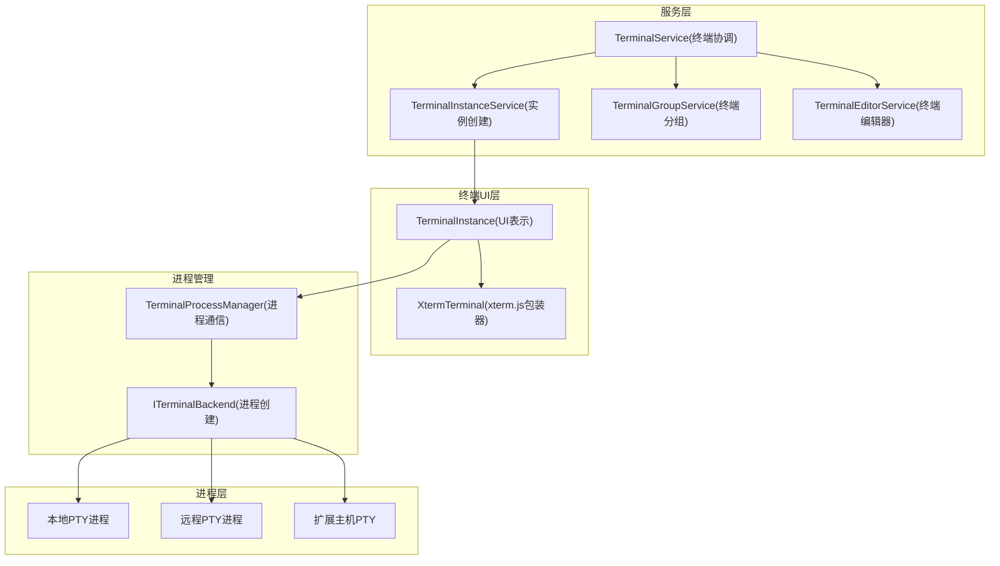
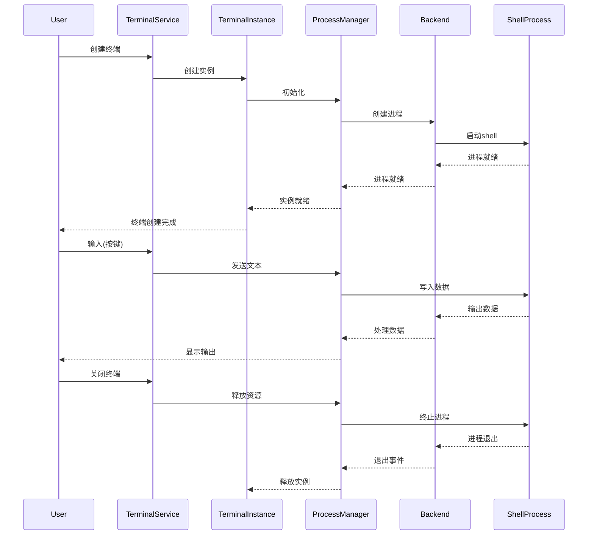
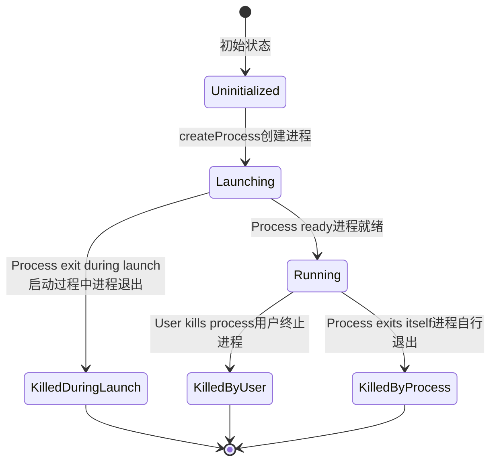
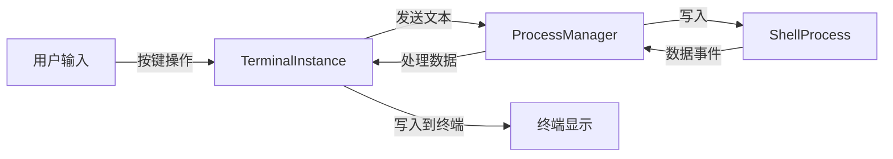
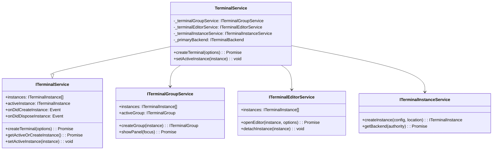
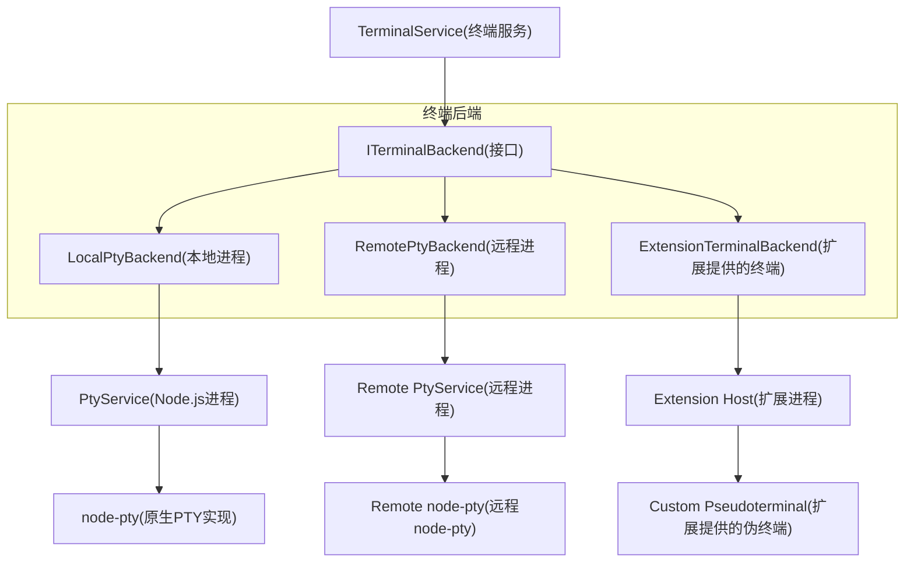
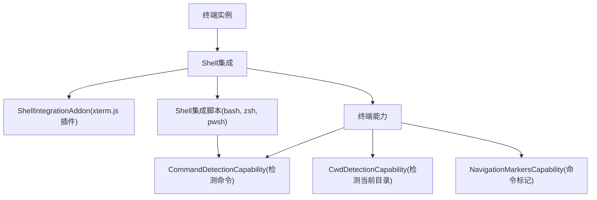
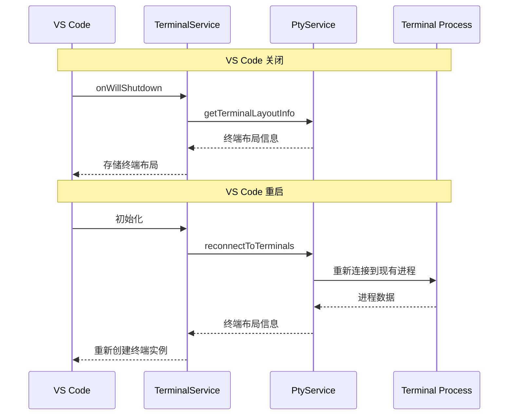
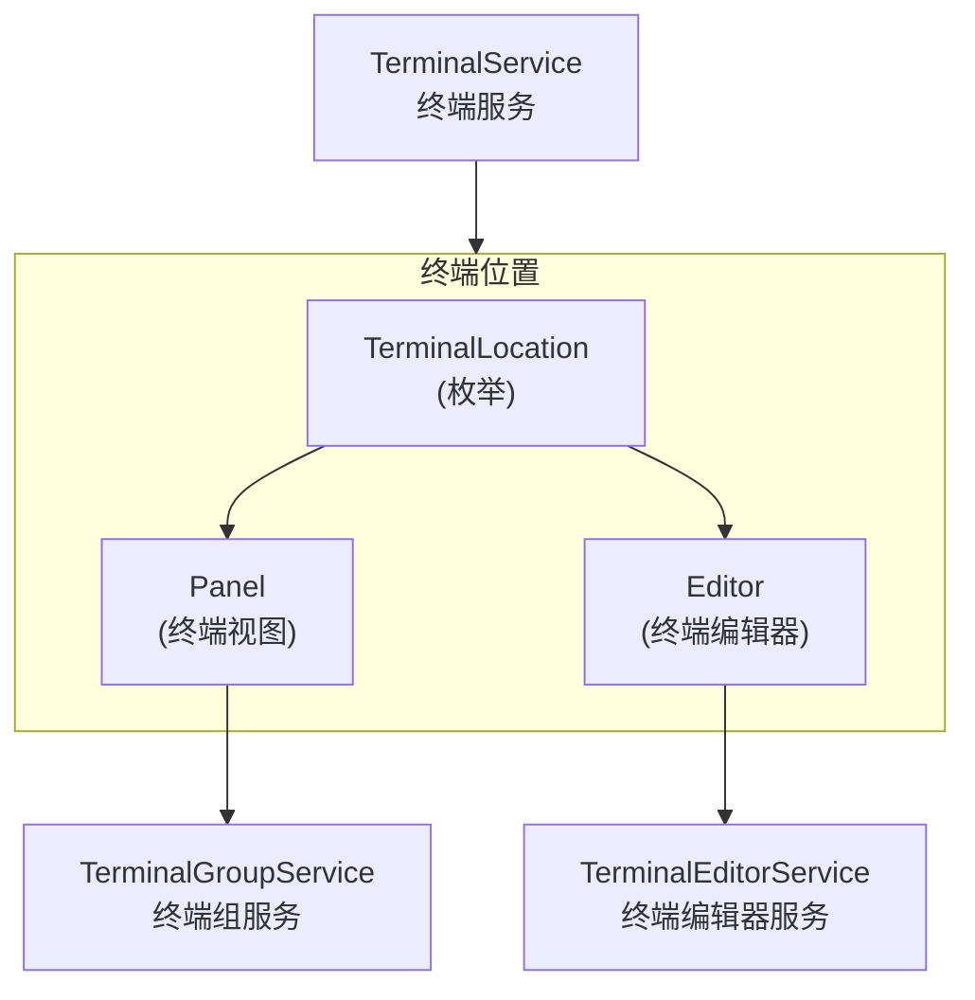
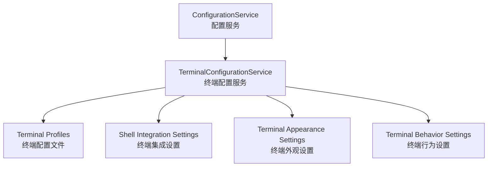

# 终端实例和进程管理

相关源文件

* [src/vs/platform/terminal/common/terminal.ts](../../src/vs/platform/terminal/common/terminal.ts)
* [src/vs/platform/terminal/common/terminalPlatformConfiguration.ts](../../src/vs/platform/terminal/common/terminalPlatformConfiguration.ts)
* [src/vs/platform/terminal/node/ptyHostService.ts](../../src/vs/platform/terminal/node/ptyHostService.ts)
* [src/vs/platform/terminal/node/ptyService.ts](../../src/vs/platform/terminal/node/ptyService.ts)
* [src/vs/platform/terminal/node/terminalProcess.ts](../../src/vs/platform/terminal/node/terminalProcess.ts)
* [src/vs/platform/terminal/node/terminalProfiles.ts](../../src/vs/platform/terminal/node/terminalProfiles.ts)
* [src/vs/workbench/api/browser/mainThreadTerminalService.ts](../../src/vs/workbench/api/browser/mainThreadTerminalService.ts)
* [src/vs/workbench/api/common/extHostTerminalService.ts](../../src/vs/workbench/api/common/extHostTerminalService.ts)
* [src/vs/workbench/api/node/extHostTerminalService.ts](../../src/vs/workbench/api/node/extHostTerminalService.ts)
* [src/vs/workbench/browser/parts/media/compositepart.css](../../src/vs/workbench/browser/parts/media/compositepart.css)
* [src/vs/workbench/contrib/terminal/browser/media/terminal.css](../../src/vs/workbench/contrib/terminal/browser/media/terminal.css)
* [src/vs/workbench/contrib/terminal/browser/media/xterm.css](../../src/vs/workbench/contrib/terminal/browser/media/xterm.css)
* [src/vs/workbench/contrib/terminal/browser/remotePty.ts](../../src/vs/workbench/contrib/terminal/browser/remotePty.ts)
* [src/vs/workbench/contrib/terminal/browser/terminal.contribution.ts](../../src/vs/workbench/contrib/terminal/browser/terminal.contribution.ts)
* [src/vs/workbench/contrib/terminal/browser/terminal.ts](../../src/vs/workbench/contrib/terminal/browser/terminal.ts)
* [src/vs/workbench/contrib/terminal/browser/terminalActions.ts](../../src/vs/workbench/contrib/terminal/browser/terminalActions.ts)
* [src/vs/workbench/contrib/terminal/browser/terminalEditor.ts](../../src/vs/workbench/contrib/terminal/browser/terminalEditor.ts)
* [src/vs/workbench/contrib/terminal/browser/terminalEditorInput.ts](../../src/vs/workbench/contrib/terminal/browser/terminalEditorInput.ts)
* [src/vs/workbench/contrib/terminal/browser/terminalEditorService.ts](../../src/vs/workbench/contrib/terminal/browser/terminalEditorService.ts)
* [src/vs/workbench/contrib/terminal/browser/terminalGroup.ts](../../src/vs/workbench/contrib/terminal/browser/terminalGroup.ts)
* [src/vs/workbench/contrib/terminal/browser/terminalGroupService.ts](../../src/vs/workbench/contrib/terminal/browser/terminalGroupService.ts)
* [src/vs/workbench/contrib/terminal/browser/terminalIcon.ts](../../src/vs/workbench/contrib/terminal/browser/terminalIcon.ts)
* [src/vs/workbench/contrib/terminal/browser/terminalInstance.ts](../../src/vs/workbench/contrib/terminal/browser/terminalInstance.ts)
* [src/vs/workbench/contrib/terminal/browser/terminalMenus.ts](../../src/vs/workbench/contrib/terminal/browser/terminalMenus.ts)
* [src/vs/workbench/contrib/terminal/browser/terminalProcessExtHostProxy.ts](../../src/vs/workbench/contrib/terminal/browser/terminalProcessExtHostProxy.ts)
* [src/vs/workbench/contrib/terminal/browser/terminalProcessManager.ts](../../src/vs/workbench/contrib/terminal/browser/terminalProcessManager.ts)
* [src/vs/workbench/contrib/terminal/browser/terminalProfileQuickpick.ts](../../src/vs/workbench/contrib/terminal/browser/terminalProfileQuickpick.ts)
* [src/vs/workbench/contrib/terminal/browser/terminalProfileResolverService.ts](../../src/vs/workbench/contrib/terminal/browser/terminalProfileResolverService.ts)
* [src/vs/workbench/contrib/terminal/browser/terminalProfileService.ts](../../src/vs/workbench/contrib/terminal/browser/terminalProfileService.ts)
* [src/vs/workbench/contrib/terminal/browser/terminalService.ts](../../src/vs/workbench/contrib/terminal/browser/terminalService.ts)
* [src/vs/workbench/contrib/terminal/browser/terminalTabbedView.ts](../../src/vs/workbench/contrib/terminal/browser/terminalTabbedView.ts)
* [src/vs/workbench/contrib/terminal/browser/terminalTabsList.ts](../../src/vs/workbench/contrib/terminal/browser/terminalTabsList.ts)
* [src/vs/workbench/contrib/terminal/browser/terminalView.ts](../../src/vs/workbench/contrib/terminal/browser/terminalView.ts)
* [src/vs/workbench/contrib/terminal/browser/xterm/xtermTerminal.ts](../../src/vs/workbench/contrib/terminal/browser/xterm/xtermTerminal.ts)
* [src/vs/workbench/contrib/terminal/common/terminal.ts](../../src/vs/workbench/contrib/terminal/common/terminal.ts)
* [src/vs/workbench/contrib/terminal/common/terminalColorRegistry.ts](../../src/vs/workbench/contrib/terminal/common/terminalColorRegistry.ts)
* [src/vs/workbench/contrib/terminal/common/terminalConfiguration.ts](../../src/vs/workbench/contrib/terminal/common/terminalConfiguration.ts)
* [src/vs/workbench/contrib/terminal/common/terminalStrings.ts](../../src/vs/workbench/contrib/terminal/common/terminalStrings.ts)
* [src/vs/workbench/contrib/terminal/electron-sandbox/localPty.ts](../../src/vs/workbench/contrib/terminal/electron-sandbox/localPty.ts)
* [src/vs/workbench/contrib/terminal/electron-sandbox/terminalProfileResolverService.ts](../../src/vs/workbench/contrib/terminal/electron-sandbox/terminalProfileResolverService.ts)
* [src/vs/workbench/contrib/terminal/test/node/terminalProfiles.test.ts](../../src/vs/workbench/contrib/terminal/test/node/terminalProfiles.test.ts)

本文档解释了VS Code如何管理终端实例和进程，重点关注终端实例的生命周期、它们与shell进程的通信，以及支持在不同环境中实现终端功能的架构。

有关终端UI组件和渲染的信息，请参阅《终端UI和集成》。

## 概述

VS Code终端系统在编辑器内提供集成终端体验。它管理终端实例，处理进程创建和通信，并提供丰富的功能集用于与终端进程交互。

终端架构由几个关键组件组成：

1. **终端实例（Terminal Instance）**：在UI中表示一个终端，管理终端的生命周期，处理用户交互
2. **进程管理器（Process Manager）**：管理与底层shell进程的通信
3. **终端服务（Terminal Service）**：协调终端实例并提供终端操作的API
4. **终端后端（Terminal Backend）**：处理实际的进程创建和通信，根据环境（本地、远程）而变化

资源：

* src/vs/workbench/contrib/terminal/browser/terminalInstance.ts127-649
* src/vs/workbench/contrib/terminal/browser/terminalProcessManager.ts70-175
* src/vs/workbench/contrib/terminal/browser/terminalService.ts62-193

## 终端架构

资源：

* src/vs/workbench/contrib/terminal/browser/terminalInstance.ts127-649
* src/vs/workbench/contrib/terminal/browser/terminalProcessManager.ts70-175
* src/vs/workbench/contrib/terminal/browser/terminalService.ts62-193
* src/vs/workbench/contrib/terminal/browser/terminal.ts36-41

## 终端实例生命周期

资源：

* src/vs/workbench/contrib/terminal/browser/terminalInstance.ts364-648
* src/vs/workbench/contrib/terminal/browser/terminalProcessManager.ts134-175
* src/vs/workbench/contrib/terminal/browser/terminalService.ts243-280

## 终端实例

`TerminalInstance`类是表示VS Code中终端的中心组件。它管理终端的生命周期，处理用户交互，并与进程管理器协调以与shell进程通信。

### 关键属性

| 属性               | 类型                     | 描述                                  |
| ------------------ | ------------------------ | ------------------------------------- |
| \_id               | number                   | 终端实例的唯一标识符                  |
| \_processManager   | ITerminalProcessManager  | 管理与shell进程的通信                 |
| xterm              | XtermTerminal            | 用于渲染终端的xterm.js实例            |
| \_shellLaunchConfig| IShellLaunchConfig       | 启动shell的配置                       |
| \_cols / \_rows    | number                   | 终端尺寸                              |
| capabilities       | TerminalCapabilityStore  | 终端功能存储（如shell集成）           |

### 关键方法

| 方法         | 描述                                  |
| ------------ | ------------------------------------- |
| create       | 创建终端实例并初始化进程              |
| createProcess| 使用进程管理器创建shell进程           |
| setVisible   | 设置终端的可见性                      |
| sendText     | 向终端进程发送文本                    |
| dispose      | 销毁终端实例并终止进程                |

资源：

* src/vs/workbench/contrib/terminal/browser/terminalInstance.ts127-649

## 进程管理

`TerminalProcessManager`类负责管理与shell进程的通信。它处理进程创建、数据传输和进程终止。

### 进程状态

终端进程可以处于以下状态之一：

资源：

* src/vs/workbench/contrib/terminal/common/terminal.ts313-330

### 进程创建

进程创建流程涉及几个步骤：

1. `TerminalInstance`在`TerminalProcessManager`上调用`createProcess`
2. `TerminalProcessManager`解析shell环境和配置
3. `TerminalProcessManager`请求后端创建进程
4. 后端创建进程并返回进程对象
5. `TerminalProcessManager`设置进程数据和退出事件的事件监听器

资源：

* src/vs/workbench/contrib/terminal/browser/terminalProcessManager.ts296-395

### 数据流

资源：

* src/vs/workbench/contrib/terminal/browser/terminalInstance.ts1000-1050
* src/vs/workbench/contrib/terminal/browser/terminalProcessManager.ts296-395

## 终端服务架构

终端服务架构由几个协同工作的服务组成，提供终端功能：

资源：

* src/vs/workbench/contrib/terminal/browser/terminal.ts246-358
* src/vs/workbench/contrib/terminal/browser/terminalService.ts62-193

### 终端服务

`TerminalService`是终端操作的主要入口点。它协调不同的终端相关服务，并提供创建和管理终端实例的API。

主要职责：

* 创建终端实例
* 管理活跃的终端实例
* 处理终端实例事件
* 协调终端组和编辑器之间的交互

资源：

* src/vs/workbench/contrib/terminal/browser/terminalService.ts62-193

### 终端实例服务

`TerminalInstanceService`负责创建终端实例和管理终端后端。

主要职责：

* 创建终端实例
* 提供对终端后端的访问
* 将shell启动配置转换为终端实例

资源：

* src/vs/workbench/contrib/terminal/browser/terminal.ts61-98

### 终端组服务

`TerminalGroupService`管理终端面板视图中的终端组。

主要职责：

* 管理终端组
* 处理终端面板可见性
* 提供对面板中终端实例的访问

资源：

* src/vs/workbench/contrib/terminal/browser/terminalGroupService.ts1-70

### 终端编辑器服务

`TerminalEditorService`管理编辑器标签中的终端实例。

主要职责：

* 在编辑器标签中打开终端
* 管理终端编辑器输入
* 提供对编辑器中终端实例的访问

资源：

* src/vs/workbench/contrib/terminal/browser/terminalEditorService.ts1-70

## 终端后端

终端后端负责创建和与终端进程通信。VS Code根据环境支持不同的后端：

资源：

* src/vs/platform/terminal/node/ptyService.ts71-116
* src/vs/workbench/contrib/terminal/browser/remotePty.ts1-20
* src/vs/workbench/api/common/extHostTerminalService.ts31-60

### 本地PTY后端

本地PTY后端在本地机器上创建和管理终端进程。它使用`node-pty`库创建伪终端进程。

关键组件：

* `PtyService`：管理PTY进程
* `TerminalProcess`：表示终端进程
* `node-pty`：伪终端的原生实现

资源：

* src/vs/platform/terminal/node/ptyService.ts71-116
* src/vs/platform/terminal/node/terminalProcess.ts70-100

### 远程PTY后端

远程PTY后端在远程机器上创建和管理终端进程。它通过远程连接与远程PTY服务通信。

关键组件：

* `RemotePtyBackend`：管理远程PTY进程
* `RemotePtyService`：用于创建和管理PTY进程的远程服务

资源：

* src/vs/workbench/contrib/terminal/browser/remotePty.ts1-20

### 扩展终端后端

扩展终端后端允许扩展提供自定义终端实现。它与扩展主机通信，创建和管理扩展提供的终端。

关键组件：

* `ExtHostTerminalService`：管理扩展提供的终端
* `TerminalProcessExtHostProxy`：代理工作台和扩展主机之间的通信

资源：

* src/vs/workbench/api/common/extHostTerminalService.ts31-60
* src/vs/workbench/contrib/terminal/browser/terminalProcessExtHostProxy.ts1-20

## Shell集成

VS Code提供shell集成功能，增强终端体验。Shell集成通过shell脚本和终端功能的组合实现。

资源：

* src/vs/workbench/contrib/terminal/browser/terminalInstance.ts456-490
* src/vs/platform/terminal/common/capabilities/capabilities.ts1-50

### Shell集成过程

1. 当创建终端时，VS Code将shell集成脚本注入到shell的启动序列中
2. shell集成脚本发出特殊的转义序列来发信号通知事件，如命令执行、当前目录更改等
3. 终端实例中的`ShellIntegrationAddon`解析这些转义序列并更新终端功能
4. 终端功能提供API用于命令检测、当前目录跟踪和命令导航等功能

资源：

* src/vs/workbench/contrib/terminal/browser/terminalInstance.ts456-490

### 终端功能

终端功能提供访问shell集成功能的API：

| 功能                      | 描述                              |
| ------------------------- | --------------------------------- |
| CommandDetectionCapability | 检测命令执行和输出                |
| CwdDetectionCapability    | 跟踪当前工作目录                  |
| NavigationMarkersCapability | 提供在命令之间导航的标记         |

资源：

* src/vs/platform/terminal/common/capabilities/capabilities.ts1-50

## 终端持久化

VS Code支持终端持久化，允许在VS Code重启后恢复终端会话。

资源：

* src/vs/workbench/contrib/terminal/browser/terminalService.ts234-242
* src/vs/workbench/contrib/terminal/browser/terminalService.ts442-483

### 持久化过程

1. 当VS Code关闭时，终端服务存储终端布局信息
2. 终端布局包括有关终端组、实例及其关联进程的信息
3. 当VS Code重启时，终端服务重新连接到现有终端进程
4. 终端服务根据存储的布局信息重新创建终端实例

资源：

* src/vs/workbench/contrib/terminal/browser/terminalService.ts234-242
* src/vs/workbench/contrib/terminal/browser/terminalService.ts442-483

## 终端位置

VS Code支持不同的终端位置：

资源：

* src/vs/platform/terminal/common/terminal.ts207-216
* src/vs/workbench/contrib/terminal/browser/terminal.ts246-358

### 面板终端

面板终端显示在终端面板视图中。它们由`TerminalGroupService`管理，可以组织成组和分割窗格。

资源：

* src/vs/workbench/contrib/terminal/browser/terminalGroupService.ts1-70
* src/vs/workbench/contrib/terminal/browser/terminalView.ts55-115

### 编辑器终端

编辑器终端显示在编辑器标签中。它们由`TerminalEditorService`管理，行为类似于常规编辑器标签。

资源：

* src/vs/workbench/contrib/terminal/browser/terminalEditorService.ts1-70
* src/vs/workbench/contrib/terminal/browser/terminalEditor.ts1-70

## 终端配置

VS Code提供了丰富的终端配置选项。这些配置由`TerminalConfigurationService`管理。

资源：

* src/vs/workbench/contrib/terminal/common/terminalConfiguration.ts43-251
* src/vs/platform/terminal/common/terminalPlatformConfiguration.ts1-50

### 终端配置文件

终端配置文件定义用于创建终端的shell和配置。配置文件可以在设置中定义或自动检测。

资源：

* src/vs/platform/terminal/node/terminalProfiles.ts1-50
* src/vs/workbench/contrib/terminal/browser/terminalProfileService.ts1-50

### 配置文件解析

在创建终端时，VS Code基于以下流程解析终端配置文件：

1. 如果请求了特定配置文件，使用该配置文件
2. 如果未指定配置文件，使用当前平台的默认配置文件
3. 如果未配置默认配置文件，检测平台的默认shell

资源：

* src/vs/workbench/contrib/terminal/browser/terminalProfileResolverService.ts1-50

## 结论

VS Code中的终端实例和进程管理系统为集成终端体验提供了强大的基础。它管理终端实例的生命周期，管理与shell进程的通信，并提供丰富的功能集用于与终端交互。

关键组件包括：

* `TerminalInstance`：在UI中表示终端
* `TerminalProcessManager`：管理与shell进程的通信
* `TerminalService`：协调终端实例并提供终端操作的API
* 终端后端：在不同环境中处理进程创建和通信

这种架构使VS Code能够在不同平台和环境中提供无缝的终端体验，支持shell集成、终端持久化和多个终端位置等功能。
