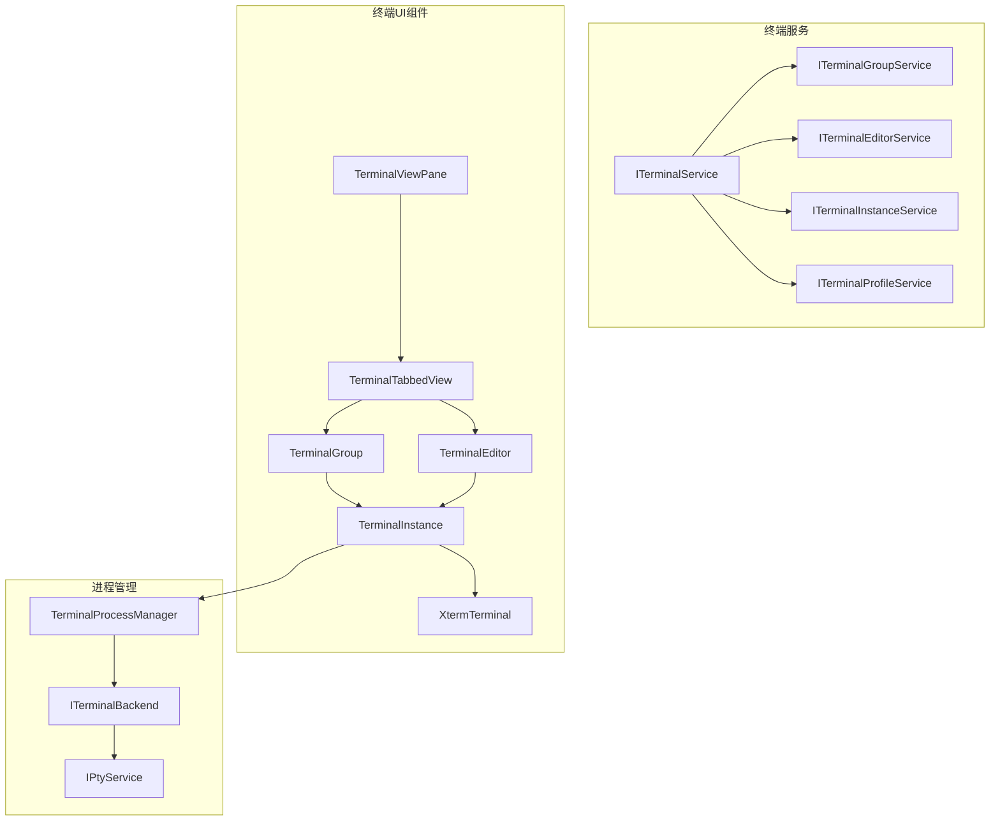
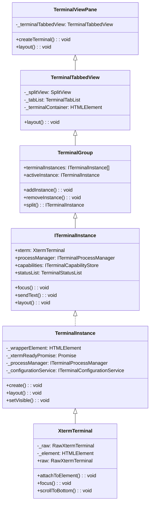
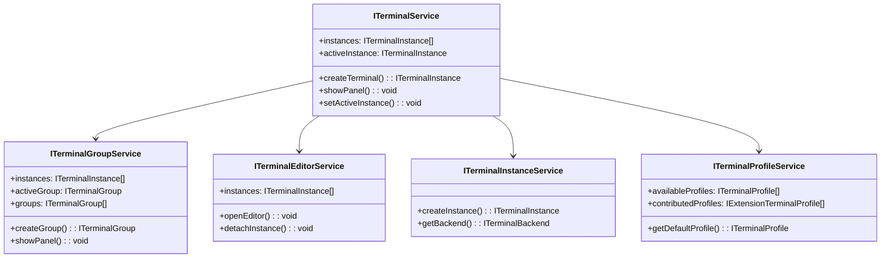
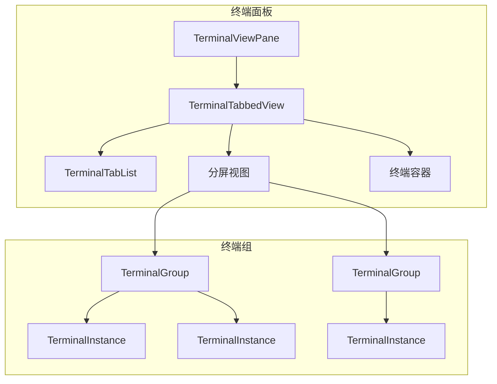
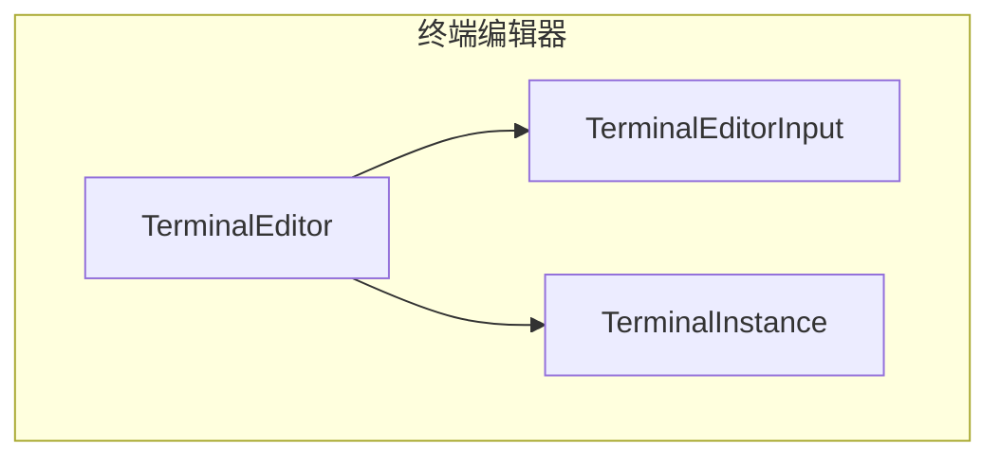
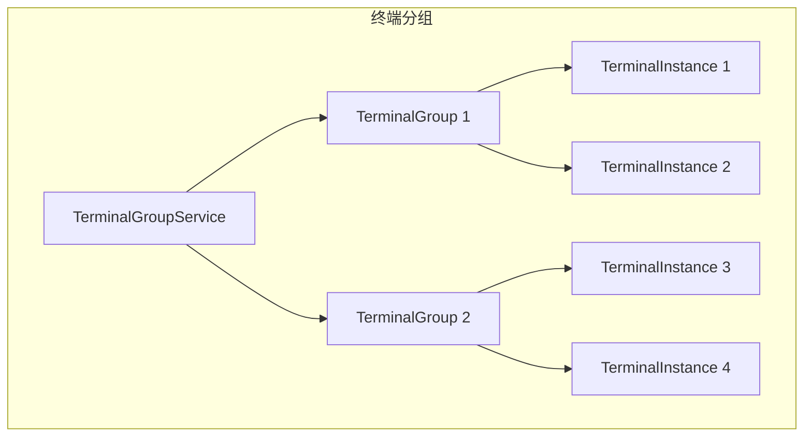
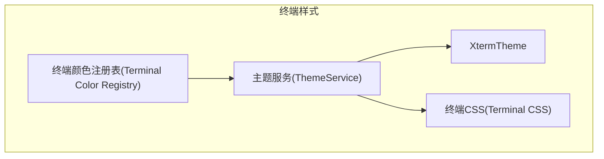
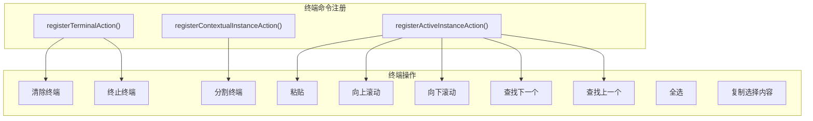
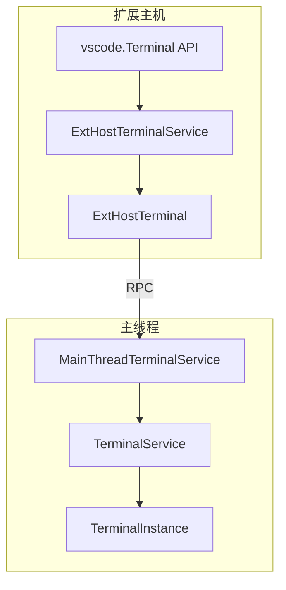

# 终端UI与集成

相关源文件

* [src/vs/platform/terminal/common/terminal.ts](../../src/vs/platform/terminal/common/terminal.ts)
* [src/vs/platform/terminal/common/terminalPlatformConfiguration.ts](../../src/vs/platform/terminal/common/terminalPlatformConfiguration.ts)
* [src/vs/platform/terminal/node/ptyHostService.ts](../../src/vs/platform/terminal/node/ptyHostService.ts)
* [src/vs/platform/terminal/node/ptyService.ts](../../src/vs/platform/terminal/node/ptyService.ts)
* [src/vs/platform/terminal/node/terminalProcess.ts](../../src/vs/platform/terminal/node/terminalProcess.ts)
* [src/vs/platform/terminal/node/terminalProfiles.ts](../../src/vs/platform/terminal/node/terminalProfiles.ts)
* [src/vs/workbench/api/browser/mainThreadTerminalService.ts](../../src/vs/workbench/api/browser/mainThreadTerminalService.ts)
* [src/vs/workbench/api/common/extHostTerminalService.ts](../../src/vs/workbench/api/common/extHostTerminalService.ts)
* [src/vs/workbench/api/node/extHostTerminalService.ts](../../src/vs/workbench/api/node/extHostTerminalService.ts)
* [src/vs/workbench/browser/parts/media/compositepart.css](../../src/vs/workbench/browser/parts/media/compositepart.css)
* [src/vs/workbench/contrib/terminal/browser/media/terminal.css](../../src/vs/workbench/contrib/terminal/browser/media/terminal.css)
* [src/vs/workbench/contrib/terminal/browser/media/xterm.css](../../src/vs/workbench/contrib/terminal/browser/media/xterm.css)
* [src/vs/workbench/contrib/terminal/browser/remotePty.ts](../../src/vs/workbench/contrib/terminal/browser/remotePty.ts)
* [src/vs/workbench/contrib/terminal/browser/terminal.contribution.ts](../../src/vs/workbench/contrib/terminal/browser/terminal.contribution.ts)
* [src/vs/workbench/contrib/terminal/browser/terminal.ts](../../src/vs/workbench/contrib/terminal/browser/terminal.ts)
* src/vs/workbench/contrib/terminal/browser/terminalActions.ts
* [src/vs/workbench/contrib/terminal/browser/terminalEditor.ts](../../src/vs/workbench/contrib/terminal/browser/terminalEditor.ts)
* [src/vs/workbench/contrib/terminal/browser/terminalEditorInput.ts](../../src/vs/workbench/contrib/terminal/browser/terminalEditorInput.ts)
* [src/vs/workbench/contrib/terminal/browser/terminalEditorService.ts](../../src/vs/workbench/contrib/terminal/browser/terminalEditorService.ts)
* [src/vs/workbench/contrib/terminal/browser/terminalGroup.ts](../../src/vs/workbench/contrib/terminal/browser/terminalGroup.ts)
* [src/vs/workbench/contrib/terminal/browser/terminalGroupService.ts](../../src/vs/workbench/contrib/terminal/browser/terminalGroupService.ts)
* [src/vs/workbench/contrib/terminal/browser/terminalIcon.ts](../../src/vs/workbench/contrib/terminal/browser/terminalIcon.ts)
* [src/vs/workbench/contrib/terminal/browser/terminalInstance.ts](../../src/vs/workbench/contrib/terminal/browser/terminalInstance.ts)
* [src/vs/workbench/contrib/terminal/browser/terminalMenus.ts](../../src/vs/workbench/contrib/terminal/browser/terminalMenus.ts)
* [src/vs/workbench/contrib/terminal/browser/terminalProcessExtHostProxy.ts](../../src/vs/workbench/contrib/terminal/browser/terminalProcessExtHostProxy.ts)
* [src/vs/workbench/contrib/terminal/browser/terminalProcessManager.ts](../../src/vs/workbench/contrib/terminal/browser/terminalProcessManager.ts)
* [src/vs/workbench/contrib/terminal/browser/terminalProfileQuickpick.ts](../../src/vs/workbench/contrib/terminal/browser/terminalProfileQuickpick.ts)
* [src/vs/workbench/contrib/terminal/browser/terminalProfileResolverService.ts](../../src/vs/workbench/contrib/terminal/browser/terminalProfileResolverService.ts)
* [src/vs/workbench/contrib/terminal/browser/terminalProfileService.ts](../../src/vs/workbench/contrib/terminal/browser/terminalProfileService.ts)
* [src/vs/workbench/contrib/terminal/browser/terminalService.ts](../../src/vs/workbench/contrib/terminal/browser/terminalService.ts)
* [src/vs/workbench/contrib/terminal/browser/terminalTabbedView.ts](../../src/vs/workbench/contrib/terminal/browser/terminalTabbedView.ts)
* [src/vs/workbench/contrib/terminal/browser/terminalTabsList.ts](../../src/vs/workbench/contrib/terminal/browser/terminalTabsList.ts)
* [src/vs/workbench/contrib/terminal/browser/terminalView.ts](../../src/vs/workbench/contrib/terminal/browser/terminalView.ts)
* [src/vs/workbench/contrib/terminal/browser/xterm/xtermTerminal.ts](../../src/vs/workbench/contrib/terminal/browser/xterm/xtermTerminal.ts)
* [src/vs/workbench/contrib/terminal/common/terminal.ts](../../src/vs/workbench/contrib/terminal/common/terminal.ts)
* [src/vs/workbench/contrib/terminal/common/terminalColorRegistry.ts](../../src/vs/workbench/contrib/terminal/common/terminalColorRegistry.ts)
* [src/vs/workbench/contrib/terminal/common/terminalConfiguration.ts](../../src/vs/workbench/contrib/terminal/common/terminalConfiguration.ts)
* [src/vs/workbench/contrib/terminal/common/terminalStrings.ts](../../src/vs/workbench/contrib/terminal/common/terminalStrings.ts)
* [src/vs/workbench/contrib/terminal/electron-sandbox/localPty.ts](../../src/vs/workbench/contrib/terminal/electron-sandbox/localPty.ts)
* [src/vs/workbench/contrib/terminal/electron-sandbox/terminalProfileResolverService.ts](../../src/vs/workbench/contrib/terminal/electron-sandbox/terminalProfileResolverService.ts)
* [src/vs/workbench/contrib/terminal/test/node/terminalProfiles.test.ts](../../src/vs/workbench/contrib/terminal/test/node/terminalProfiles.test.ts)

本文档解释了VS Code终端UI的实现方式及其与编辑器其余部分的集成。它涵盖了终端的视觉组件、渲染以及如何与VS Code工作台交互。有关终端进程管理和shell集成的信息，请参阅终端实例和进程管理。

## 概述

VS Code终端在编辑器内提供集成的终端体验。终端UI可以显示在两个主要位置：

* 终端面板（在工作台底部）
* 终端编辑器（在编辑器区域）

终端UI基于xterm.js库构建，该库提供核心终端模拟功能。VS Code通过额外功能对其进行扩展，如标签页、分割视图以及与编辑器主题和命令系统的集成。

来源：

* src/vs/workbench/contrib/terminal/browser/terminal.ts
* src/vs/workbench/contrib/terminal/browser/terminalInstance.ts
* src/vs/workbench/contrib/terminal/browser/terminalService.ts
* src/vs/workbench/contrib/terminal/browser/terminalView.ts

## 终端UI架构

终端UI由几个关键组件组成，这些组件共同协作提供集成的终端体验。

来源：

* src/vs/workbench/contrib/terminal/browser/terminalInstance.ts
* src/vs/workbench/contrib/terminal/browser/xterm/xtermTerminal.ts
* src/vs/workbench/contrib/terminal/browser/terminalGroup.ts
* src/vs/workbench/contrib/terminal/browser/terminalView.ts
* src/vs/workbench/contrib/terminal/browser/terminalTabbedView.ts

## 终端服务

终端功能通过多个服务暴露，这些服务处理终端管理的不同方面：

来源：

* src/vs/workbench/contrib/terminal/browser/terminal.ts36-358
* src/vs/workbench/contrib/terminal/browser/terminalService.ts62-339
* src/vs/workbench/contrib/terminal/browser/terminalGroupService.ts
* src/vs/workbench/contrib/terminal/browser/terminalEditorService.ts

## 终端实例

`TerminalInstance`类是代表单个终端实例的核心组件。它管理xterm.js实例、进程通信和UI集成。

`TerminalInstance`的主要职责：

* 管理终端的生命周期（创建、调整大小、可见性）
* 处理用户输入和输出
* 管理终端的外观（标题、图标、颜色）
* 与工作台集成（焦点、模糊、可见性）
* 与终端进程通信

来源：

* src/vs/workbench/contrib/terminal/browser/terminalInstance.ts127-649

## XtermTerminal

`XtermTerminal`类封装了xterm.js库，并提供VS Code特有的额外功能。

`XtermTerminal`的主要职责：

* 渲染终端内容
* 处理用户输入
* 管理终端插件以提供额外功能
* 将VS Code主题应用到终端
* 提供搜索功能
* 支持终端装饰和标记

来源：

* src/vs/workbench/contrib/terminal/browser/xterm/xtermTerminal.ts70-1000

## 终端视图和布局

终端UI可以显示在两个主要位置：

1. 终端面板（在工作台底部）
2. 终端编辑器（在编辑器区域）

### 终端面板

终端面板由`TerminalViewPane`类实现，该类扩展自`ViewPane`。它包含一个`TerminalTabbedView`，用于管理终端标签页和实例。

`TerminalTabbedView`管理：

* 标签页列表（显示所有终端实例）
* 分割视图（允许多个终端组）
* 终端容器（终端实例在此渲染）

来源：

* src/vs/workbench/contrib/terminal/browser/terminalView.ts55-1000
* src/vs/workbench/contrib/terminal/browser/terminalTabbedView.ts37-500

### 终端编辑器

终端编辑器允许在编辑器区域打开终端，就像文本文件一样。它们由`TerminalEditor`类实现。

`TerminalEditorInput`类表示终端的编辑器输入，允许它像其他编辑器输入一样由编辑器服务管理。

来源：

* src/vs/workbench/contrib/terminal/browser/terminalEditor.ts
* src/vs/workbench/contrib/terminal/browser/terminalEditorInput.ts

## 终端标签页和组

面板中的终端被组织成标签页和组。一个组可以包含多个水平或垂直分割的终端实例。

`TerminalTabList`组件显示所有终端实例的标签页，并允许用户：

* 在终端间切换
* 通过拖放重新排列终端
* 关闭终端
* 查看终端状态指示器

来源：

* src/vs/workbench/contrib/terminal/browser/terminalTabsList.ts
* src/vs/workbench/contrib/terminal/browser/terminalGroup.ts

## 终端样式和主题

终端UI使用CSS进行样式设置，并与VS Code的主题系统集成。终端颜色在终端颜色注册表中定义，并应用到xterm.js实例。

关键终端样式组件：

* 终端前景和背景颜色
* 光标颜色
* ANSI颜色（16种标准颜色）
* 选择颜色
* 查找匹配颜色

来源：

* src/vs/workbench/contrib/terminal/common/terminalColorRegistry.ts
* src/vs/workbench/contrib/terminal/browser/media/terminal.css
* src/vs/workbench/contrib/terminal/browser/media/xterm.css

## 终端操作和命令

终端提供了丰富的操作和命令集合，用于与终端交互。

终端操作使用处理常见模式的辅助函数注册：

* `registerTerminalAction`：注册通用终端操作
* `registerContextualInstanceAction`：注册对所选终端实例进行操作的操作
* `registerActiveInstanceAction`：注册对活动终端实例进行操作的操作

来源：

* src/vs/workbench/contrib/terminal/browser/terminalActions.ts161-286
* src/vs/workbench/contrib/terminal/common/terminal.ts399-486

## 终端配置

终端行为和外观可以通过VS Code的设置系统配置。终端配置在`terminalConfiguration.ts`中定义。

关键终端配置类别：

* 外观（字体、颜色、光标样式）
* 行为（回滚、铃声、右键点击行为）
* 环境（shell、参数、环境变量）
* 集成（shell集成、链接）
* 性能（GPU加速）

`ITerminalConfigurationService`提供对终端配置和派生值的访问。

来源：

* src/vs/workbench/contrib/terminal/common/terminalConfiguration.ts43-1000
* src/vs/platform/terminal/common/terminal.ts30-133
* src/vs/workbench/contrib/terminal/browser/terminalConfigurationService.ts

## 终端与扩展的集成

VS Code的终端API允许扩展与终端交互。扩展主机终端服务为终端API提供实现。

终端API允许扩展：

* 创建终端
* 向终端发送文本
* 显示/隐藏终端
* 获取终端退出状态
* 注册终端链接提供者
* 注册终端配置文件

来源：

* src/vs/workbench/api/common/extHostTerminalService.ts
* src/vs/workbench/api/node/extHostTerminalService.ts
* src/vs/workbench/api/browser/mainThreadTerminalService.ts

## 终端初始化和生命周期

终端系统在工作台启动期间初始化。终端贡献注册终端服务、视图和命令。

来源：

* src/vs/workbench/contrib/terminal/browser/terminal.contribution.ts55-65
* src/vs/workbench/contrib/terminal/browser/terminalService.ts170-193
* src/vs/workbench/contrib/terminal/browser/terminalInstance.ts364-648

## 终端UI布局

终端UI布局由几个组件管理：

1. `TerminalViewPane`：管理面板中的整体终端视图
2. `TerminalTabbedView`：管理标签页和分割视图
3. `TerminalGroup`：管理一组终端实例
4. `TerminalInstance`：管理单个终端实例

布局过程：

1. 工作台布局服务触发终端视图窗格上的布局
2. 终端视图窗格布局标签式视图
3. 标签式视图布局分割视图和标签页列表
4. 分割视图布局终端组
5. 终端组布局终端实例
6. 终端实例布局xterm.js实例

来源：

* src/vs/workbench/contrib/terminal/browser/terminalView.ts112-113
* src/vs/workbench/contrib/terminal/browser/terminalTabbedView.ts152-180
* src/vs/workbench/contrib/terminal/browser/terminalInstance.ts719-800

## 终端状态和装饰

终端可以显示状态指示器和装饰，为用户提供额外信息。

终端状态指示器出现在终端标签页中，提供有关以下内容的信息：

* Shell集成状态
* 任务状态
* 错误状态
* 进程状态

终端装饰出现在终端内容中，提供：

* 命令装饰（显示命令执行状态）
* 错误装饰（突出显示错误）
* 链接装饰（使URL和文件路径可点击）

来源：

* src/vs/workbench/contrib/terminal/browser/terminalStatusList.ts
* src/vs/workbench/contrib/terminal/browser/xterm/decorationAddon.ts

## 结论

VS Code终端UI是一个复杂系统，将xterm.js终端模拟器与VS Code工作台集成。它提供了丰富的终端管理功能，包括标签页、分割、主题和与编辑器的集成。终端UI高度可配置和可扩展，允许用户和扩展自定义终端体验。

终端UI的关键组件是：

* `TerminalInstance`：管理单个终端实例
* `XtermTerminal`：封装xterm.js库
* `TerminalViewPane`：管理面板中的终端视图
* `TerminalTabbedView`：管理终端标签页和分割视图
* `TerminalGroup`：管理一组终端实例
* `TerminalService`：提供主要终端服务API

这些组件共同协作，在VS Code中提供无缝的终端体验。
