# 调试系统

相关源文件

- [src/vs/workbench/api/browser/mainThreadDebugService.ts](../../src/vs/workbench/api/browser/mainThreadDebugService.ts)
- [src/vs/workbench/api/common/extHostDebugService.ts](../../src/vs/workbench/api/common/extHostDebugService.ts)
- [src/vs/workbench/contrib/debug/browser/baseDebugView.ts](../../src/vs/workbench/contrib/debug/browser/baseDebugView.ts)
- [src/vs/workbench/contrib/debug/browser/breakpointEditorContribution.ts](../../src/vs/workbench/contrib/debug/browser/breakpointEditorContribution.ts)
- [src/vs/workbench/contrib/debug/browser/breakpointsView.ts](../../src/vs/workbench/contrib/debug/browser/breakpointsView.ts)
- [src/vs/workbench/contrib/debug/browser/callStackEditorContribution.ts](../../src/vs/workbench/contrib/debug/browser/callStackEditorContribution.ts)
- [src/vs/workbench/contrib/debug/browser/callStackView.ts](../../src/vs/workbench/contrib/debug/browser/callStackView.ts)
- [src/vs/workbench/contrib/debug/browser/debug.contribution.ts](../../src/vs/workbench/contrib/debug/browser/debug.contribution.ts)
- [src/vs/workbench/contrib/debug/browser/debugActionViewItems.ts](../../src/vs/workbench/contrib/debug/browser/debugActionViewItems.ts)
- [src/vs/workbench/contrib/debug/browser/debugCommands.ts](../../src/vs/workbench/contrib/debug/browser/debugCommands.ts)
- [src/vs/workbench/contrib/debug/browser/debugConfigurationManager.ts](../../src/vs/workbench/contrib/debug/browser/debugConfigurationManager.ts)
- [src/vs/workbench/contrib/debug/browser/debugEditorActions.ts](../../src/vs/workbench/contrib/debug/browser/debugEditorActions.ts)
- [src/vs/workbench/contrib/debug/browser/debugEditorContribution.ts](../../src/vs/workbench/contrib/debug/browser/debugEditorContribution.ts)
- [src/vs/workbench/contrib/debug/browser/debugHover.ts](../../src/vs/workbench/contrib/debug/browser/debugHover.ts)
- [src/vs/workbench/contrib/debug/browser/debugService.ts](../../src/vs/workbench/contrib/debug/browser/debugService.ts)
- [src/vs/workbench/contrib/debug/browser/debugSession.ts](../../src/vs/workbench/contrib/debug/browser/debugSession.ts)
- [src/vs/workbench/contrib/debug/browser/debugToolBar.ts](../../src/vs/workbench/contrib/debug/browser/debugToolBar.ts)
- [src/vs/workbench/contrib/debug/browser/debugViewlet.ts](../../src/vs/workbench/contrib/debug/browser/debugViewlet.ts)
- [src/vs/workbench/contrib/debug/browser/disassemblyView.ts](../../src/vs/workbench/contrib/debug/browser/disassemblyView.ts)
- [src/vs/workbench/contrib/debug/browser/exceptionWidget.ts](../../src/vs/workbench/contrib/debug/browser/exceptionWidget.ts)
- [src/vs/workbench/contrib/debug/browser/loadedScriptsView.ts](../../src/vs/workbench/contrib/debug/browser/loadedScriptsView.ts)
- [src/vs/workbench/contrib/debug/browser/media/callStackEditorContribution.css](../../src/vs/workbench/contrib/debug/browser/media/callStackEditorContribution.css)
- [src/vs/workbench/contrib/debug/browser/media/debug.contribution.css](../../src/vs/workbench/contrib/debug/browser/media/debug.contribution.css)
- [src/vs/workbench/contrib/debug/browser/media/debugHover.css](../../src/vs/workbench/contrib/debug/browser/media/debugHover.css)
- [src/vs/workbench/contrib/debug/browser/media/debugToolBar.css](../../src/vs/workbench/contrib/debug/browser/media/debugToolBar.css)
- [src/vs/workbench/contrib/debug/browser/media/debugViewlet.css](../../src/vs/workbench/contrib/debug/browser/media/debugViewlet.css)
- [src/vs/workbench/contrib/debug/browser/media/exceptionWidget.css](../../src/vs/workbench/contrib/debug/browser/media/exceptionWidget.css)
- [src/vs/workbench/contrib/debug/browser/media/repl.css](../../src/vs/workbench/contrib/debug/browser/media/repl.css)
- [src/vs/workbench/contrib/debug/browser/rawDebugSession.ts](../../src/vs/workbench/contrib/debug/browser/rawDebugSession.ts)
- [src/vs/workbench/contrib/debug/browser/repl.ts](../../src/vs/workbench/contrib/debug/browser/repl.ts)
- [src/vs/workbench/contrib/debug/browser/replFilter.ts](../../src/vs/workbench/contrib/debug/browser/replFilter.ts)
- [src/vs/workbench/contrib/debug/browser/replViewer.ts](../../src/vs/workbench/contrib/debug/browser/replViewer.ts)
- [src/vs/workbench/contrib/debug/browser/variablesView.ts](../../src/vs/workbench/contrib/debug/browser/variablesView.ts)
- [src/vs/workbench/contrib/debug/browser/watchExpressionsView.ts](../../src/vs/workbench/contrib/debug/browser/watchExpressionsView.ts)
- [src/vs/workbench/contrib/debug/common/debug.ts](../../src/vs/workbench/contrib/debug/common/debug.ts)
- [src/vs/workbench/contrib/debug/common/debugModel.ts](../../src/vs/workbench/contrib/debug/common/debugModel.ts)
- [src/vs/workbench/contrib/debug/common/debugStorage.ts](../../src/vs/workbench/contrib/debug/common/debugStorage.ts)
- [src/vs/workbench/contrib/debug/common/replModel.ts](../../src/vs/workbench/contrib/debug/common/replModel.ts)
- [src/vs/workbench/contrib/debug/test/browser/baseDebugView.test.ts](../../src/vs/workbench/contrib/debug/test/browser/baseDebugView.test.ts)
- [src/vs/workbench/contrib/debug/test/browser/breakpoints.test.ts](../../src/vs/workbench/contrib/debug/test/browser/breakpoints.test.ts)
- [src/vs/workbench/contrib/debug/test/browser/callStack.test.ts](../../src/vs/workbench/contrib/debug/test/browser/callStack.test.ts)
- [src/vs/workbench/contrib/debug/test/browser/debugHover.test.ts](../../src/vs/workbench/contrib/debug/test/browser/debugHover.test.ts)
- [src/vs/workbench/contrib/debug/test/browser/debugSource.test.ts](../../src/vs/workbench/contrib/debug/test/browser/debugSource.test.ts)
- [src/vs/workbench/contrib/debug/test/browser/debugViewModel.test.ts](../../src/vs/workbench/contrib/debug/test/browser/debugViewModel.test.ts)
- [src/vs/workbench/contrib/debug/test/browser/mockDebugModel.ts](../../src/vs/workbench/contrib/debug/test/browser/mockDebugModel.ts)
- [src/vs/workbench/contrib/debug/test/browser/rawDebugSession.test.ts](../../src/vs/workbench/contrib/debug/test/browser/rawDebugSession.test.ts)
- [src/vs/workbench/contrib/debug/test/browser/repl.test.ts](../../src/vs/workbench/contrib/debug/test/browser/repl.test.ts)
- [src/vs/workbench/contrib/debug/test/browser/watch.test.ts](../../src/vs/workbench/contrib/debug/test/browser/watch.test.ts)
- [src/vs/workbench/contrib/debug/test/common/debugModel.test.ts](../../src/vs/workbench/contrib/debug/test/common/debugModel.test.ts)
- [src/vs/workbench/contrib/files/browser/views/emptyView.ts](../../src/vs/workbench/contrib/files/browser/views/emptyView.ts)
- [src/vs/workbench/contrib/files/browser/views/openEditorsView.ts](../../src/vs/workbench/contrib/files/browser/views/openEditorsView.ts)

本文档提供了VS Code调试架构的概述，该架构使用户能够调试用各种编程语言编写的程序。调试系统负责启动调试会话、管理断点、评估表达式，以及提供用于控制调试过程的用户界面。

有关调试适配器协议(DAP)的特定信息，请参阅扩展主机协议。

## 概述

VS Code调试系统遵循客户端-服务器架构，其中VS Code充当通过调试适配器协议(DAP)与特定语言的调试适配器（调试后端）通信的客户端（调试前端）。这种架构允许VS Code支持任何编程语言的调试，只要有相应的实现该协议的调试适配器即可。

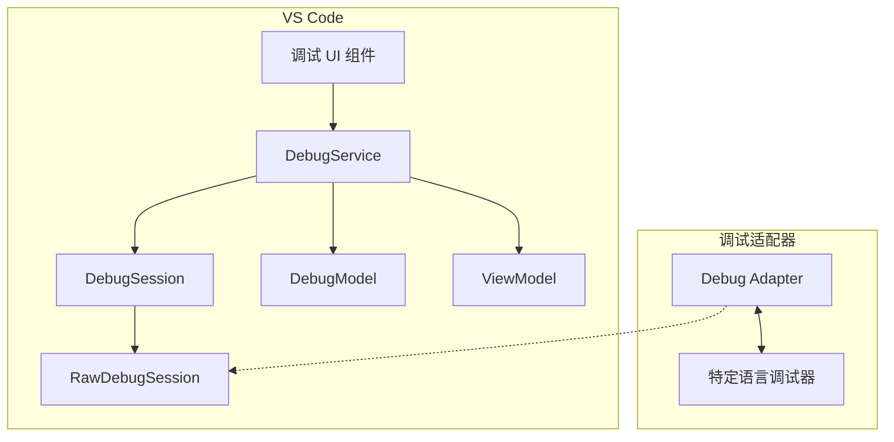

来源：

* src/vs/workbench/contrib/debug/browser/debugService.ts62-215
* src/vs/workbench/contrib/debug/browser/debugSession.ts52-187
* src/vs/workbench/contrib/debug/browser/rawDebugSession.ts42-53

## 核心组件

### 调试服务

`DebugService`是调试系统的核心组件。它管理调试会话的生命周期，处理配置，并协调UI和调试适配器之间的交互。

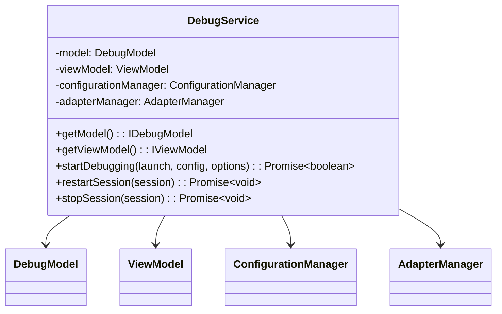

来源：

* src/vs/workbench/contrib/debug/browser/debugService.ts62-215
* src/vs/workbench/contrib/debug/common/debug.ts46-486

### 调试会话

`DebugSession`表示单个调试会话。它通过`RawDebugSession`处理与调试适配器的通信，并管理调试会话的状态。

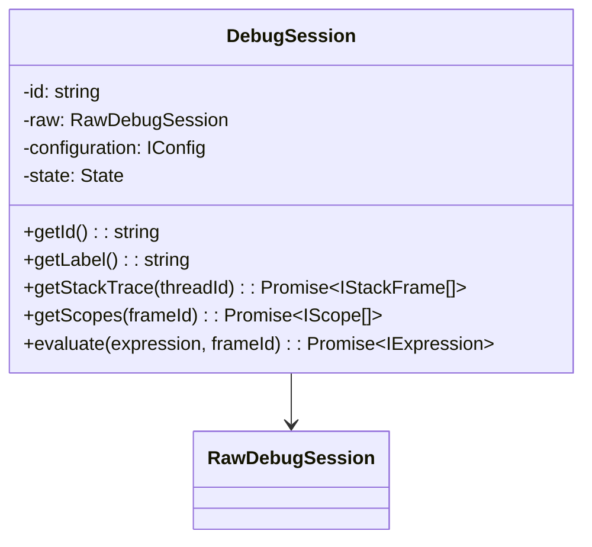

来源：

* src/vs/workbench/contrib/debug/browser/debugSession.ts52-187
* src/vs/workbench/contrib/debug/common/debug.ts370-486

### 原始调试会话

`RawDebugSession`封装了与调试适配器的通信。它发送和接收调试适配器协议(DAP)消息，并发出事件供`DebugSession`处理。

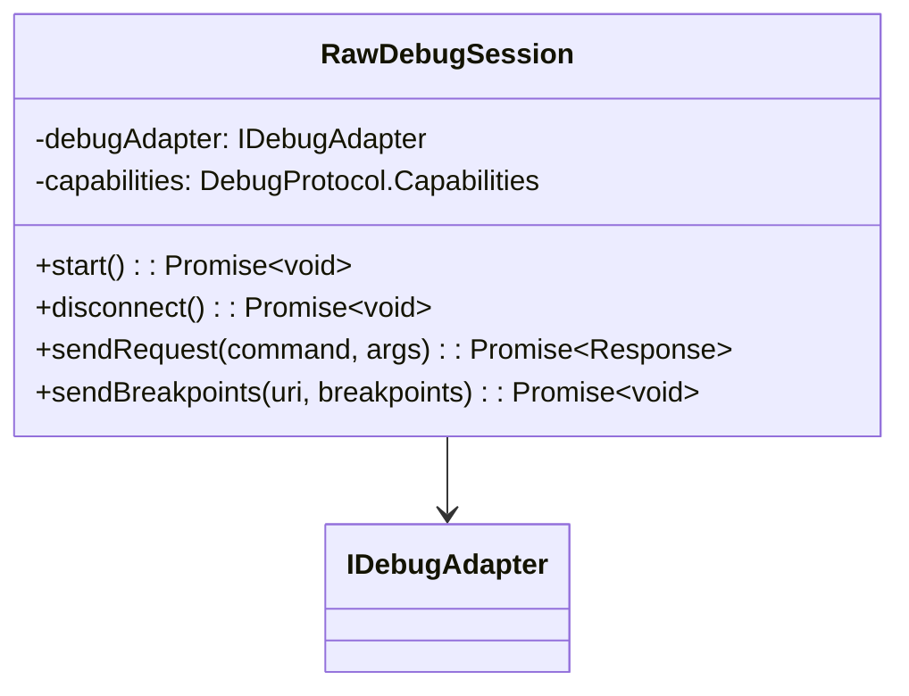

来源：

* src/vs/workbench/contrib/debug/browser/rawDebugSession.ts42-53

### 调试模型

`DebugModel`维护调试系统的状态，包括断点、监视表达式和调试会话。

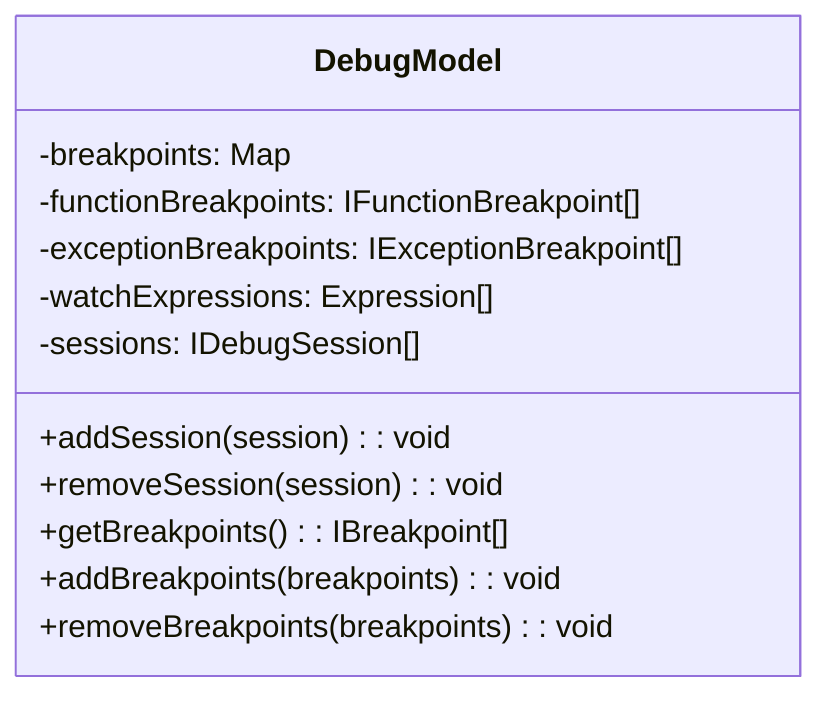

来源：

* src/vs/workbench/contrib/debug/common/debugModel.ts25-1000

### 视图模型

`ViewModel`管理调试系统的UI状态，包括当前关注的调试会话、线程和堆栈帧。

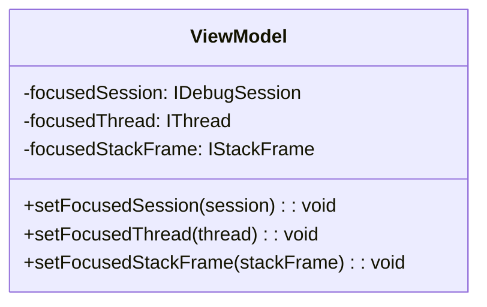

来源：

* src/vs/workbench/contrib/debug/browser/debugService.ts138-139

## 调试状态和生命周期

调试会话可以处于以下四种状态之一：

1. **非活动状态**：没有运行调试会话
2. **初始化中**：正在设置调试会话
3. **运行中**：程序正在运行
4. **已停止**：程序在断点或异常处暂停

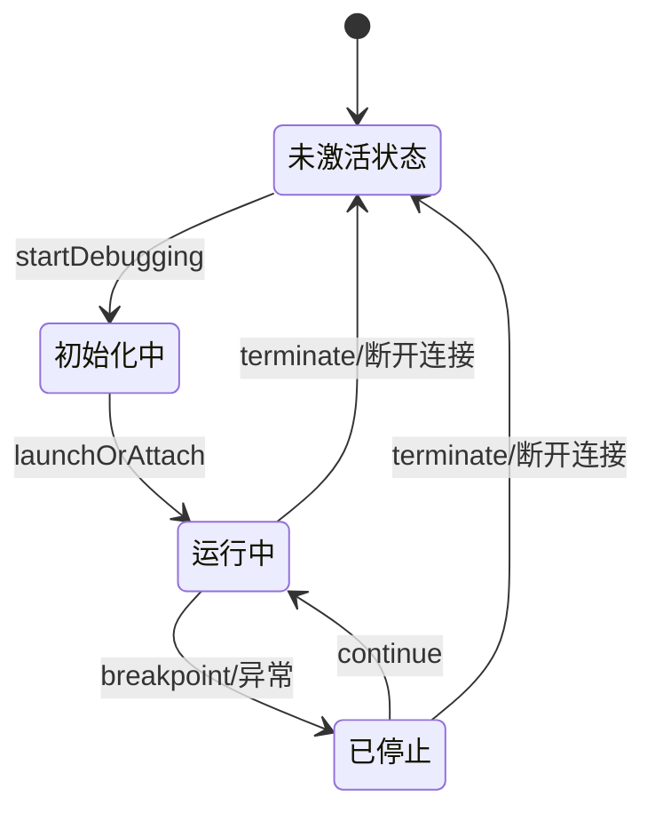

来源：

* src/vs/workbench/contrib/debug/common/debug.ts202-216
* src/vs/workbench/contrib/debug/browser/debugSession.ts267-284

### 启动调试会话

启动调试会话的过程涉及几个步骤：

1. 解析调试配置
2. 创建调试会话
3. 初始化调试适配器
4. 启动或附加到目标程序

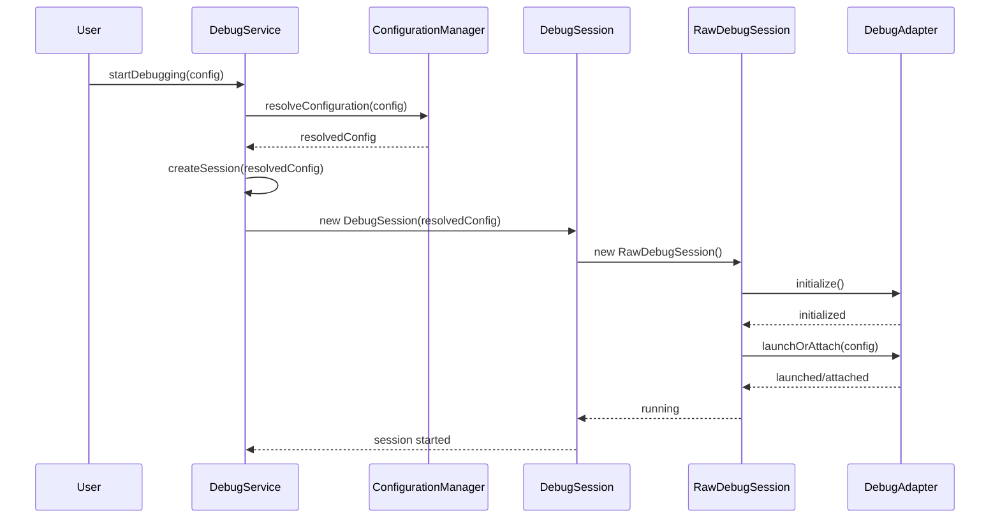

来源：

* src/vs/workbench/contrib/debug/browser/debugService.ts352-449
* src/vs/workbench/contrib/debug/browser/debugSession.ts338-403

## 断点管理

断点由`DebugModel`管理，可以是几种类型：

1. **源代码断点**：设置在源文件中的特定行上
2. **函数断点**：设置在函数名上
3. **数据断点**：当数据发生变化时触发
4. **异常断点**：当发生异常时触发
5. **指令断点**：在反汇编视图中设置在特定指令上

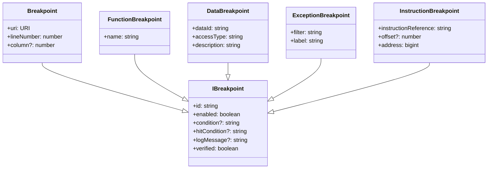

来源：

* src/vs/workbench/contrib/debug/common/debug.ts580-686
* src/vs/workbench/contrib/debug/common/debugModel.ts1000-1500

### 断点生命周期

断点在其生命周期中经历几个阶段：

1. **创建**：用户在编辑器或断点视图中添加断点
2. **注册**：断点被添加到`DebugModel`
3. **发送**：断点被发送到调试适配器
4. **验证**：调试适配器验证断点是否可以设置
5. **更新**：根据验证更新断点状态
6. **移除**：用户移除断点或调试会话结束

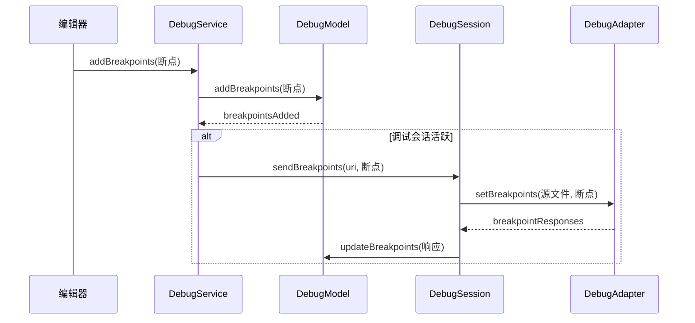

来源：

* src/vs/workbench/contrib/debug/browser/debugService.ts1000-1100
* src/vs/workbench/contrib/debug/browser/debugSession.ts480-500
* src/vs/workbench/contrib/debug/browser/breakpointEditorContribution.ts60-100

## 调试UI组件

VS Code提供了几个用于调试的UI组件：

### 调试视图

调试视图是调试的主要UI容器，包含几个视图：

1. **变量视图**：显示当前作用域中的变量
2. **监视视图**：显示监视表达式
3. **调用堆栈视图**：显示当前线程的调用堆栈
4. **断点视图**：显示所有断点
5. **已加载脚本视图**：显示所有已加载的脚本
6. **反汇编视图**：在源代码不可用时显示反汇编

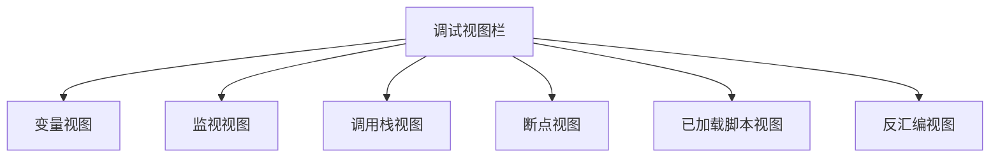

来源：

* src/vs/workbench/contrib/debug/browser/debugViewlet.ts1-100
* src/vs/workbench/contrib/debug/browser/variablesView.ts1-100
* src/vs/workbench/contrib/debug/browser/watchExpressionsView.ts1-100
* src/vs/workbench/contrib/debug/browser/callStackView.ts1-100
* src/vs/workbench/contrib/debug/browser/breakpointsView.ts1-100

### 调试控制台（REPL）

调试控制台（REPL）允许用户在调试过程中评估表达式并查看程序输出。

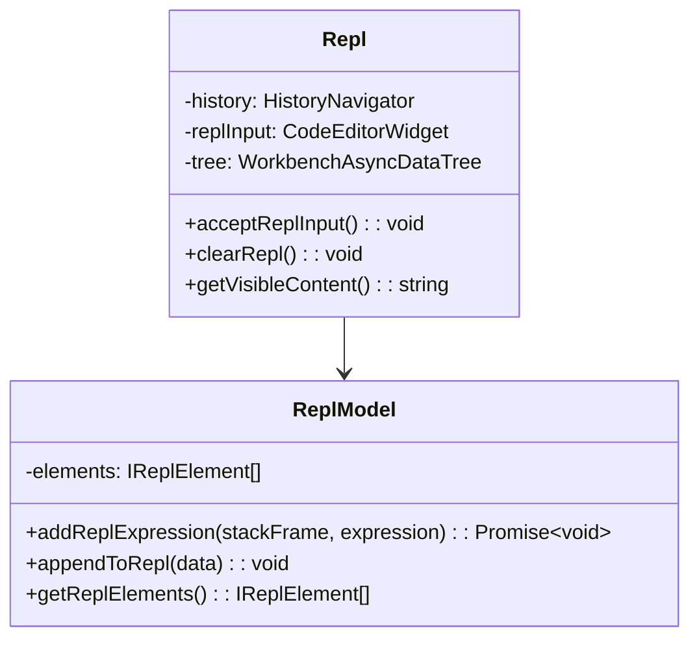

来源：

* src/vs/workbench/contrib/debug/browser/repl.ts95-547
* src/vs/workbench/contrib/debug/common/replModel.ts1-100

### 调试操作和命令

VS Code提供了各种用于控制调试过程的操作和命令：

| 命令 | 描述 | 快捷键 |
| --- | --- | --- |
| 开始调试 | 启动新的调试会话 | F5 |
| 停止调试 | 停止当前调试会话 | Shift+F5 |
| 重启调试 | 重启当前调试会话 | Ctrl+Shift+F5 |
| 继续 | 继续执行 | F5 |
| 单步跳过 | 跳过当前行 | F10 |
| 单步进入 | 进入当前函数 | F11 |
| 单步跳出 | 跳出当前函数 | Shift+F11 |
| 切换断点 | 在当前行切换断点 | F9 |

来源：

* src/vs/workbench/contrib/debug/browser/debugCommands.ts42-138
* src/vs/workbench/contrib/debug/browser/debugToolBar.ts1-100

### 调试编辑器贡献

VS Code通过调试功能扩展编辑器：

1. **断点编辑器贡献**：管理编辑器中的断点
2. **调试编辑器贡献**：提供内联值、悬停和异常小部件
3. **调用堆栈编辑器贡献**：显示当前执行位置

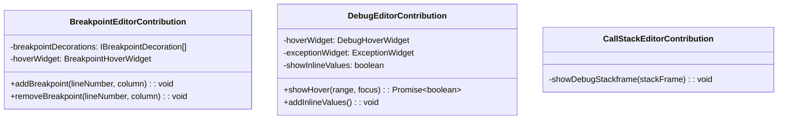

来源：

* src/vs/workbench/contrib/debug/browser/breakpointEditorContribution.ts1-100
* src/vs/workbench/contrib/debug/browser/debugEditorContribution.ts1-100
* src/vs/workbench/contrib/debug/browser/callStackEditorContribution.ts1-100

## 调试配置

调试配置存储在`launch.json`文件中，定义如何启动或附加到程序进行调试。

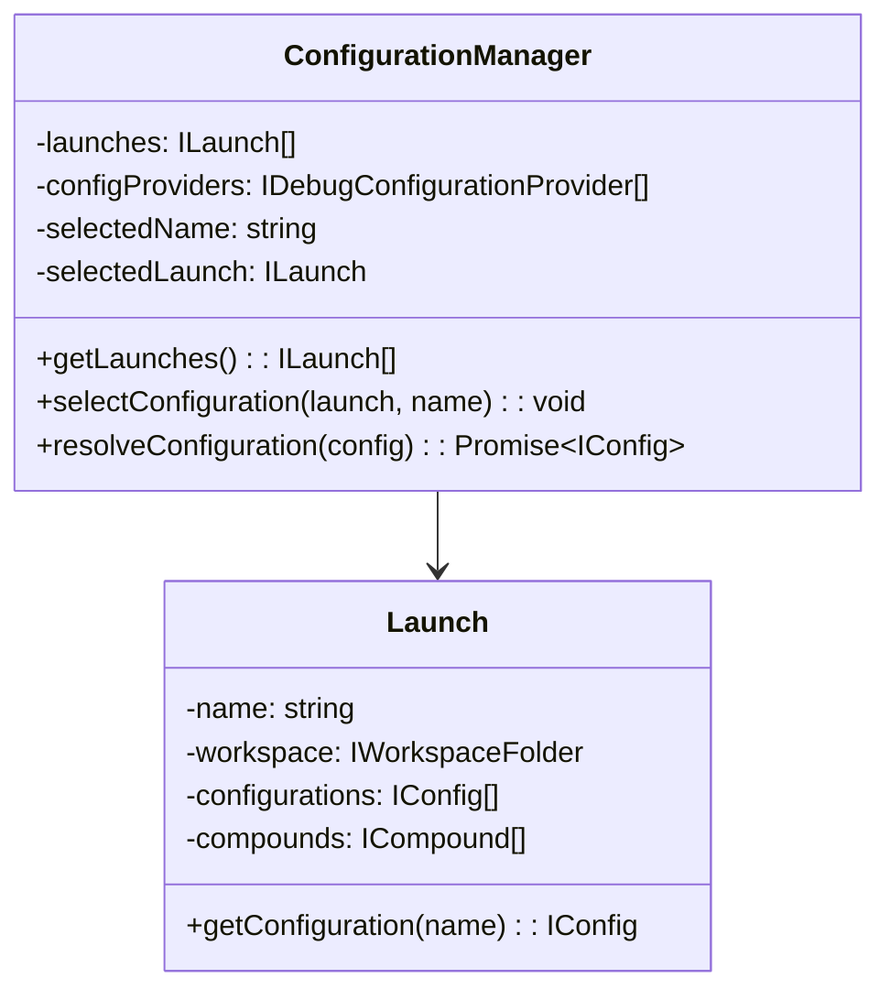

来源：

* src/vs/workbench/contrib/debug/browser/debugConfigurationManager.ts52-100

### 配置解析

调试配置在用于启动调试会话之前会经过解析过程：

1. **初始解析**：基本变量替换
2. **提供者解析**：调试配置提供者可以修改配置
3. **最终解析**：最终变量替换和验证

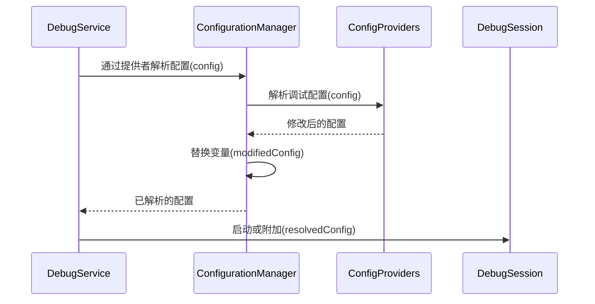

来源：

* src/vs/workbench/contrib/debug/browser/debugConfigurationManager.ts127-168

## 调试适配器集成

VS Code通过调试适配器协议(DAP)与调试适配器通信。`RawDebugSession`处理这种通信。

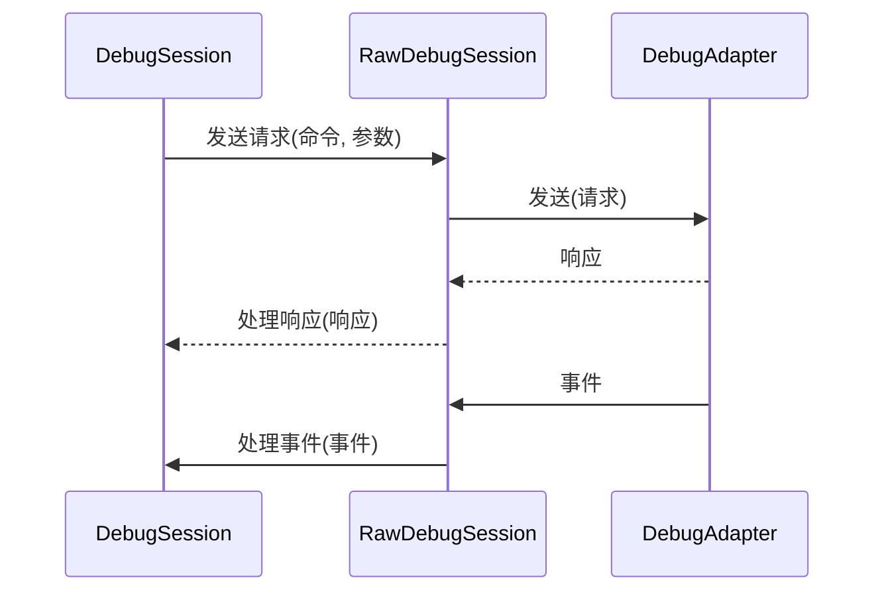

来源：

* src/vs/workbench/contrib/debug/browser/rawDebugSession.ts42-100

### 调试适配器生命周期

调试适配器的生命周期包括：

1. **创建**：调试器创建调试适配器
2. **初始化**：调试适配器初始化功能
3. **启动/附加**：调试适配器启动或附加到目标程序
4. **调试**：调试适配器处理请求并发送事件
5. **终止**：调试会话结束时终止调试适配器

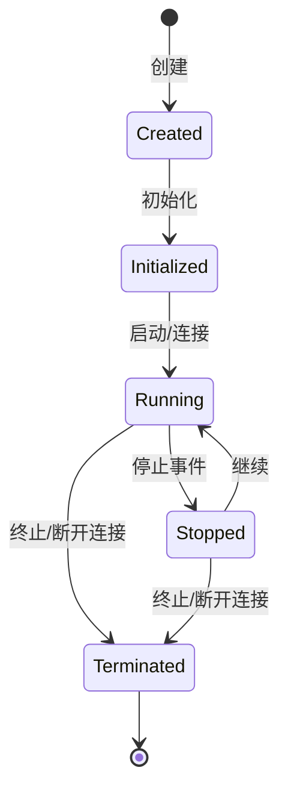

来源：

* src/vs/workbench/contrib/debug/browser/rawDebugSession.ts42-100

## 扩展点

VS Code为调试系统提供了几个扩展点：

1. **调试配置提供者**：贡献调试配置
2. **调试适配器描述符工厂**：创建调试适配器描述符
3. **调试适配器跟踪器工厂**：跟踪调试适配器通信

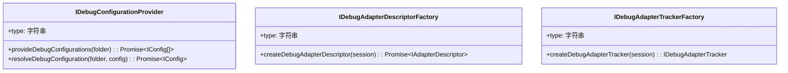

来源：

* src/vs/workbench/contrib/debug/common/debug.ts186-200
* src/vs/workbench/api/common/extHostDebugService.ts1-100

## 总结

VS Code调试系统提供了一个灵活且可扩展的架构，用于调试各种语言的程序。它通过调试适配器协议将调试前端（VS Code）与调试后端（特定语言的调试适配器）分离，从而在各种语言中提供一致的调试体验。

该系统由几个关键组件组成：

1. **DebugService**：管理调试会话的中心服务
2. **DebugSession**：表示单个调试会话
3. **RawDebugSession**：处理与调试适配器的通信
4. **DebugModel**：维护断点和监视表达式的状态
5. **ViewModel**：管理调试的UI状态
6. **UI组件**：提供调试的用户界面

这种架构使VS Code能够支持广泛的编程语言的调试，同时提供一致且强大的调试体验。
