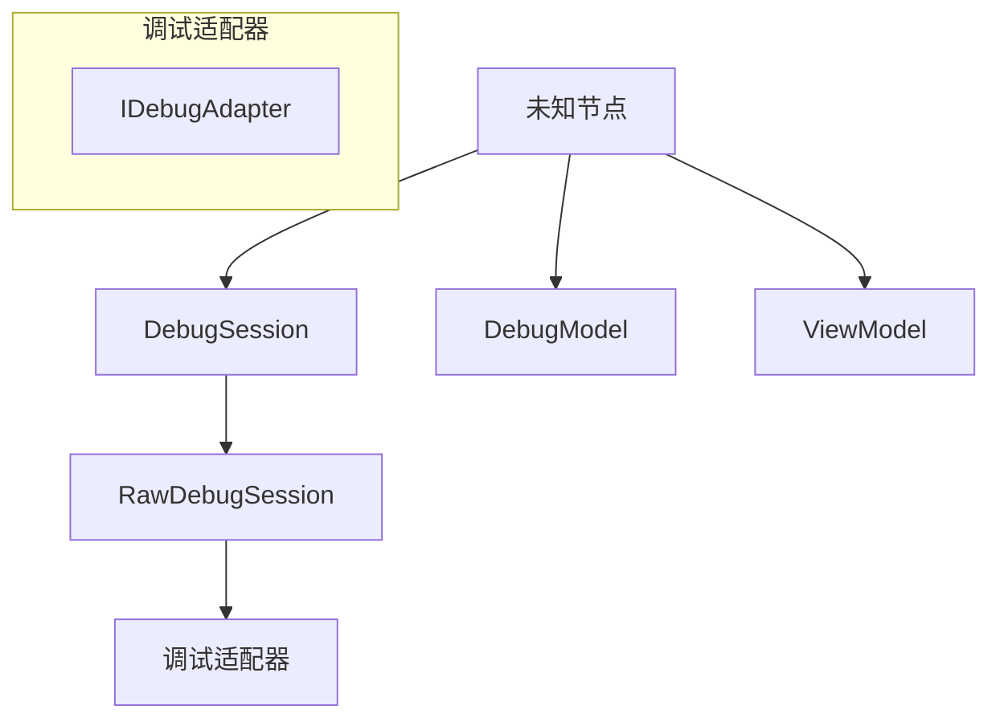

# 调试服务和会话管理

<details>
<summary>相关源文件</summary>

* [src/vs/workbench/api/browser/mainThreadDebugService.ts](../../src/vs/workbench/api/browser/mainThreadDebugService.ts)
* [src/vs/workbench/api/common/extHostDebugService.ts](../../src/vs/workbench/api/common/extHostDebugService.ts)
* [src/vs/workbench/contrib/debug/browser/baseDebugView.ts](../../src/vs/workbench/contrib/debug/browser/baseDebugView.ts)
* [src/vs/workbench/contrib/debug/browser/breakpointEditorContribution.ts](../../src/vs/workbench/contrib/debug/browser/breakpointEditorContribution.ts)
* [src/vs/workbench/contrib/debug/browser/breakpointsView.ts](../../src/vs/workbench/contrib/debug/browser/breakpointsView.ts)
* [src/vs/workbench/contrib/debug/browser/callStackEditorContribution.ts](../../src/vs/workbench/contrib/debug/browser/callStackEditorContribution.ts)
* [src/vs/workbench/contrib/debug/browser/callStackView.ts](../../src/vs/workbench/contrib/debug/browser/callStackView.ts)
* [src/vs/workbench/contrib/debug/browser/debug.contribution.ts](../../src/vs/workbench/contrib/debug/browser/debug.contribution.ts)
* [src/vs/workbench/contrib/debug/browser/debugActionViewItems.ts](../../src/vs/workbench/contrib/debug/browser/debugActionViewItems.ts)
* [src/vs/workbench/contrib/debug/browser/debugCommands.ts](../../src/vs/workbench/contrib/debug/browser/debugCommands.ts)
* [src/vs/workbench/contrib/debug/browser/debugConfigurationManager.ts](../../src/vs/workbench/contrib/debug/browser/debugConfigurationManager.ts)
* [src/vs/workbench/contrib/debug/browser/debugEditorActions.ts](../../src/vs/workbench/contrib/debug/browser/debugEditorActions.ts)
* [src/vs/workbench/contrib/debug/browser/debugEditorContribution.ts](../../src/vs/workbench/contrib/debug/browser/debugEditorContribution.ts)
* [src/vs/workbench/contrib/debug/browser/debugHover.ts](../../src/vs/workbench/contrib/debug/browser/debugHover.ts)
* [src/vs/workbench/contrib/debug/browser/debugService.ts](../../src/vs/workbench/contrib/debug/browser/debugService.ts)
* [src/vs/workbench/contrib/debug/browser/debugSession.ts](../../src/vs/workbench/contrib/debug/browser/debugSession.ts)
* [src/vs/workbench/contrib/debug/browser/debugToolBar.ts](../../src/vs/workbench/contrib/debug/browser/debugToolBar.ts)
* [src/vs/workbench/contrib/debug/browser/debugViewlet.ts](../../src/vs/workbench/contrib/debug/browser/debugViewlet.ts)
* [src/vs/workbench/contrib/debug/browser/disassemblyView.ts](../../src/vs/workbench/contrib/debug/browser/disassemblyView.ts)
* [src/vs/workbench/contrib/debug/browser/exceptionWidget.ts](../../src/vs/workbench/contrib/debug/browser/exceptionWidget.ts)
* [src/vs/workbench/contrib/debug/browser/loadedScriptsView.ts](../../src/vs/workbench/contrib/debug/browser/loadedScriptsView.ts)
* [src/vs/workbench/contrib/debug/browser/media/callStackEditorContribution.css](../../src/vs/workbench/contrib/debug/browser/media/callStackEditorContribution.css)
* [src/vs/workbench/contrib/debug/browser/media/debug.contribution.css](../../src/vs/workbench/contrib/debug/browser/media/debug.contribution.css)
* [src/vs/workbench/contrib/debug/browser/media/debugHover.css](../../src/vs/workbench/contrib/debug/browser/media/debugHover.css)
* [src/vs/workbench/contrib/debug/browser/media/debugToolBar.css](../../src/vs/workbench/contrib/debug/browser/media/debugToolBar.css)
* [src/vs/workbench/contrib/debug/browser/media/debugViewlet.css](../../src/vs/workbench/contrib/debug/browser/media/debugViewlet.css)
* [src/vs/workbench/contrib/debug/browser/media/exceptionWidget.css](../../src/vs/workbench/contrib/debug/browser/media/exceptionWidget.css)
* [src/vs/workbench/contrib/debug/browser/media/repl.css](../../src/vs/workbench/contrib/debug/browser/media/repl.css)
* [src/vs/workbench/contrib/debug/browser/rawDebugSession.ts](../../src/vs/workbench/contrib/debug/browser/rawDebugSession.ts)
* [src/vs/workbench/contrib/debug/browser/repl.ts](../../src/vs/workbench/contrib/debug/browser/repl.ts)
* [src/vs/workbench/contrib/debug/browser/replFilter.ts](../../src/vs/workbench/contrib/debug/browser/replFilter.ts)
* [src/vs/workbench/contrib/debug/browser/replViewer.ts](../../src/vs/workbench/contrib/debug/browser/replViewer.ts)
* [src/vs/workbench/contrib/debug/browser/variablesView.ts](../../src/vs/workbench/contrib/debug/browser/variablesView.ts)
* [src/vs/workbench/contrib/debug/browser/watchExpressionsView.ts](../../src/vs/workbench/contrib/debug/browser/watchExpressionsView.ts)
* [src/vs/workbench/contrib/debug/common/debug.ts](../../src/vs/workbench/contrib/debug/common/debug.ts)
* [src/vs/workbench/contrib/debug/common/debugModel.ts](../../src/vs/workbench/contrib/debug/common/debugModel.ts)
* [src/vs/workbench/contrib/debug/common/debugStorage.ts](../../src/vs/workbench/contrib/debug/common/debugStorage.ts)
* [src/vs/workbench/contrib/debug/common/replModel.ts](../../src/vs/workbench/contrib/debug/common/replModel.ts)
* [src/vs/workbench/contrib/debug/test/browser/baseDebugView.test.ts](../../src/vs/workbench/contrib/debug/test/browser/baseDebugView.test.ts)
* [src/vs/workbench/contrib/debug/test/browser/breakpoints.test.ts](../../src/vs/workbench/contrib/debug/test/browser/breakpoints.test.ts)
* [src/vs/workbench/contrib/debug/test/browser/callStack.test.ts](../../src/vs/workbench/contrib/debug/test/browser/callStack.test.ts)
* [src/vs/workbench/contrib/debug/test/browser/debugHover.test.ts](../../src/vs/workbench/contrib/debug/test/browser/debugHover.test.ts)
* [src/vs/workbench/contrib/debug/test/browser/debugSource.test.ts](../../src/vs/workbench/contrib/debug/test/browser/debugSource.test.ts)
* [src/vs/workbench/contrib/debug/test/browser/debugViewModel.test.ts](../../src/vs/workbench/contrib/debug/test/browser/debugViewModel.test.ts)
* [src/vs/workbench/contrib/debug/test/browser/mockDebugModel.ts](../../src/vs/workbench/contrib/debug/test/browser/mockDebugModel.ts)
* [src/vs/workbench/contrib/debug/test/browser/rawDebugSession.test.ts](../../src/vs/workbench/contrib/debug/test/browser/rawDebugSession.test.ts)
* [src/vs/workbench/contrib/debug/test/browser/repl.test.ts](../../src/vs/workbench/contrib/debug/test/browser/repl.test.ts)
* [src/vs/workbench/contrib/debug/test/browser/watch.test.ts](../../src/vs/workbench/contrib/debug/test/browser/watch.test.ts)
* [src/vs/workbench/contrib/debug/test/common/debugModel.test.ts](../../src/vs/workbench/contrib/debug/test/common/debugModel.test.ts)
* [src/vs/workbench/contrib/files/browser/views/emptyView.ts](../../src/vs/workbench/contrib/files/browser/views/emptyView.ts)
* [src/vs/workbench/contrib/files/browser/views/openEditorsView.ts](../../src/vs/workbench/contrib/files/browser/views/openEditorsView.ts)

</details>

本文档解释了VS Code的调试服务如何管理调试会话，包括它们的生命周期、状态管理和与调试适配器的通信。它涵盖了使VS Code中调试功能成为可能的核心组件。

有关调试配置管理的信息，请参阅调试配置管理。

## 概述

VS Code调试架构遵循客户端-服务器模型，其中编辑器（客户端）使用调试适配器协议（DAP）与调试适配器（服务器）通信。调试服务充当所有调试活动的中央协调器，管理调试会话及其生命周期。



来源：

* src/vs/workbench/contrib/debug/browser/debugService.ts62-93
* src/vs/workbench/contrib/debug/browser/debugSession.ts52-187
* src/vs/workbench/contrib/debug/browser/rawDebugSession.ts42-53

## 调试服务

`DebugService`是管理VS Code中所有调试活动的中央组件。它实现了`IDebugService`接口，负责：

1. 管理调试模型和视图模型
2. 创建和管理调试会话
3. 处理调试状态变化
4. 协调会话间的断点

来源：

* src/vs/workbench/contrib/debug/browser/debugService.ts62-93
* src/vs/workbench/contrib/debug/common/debug.ts46-486

### 调试状态管理

调试服务管理整体调试状态，可以是以下之一：

状态在`State`枚举中定义：

```
enum State {
    Inactive,
    Initializing,
    Stopped,
    Running
}
```

调试服务维护反映当前调试状态的上下文键，这些键被UI用来显示/隐藏适当的命令和视图。

来源：

* src/vs/workbench/contrib/debug/common/debug.ts202-207
* src/vs/workbench/contrib/debug/browser/debugService.ts262-316

## 调试会话

`DebugSession`类代表单个调试会话，负责：

1. 管理与调试适配器的通信
2. 跟踪会话状态
3. 管理线程、堆栈帧和变量
4. 处理会话的断点

当用户开始调试时创建调试会话，调试结束时销毁。多个调试会话可以同时存在，允许多目标调试。

来源：

* src/vs/workbench/contrib/debug/browser/debugSession.ts52-187
* src/vs/workbench/contrib/debug/common/debug.ts371-486

### 会话生命周期

调试会话遵循特定的生命周期：

1. **创建**：当用户开始调试时，调试服务创建会话
2. **初始化**：会话初始化调试适配器
3. **启动/附加**：会话启动新进程或附加到现有进程
4. **运行/停止**：会话运行直到遇到断点或异常
5. **终止**：当用户停止调试或调试的进程结束时，会话终止

来源：

* src/vs/workbench/contrib/debug/browser/debugService.ts347-443
* src/vs/workbench/contrib/debug/browser/debugSession.ts334-477

### 原始调试会话

`RawDebugSession`类封装了与调试适配器的直接通信。它：

1. 管理调试适配器生命周期
2. 处理调试适配器协议（DAP）消息
3. 在VS Code的内部模型和DAP之间进行转换

来源：

* src/vs/workbench/contrib/debug/browser/rawDebugSession.ts42-53

## 调试模型

调试模型表示调试会话的状态，包括：

1. 断点
2. 线程
3. 堆栈帧
4. 变量和表达式
5. 调试会话

来源：

* src/vs/workbench/contrib/debug/common/debugModel.ts25-31

### 线程和堆栈帧

调试模型包括用于表示线程和堆栈帧的类：

来源：

* src/vs/workbench/contrib/debug/common/debug.ts487-573
* src/vs/workbench/contrib/debug/common/debugModel.ts1000-1200

### 变量和表达式

调试模型包括用于表示变量和表达式的类：

来源：

* src/vs/workbench/contrib/debug/common/debug.ts165-196
* src/vs/workbench/contrib/debug/common/debugModel.ts37-304

## 视图模型

视图模型表示调试会话的UI状态，包括：

1. 焦点会话
2. 焦点线程
3. 焦点堆栈帧

来源：

* src/vs/workbench/contrib/debug/common/debugViewModel.ts

## 调试服务实现

`DebugService`实现处理核心调试功能：

### 启动调试会话

`startDebugging`方法是启动调试会话的主要入口点：

该方法：

1. 解析调试配置
2. 运行启动前任务
3. 创建调试会话
4. 初始化调试适配器
5. 启动或附加到目标进程

来源：

* src/vs/workbench/contrib/debug/browser/debugService.ts347-443

### 创建调试会话

`createSession`方法创建新的调试会话：

来源：

* src/vs/workbench/contrib/debug/browser/debugService.ts454-568

### 调试会话实现

`DebugSession`类实现`IDebugSession`接口并管理调试会话的生命周期：

#### 初始化

`initialize`方法初始化调试适配器：

来源：

* src/vs/workbench/contrib/debug/browser/debugSession.ts334-382

#### 启动或附加

`launchOrAttach`方法启动新进程或附加到现有进程：

来源：

* src/vs/workbench/contrib/debug/browser/debugSession.ts387-403

#### 终止

`terminate`方法终止调试会话：

来源：

* src/vs/workbench/contrib/debug/browser/debugSession.ts418-440

### 原始调试会话实现

`RawDebugSession`类处理与调试适配器的直接通信：

来源：

* src/vs/workbench/contrib/debug/browser/rawDebugSession.ts42-53

## 调试UI集成

调试服务通过各种组件与VS Code UI集成：

### 调试视图

VS Code提供了几个与调试相关的视图：

1. **调用堆栈视图**：显示当前线程的调用堆栈
2. **变量视图**：显示当前堆栈帧中的变量
3. **监视视图**：显示用户定义的监视表达式
4. **断点视图**：显示所有断点
5. **调试控制台**：显示调试输出并允许评估表达式

来源：

* src/vs/workbench/contrib/debug/browser/callStackView.ts135-213
* src/vs/workbench/contrib/debug/browser/variablesView.ts45-49
* src/vs/workbench/contrib/debug/browser/watchExpressionsView.ts1-14
* src/vs/workbench/contrib/debug/browser/breakpointsView.ts87-136
* src/vs/workbench/contrib/debug/browser/repl.ts95-177

### 调试操作

VS Code提供了各种与调试相关的操作：

1. **开始调试**：启动新的调试会话
2. **停止调试**：停止当前调试会话
3. **继续**：继续执行
4. **单步跳过**：跳过当前行
5. **单步进入**：进入当前函数
6. **单步跳出**：跳出当前函数
7. **重启**：重启当前调试会话
8. **暂停**：暂停执行

来源：

* src/vs/workbench/contrib/debug/browser/debugCommands.ts42-76
* src/vs/workbench/contrib/debug/browser/debugToolBar.ts1-20

## 多会话调试

VS Code支持同时调试多个目标：

视图模型跟踪焦点会话、线程和堆栈帧，这决定了UI中显示的内容。

来源：

* src/vs/workbench/contrib/debug/browser/debugService.ts171-185
* src/vs/workbench/contrib/debug/browser/callStackView.ts255-270

## 复合调试

VS Code支持复合调试，允许一次启动多个调试会话：

来源：

* src/vs/workbench/contrib/debug/browser/debugService.ts382-432

## 结论

VS Code中的调试服务和会话管理系统提供了一个强大的架构用于调试应用程序。它管理调试会话的生命周期，与调试适配器通信，并与VS Code UI集成，提供无缝的调试体验。

关键组件是：

1. **DebugService**：所有调试活动的中央协调器
2. **DebugSession**：代表单个调试会话并管理与调试适配器的通信
3. **RawDebugSession**：处理与调试适配器的直接通信
4. **DebugModel**：表示调试会话的状态
5. **ViewModel**：表示调试会话的UI状态

这些组件共同工作，在VS Code中提供强大而灵活的调试体验。
