# 调试适配器协议


<details>
<summary>相关源文件</summary>

* [src/vs/workbench/api/browser/mainThreadDebugService.ts](../../src/vs/workbench/api/browser/mainThreadDebugService.ts)
* [src/vs/workbench/api/common/extHostDebugService.ts](../../src/vs/workbench/api/common/extHostDebugService.ts)
* [src/vs/workbench/contrib/debug/browser/baseDebugView.ts](../../src/vs/workbench/contrib/debug/browser/baseDebugView.ts)
* [src/vs/workbench/contrib/debug/browser/breakpointEditorContribution.ts](../../src/vs/workbench/contrib/debug/browser/breakpointEditorContribution.ts)
* [src/vs/workbench/contrib/debug/browser/breakpointsView.ts](../../src/vs/workbench/contrib/debug/browser/breakpointsView.ts)
* [src/vs/workbench/contrib/debug/browser/callStackEditorContribution.ts](../../src/vs/workbench/contrib/debug/browser/callStackEditorContribution.ts)
* [src/vs/workbench/contrib/debug/browser/callStackView.ts](../../src/vs/workbench/contrib/debug/browser/callStackView.ts)
* [src/vs/workbench/contrib/debug/browser/debug.contribution.ts](../../src/vs/workbench/contrib/debug/browser/debug.contribution.ts)
* [src/vs/workbench/contrib/debug/browser/debugActionViewItems.ts](../../src/vs/workbench/contrib/debug/browser/debugActionViewItems.ts)
* [src/vs/workbench/contrib/debug/browser/debugCommands.ts](../../src/vs/workbench/contrib/debug/browser/debugCommands.ts)
* [src/vs/workbench/contrib/debug/browser/debugConfigurationManager.ts](../../src/vs/workbench/contrib/debug/browser/debugConfigurationManager.ts)
* [src/vs/workbench/contrib/debug/browser/debugEditorActions.ts](../../src/vs/workbench/contrib/debug/browser/debugEditorActions.ts)
* [src/vs/workbench/contrib/debug/browser/debugEditorContribution.ts](../../src/vs/workbench/contrib/debug/browser/debugEditorContribution.ts)
* [src/vs/workbench/contrib/debug/browser/debugHover.ts](../../src/vs/workbench/contrib/debug/browser/debugHover.ts)
* [src/vs/workbench/contrib/debug/browser/debugService.ts](../../src/vs/workbench/contrib/debug/browser/debugService.ts)
* [src/vs/workbench/contrib/debug/browser/debugSession.ts](../../src/vs/workbench/contrib/debug/browser/debugSession.ts)
* [src/vs/workbench/contrib/debug/browser/debugToolBar.ts](../../src/vs/workbench/contrib/debug/browser/debugToolBar.ts)
* [src/vs/workbench/contrib/debug/browser/debugViewlet.ts](../../src/vs/workbench/contrib/debug/browser/debugViewlet.ts)
* [src/vs/workbench/contrib/debug/browser/disassemblyView.ts](../../src/vs/workbench/contrib/debug/browser/disassemblyView.ts)
* [src/vs/workbench/contrib/debug/browser/exceptionWidget.ts](../../src/vs/workbench/contrib/debug/browser/exceptionWidget.ts)
* [src/vs/workbench/contrib/debug/browser/loadedScriptsView.ts](../../src/vs/workbench/contrib/debug/browser/loadedScriptsView.ts)
* [src/vs/workbench/contrib/debug/browser/media/callStackEditorContribution.css](../../src/vs/workbench/contrib/debug/browser/media/callStackEditorContribution.css)
* [src/vs/workbench/contrib/debug/browser/media/debug.contribution.css](../../src/vs/workbench/contrib/debug/browser/media/debug.contribution.css)
* [src/vs/workbench/contrib/debug/browser/media/debugHover.css](../../src/vs/workbench/contrib/debug/browser/media/debugHover.css)
* [src/vs/workbench/contrib/debug/browser/media/debugToolBar.css](../../src/vs/workbench/contrib/debug/browser/media/debugToolBar.css)
* [src/vs/workbench/contrib/debug/browser/media/debugViewlet.css](../../src/vs/workbench/contrib/debug/browser/media/debugViewlet.css)
* [src/vs/workbench/contrib/debug/browser/media/exceptionWidget.css](../../src/vs/workbench/contrib/debug/browser/media/exceptionWidget.css)
* [src/vs/workbench/contrib/debug/browser/media/repl.css](../../src/vs/workbench/contrib/debug/browser/media/repl.css)
* [src/vs/workbench/contrib/debug/browser/rawDebugSession.ts](../../src/vs/workbench/contrib/debug/browser/rawDebugSession.ts)
* [src/vs/workbench/contrib/debug/browser/repl.ts](../../src/vs/workbench/contrib/debug/browser/repl.ts)
* [src/vs/workbench/contrib/debug/browser/replFilter.ts](../../src/vs/workbench/contrib/debug/browser/replFilter.ts)
* [src/vs/workbench/contrib/debug/browser/replViewer.ts](../../src/vs/workbench/contrib/debug/browser/replViewer.ts)
* [src/vs/workbench/contrib/debug/browser/variablesView.ts](../../src/vs/workbench/contrib/debug/browser/variablesView.ts)
* [src/vs/workbench/contrib/debug/browser/watchExpressionsView.ts](../../src/vs/workbench/contrib/debug/browser/watchExpressionsView.ts)
* [src/vs/workbench/contrib/debug/common/debug.ts](../../src/vs/workbench/contrib/debug/common/debug.ts)
* [src/vs/workbench/contrib/debug/common/debugModel.ts](../../src/vs/workbench/contrib/debug/common/debugModel.ts)
* [src/vs/workbench/contrib/debug/common/debugStorage.ts](../../src/vs/workbench/contrib/debug/common/debugStorage.ts)
* [src/vs/workbench/contrib/debug/common/replModel.ts](../../src/vs/workbench/contrib/debug/common/replModel.ts)
* [src/vs/workbench/contrib/debug/test/browser/baseDebugView.test.ts](../../src/vs/workbench/contrib/debug/test/browser/baseDebugView.test.ts)
* [src/vs/workbench/contrib/debug/test/browser/breakpoints.test.ts](../../src/vs/workbench/contrib/debug/test/browser/breakpoints.test.ts)
* [src/vs/workbench/contrib/debug/test/browser/callStack.test.ts](../../src/vs/workbench/contrib/debug/test/browser/callStack.test.ts)
* [src/vs/workbench/contrib/debug/test/browser/debugHover.test.ts](../../src/vs/workbench/contrib/debug/test/browser/debugHover.test.ts)
* [src/vs/workbench/contrib/debug/test/browser/debugSource.test.ts](../../src/vs/workbench/contrib/debug/test/browser/debugSource.test.ts)
* [src/vs/workbench/contrib/debug/test/browser/debugViewModel.test.ts](../../src/vs/workbench/contrib/debug/test/browser/debugViewModel.test.ts)
* [src/vs/workbench/contrib/debug/test/browser/mockDebugModel.ts](../../src/vs/workbench/contrib/debug/test/browser/mockDebugModel.ts)
* [src/vs/workbench/contrib/debug/test/browser/rawDebugSession.test.ts](../../src/vs/workbench/contrib/debug/test/browser/rawDebugSession.test.ts)
* [src/vs/workbench/contrib/debug/test/browser/repl.test.ts](../../src/vs/workbench/contrib/debug/test/browser/repl.test.ts)
* [src/vs/workbench/contrib/debug/test/browser/watch.test.ts](../../src/vs/workbench/contrib/debug/test/browser/watch.test.ts)
* [src/vs/workbench/contrib/debug/test/common/debugModel.test.ts](../../src/vs/workbench/contrib/debug/test/common/debugModel.test.ts)
* [src/vs/workbench/contrib/debug/test/common/mockDebug.ts](../../src/vs/workbench/contrib/debug/test/common/mockDebug.ts)
* [src/vs/workbench/contrib/files/browser/views/emptyView.ts](../../src/vs/workbench/contrib/files/browser/views/emptyView.ts)
* [src/vs/workbench/contrib/files/browser/views/openEditorsView.ts](../../src/vs/workbench/contrib/files/browser/views/openEditorsView.ts)
</details>

调试适配器协议（DAP）是一种基于JSON的协议，它标准化了开发工具（如VS Code）与调试器或运行时环境之间的通信。本页说明了VS Code如何实现调试适配器协议，重点关注使不同语言和平台的调试成为可能的架构、组件和交互。

有关调试服务架构的信息，请参见调试服务。有关扩展主机协议的信息，请参见扩展主机协议。

## 概述

调试适配器协议允许VS Code以标准化的方式与各种调试器通信。它定义了一组请求、响应和事件，使得无论被调试的编程语言或运行时是什么，都能执行常见的调试操作，如设置断点、单步执行代码、检查变量和评估表达式。

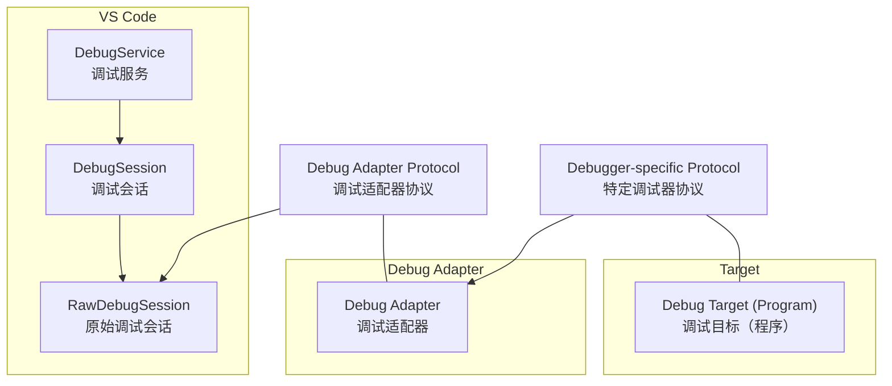

来源：src/vs/workbench/contrib/debug/browser/debugSession.ts1-100 src/vs/workbench/contrib/debug/browser/rawDebugSession.ts1-50 src/vs/workbench/contrib/debug/common/debug.ts1-100

## 协议架构

调试适配器协议设计为客户端-服务器架构，其中VS Code作为客户端（调试服务）与作为服务器的调试适配器通信。每个调试适配器都针对特定的编程语言或运行时，并在调试适配器协议与目标运行时的原生调试协议之间进行转换。

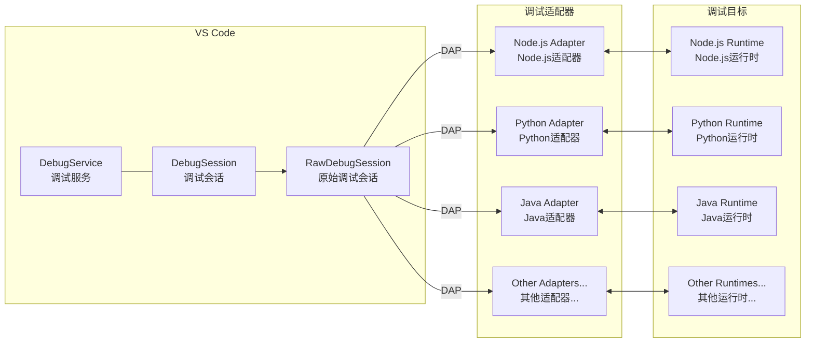

来源：src/vs/workbench/contrib/debug/browser/debugService.ts1-100 src/vs/workbench/contrib/debug/browser/rawDebugSession.ts1-100

## 协议消息类型

调试适配器协议定义了VS Code与调试适配器之间交换的几种消息类型：

1. **请求（Requests）**：从VS Code发送到调试适配器的命令（如"launch"、"setBreakpoints"）
2. **响应（Responses）**：调试适配器对VS Code请求的回复
3. **事件（Events）**：从调试适配器发送到VS Code的通知（如"stopped"、"output"）

### 关键协议消息

| 消息类型 | 方向 | 示例 | 目的 |
| ------ | ------ | ------ | ------ |
| 请求 | VS Code → 适配器 | launch, attach, setBreakpoints | 命令适配器执行操作 |
| 响应 | 适配器 → VS Code | 带数据的成功/失败 | 确认请求并返回结果 |
| 事件 | 适配器 → VS Code | stopped, output, terminated | 通知VS Code状态变化 |

来源：src/vs/workbench/contrib/debug/browser/rawDebugSession.ts50-150 src/vs/workbench/contrib/debug/common/debug.ts400-500

## VS Code中的实现

VS Code对调试适配器协议的实现围绕几个关键类展开：

### 核心组件

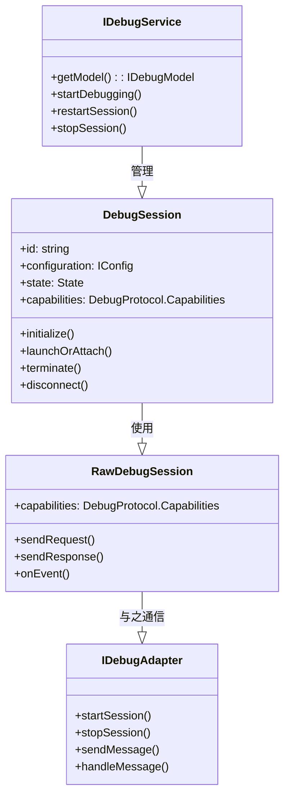

来源：src/vs/workbench/contrib/debug/browser/debugService.ts60-100 src/vs/workbench/contrib/debug/browser/debugSession.ts50-100 src/vs/workbench/contrib/debug/browser/rawDebugSession.ts40-60

### DebugSession

`DebugSession`类表示VS Code中的调试会话。它管理调试会话的生命周期，并提供与调试适配器交互的高级方法。

主要职责：

* 初始化调试适配器
* 启动或附加到目标程序
* 管理断点
* 处理调试事件
* 终止调试会话

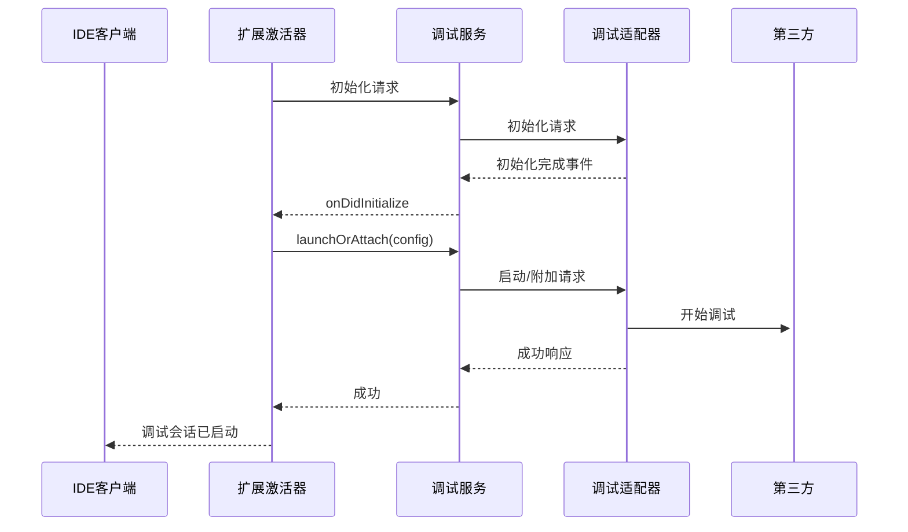

来源：src/vs/workbench/contrib/debug/browser/debugSession.ts50-400

### RawDebugSession

`RawDebugSession`类处理与调试适配器的直接通信。它封装了调试适配器协议的实现，并提供发送请求以及处理响应和事件的方法。

主要职责：

* 向调试适配器发送协议消息
* 处理来自调试适配器的响应和事件
* 管理调试适配器生命周期
* 处理协议特定的细节

来源：src/vs/workbench/contrib/debug/browser/rawDebugSession.ts40-200

## 协议初始化流程

当调试会话启动时，VS Code遵循特定的序列来初始化调试适配器并开始调试：

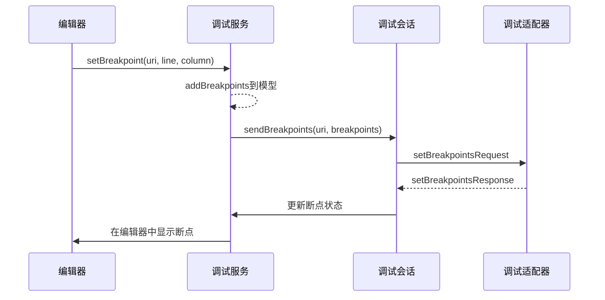

来源：src/vs/workbench/contrib/debug/browser/debugService.ts350-450 src/vs/workbench/contrib/debug/browser/debugSession.ts330-400 src/vs/workbench/contrib/debug/browser/rawDebugSession.ts150-200

## 断点管理

断点是调试的基本部分。VS Code通过调试适配器协议管理断点：

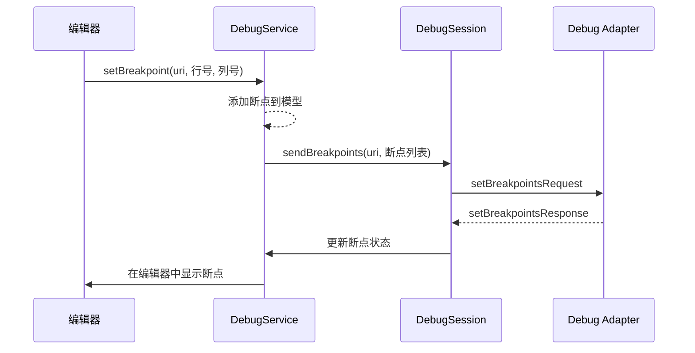

来源：src/vs/workbench/contrib/debug/browser/debugSession.ts480-550 src/vs/workbench/contrib/debug/browser/breakpointEditorContribution.ts1-100

## 执行控制

调试适配器协议提供了控制被调试程序执行的命令：

| 命令 | 目的 | 实现 |
| ------ | ------ | ------ |
| continue | 恢复执行 | DebugSession.continue() |
| next | 单步跳过 | DebugSession.next() |
| stepIn | 单步进入 | DebugSession.stepIn() |
| stepOut | 单步跳出 | DebugSession.stepOut() |
| pause | 暂停执行 | DebugSession.pause() |
| terminate | 结束调试 | DebugSession.terminate() |

来源：src/vs/workbench/contrib/debug/browser/debugSession.ts440-480 src/vs/workbench/contrib/debug/browser/debugCommands.ts50-70

## 变量和表达式评估

调试适配器协议允许VS Code在被调试程序的上下文中检查变量和评估表达式：

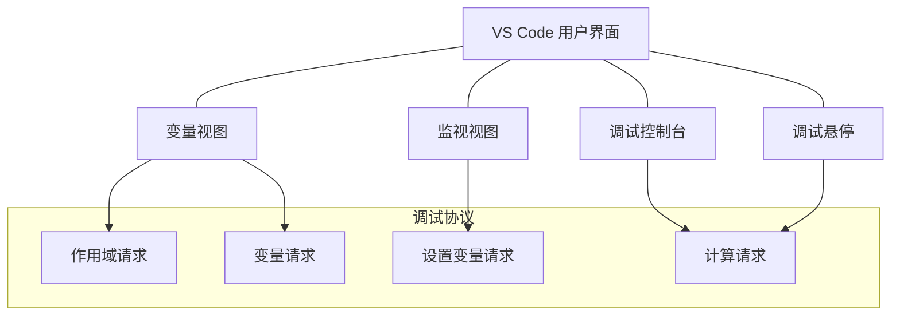

来源：src/vs/workbench/contrib/debug/browser/variablesView.ts1-100 src/vs/workbench/contrib/debug/browser/watchExpressionsView.ts1-50 src/vs/workbench/contrib/debug/browser/repl.ts1-100

## 调试适配器能力

调试适配器可以向VS Code通告其能力，这允许VS Code根据适配器支持的功能启用或禁用某些特性：

VS Code使用这些能力动态调整其UI和行为。例如，只有当调试适配器支持向后单步时，"后退"按钮才会启用。

来源：src/vs/workbench/contrib/debug/common/debug.ts400-450 src/vs/workbench/contrib/debug/browser/debugSession.ts280-300

## 调试适配器实现

调试适配器可以通过各种方式实现：

1. **进程内（In-process）**：适配器在VS Code的进程内运行
2. **服务器（Server）**：适配器作为VS Code通信的单独进程运行
3. **可执行文件（Executable）**：VS Code将适配器作为单独的可执行文件启动
4. **命名管道（Named Pipe）**：VS Code通过命名管道连接到适配器

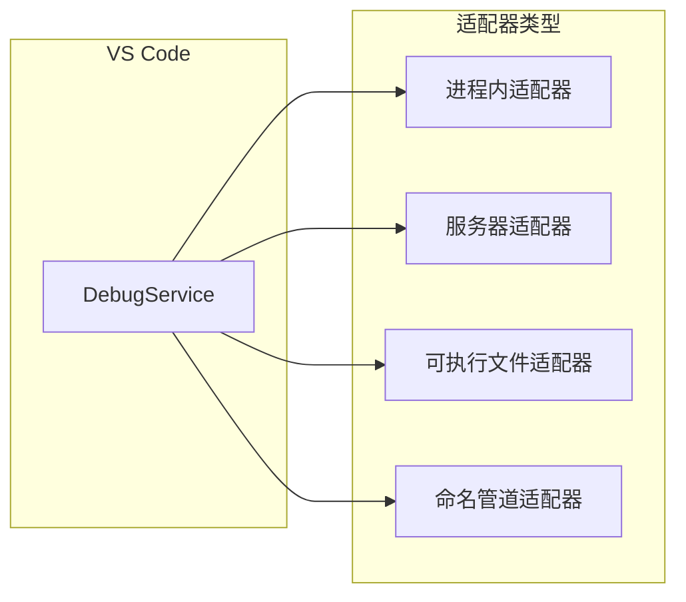

来源：src/vs/workbench/contrib/debug/common/debug.ts180-220 src/vs/workbench/contrib/debug/browser/debugAdapterManager.ts1-50

## 扩展集成

VS Code扩展可以通过扩展API贡献调试适配器。这允许扩展为特定语言或运行时提供调试支持。

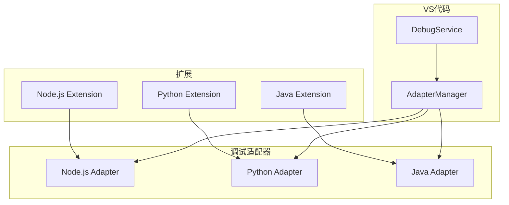

来源：src/vs/workbench/api/browser/mainThreadDebugService.ts1-50 src/vs/workbench/api/common/extHostDebugService.ts1-50

## 调试配置

调试配置在`launch.json`文件中定义，指定如何启动或附加到程序进行调试。调试适配器协议使用这些配置启动调试会话。

```mermaid
{
    "version": "0.2.0",
    "configurations": [
        {
            "type": "node",
            "request": "launch",
            "name": "Launch Program",
            "program": "${workspaceFolder}/app.js"
        }
    ]
}
```
VS Code提供了一个配置管理器，用于加载、解析和管理调试配置。

来源：src/vs/workbench/contrib/debug/browser/debugConfigurationManager.ts1-100

## 错误处理

调试适配器协议包含错误处理机制：

1. **响应错误**：调试适配器可以返回请求的错误响应
2. **事件通知**：调试适配器可以发送事件通知VS Code错误
3. **终止事件**：调试适配器可以在意外终止时通知VS Code

VS Code处理这些错误并向用户呈现适当的UI反馈。

来源：

* src/vs/workbench/contrib/debug/browser/rawDebugSession.ts200-250
* src/vs/workbench/contrib/debug/browser/debugSession.ts400-450

## UI集成

VS Code的UI通过各种组件与调试适配器协议集成：

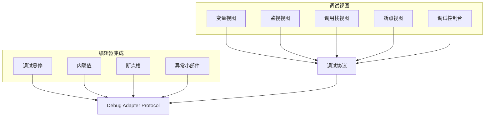

来源：src/vs/workbench/contrib/debug/browser/variablesView.ts1-50 src/vs/workbench/contrib/debug/browser/callStackView.ts1-50 src/vs/workbench/contrib/debug/browser/breakpointsView.ts1-50 src/vs/workbench/contrib/debug/browser/repl.ts1-50 src/vs/workbench/contrib/debug/browser/debugHover.ts1-50 src/vs/workbench/contrib/debug/browser/debugEditorContribution.ts1-50

## 多会话调试

VS Code支持通过多个调试会话同时调试多个程序。每个会话使用调试适配器协议与自己的调试适配器通信。

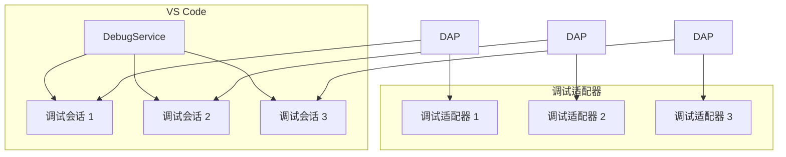

来源：

* src/vs/workbench/contrib/debug/browser/debugService.ts150-200
* src/vs/workbench/contrib/debug/browser/debugToolBar.ts1-50

## 结论

调试适配器协议是一个强大的抽象，使VS Code能够支持广泛的编程语言和运行时的调试。通过标准化编辑器和调试适配器之间的通信，它让VS Code能够提供一致的调试体验，无论底层调试器实现如何。

协议的设计允许可扩展性，使得新的调试功能能够在保持向后兼容性的同时添加。这使得VS Code的调试能力能够随着时间的推移而发展，支持诸如条件断点、数据断点和调试可视化等高级功能。
