# 聊天和AI集成

相关源文件

* [extensions/vscode-api-tests/src/singlefolder-tests/chat.test.ts](../../extensions/vscode-api-tests/src/singlefolder-tests/chat.test.ts)
* [src/vs/base/browser/ui/hover/hoverWidget.css](../../src/vs/base/browser/ui/hover/hoverWidget.css)
* [src/vs/editor/browser/services/hoverService/hover.css](../../src/vs/editor/browser/services/hoverService/hover.css)
* [src/vs/workbench/api/browser/mainThreadChatAgents2.ts](../../src/vs/workbench/api/browser/mainThreadChatAgents2.ts)
* [src/vs/workbench/api/browser/mainThreadChatStatus.ts](../../src/vs/workbench/api/browser/mainThreadChatStatus.ts)
* [src/vs/workbench/api/common/extHostChatAgents2.ts](../../src/vs/workbench/api/common/extHostChatAgents2.ts)
* [src/vs/workbench/api/common/extHostChatStatus.ts](../../src/vs/workbench/api/common/extHostChatStatus.ts)
* [src/vs/workbench/contrib/chat/browser/actions/chatActions.ts](../../src/vs/workbench/contrib/chat/browser/actions/chatActions.ts)
* [src/vs/workbench/contrib/chat/browser/actions/chatClearActions.ts](../../src/vs/workbench/contrib/chat/browser/actions/chatClearActions.ts)
* [src/vs/workbench/contrib/chat/browser/actions/chatCodeblockActions.ts](../../src/vs/workbench/contrib/chat/browser/actions/chatCodeblockActions.ts)
* [src/vs/workbench/contrib/chat/browser/actions/chatContextActions.ts](../../src/vs/workbench/contrib/chat/browser/actions/chatContextActions.ts)
* [src/vs/workbench/contrib/chat/browser/actions/chatExecuteActions.ts](../../src/vs/workbench/contrib/chat/browser/actions/chatExecuteActions.ts)
* [src/vs/workbench/contrib/chat/browser/actions/chatGettingStarted.ts](../../src/vs/workbench/contrib/chat/browser/actions/chatGettingStarted.ts)
* [src/vs/workbench/contrib/chat/browser/actions/chatMoveActions.ts](../../src/vs/workbench/contrib/chat/browser/actions/chatMoveActions.ts)
* [src/vs/workbench/contrib/chat/browser/actions/chatQuickInputActions.ts](../../src/vs/workbench/contrib/chat/browser/actions/chatQuickInputActions.ts)
* [src/vs/workbench/contrib/chat/browser/actions/chatTitleActions.ts](../../src/vs/workbench/contrib/chat/browser/actions/chatTitleActions.ts)
* [src/vs/workbench/contrib/chat/browser/chat.contribution.ts](../../src/vs/workbench/contrib/chat/browser/chat.contribution.ts)
* [src/vs/workbench/contrib/chat/browser/chat.ts](../../src/vs/workbench/contrib/chat/browser/chat.ts)
* [src/vs/workbench/contrib/chat/browser/chatEditing/chatEditingActions.ts](../../src/vs/workbench/contrib/chat/browser/chatEditing/chatEditingActions.ts)
* [src/vs/workbench/contrib/chat/browser/chatEditor.ts](../../src/vs/workbench/contrib/chat/browser/chatEditor.ts)
* [src/vs/workbench/contrib/chat/browser/chatEditorInput.ts](../../src/vs/workbench/contrib/chat/browser/chatEditorInput.ts)
* [src/vs/workbench/contrib/chat/browser/chatInputPart.ts](../../src/vs/workbench/contrib/chat/browser/chatInputPart.ts)
* [src/vs/workbench/contrib/chat/browser/chatListRenderer.ts](../../src/vs/workbench/contrib/chat/browser/chatListRenderer.ts)
* [src/vs/workbench/contrib/chat/browser/chatQuick.ts](../../src/vs/workbench/contrib/chat/browser/chatQuick.ts)
* [src/vs/workbench/contrib/chat/browser/chatSetup.ts](../../src/vs/workbench/contrib/chat/browser/chatSetup.ts)
* [src/vs/workbench/contrib/chat/browser/chatStatus.ts](../../src/vs/workbench/contrib/chat/browser/chatStatus.ts)
* [src/vs/workbench/contrib/chat/browser/chatStatusItemService.ts](../../src/vs/workbench/contrib/chat/browser/chatStatusItemService.ts)
* [src/vs/workbench/contrib/chat/browser/chatViewPane.ts](../../src/vs/workbench/contrib/chat/browser/chatViewPane.ts)
* [src/vs/workbench/contrib/chat/browser/chatWidget.ts](../../src/vs/workbench/contrib/chat/browser/chatWidget.ts)
* [src/vs/workbench/contrib/chat/browser/codeBlockPart.css](../../src/vs/workbench/contrib/chat/browser/codeBlockPart.css)
* [src/vs/workbench/contrib/chat/browser/codeBlockPart.ts](../../src/vs/workbench/contrib/chat/browser/codeBlockPart.ts)
* [src/vs/workbench/contrib/chat/browser/media/chat.css](../../src/vs/workbench/contrib/chat/browser/media/chat.css)
* [src/vs/workbench/contrib/chat/browser/media/chatSetup.css](../../src/vs/workbench/contrib/chat/browser/media/chatSetup.css)
* [src/vs/workbench/contrib/chat/browser/media/chatStatus.css](../../src/vs/workbench/contrib/chat/browser/media/chatStatus.css)
* [src/vs/workbench/contrib/chat/common/chatAgents.ts](../../src/vs/workbench/contrib/chat/common/chatAgents.ts)
* [src/vs/workbench/contrib/chat/common/chatContextKeys.ts](../../src/vs/workbench/contrib/chat/common/chatContextKeys.ts)
* [src/vs/workbench/contrib/chat/common/chatEntitlementService.ts](../../src/vs/workbench/contrib/chat/common/chatEntitlementService.ts)
* [src/vs/workbench/contrib/chat/common/chatModel.ts](../../src/vs/workbench/contrib/chat/common/chatModel.ts)
* [src/vs/workbench/contrib/chat/common/chatService.ts](../../src/vs/workbench/contrib/chat/common/chatService.ts)
* [src/vs/workbench/contrib/chat/common/chatServiceImpl.ts](../../src/vs/workbench/contrib/chat/common/chatServiceImpl.ts)
* [src/vs/workbench/contrib/chat/common/chatViewModel.ts](../../src/vs/workbench/contrib/chat/common/chatViewModel.ts)
* [src/vs/workbench/contrib/chat/test/common/chatService.test.ts](../../src/vs/workbench/contrib/chat/test/common/chatService.test.ts)
* [src/vs/workbench/services/editor/common/editorGroupFinder.ts](../../src/vs/workbench/services/editor/common/editorGroupFinder.ts)
* [src/vscode-dts/vscode.proposed.chatParticipantAdditions.d.ts](../../src/vscode-dts/vscode.proposed.chatParticipantAdditions.d.ts)
* [src/vscode-dts/vscode.proposed.chatStatusItem.d.ts](../../src/vscode-dts/vscode.proposed.chatStatusItem.d.ts)

本页面概述了VS Code的聊天和AI集成系统，该系统支持Copilot Chat、内联聊天和AI辅助编辑等功能。该系统管理用户与AI模型之间的对话，处理从UI渲染到处理请求和响应的所有内容。

有关语言模型及其配置的信息，请参阅语言模型。有关扩展对聊天系统的贡献的信息，请参阅扩展系统。

## 架构概述

聊天系统由多个相互连接的组件组成，共同协作提供无缝的聊天体验。在高层次上，架构包括UI组件、处理请求和响应的服务，以及与语言模型的集成。

**聊天系统架构**

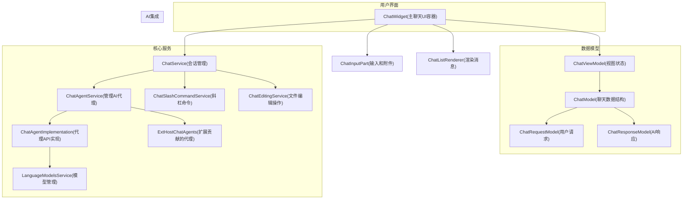

来源：

* src/vs/workbench/contrib/chat/browser/chatWidget.ts98-650
* src/vs/workbench/contrib/chat/common/chatServiceImpl.ts106-236
* src/vs/workbench/contrib/chat/common/chatAgents.ts178-315
* src/vs/workbench/contrib/chat/browser/chatInputPart.ts136-200
* src/vs/workbench/contrib/chat/browser/chatListRenderer.ts118-168

## 聊天请求-响应流程

聊天系统通过组件之间的一系列交互处理用户输入并生成响应。此流程从用户输入开始，以渲染响应结束。

**聊天请求-响应流程**

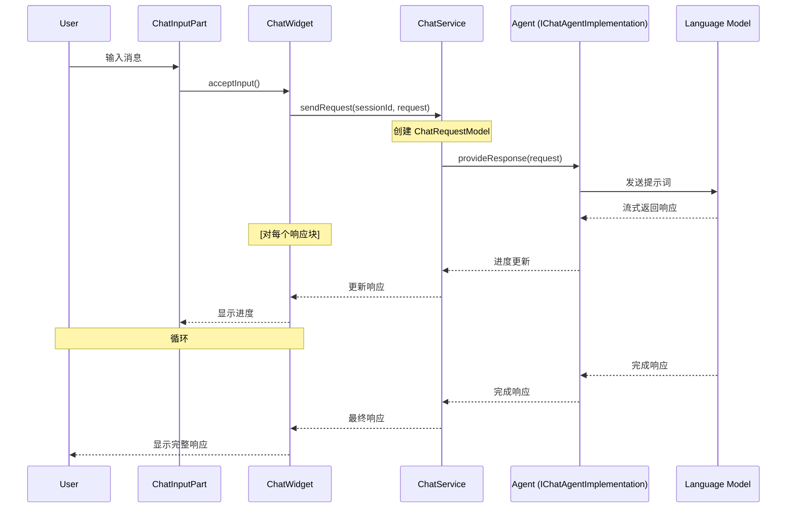

来源：

* src/vs/workbench/contrib/chat/browser/chatWidget.ts1250-1350
* src/vs/workbench/contrib/chat/common/chatServiceImpl.ts450-550
* src/vs/workbench/contrib/chat/browser/chatInputPart.ts760-780

## 关键组件

### 聊天小部件（Chat Widget）

`ChatWidget`是协调聊天体验的核心UI组件。它管理聊天视图模型，处理聊天项的渲染，并协调输入和响应交互。

主要功能：

* 管理聊天视图模型和会话
* 通过列表渲染器渲染聊天消息
* 处理用户输入和请求
* 管理焦点和可见性状态
* 通过贡献系统与扩展协调

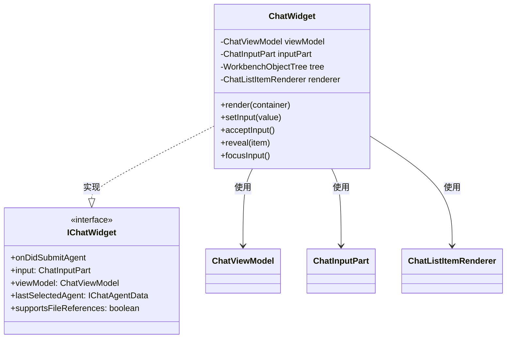

来源：

* src/vs/workbench/contrib/chat/browser/chatWidget.ts98-200
* src/vs/workbench/contrib/chat/browser/chat.ts98-150

### 聊天输入部分（Chat Input Part）

`ChatInputPart`管理聊天界面的输入区域，包括：

* 用于输入查询的输入编辑器
* 文件和变量的附件管理
* 历史导航
* 命令检测和处理
* 聊天模式切换（询问/代理/编辑）

显著特点：

* 支持文件和上下文附件
* 管理输入历史
* 处理代码片段、文件和命令等上下文变量
* 与不同聊天模式集成（询问/编辑/代理）

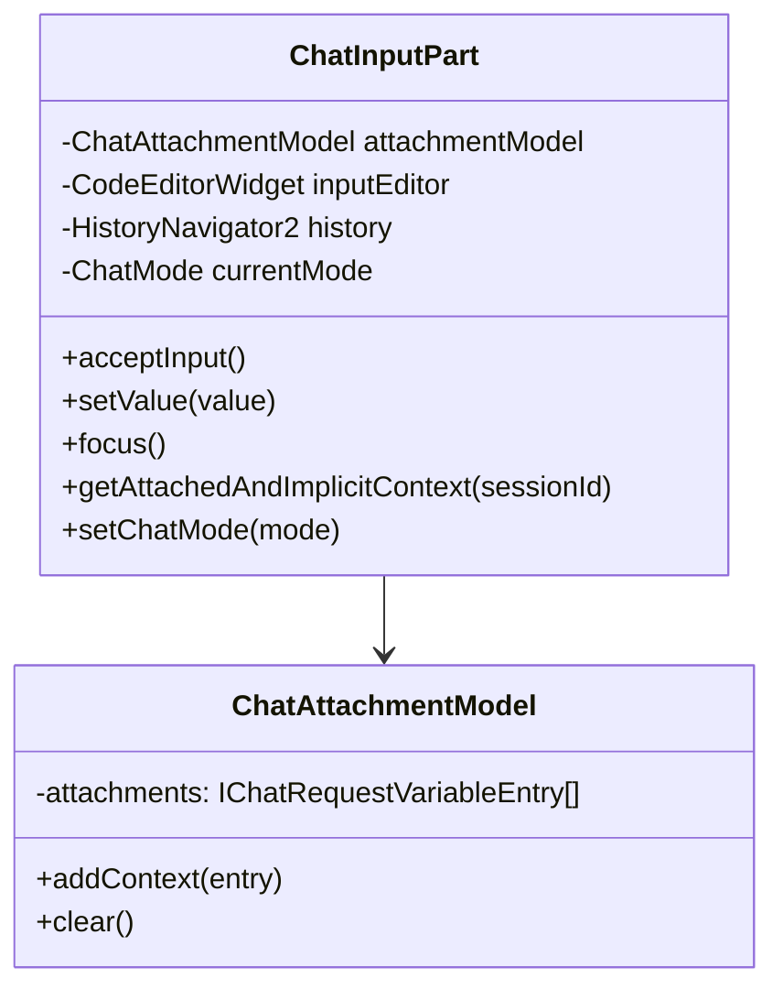

来源：

* src/vs/workbench/contrib/chat/browser/chatInputPart.ts136-450
* src/vs/workbench/contrib/chat/browser/chatInputPart.ts451-646

### 聊天服务（Chat Service）

`ChatService`是管理聊天会话、处理请求和与代理协调的中央服务。它：

* 管理聊天会话及其持久性
* 处理聊天请求并将其路由到适当的代理
* 处理响应和进度更新
* 提供会话管理API

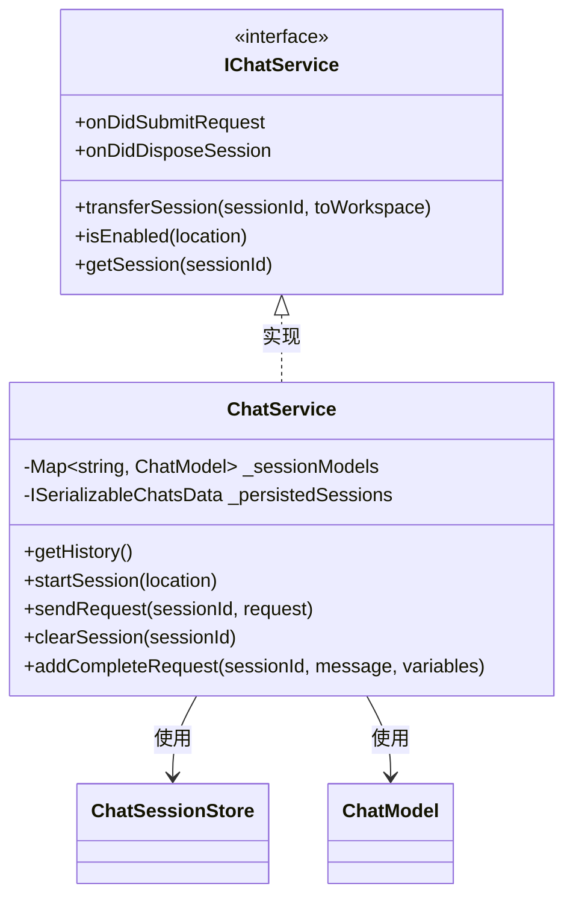

来源：

* src/vs/workbench/contrib/chat/common/chatServiceImpl.ts106-260
* src/vs/workbench/contrib/chat/common/chatService.ts277-330

### 聊天代理（Chat Agents）

聊天代理是处理用户查询并生成响应的AI后端。系统支持：

* 多种代理类型（默认、扩展贡献）
* 代理命令（斜杠命令）
* 代理消歧以确定哪个代理应处理请求

主要组件：

* `ChatAgentService` - 管理代理注册和选择
* `IChatAgentImplementation` - 代理实现的接口
* `SetupChatAgent` - 处理设置流程的特殊代理

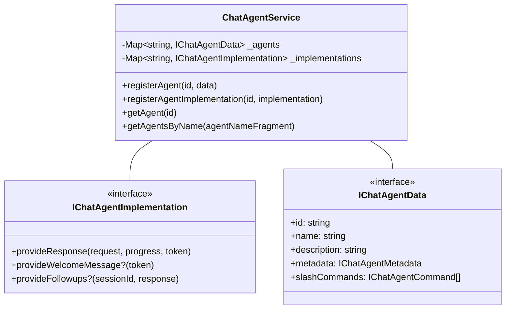

来源：

* src/vs/workbench/contrib/chat/common/chatAgents.ts178-315
* src/vs/workbench/contrib/chat/common/chatAgents.ts600-730
* src/vs/workbench/contrib/chat/browser/chatSetup.ts97-156

### 聊天列表渲染器（Chat List Renderer）

`ChatListItemRenderer`负责在UI中渲染聊天消息。它渲染：

* 用户请求
* 带有Markdown、代码块和其他内容的AI响应
* 进度指示器
* 反馈按钮和后续问题等交互元素

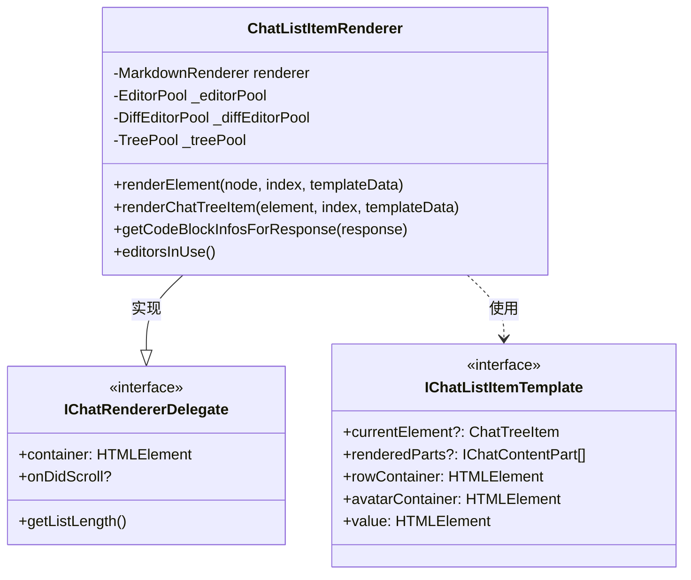

来源：

* src/vs/workbench/contrib/chat/browser/chatListRenderer.ts118-168
* src/vs/workbench/contrib/chat/browser/chatListRenderer.ts264-371

### 内容部分系统（Content Parts System）

聊天响应使用模块化内容部分系统渲染，支持各种内容类型：

| 内容部分类型              | 描述                                           |
| ------------------------- | ---------------------------------------------- |
| ChatMarkdownContentPart   | 渲染包括文本和简单格式化的Markdown内容         |
| ChatCodeBlockPart         | 渲染带有语法高亮和操作的代码                   |
| ChatTextEditContentPart   | 显示带有差异查看器的文本编辑                   |
| ChatTreeContentPart       | 显示文件树和层次数据                           |
| ChatAttachmentsContentPart| 显示附加文件和资源                             |
| ChatToolInvocationPart    | 显示工具执行和结果                             |
| ChatProgressContentPart   | 显示加载和进度指示器                           |
| ChatFollowups             | 显示建议的后续问题                             |

来源：

* src/vs/workbench/contrib/chat/browser/chatContentParts/chatMarkdownContentPart.ts
* src/vs/workbench/contrib/chat/browser/codeBlockPart.ts1-100
* src/vs/workbench/contrib/chat/browser/chatFollowups.ts

## 聊天模式和代理位置

聊天系统支持VS Code内不同的模式和位置：

### 聊天模式

VS Code的聊天系统支持三种主要模式：

1. **询问模式（`ChatMode.Ask`）**：标准聊天交互，用于提问和获取信息。
2. **编辑模式（`ChatMode.Edit`）**：专注于根据自然语言指令对代码文件进行编辑。
3. **代理模式（`ChatMode.Agent`）**：高级模式，AI可以使用工具并执行复杂任务。

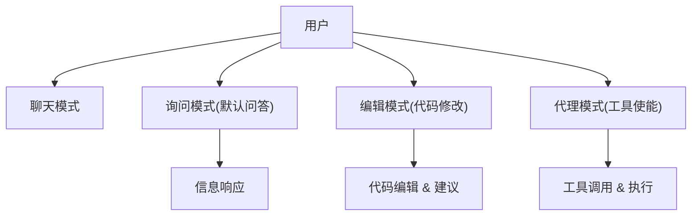

### 聊天位置

聊天可以在VS Code内多个位置使用：

| 位置                       | 描述               | 使用场景                     |
| -------------------------- | ------------------ | ---------------------------- |
| ChatAgentLocation.Panel    | 主聊天面板视图     | 一般问答，工作区范围的任务   |
| ChatAgentLocation.Editor   | 内联编辑器聊天     | 上下文特定的代码帮助         |
| ChatAgentLocation.Terminal | 终端集成           | 命令协助                     |
| ChatAgentLocation.Notebook | 笔记本集成         | 数据分析和解释               |

来源：

* src/vs/workbench/contrib/chat/common/constants.ts8-38
* src/vs/workbench/contrib/chat/browser/actions/chatExecuteActions.ts50-150
* src/vs/workbench/contrib/chat/browser/chatInputPart.ts480-490

## 聊天请求变量和上下文

聊天系统支持可以附加到聊天请求的各种类型的上下文，以获得更好的结果：

### 变量类型

| 变量类型           | 描述                      | 用途                            |
| ------------------ | ------------------------- | ------------------------------- |
| File Entry         | 工作区中的文件            | 提供代码文件的上下文            |
| Directory Entry    | 工作区中的文件夹          | 包含多个相关文件                |
| Paste Variable     | 复制的代码片段            | 不保存到文件而共享代码          |
| Symbol Variable    | 代码符号引用              | 引用特定的函数/类               |
| Image Variable     | 图像数据或引用            | 共享截图或图像                  |
| Implicit Variable  | 自动附加的上下文          | 当前文件或选择                  |
| Tool Variable      | 工具引用                  | 允许AI使用特定工具              |
| Diagnostic Variable| 代码问题                  | 询问关于错误或警告              |

变量可以在提示中使用`#`前缀引用，系统管理其序列化和附加到请求。

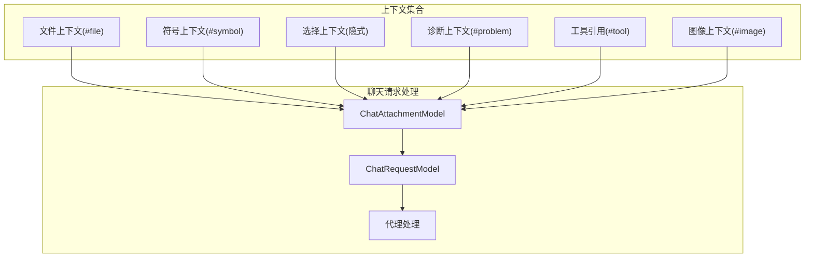

来源：

* src/vs/workbench/contrib/chat/common/chatModel.ts34-190
* src/vs/workbench/contrib/chat/browser/chatInputPart.ts165-191
* src/vs/workbench/contrib/chat/browser/actions/chatContextActions.ts68-113

## 聊天UI组件

### 核心UI结构

聊天UI由几个关键组件组成：

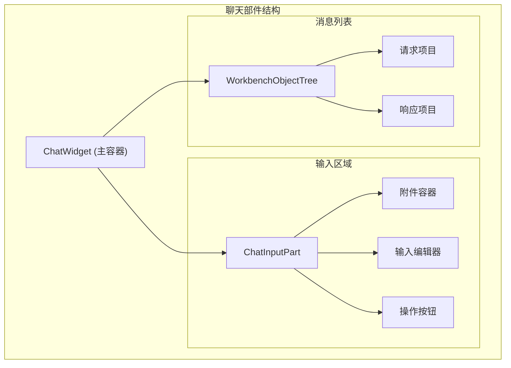

### 消息渲染结构

聊天消息使用基于组件的方法渲染：

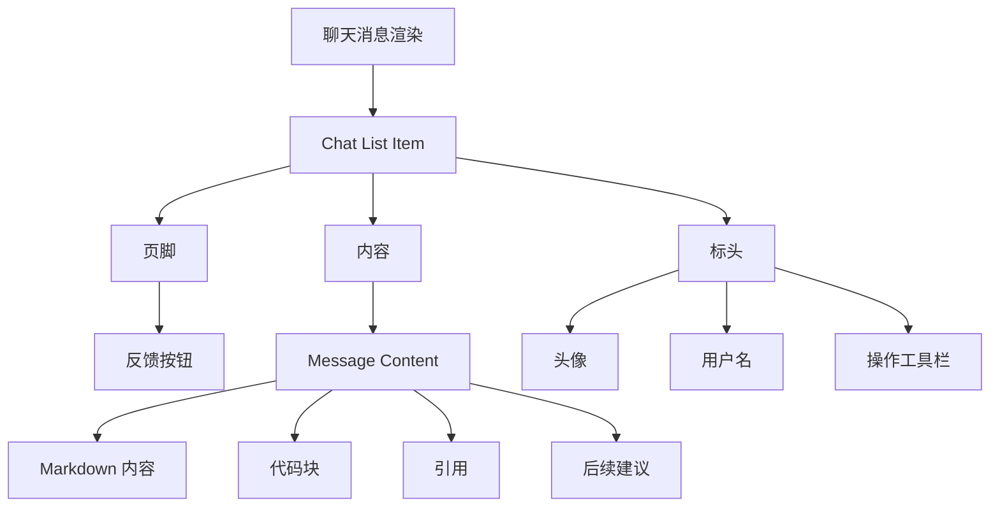

来源：

* src/vs/workbench/contrib/chat/browser/media/chat.css17-100
* src/vs/workbench/contrib/chat/browser/chatListRenderer.ts119-185
* src/vs/workbench/contrib/chat/browser/chatWidget.ts140-200

## 聊天操作和命令

聊天系统提供了许多用于与聊天交互的操作和命令：

| 操作类别        | 示例                        | 目的                         |
| --------------- | --------------------------- | ---------------------------- |
| 聊天执行        | 提交、取消、重试             | 控制聊天请求                |
| 聊天导航        | 新聊天、历史、清除           | 管理聊天会话                |
| 上下文操作      | 附加文件、附加选择           | 为聊天添加上下文            |
| 代码操作        | 插入、复制、应用             | 使用响应中的代码            |
| 编辑操作        | 接受更改、显示更改           | 管理AI建议的编辑            |
| 反馈操作        | 有帮助、没帮助               | 对响应提供反馈              |

来源：

* src/vs/workbench/contrib/chat/browser/actions/chatActions.ts104-188
* src/vs/workbench/contrib/chat/browser/actions/chatExecuteActions.ts50-97
* src/vs/workbench/contrib/chat/browser/actions/chatContextActions.ts68-95
* src/vs/workbench/contrib/chat/browser/actions/chatCodeblockActions.ts68-95

## 聊天编辑集成

聊天系统包含强大的代码编辑功能：

### 编辑流程

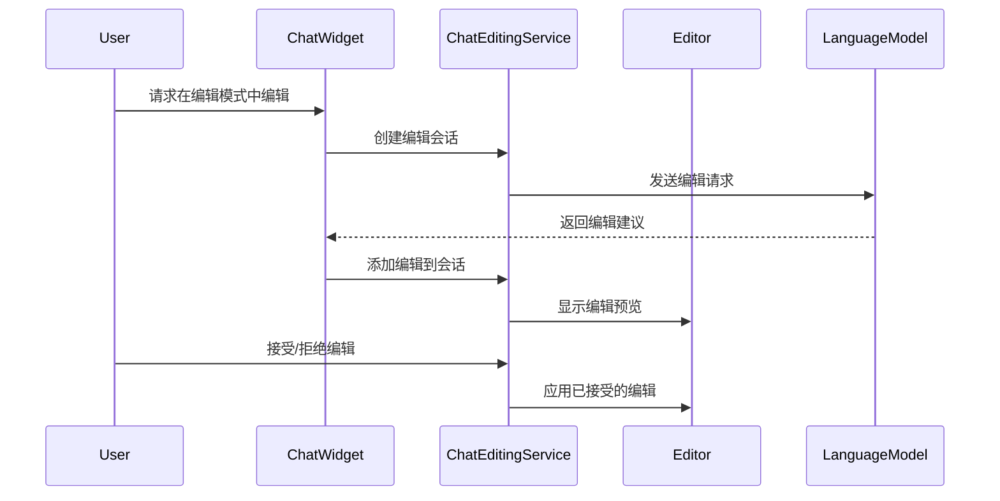

### 编辑功能

* 应用前预览更改
* 接受/拒绝单个编辑
* 查看建议更改的差异
* 将编辑应用到多个文件
* 跟踪编辑历史以进行撤销/重做

来源：

* src/vs/workbench/contrib/chat/browser/chatEditing/chatEditingActions.ts1-40
* src/vs/workbench/contrib/chat/common/chatEditingService.ts
* src/vs/workbench/contrib/chat/browser/actions/chatExecuteActions.ts248-310

## 扩展集成

聊天系统为第三方扩展提供扩展点，以便与AI功能集成：

* 聊天代理贡献
* 代理模式的工具集成
* 自定义斜杠命令
* 响应渲染自定义
* 变量类型扩展

例如，扩展可以注册自定义代理：

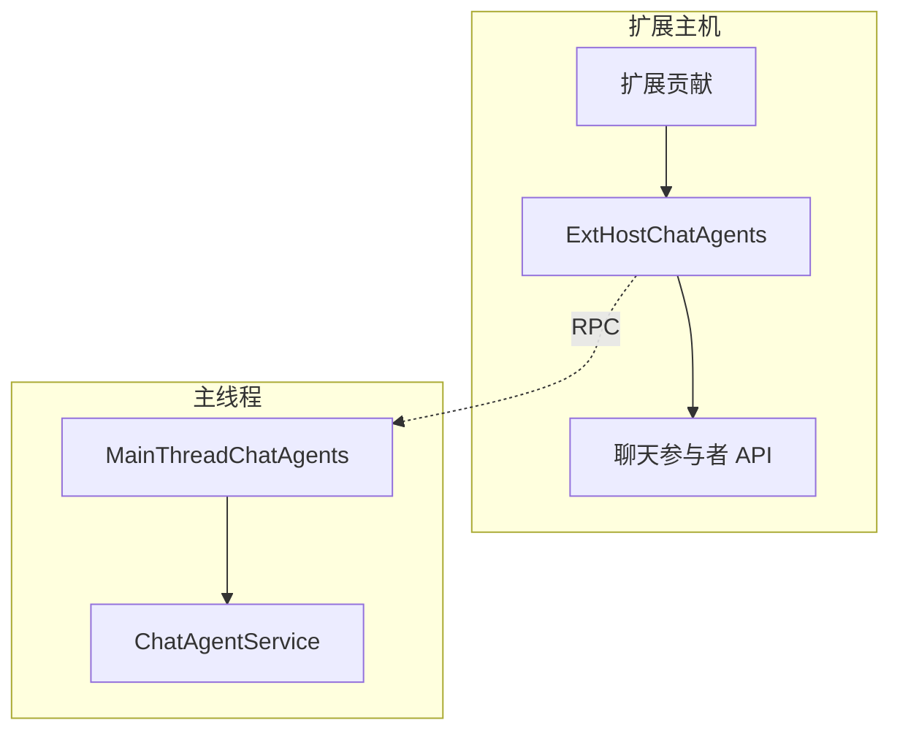

来源：

* src/vs/workbench/api/common/extHostChatAgents2.ts1-50
* src/vs/workbench/contrib/chat/browser/chat.contribution.ts54-107
* src/vscode-dts/vscode.proposed.chatParticipantAdditions.d.ts8-20

## 结论

VS Code的聊天和AI集成系统为AI辅助开发提供了全面的框架。模块化架构将UI、服务和AI交互之间的关注点分离，实现灵活且可扩展的聊天体验。该系统支持从简单的问答到复杂的基于代理的工具交互的各种使用模式，并与VS Code UI的多个部分集成。

丰富的上下文功能、详细的响应渲染和编辑集成的组合使这个系统对于在整个开发工作流程中寻求AI帮助的开发人员来说非常强大。
