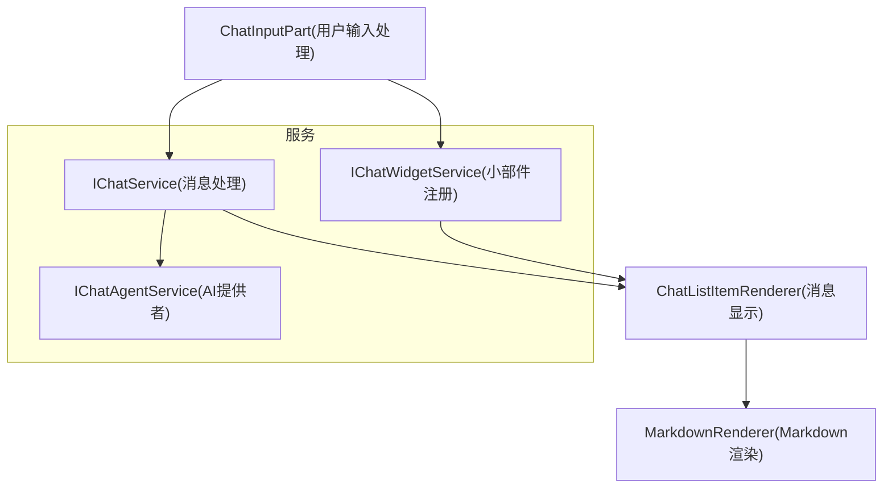
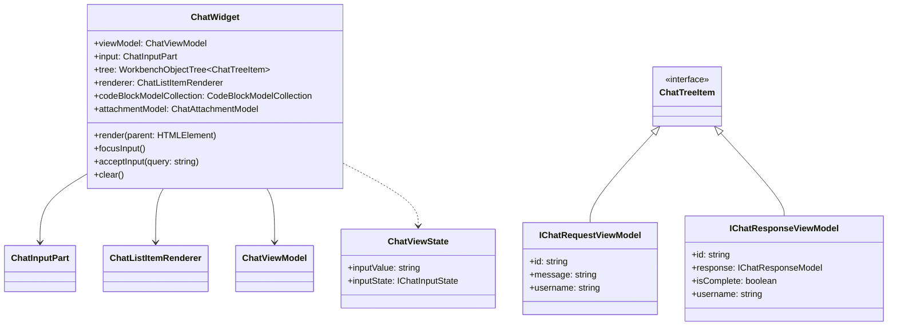
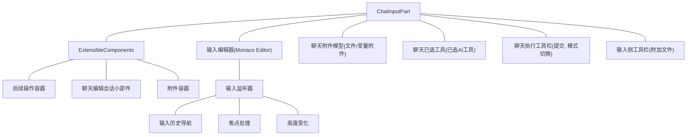
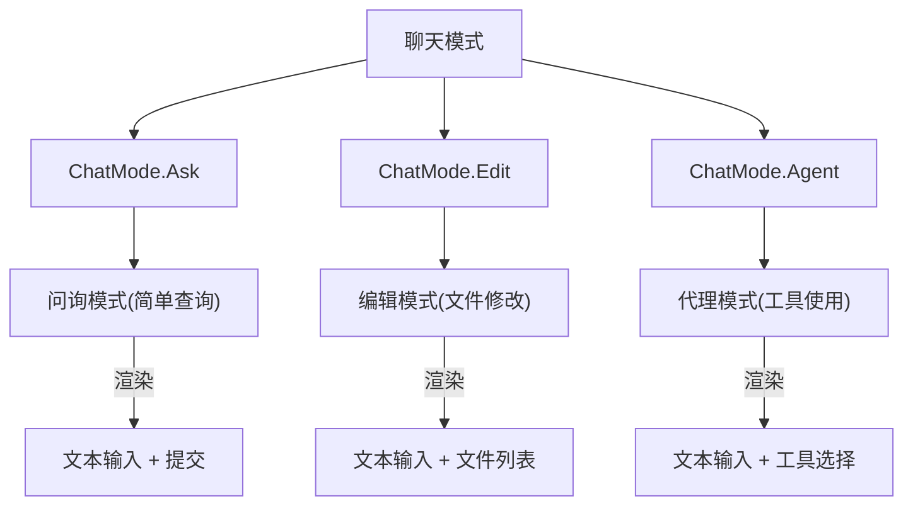
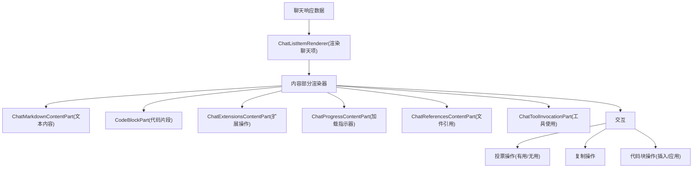
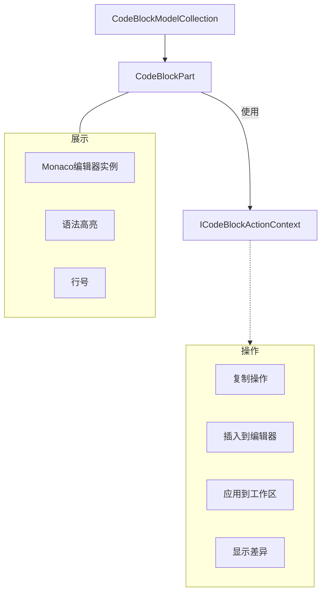
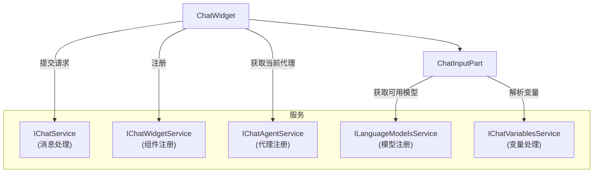

# 聊天UI组件

<details>
<summary>相关源文件</summary>

* [extensions/vscode-api-tests/src/singlefolder-tests/chat.test.ts](../../extensions/vscode-api-tests/src/singlefolder-tests/chat.test.ts)
* [src/vs/base/browser/ui/hover/hoverWidget.css](../../src/vs/base/browser/ui/hover/hoverWidget.css)
* [src/vs/editor/browser/services/hoverService/hover.css](../../src/vs/editor/browser/services/hoverService/hover.css)
* [src/vs/workbench/api/browser/mainThreadChatAgents2.ts](../../src/vs/workbench/api/browser/mainThreadChatAgents2.ts)
* [src/vs/workbench/api/browser/mainThreadChatStatus.ts](../../src/vs/workbench/api/browser/mainThreadChatStatus.ts)
* [src/vs/workbench/api/common/extHostChatAgents2.ts](../../src/vs/workbench/api/common/extHostChatAgents2.ts)
* [src/vs/workbench/api/common/extHostChatStatus.ts](../../src/vs/workbench/api/common/extHostChatStatus.ts)
* [src/vs/workbench/contrib/chat/browser/actions/chatActions.ts](../../src/vs/workbench/contrib/chat/browser/actions/chatActions.ts)
* [src/vs/workbench/contrib/chat/browser/actions/chatClearActions.ts](../../src/vs/workbench/contrib/chat/browser/actions/chatClearActions.ts)
* [src/vs/workbench/contrib/chat/browser/actions/chatCodeblockActions.ts](../../src/vs/workbench/contrib/chat/browser/actions/chatCodeblockActions.ts)
* [src/vs/workbench/contrib/chat/browser/actions/chatContextActions.ts](../../src/vs/workbench/contrib/chat/browser/actions/chatContextActions.ts)
* [src/vs/workbench/contrib/chat/browser/actions/chatExecuteActions.ts](../../src/vs/workbench/contrib/chat/browser/actions/chatExecuteActions.ts)
* [src/vs/workbench/contrib/chat/browser/actions/chatGettingStarted.ts](../../src/vs/workbench/contrib/chat/browser/actions/chatGettingStarted.ts)
* [src/vs/workbench/contrib/chat/browser/actions/chatMoveActions.ts](../../src/vs/workbench/contrib/chat/browser/actions/chatMoveActions.ts)
* [src/vs/workbench/contrib/chat/browser/actions/chatQuickInputActions.ts](../../src/vs/workbench/contrib/chat/browser/actions/chatQuickInputActions.ts)
* [src/vs/workbench/contrib/chat/browser/actions/chatTitleActions.ts](../../src/vs/workbench/contrib/chat/browser/actions/chatTitleActions.ts)
* [src/vs/workbench/contrib/chat/browser/chat.contribution.ts](../../src/vs/workbench/contrib/chat/browser/chat.contribution.ts)
* [src/vs/workbench/contrib/chat/browser/chat.ts](../../src/vs/workbench/contrib/chat/browser/chat.ts)
* [src/vs/workbench/contrib/chat/browser/chatEditing/chatEditingActions.ts](../../src/vs/workbench/contrib/chat/browser/chatEditing/chatEditingActions.ts)
* [src/vs/workbench/contrib/chat/browser/chatEditor.ts](../../src/vs/workbench/contrib/chat/browser/chatEditor.ts)
* [src/vs/workbench/contrib/chat/browser/chatEditorInput.ts](../../src/vs/workbench/contrib/chat/browser/chatEditorInput.ts)
* [src/vs/workbench/contrib/chat/browser/chatInputPart.ts](../../src/vs/workbench/contrib/chat/browser/chatInputPart.ts)
* [src/vs/workbench/contrib/chat/browser/chatListRenderer.ts](../../src/vs/workbench/contrib/chat/browser/chatListRenderer.ts)
* [src/vs/workbench/contrib/chat/browser/chatQuick.ts](../../src/vs/workbench/contrib/chat/browser/chatQuick.ts)
* [src/vs/workbench/contrib/chat/browser/chatSetup.ts](../../src/vs/workbench/contrib/chat/browser/chatSetup.ts)
* [src/vs/workbench/contrib/chat/browser/chatStatus.ts](../../src/vs/workbench/contrib/chat/browser/chatStatus.ts)
* [src/vs/workbench/contrib/chat/browser/chatStatusItemService.ts](../../src/vs/workbench/contrib/chat/browser/chatStatusItemService.ts)
* [src/vs/workbench/contrib/chat/browser/chatViewPane.ts](../../src/vs/workbench/contrib/chat/browser/chatViewPane.ts)
* [src/vs/workbench/contrib/chat/browser/chatWidget.ts](../../src/vs/workbench/contrib/chat/browser/chatWidget.ts)
* [src/vs/workbench/contrib/chat/browser/codeBlockPart.css](../../src/vs/workbench/contrib/chat/browser/codeBlockPart.css)
* [src/vs/workbench/contrib/chat/browser/codeBlockPart.ts](../../src/vs/workbench/contrib/chat/browser/codeBlockPart.ts)
* [src/vs/workbench/contrib/chat/browser/media/chat.css](../../src/vs/workbench/contrib/chat/browser/media/chat.css)
* [src/vs/workbench/contrib/chat/browser/media/chatSetup.css](../../src/vs/workbench/contrib/chat/browser/media/chatSetup.css)
* [src/vs/workbench/contrib/chat/browser/media/chatStatus.css](../../src/vs/workbench/contrib/chat/browser/media/chatStatus.css)
* [src/vs/workbench/contrib/chat/common/chatAgents.ts](../../src/vs/workbench/contrib/chat/common/chatAgents.ts)
* [src/vs/workbench/contrib/chat/common/chatContextKeys.ts](../../src/vs/workbench/contrib/chat/common/chatContextKeys.ts)
* [src/vs/workbench/contrib/chat/common/chatEntitlementService.ts](../../src/vs/workbench/contrib/chat/common/chatEntitlementService.ts)
* [src/vs/workbench/contrib/chat/common/chatModel.ts](../../src/vs/workbench/contrib/chat/common/chatModel.ts)
* [src/vs/workbench/contrib/chat/common/chatService.ts](../../src/vs/workbench/contrib/chat/common/chatService.ts)
* [src/vs/workbench/contrib/chat/common/chatServiceImpl.ts](../../src/vs/workbench/contrib/chat/common/chatServiceImpl.ts)
* [src/vs/workbench/contrib/chat/common/chatViewModel.ts](../../src/vs/workbench/contrib/chat/common/chatViewModel.ts)
* [src/vs/workbench/contrib/chat/test/common/chatService.test.ts](../../src/vs/workbench/contrib/chat/test/common/chatService.test.ts)
* [src/vs/workbench/services/editor/common/editorGroupFinder.ts](../../src/vs/workbench/services/editor/common/editorGroupFinder.ts)
* [src/vscode-dts/vscode.proposed.chatParticipantAdditions.d.ts](../../src/vscode-dts/vscode.proposed.chatParticipantAdditions.d.ts)
* [src/vscode-dts/vscode.proposed.chatStatusItem.d.ts](../../src/vscode-dts/vscode.proposed.chatStatusItem.d.ts)
</details>

本文档介绍了VS Code聊天功能的用户界面组件，解释了聊天小部件、输入区域、消息渲染和相关UI元素的布局和交互方式。关于聊天服务后端的信息，请参阅聊天服务。

## 概述

VS Code的聊天UI提供了一个对话界面，用于与GitHub Copilot等AI助手进行交互。UI组件创建了一个支持文本输入、上下文附件、富消息渲染（包括Markdown和代码块）以及各种用户交互（如投票、代码插入等）的聊天体验。

主要UI组件包括：

* 聊天小部件：承载整个聊天体验的容器
* 输入部分：处理文本输入、附件和提交
* 消息列表渲染器：显示聊天请求和响应
* 代码块部分：渲染和管理响应中的代码块



来源：

* src/vs/workbench/contrib/chat/browser/chatWidget.ts96-592
* src/vs/workbench/contrib/chat/browser/chatInputPart.ts6-136
* src/vs/workbench/contrib/chat/browser/chat.ts28-101
* src/vs/workbench/contrib/chat/browser/chatListRenderer.ts118-365

## 聊天小部件架构

`ChatWidget`作为主要容器组件，负责协调聊天体验。它管理：

* 聊天视图模型
* 用于显示请求和响应的消息列表
* 用于接收用户输入的输入部分
* 处理滚动、焦点和内容高度变化等事件



`ChatWidget`实现了`IChatWidget`接口，该接口定义了聊天体验所需的核心功能。这使得不同的聊天实现（如标准聊天视图和快速聊天）能够提供一致的功能。

来源：

* src/vs/workbench/contrib/chat/browser/chatWidget.ts98-592
* src/vs/workbench/contrib/chat/browser/chat.ts74-100
* src/vs/workbench/contrib/chat/common/chatViewModel.ts1-25

## 聊天输入部分

`ChatInputPart`是一个复杂的组件，用于处理用户输入。它包括：

* 用于文本输入的输入编辑器
* 对变量附件的支持（文件、代码片段等）
* 用于显示当前活动模式的UI（提问、编辑、代理）
* 带有操作的工具栏（发送、切换模型等）
* 历史记录导航

### 输入部分结构

`ChatInputPart`输入部分采用模块化设计，以支持不同的功能：



* 带有Monaco编辑器功能的文本输入编辑器
* 支持附加上下文（文件、代码片段、图像）
* 用于建议回复的后续问题
* 用于显示正在修改的文件的编辑会话

来源：

* src/vs/workbench/contrib/chat/browser/chatInputPart.ts134-1815
* src/vs/workbench/contrib/chat/browser/media/chat.css583-1092

### 输入模式

聊天输入支持几种模式：

| 模式   | 描述                 | UI组件                  | 主要操作                      |
| ------ | -------------------- | ----------------------- | ----------------------------- |
| 提问   | 标准聊天查询         | 文本输入、上下文附件    | ChatSubmitAction              |
| 编辑   | 修改工作区文件       | 文本输入、工作集文件    | ChatEditingSessionSubmitAction|
| 代理   | 工具增强响应         | 文本输入、工具选择      | ChatAgentSubmitAction         |

输入部分根据活动模式调整其UI：



来源：

* [src/vs/workbench/contrib/chat/browser/actions/chatExecuteActions.ts](../../src/vs/workbench/contrib/chat/browser/actions/chatExecuteActions.ts)50-229
* [src/vs/workbench/contrib/chat/browser/chatInputPart.ts](../../src/vs/workbench/contrib/chat/browser/chatInputPart.ts)475-497
* [src/vs/workbench/contrib/chat/common/constants.ts](../../src/vs/workbench/contrib/chat/common/constants.ts)

### 附件

输入部分通过`ChatAttachmentModel`提供对附件的完善支持：

| 附件类型       | 描述                | 图标         | 实现                            |
| -------------- | ------------------- | ------------ | ------------------------------- |
| 文件           | 工作区文件          | 文件图标     | IChatRequestFileEntry           |
| 目录           | 工作区文件夹        | 文件夹图标   | IChatRequestDirectoryEntry      |
| 代码粘贴       | 代码片段            | 代码图标     | IChatRequestPasteVariableEntry  |
| 图像           | 图像数据            | 图像图标     | IImageVariableEntry             |
| 工具           | AI工具引用          | 工具图标     | IChatRequestToolEntry           |
| 隐式上下文     | 活动编辑器内容      | 文件图标     | IChatRequestImplicitVariableEntry|
| 诊断           | 错误信息            | 错误图标     | IDiagnosticVariableEntry        |

来源：

* src/vs/workbench/contrib/chat/common/chatModel.ts34-211
* src/vs/workbench/contrib/chat/browser/chatInputPart.ts158-218
* src/vs/workbench/contrib/chat/browser/actions/chatContextActions.ts68-113

## 聊天列表渲染器

`ChatListItemRenderer`负责在树视图中显示聊天消息。它处理：

* 渲染聊天请求（用户输入）
* 渲染聊天响应（AI生成的内容）
* 渐进式渲染传入的响应
* 交互式元素，如代码块、后续问题和投票按钮

### 渲染架构



渲染器使用基于模板的方法来创建每个聊天项的UI：

```
请求模板：
- 头像
- 用户名
- 请求消息（带有变量格式）

响应模板：
- 头像
- 用户名
- 响应内容（渐进式Markdown渲染）
- 标题工具栏（带有操作）
- 页脚工具栏（带有投票操作）
```

来源：

* src/vs/workbench/contrib/chat/browser/chatListRenderer.ts118-371
* src/vs/workbench/contrib/chat/browser/media/chat.css6-134
* src/vs/workbench/contrib/chat/browser/actions/chatTitleActions.ts30-43

### 内容部分

聊天响应使用专门的内容部分渲染器来渲染不同类型的内容：

| 内容部分                 | 用途                   | 实现                         |
| ------------------------ | ---------------------- | ---------------------------- |
| ChatMarkdownContentPart  | 渲染markdown文本       | 使用VS Code的MarkdownRenderer|
| CodeBlockPart            | 带语法高亮渲染代码     | 使用Monaco编辑器实例         |
| ChatProgressContentPart  | 显示加载动画           | 使用动画省略号               |
| ChatReferencesContentPart| 显示引用的文件         | 使用列表组件                 |
| ChatToolInvocationPart   | 显示工具使用           | 使用可折叠部分               |
| ChatWarningContentPart   | 显示警告               | 使用警告样式                 |
| ChatTaskContentPart      | 显示任务进度           | 使用进度指示器               |

来源：

* src/vs/workbench/contrib/chat/browser/chatContentParts/chatContentParts.js
* src/vs/workbench/contrib/chat/browser/chatListRenderer.ts372-458
* src/vs/workbench/contrib/chat/browser/media/chat.css134-450

## 代码块组件

代码块是聊天UI的重要组成部分，提供带有交互功能的语法高亮代码片段。

### 代码块架构


代码块系统使用编辑器实例池高效渲染代码片段：

1. `EditorPool`管理一组可重用的Monaco编辑器实例
2. `CodeBlockPart`表示响应中的单个代码块
3. `CodeBlockModelCollection`管理所有代码块的文本模型
4. 操作提供复制、插入和应用代码等功能

来源：

* src/vs/workbench/contrib/chat/browser/codeBlockPart.ts1-320
* src/vs/workbench/contrib/chat/browser/actions/chatCodeblockActions.ts40-370
* src/vs/workbench/contrib/chat/common/codeBlockModelCollection.ts

### 代码块操作

代码块支持多种操作：

| 操作       | 快捷键    | 描述                 | 实现                        |
| ---------- | --------- | -------------------- | --------------------------- |
| 复制       | Ctrl+C    | 复制代码到剪贴板     | CopyAction                  |
| 插入       | Alt+Insert| 在编辑器光标处插入   | InsertCodeBlockOperation    |
| 应用       | Alt+A     | 应用更改到工作区     | ApplyCodeBlockOperation     |
| 比较       | Alt+C     | 与当前文件显示差异   | CompareCodeBlockWithFileAction|
| 作为文件查看| Alt+V     | 作为临时文件打开     | OpenCodeBlockAsFileAction   |
| 终端       | Alt+T     | 在终端中运行         | RunInTerminalAction         |

来源：

* src/vs/workbench/contrib/chat/browser/actions/chatCodeblockActions.ts67-230
* src/vs/workbench/contrib/chat/browser/codeBlockPart.ts240-340

## 聊天样式

聊天UI使用CSS中定义的一致样式系统：

### 消息容器

```
.interactive-session                     (主容器)
├── .interactive-list                    (消息列表)
│   └── .monaco-list-row                 (列表行)
│       └── .interactive-item-container  (消息容器)
│           ├── .header                  (包含用户信息)
│           │   ├── .user                (用户部分)
│           │   │   ├── .avatar-container (头像)
│           │   │   └── .username        (用户名)
│           │   └── .monaco-toolbar      (消息工具栏)
│           ├── .value                   (消息内容)
│           │   └── .rendered-markdown   (Markdown内容)
│           └── .chat-footer-toolbar     (投票按钮等)
└── .interactive-input-part             (输入容器)
    └── .chat-input-container           (输入编辑器)
```

来源：

* src/vs/workbench/contrib/chat/browser/media/chat.css6-800
* src/vs/workbench/contrib/chat/browser/chatListRenderer.ts265-307

### 输入部分样式

输入部分有自己的样式结构：

```
.interactive-input-part
├── .chat-input-container               (主输入容器)
│   ├── .chat-editor-container          (编辑器容器)
│   └── .chat-input-toolbars            (输入工具栏容器)
│       ├── .chat-execute-toolbar       (提交按钮，模型选择器)
│       └── [其他工具栏]
├── .chat-attachments-container         (附件区域)
│   ├── .chat-attachment-toolbar        (附件操作)
│   ├── .chat-attached-context          (附加的文件/变量)
│   └── .chat-related-files             (相关文件部分)
└── .interactive-input-followups        (后续问题部分)
```

来源：

* src/vs/workbench/contrib/chat/browser/media/chat.css583-948
* src/vs/workbench/contrib/chat/browser/chatInputPart.ts825-867

## 小部件注册和服务集成

聊天UI组件通过几个服务与VS Code的服务架构集成：



`ChatWidgetService`作为所有聊天小部件的注册表，允许它们之间的协调并提供对最近聚焦小部件的访问。

来源：

* src/vs/workbench/contrib/chat/browser/chat.ts28-62
* src/vs/workbench/contrib/chat/browser/chatWidget.ts482-499
* src/vs/workbench/contrib/chat/browser/chat.contribution.ts350-443

## 结论

VS Code聊天UI组件形成了一个全面且可扩展的对话界面系统。该架构采用模块化方法，使用专门的组件处理输入、消息渲染和代码块交互。系统与VS Code服务集成，用于聊天代理管理、语言模型访问和小部件注册。

这种模块化设计允许：

1. 多种聊天实现（面板、编辑器、快速聊天）
2. 通过自定义内容部分实现可扩展性
3. 与代码块和其他内容进行丰富交互
4. 高效渲染大型聊天历史

了解这些组件为扩展VS Code的聊天功能或实现类似的对话界面提供了基础。
