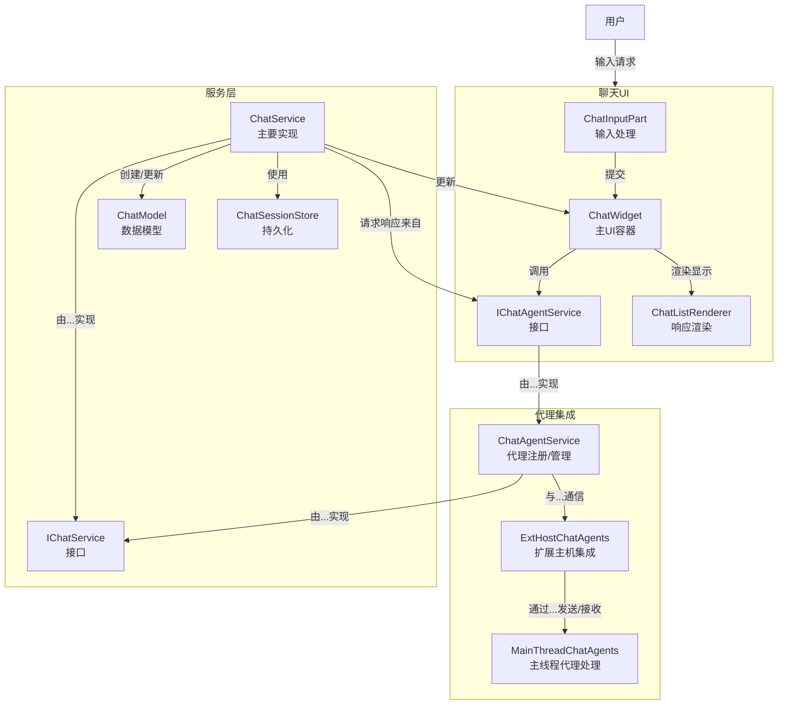
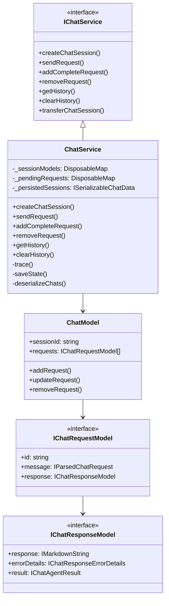
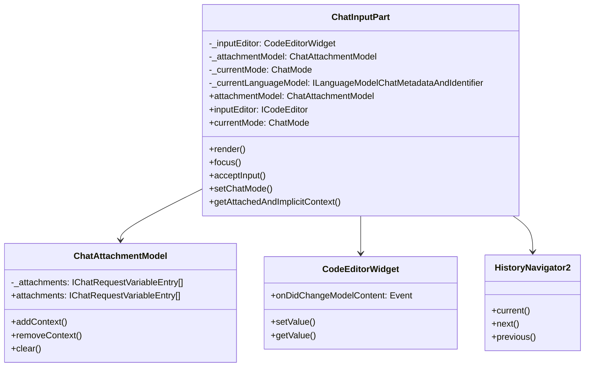
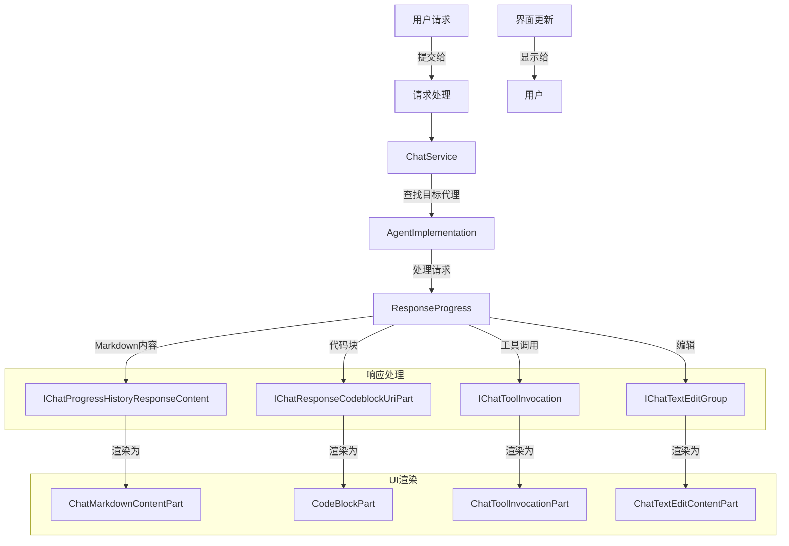
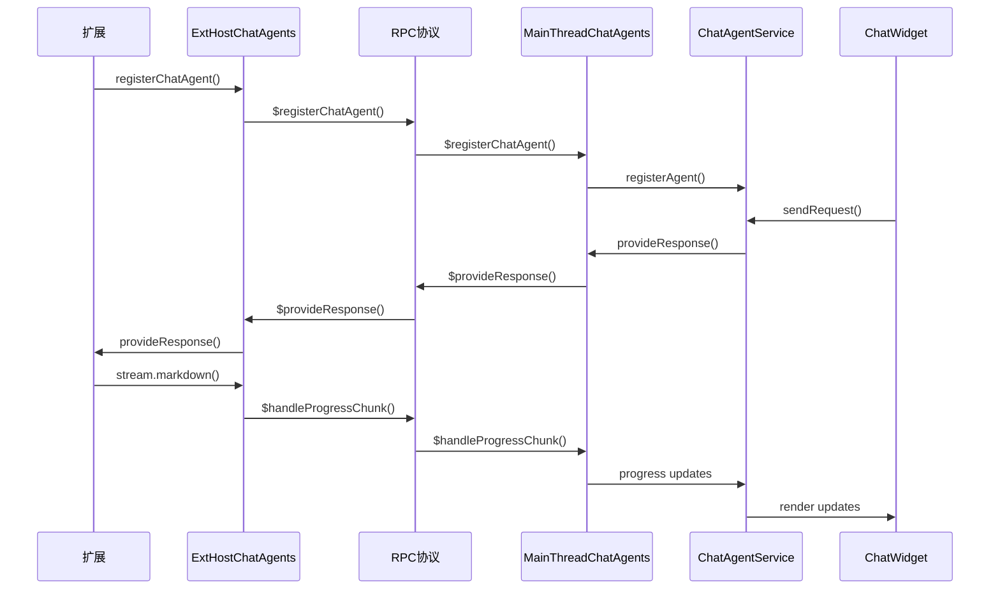

# 聊天服务和代理集成


<details>
<summary>相关源文件</summary>

* [extensions/vscode-api-tests/src/singlefolder-tests/chat.test.ts](../../extensions/vscode-api-tests/src/singlefolder-tests/chat.test.ts)
* [src/vs/base/browser/ui/hover/hoverWidget.css](../../src/vs/base/browser/ui/hover/hoverWidget.css)
* [src/vs/editor/browser/services/hoverService/hover.css](../../src/vs/editor/browser/services/hoverService/hover.css)
* [src/vs/workbench/api/browser/mainThreadChatAgents2.ts](../../src/vs/workbench/api/browser/mainThreadChatAgents2.ts)
* [src/vs/workbench/api/browser/mainThreadChatStatus.ts](../../src/vs/workbench/api/browser/mainThreadChatStatus.ts)
* [src/vs/workbench/api/common/extHostChatAgents2.ts](../../src/vs/workbench/api/common/extHostChatAgents2.ts)
* [src/vs/workbench/api/common/extHostChatStatus.ts](../../src/vs/workbench/api/common/extHostChatStatus.ts)
* [src/vs/workbench/contrib/chat/browser/actions/chatActions.ts](../../src/vs/workbench/contrib/chat/browser/actions/chatActions.ts)
* [src/vs/workbench/contrib/chat/browser/actions/chatClearActions.ts](../../src/vs/workbench/contrib/chat/browser/actions/chatClearActions.ts)
* [src/vs/workbench/contrib/chat/browser/actions/chatCodeblockActions.ts](../../src/vs/workbench/contrib/chat/browser/actions/chatCodeblockActions.ts)
* [src/vs/workbench/contrib/chat/browser/actions/chatContextActions.ts](../../src/vs/workbench/contrib/chat/browser/actions/chatContextActions.ts)
* [src/vs/workbench/contrib/chat/browser/actions/chatExecuteActions.ts](../../src/vs/workbench/contrib/chat/browser/actions/chatExecuteActions.ts)
* [src/vs/workbench/contrib/chat/browser/actions/chatGettingStarted.ts](../../src/vs/workbench/contrib/chat/browser/actions/chatGettingStarted.ts)
* [src/vs/workbench/contrib/chat/browser/actions/chatMoveActions.ts](../../src/vs/workbench/contrib/chat/browser/actions/chatMoveActions.ts)
* [src/vs/workbench/contrib/chat/browser/actions/chatQuickInputActions.ts](../../src/vs/workbench/contrib/chat/browser/actions/chatQuickInputActions.ts)
* [src/vs/workbench/contrib/chat/browser/actions/chatTitleActions.ts](../../src/vs/workbench/contrib/chat/browser/actions/chatTitleActions.ts)
* [src/vs/workbench/contrib/chat/browser/chat.contribution.ts](../../src/vs/workbench/contrib/chat/browser/chat.contribution.ts)
* [src/vs/workbench/contrib/chat/browser/chat.ts](../../src/vs/workbench/contrib/chat/browser/chat.ts)
* [src/vs/workbench/contrib/chat/browser/chatEditing/chatEditingActions.ts](../../src/vs/workbench/contrib/chat/browser/chatEditing/chatEditingActions.ts)
* [src/vs/workbench/contrib/chat/browser/chatEditor.ts](../../src/vs/workbench/contrib/chat/browser/chatEditor.ts)
* [src/vs/workbench/contrib/chat/browser/chatEditorInput.ts](../../src/vs/workbench/contrib/chat/browser/chatEditorInput.ts)
* [src/vs/workbench/contrib/chat/browser/chatInputPart.ts](../../src/vs/workbench/contrib/chat/browser/chatInputPart.ts)
* [src/vs/workbench/contrib/chat/browser/chatListRenderer.ts](../../src/vs/workbench/contrib/chat/browser/chatListRenderer.ts)
* [src/vs/workbench/contrib/chat/browser/chatQuick.ts](../../src/vs/workbench/contrib/chat/browser/chatQuick.ts)
* [src/vs/workbench/contrib/chat/browser/chatSetup.ts](../../src/vs/workbench/contrib/chat/browser/chatSetup.ts)
* [src/vs/workbench/contrib/chat/browser/chatStatus.ts](../../src/vs/workbench/contrib/chat/browser/chatStatus.ts)
* [src/vs/workbench/contrib/chat/browser/chatStatusItemService.ts](../../src/vs/workbench/contrib/chat/browser/chatStatusItemService.ts)
* [src/vs/workbench/contrib/chat/browser/chatViewPane.ts](../../src/vs/workbench/contrib/chat/browser/chatViewPane.ts)
* [src/vs/workbench/contrib/chat/browser/chatWidget.ts](../../src/vs/workbench/contrib/chat/browser/chatWidget.ts)
* [src/vs/workbench/contrib/chat/browser/codeBlockPart.css](../../src/vs/workbench/contrib/chat/browser/codeBlockPart.css)
* [src/vs/workbench/contrib/chat/browser/codeBlockPart.ts](../../src/vs/workbench/contrib/chat/browser/codeBlockPart.ts)
* [src/vs/workbench/contrib/chat/browser/media/chat.css](../../src/vs/workbench/contrib/chat/browser/media/chat.css)
* [src/vs/workbench/contrib/chat/browser/media/chatSetup.css](../../src/vs/workbench/contrib/chat/browser/media/chatSetup.css)
* [src/vs/workbench/contrib/chat/browser/media/chatStatus.css](../../src/vs/workbench/contrib/chat/browser/media/chatStatus.css)
* [src/vs/workbench/contrib/chat/common/chatAgents.ts](../../src/vs/workbench/contrib/chat/common/chatAgents.ts)
* [src/vs/workbench/contrib/chat/common/chatContextKeys.ts](../../src/vs/workbench/contrib/chat/common/chatContextKeys.ts)
* [src/vs/workbench/contrib/chat/common/chatEntitlementService.ts](../../src/vs/workbench/contrib/chat/common/chatEntitlementService.ts)
* [src/vs/workbench/contrib/chat/common/chatModel.ts](../../src/vs/workbench/contrib/chat/common/chatModel.ts)
* [src/vs/workbench/contrib/chat/common/chatService.ts](../../src/vs/workbench/contrib/chat/common/chatService.ts)
* [src/vs/workbench/contrib/chat/common/chatServiceImpl.ts](../../src/vs/workbench/contrib/chat/common/chatServiceImpl.ts)
* [src/vs/workbench/contrib/chat/common/chatViewModel.ts](../../src/vs/workbench/contrib/chat/common/chatViewModel.ts)
* [src/vs/workbench/contrib/chat/test/common/chatService.test.ts](../../src/vs/workbench/contrib/chat/test/common/chatService.test.ts)
* [src/vs/workbench/services/editor/common/editorGroupFinder.ts](../../src/vs/workbench/services/editor/common/editorGroupFinder.ts)
* [src/vscode-dts/vscode.proposed.chatParticipantAdditions.d.ts](../../src/vscode-dts/vscode.proposed.chatParticipantAdditions.d.ts)
* [src/vscode-dts/vscode.proposed.chatStatusItem.d.ts](../../src/vscode-dts/vscode.proposed.chatStatusItem.d.ts)
</details>

本文档提供了VS Code聊天服务架构和代理集成系统的技术概述。它解释了聊天服务如何管理会话、处理请求并与AI代理集成，以在VS Code中提供智能聊天功能。关于聊天UI组件的信息，请参阅"聊天UI组件"。

## 核心架构

VS Code中的聊天系统建立在服务导向架构之上，明确分离了服务层、代理集成和UI组件。该系统设计用于支持多个聊天提供者（代理），同时保持一致的用户体验。




来源：
* [src/vs/workbench/contrib/chat/common/chatService.ts]
* [src/vs/workbench/contrib/chat/common/chatServiceImpl.ts]
* [src/vs/workbench/contrib/chat/common/chatAgents.ts]
* [src/vs/workbench/contrib/chat/browser/chatWidget.ts]
* [src/vs/workbench/contrib/chat/browser/chatInputPart.ts]

## 聊天服务

`ChatService`是核心组件，负责管理聊天会话、处理请求和响应。它实现了`IChatService`接口，负责：

1. 创建和管理聊天会话
2. 处理聊天请求
3. 从适当的代理检索响应
4. 处理聊天历史和持久化
5. 管理变量替换和会话转移



### 会话管理

`ChatService`通过`ChatModel`类管理聊天会话。每个聊天会话都有唯一ID，包含请求和响应的集合。会话可以持久化到存储并在需要时加载。

```ts
// Creating a new chat session
const sessionId = await chatService.createChatSession();

// Sending a request in the session
await chatService.sendRequest(sessionId, { message: 'Hello', variables: {} });

// Adding a complete request and response
chatService.addCompleteRequest(sessionId, 'Hello', undefined, 0, { message: 'Hi there!' });
```

来源：
* [src/vs/workbench/contrib/chat/common/chatService.ts:1-195]
* [src/vs/workbench/contrib/chat/common/chatServiceImpl.ts:106-200]
* [src/vs/workbench/contrib/chat/common/chatModel.ts:1-100]

## 代理集成

代理集成系统允许VS Code通过一致的接口与各种聊天提供者/代理交互。`ChatAgentService`实现了`IChatAgentService`接口，管理不同聊天代理的注册和使用。

### 代理注册

代理注册到`ChatAgentService`，并提供实现来生成聊天请求的响应。系统支持代理的不同模式：

* **询问模式**：标准聊天交互
* **编辑模式**：用于代码编辑操作
* **代理模式**：具有工具调用功能的高级代理

```ts
chatAgentService.registerAgent(id, {
  id,
  name: 'My Agent',
  isDefault: false,
  modes: [ChatMode.Ask, ChatMode.Edit],
  slashCommands: [],
  locations: [ChatAgentLocation.Panel]
});

// Implementing an agent
chatAgentService.registerAgentImplementation(id, {
  provideResponse: async (request, progress, token) => {
    // Process request and send response
  }
});
```

### 代理响应流程

当发出聊天请求时：

1. `ChatService`根据请求识别目标代理
2. `ChatAgentService`将请求转发给适当的代理实现
3. 代理处理请求并通过进度API返回响应
4. `ChatService`使用响应更新UI

来源：
* [src/vs/workbench/contrib/chat/common/chatAgents.ts:1-100]
* [src/vs/workbench/api/common/extHostChatAgents2.ts:38-110]
* [src/vs/workbench/contrib/chat/common/constants.ts]

## 聊天输入

`ChatInputPart`类处理聊天界面中的用户输入，包括：

1. 文本输入管理
2. 变量和上下文附加
3. 输入历史导航
4. 聊天模式切换（询问/编辑/代理）
5. 语言模型选择



### 上下文附加

用户可以将不同类型的上下文附加到他们的聊天请求中：

* **文件**：作为上下文的代码文件
* **选择**：当前编辑器选择
* **图像**：截图或图像附件
* **诊断**：错误信息
* **工具**：代理模式的工具

`ChatAttachmentModel`管理这些附件，并在处理请求时提供给代理。

```ts
// Adding file context
chatWidget.attachmentModel.addContext({
  kind: 'file',
  name: basename(uri),
  uri,
  value: uri
});

// Getting all context for a request
const context = chatInputPart.getAttachedAndImplicitContext(sessionId);
```

来源：
* [src/vs/workbench/contrib/chat/browser/chatInputPart.ts:136-250]
* [src/vs/workbench/contrib/chat/browser/chatInputPart.ts:420-550]
* [src/vs/workbench/contrib/chat/common/chatModel.ts:34-150]

## 聊天响应处理

响应处理涉及几个步骤：

1. 从代理接收响应内容
2. 处理和渲染markdown内容
3. 处理代码块、工具调用和其他专门内容
4. 为响应渲染UI组件



### 响应内容类型

聊天系统支持各种响应内容类型：

| 内容类型 | 实现 | 描述 |
| ------- | --- | --- |
| Markdown | IChatMarkdownContent | 带有markdown格式的常规文本响应 |
| 代码块 | IChatResponseCodeblockUriPart | 带有语法高亮的代码片段 |
| 工具调用 | IChatToolInvocation | 代理使用工具执行任务 |
| 文本编辑 | IChatTextEditGroup | 代码编辑操作 |
| 引用 | IChatContentReference | 对文件或位置的引用 |
| 文件树 | IChatTreeData | 目录/文件结构视图 |
| 工作进度 | IChatProgressMessage | 响应生成过程中的进度指示器 |

来源：
* [src/vs/workbench/contrib/chat/common/chatModel.ts:276-300]
* [src/vs/workbench/contrib/chat/browser/chatListRenderer.ts:360-450]
* [src/vs/workbench/contrib/chat/browser/codeBlockPart.ts:1-100]

## 代理模式

聊天系统支持三种主要操作模式：

### 询问模式

标准聊天交互，代理用信息、代码示例或解释回应查询。

```ts
chatWidget.input.setChatMode(ChatMode.Ask);
```

### 编辑模式

使代理能够提出文件编辑，并提供专门的UI来审查和应用更改。

```ts
chatWidget.input.setChatMode(ChatMode.Edit);
```

### 代理模式

高级模式，使代理能够使用工具并在工作区执行更复杂的操作。

```ts
chatWidget.input.setChatMode(ChatMode.Agent);
```

不同模式影响：
* 哪些代理可用
* UI呈现
* 可用操作
* 响应处理

来源：
* [src/vs/workbench/contrib/chat/common/constants.ts]
* [src/vs/workbench/contrib/chat/browser/chatInputPart.ts:480-505]
* [src/vs/workbench/contrib/chat/browser/actions/chatExecuteActions.ts:50-150]

## 扩展集成

聊天系统可以通过VS Code扩展进行扩展：

1. 注册自定义聊天代理
2. 为代理模式贡献工具
3. 添加自定义斜杠命令
4. 扩展聊天UI

扩展主机通过定义良好的协议与主线程通信：


### 工具集成

代理模式中的代理可以访问扩展贡献的工具：

```ts
// Tool registration
languageModelToolsService.registerTool({
  id: 'myTool',
  name: 'My Tool',
  description: 'Does something useful',
  invoke: async (args) => {
    // Tool implementation
    return { result: 'Tool result' };
  }
});

// Tool invocation in agent response
stream.tool({
  toolId: 'myTool',
  args: { param: 'value' }
}, async (progress) => {
  // Tool execution with progress
  return 'Final result';
});
```

来源：
* [src/vs/workbench/api/common/extHostChatAgents2.ts:79-135]
* [src/vs/workbench/api/browser/mainThreadChatAgents2.ts:1-50]
* [src/vs/workbench/contrib/chat/common/languageModelToolsService.ts]

## 聊天服务生命周期

聊天服务生命周期遵循以下关键步骤：

1. **初始化**：
   * 服务在工作台初始化期间注册
   * 从存储加载以前的会话
   * 注册默认代理
2. **会话创建**：
   * 用户打开聊天UI
   * 创建新的聊天会话
   * 会话与模型和小部件关联
3. **请求处理**：
   * 用户提交请求
   * 请求发送给适当的代理
   * 接收并处理响应
   * 更新UI
4. **会话持久化**：
   * 会话保存到存储
   * 会话可以稍后恢复
5. **会话清理**：
   * 会话可以被清除
   * 资源被释放

来源：
* [src/vs/workbench/contrib/chat/browser/chat.contribution.ts:350-400]
* [src/vs/workbench/contrib/chat/common/chatServiceImpl.ts:142-235]
* [src/vs/workbench/contrib/chat/browser/actions/chatClearActions.ts:1-50]

## 结论

VS Code中的聊天服务和代理集成系统提供了一个灵活且可扩展的架构，用于将AI助手整合到开发环境中。该系统在服务、代理集成和UI组件之间分离关注点，允许轻松扩展和定制。

关键组件包括：

* `ChatService`：管理聊天会话的核心服务
* `ChatAgentService`：处理代理注册和集成
* `ChatInputPart`：管理用户输入和上下文
* `ChatWidget`：聊天界面的主要UI组件

该架构支持多种聊天模式、工具集成和定制的扩展点，使其成为AI辅助开发的强大平台。
